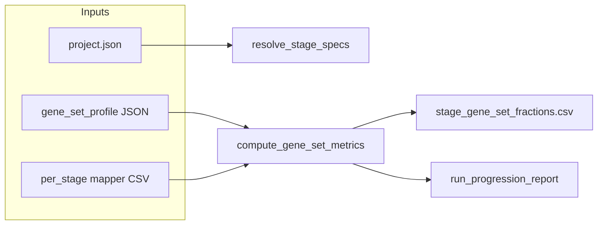

# Disease-aware gene-set fraction metrics (progression)

## Goal

Add a **quantitative** layer that, for each ordered stage (comparison), reports **overlap of mapper gene lists with curated gene sets** (e.g. replication, DNA repair, AR-related, metabolic), keyed by a **disease context** already present in the project (e.g. prostate cancer template). This complements existing enrichment (`pathways_long.csv`) and label rules (`entities_progression_labels.csv`) in [`packages/methyldiseaseprogression/methyl_disease_progression/progression.py`](packages/methyldiseaseprogression/methyl_disease_progression/progression.py).

## Current baseline

- [`resolve_stage_specs`](packages/methyldiseaseprogression/methyl_disease_progression/progression.py) loads `step_config.progression`, resolves ordered stages from comparisons, and points to per-stage [`mapper_combined_csv`](packages/methyldiseaseprogression/methyl_disease_progression/progression.py) and enricher outputs.
- [`run_progression_report`](packages/methyldiseaseprogression/methyl_disease_progression/progression.py) writes long tables and optional `report.md`.
- **Disease** is implicit in **comparison labels / disease_group** and optional progression ordering; there is no first-class `disease_id` field required today.

## Proposed config surface (project JSON)

Under **`step_config.progression`**, add an optional block, for example:

- **`disease_context`** (string): logical label for presets, e.g. `"prostate_cancer"`. (Could default from project metadata if you add a field later.)
- **`gene_set_profile`**: either an inline object or a path to JSON:
  - **`categories`**: list of `{ "id": "replication", "label": "...", "genes": ["ORC1", ...] }` or `{ "msigdb_hallmark": "E2F_TARGETS" }` if you later wire MSigDB lookup.
  - For v1, **inline symbol lists** or **`path`**: `profiles/prostate_v1.json` under repo or user data dir keeps JSON small in project files.
- **`gene_set_metrics`**: toggles and thresholds:
  - **`enabled`** (bool, default false): opt-in so existing runs unchanged.
  - **`gene_universe`**: `"mapper_all"` | `"mapper_top_n"` | `"mapper_min_weight_quantile"` (optional filters on genes before counting).
  - **`output_basename`**: e.g. `stage_gene_set_fractions.csv`.

Keep **backward compatibility**: if block absent or `enabled: false`, behavior matches today.

## Computation (core logic)

New module or functions in the same package, e.g. [`gene_set_coverage.py`](packages/methyldiseaseprogression/methyl_disease_progression/gene_set_coverage.py):

1. Load normalized **gene symbols** per stage from the same CSV as `_build_gene_rows` (reuse column resolution).
2. Load **category to gene-set** map from resolved profile (upper-case symbols, de-duplicate).
3. For each stage and category: **`n_overlap`**, **`n_genes_universe`**, **`fraction = n_overlap / max(n_genes_universe, 1)`**.
4. Optional: also output **weight-weighted** summaries (e.g. sum of `total_weight` in overlap vs total) if config requests it.

Output: **`stage_gene_set_fractions.csv`** (long or wide); **`stage_gene_set_fractions.json`** summary for plotting.

## Workflow integration

1. **Pipeline / docs**: After freeze (mapper + enricher per comparison), user runs `methyl-disease-progression` as today; with config enabled, the command **also** writes gene-set metrics into `<project_root>/progression/` (or `--output-dir`).
2. **CLI**: extend [`cli.py`](packages/methyldiseaseprogression/methyl_disease_progression/cli.py) with optional overrides (`--gene-set-profile`, `--no-gene-set-metrics`) only if you want CLI to beat JSON for ad-hoc runs; otherwise config-only is enough.
3. **Theory doc**: update [`docs/theory/chapters/05-methylpredictor-and-validation.qmd`](docs/theory/chapters/05-methylpredictor-and-validation.qmd) (progression subsection) to describe fractions vs enrichment q-values and limitations (curated sets are hypotheses, not ground truth).

## Preset content strategy (disease = prostate example)

- Ship **one** example profile JSON in-repo under e.g. [`packages/methyldiseaseprogression/profiles/`](packages/methyldiseaseprogression/) (small curated lists or MSigDB hallmark IDs as documentation-only placeholders) **or** document that users supply paths under their `output_base`.
- Map **`disease_context: prostate_cancer`** to that file via convention: `prostate_cancer.json` resolved from package data or explicit `gene_set_profile.path`.

## Testing

- Unit tests: synthetic mapper CSV + tiny gene sets; assert fractions for 2–3 stages.
- Regression: existing [`test_progression_report_writes_outputs`](packages/methyldiseaseprogression/tests/test_progression.py) unchanged when metrics disabled.

## Non-goals (explicit)

- Replacing GSEA/enrichment with raw fractions (document that both are complementary).
- Automatic MSigDB download in v1 (optional follow-up: cache GMT by hallmark name).
