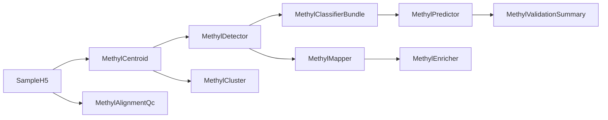

# MethylPipeline Full Revision

## Scope

Review and remediate the full repository, with the main execution chain anchored on [packages/methylcentroid/methyl_centroid/methyl_centroid.py](packages/methylcentroid/methyl_centroid/methyl_centroid.py), [packages/methyldetector/methyl_detector/core/methyldetector.py](packages/methyldetector/methyl_detector/core/methyldetector.py), [packages/methylclassifier/methyl_classifier/core/classifier.py](packages/methylclassifier/methyl_classifier/core/classifier.py), [packages/methylpredictor/methyl_predictor/core/predictor.py](packages/methylpredictor/methyl_predictor/core/predictor.py), and [packages/methylvalidation/methyl_validation/pipeline_runner.py](packages/methylvalidation/methyl_validation/pipeline_runner.py). Treat the shared config and path contract in [packages/methylutils/methyl_utils/pipeline_config.py](packages/methylutils/methyl_utils/pipeline_config.py) and the package-level `project_resolver.py` files as the code-level source of truth.

## Phase 1: Lock Canonical Contracts And Remove High-Risk Drift

- Establish the canonical project schema, output-directory conventions, and comparison semantics from [packages/methylutils/methyl_utils/pipeline_config.py](packages/methylutils/methyl_utils/pipeline_config.py) plus the resolver files in `methylcentroid`, `methyldetector`, `methylclassifier`, `methylpredictor`, `methylmapper`, `methylenricher`, `methylalignmentqc`, and `methylcluster`.
- Scrub tracked secrets from example configs such as [configs/project_PCa_vs_Healthy.json](configs/project_PCa_vs_Healthy.json) and [configs/project_Healthy_vs_PCa1-4.json](configs/project_Healthy_vs_PCa1-4.json), then replace them with env-var based examples.
- Normalize installer/runtime truth across [scripts/install_all.sh](scripts/install_all.sh), [scripts/setup_host.sh](scripts/setup_host.sh), [scripts/setup_host_conda.sh](scripts/setup_host_conda.sh), [docker/Dockerfile.production](docker/Dockerfile.production), and package `pyproject.toml` entrypoints so every documented CLI is actually installable.

## Phase 2: Theory Vs Implementation Reconciliation

- Audit the active mathematical story against the docs for the core pipeline, using code as primary truth and revising the theory docs only after the implementation is confirmed.
- Focus first on known drift points:
  - FDR/q-value behavior in detector and shared comparison logic.
  - ECDF/PCHIP overlap and classifier likelihood semantics across detector and classifier.
  - Classifier combination and multi-chromosome inference path differences between API and CLI.
  - Validation metric generation and predictor label alignment when samples are skipped.
- Update the theory/implementation docs for the core packages and the top-level architecture docs so there is one consistent description of what is currently supported.

## Phase 3: Usage Surface And User Guidance Cleanup

- Rewrite the user-facing run path around one canonical project-driven workflow, with [README.md](README.md), [docs/OPERATIONS_MANUAL.md](docs/OPERATIONS_MANUAL.md), [docs/UNIFIED_PROJECT_CONFIG_GUIDE.md](docs/UNIFIED_PROJECT_CONFIG_GUIDE.md), and [configs/README.md](configs/README.md) aligned to the same schema, path layout, and CLI names.
- Reduce config/doc sprawl by explicitly marking legacy schemas as compatibility-only and keeping one blessed example for each still-supported schema.
- Standardize artifact names and downstream discovery expectations for detector, classifier, predictor, mapper, and enricher outputs so follow-on tools no longer depend on outdated filenames from old docs.

## Phase 4: Codebase Cleanup And Package Boundaries

- Separate active packages from legacy or duplicate code paths, especially older detector/comparison implementations in `methylutils` and mixed old/new CLIs in `methylcluster` and `methylmapper`.
- Decide package-by-package whether each legacy surface should be deleted, deprecated, moved under a `legacy` namespace, or documented as unsupported.
- Remove packaging residue and stale metadata, including duplicate nested packaging in `methylutils`, inconsistent author/package metadata, and committed build artifacts or ad hoc output files.

## Phase 5: Regression Hardening

- Add or repair tests around the highest-risk contracts:
  - project/config resolution and derived output paths
  - centroid/detector/classifier export-import compatibility
  - predictor metrics with skipped/invalid samples
  - validation split reproducibility and summary aggregation
  - downstream mapper/enricher/alignment-qc resolver behavior
- Update repo-level pytest discovery and package test organization so the test layout matches where active tests actually live.
- Add a small end-to-end smoke path that exercises the canonical project flow without relying on stale example commands.

## Deliverables

- A written discrepancy report for theory, implementation, usage, packaging, and test coverage.
- A prioritized remediation sequence with high-severity items first: secrets, config/CLI truth, predictor/validation correctness, install coverage, then documentation and legacy cleanup.
- Code, docs, config, and test updates that make the repo internally consistent and easier to operate from a single canonical workflow.

