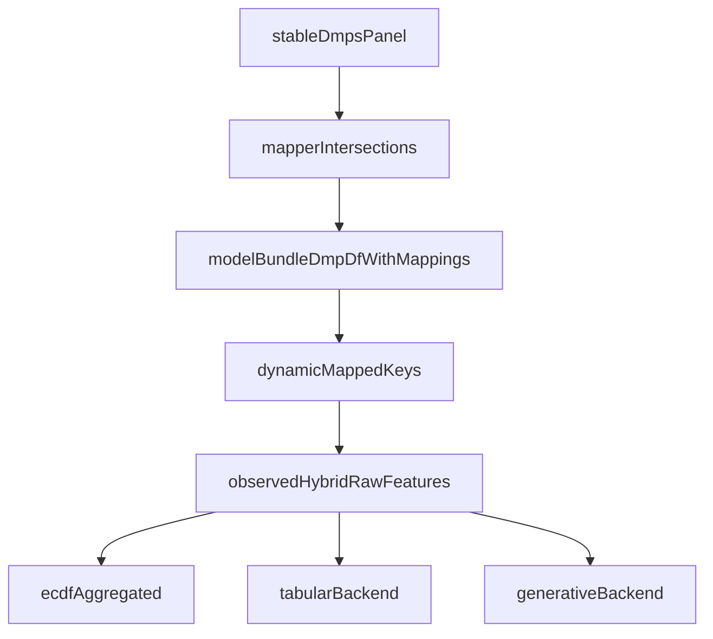

# Raw Gene Semantics for Observed Hybrid

## Goal
Make `feature_family_set=gene` behave analogously to raw DMP usage: features come directly from mapped entities derived from stable DMPs, with sign preserved through encoding. Remove biasing handcrafted summary variables and let model training perform discrimination.

## Locked Decisions
- Gene feature value per sample uses **signed weighted centered methylation**:
  - `sum(sign(effect_size) * abs(effect_size) * (beta - 0.5)) / sum(abs(effect_size))`
- Apply this semantic change to **all `observed_hybrid` backends**:
  - ECDF aggregated
  - tabular
  - generative

## Current Problem Hotspots
- [packages/methylvalidation/methyl_validation/observed_feature_builder.py](/home/ubuntu/MethylPipeline/packages/methylvalidation/methyl_validation/observed_feature_builder.py) currently emits fixed engineered gene/structural features (6 gene summaries + structural summary blocks), not raw mapped variables.
- [packages/methylvalidation/methyl_validation/ecdf_aggregated_backend.py](/home/ubuntu/MethylPipeline/packages/methylvalidation/methyl_validation/ecdf_aggregated_backend.py), [packages/methylvalidation/methyl_validation/tabular_backend.py](/home/ubuntu/MethylPipeline/packages/methylvalidation/methyl_validation/tabular_backend.py), and [packages/methylvalidation/methyl_validation/generative_backend.py](/home/ubuntu/MethylPipeline/packages/methylvalidation/methyl_validation/generative_backend.py) all depend on this builder.

## Target Feature Semantics
- `feature_family_set=dmp`: keep existing DMP family behavior.
- `feature_family_set=gene`: one feature per mapped gene key from bundle rows (`gene_name != unknown`), value = signed weighted centered aggregation over observed loci in that gene.
- `feature_family_set=structural`: one feature per mapped structural key from bundle rows; key is `(gene_name, feature_type)` so only mapped combinations are used.
- `feature_family_set=dmp+gene` and `hybrid-all`: concatenate corresponding families in deterministic order.

## Implementation Plan

### 1) Introduce raw mapped-family feature construction in observed_hybrid builder
- Refactor [packages/methylvalidation/methyl_validation/observed_feature_builder.py](/home/ubuntu/MethylPipeline/packages/methylvalidation/methyl_validation/observed_feature_builder.py):
  - Add deterministic key extraction from `dmp_df` for:
    - gene keys (`gene_name`)
    - structural keys (`gene_name__feature_type`)
  - Build per-sample values by grouping observed loci and applying the selected formula.
  - Ensure only keys present in mapped stable DMP rows are emitted (no synthetic all-feature expansion).
  - Keep schema fingerprinting and strict order checks to preserve train/predict parity.

### 2) Replace fixed gene/structural feature naming with dynamic mapped names
- Update naming helpers in [packages/methylvalidation/methyl_validation/observed_feature_builder.py](/home/ubuntu/MethylPipeline/packages/methylvalidation/methyl_validation/observed_feature_builder.py):
  - Remove hardcoded 6-gene/18-structural summary outputs for observed_hybrid family modes.
  - Emit dynamic names (`gene::<GENE>` and `struct::<GENE>::<FEATURE_TYPE>`) from `dmp_df` mappings.
  - Preserve deterministic sorting and compatibility checks in `verify_feature_schema`.

### 3) Keep backend orchestration unchanged, but ensure metadata reflects new semantics
- In:
  - [packages/methylvalidation/methyl_validation/ecdf_aggregated_backend.py](/home/ubuntu/MethylPipeline/packages/methylvalidation/methyl_validation/ecdf_aggregated_backend.py)
  - [packages/methylvalidation/methyl_validation/tabular_backend.py](/home/ubuntu/MethylPipeline/packages/methylvalidation/methyl_validation/tabular_backend.py)
  - [packages/methylvalidation/methyl_validation/generative_backend.py](/home/ubuntu/MethylPipeline/packages/methylvalidation/methyl_validation/generative_backend.py)
- Continue calling `build_observed_hybrid_feature_table`, but update/propagate report metadata to include:
  - raw mapped family key counts
  - non-empty key coverage per sample
  - formula descriptor (`signed_weighted_centered_beta`).

### 4) Align effect-size-based feature weighting with dynamic feature keys
- Update [packages/methylutils/methyl_utils/ecdf_aggregated_ovr.py](/home/ubuntu/MethylPipeline/packages/methylutils/methyl_utils/ecdf_aggregated_ovr.py):
  - Extend `build_effect_size_feature_weights()` to parse dynamic `gene::` / `struct::` feature keys.
  - Compute each feature weight from the corresponding mapped loci in `dmp_df` (not single global family averages).

### 5) Tests: regression and schema guarantees
- Extend tests in:
  - [packages/methylvalidation/tests/test_model_bundle_tabular_backend.py](/home/ubuntu/MethylPipeline/packages/methylvalidation/tests/test_model_bundle_tabular_backend.py)
  - [packages/methylutils/tests/test_ecdf_aggregated_ovr.py](/home/ubuntu/MethylPipeline/packages/methylutils/tests/test_ecdf_aggregated_ovr.py)
  - backend tests for tabular/generative observed_hybrid paths
- Add cases validating:
  - dynamic gene feature count equals number of mapped stable genes in bundle slice
  - structural keys include only mapped `(gene, feature_type)` combinations
  - signed centered formula is used (direction-sensitive expected values)
  - train/predict feature schema parity across backends

### 6) Docs/config updates
- Update observed_hybrid semantics in:
  - [packages/methylvalidation/docs/IMPLEMENTATION.md](/home/ubuntu/MethylPipeline/packages/methylvalidation/docs/IMPLEMENTATION.md)
  - relevant classifier/predictor docs if they describe observed_hybrid family behavior
- Clarify that gene/structural families are now raw mapped variables, and model selection handles dimensionality.

## Data Flow (Post-change)

## Validation Criteria
- `feature_family_set=gene` no longer yields fixed 6 summaries; it yields mapped gene keys.
- `feature_family_set=structural` yields only mapped `(gene, feature_type)` keys, not exhaustive synthetic feature blocks.
- Accuracy comparison runs show `dmp+gene` improves over prior biased gene-summary mode on multiclass `model-mc` (balanced accuracy and per-class recall tracked).