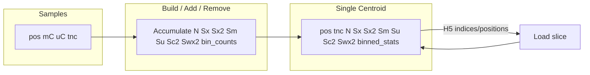

# Improve centroid: single type, (pos, N, Sx, Sx2, Sm, Su, Sc2, Swx2), required binned_stats

## Design (strong centroid schema)

Notation: per sample at a position, x_i = mC_i/(mC_i+uC_i), c_i = mC_i+uC_i.

- **Samples** (unchanged): always have `pos`, `mC`, `uC`, `tnc`.
- **Single centroid type** only (no separate “basic” vs “extended” centroid).
- **Centroid stores**: `pos`, `tnc`, `N`, `Sx`, `Sx2`, `Sm`, `Su`, `Sc2`, `Swx2`, plus **required** `binned_stats` (bin_edges, bin_counts).

**Why this set**

- **N, Sx, Sx2**: Unweighted (sample-level) mean and unbiased sample variance.  
  - x̄ = Sx/N  
  - s_x² = (Sx2 − Sx²/N) / (N−1)  
  Primary for biological comparison (samples as units).
- **Sm, Su**: Coverage-weighted mean (pooled proportion) and total coverage.  
  - x̄_w = Sm/(Sm+Su)  
  - Mean coverage = (Sm+Su)/N  
  Sm and Su alone do **not** give weighted variance.
- **Sc2 = Σ c_i²**, **Swx2 = Σ c_i x_i²** (equivalently Σ mC_i²/c_i): Required for **exact** coverage-weighted variance.  
  - Weighted population-style variance: v_w = Swx2/(Sm+Su) − (Sm/(Sm+Su))²  
  - Unbiased weighted sample variance: s_w² = (Sm+Su)[Swx2 − (Sm+Su)x̄_w²] / ((Sm+Su)² − Sc2)  
  So N, Sm, Su alone are far from enough for weighted variance; add Sc2 and Swx2.

**binned_stats**: Required on the centroid (not optional), for ECDF and downstream comparison.

**Index handling**: Centroids can be huge and positions out-of-order. Keep index-based load/save (`indices`/`positions`) and position-based matching (`intersect1d`).

---

## 1. Schema and naming

- **Stored fields**: `pos`, `tnc`, `N`, `Sx`, `Sx2`, `Sm`, `Su`, `Sc2`, `Swx2`.  
  - Sm, Su: sums of mC and uC across samples.  
  - Sc2 = Σ c_i² = Σ (mC_i+uC_i)².  
  - Swx2 = Σ c_i x_i² = Σ mC_i²/c_i (per position, over samples).
- **Dtypes**: uint32 for integer values (pos, tnc, N, Sm, Su, Sc2); float for fractions (Sx, Sx2, Swx2). No uint64.
- **Properties (clear names)**  
  - **mean**, **variance**: Keep current unweighted semantics (mean = Sx/N, variance = unbiased s_x²).  
  - **weighted_mean**: x̄_w = Sm/(Sm+Su).  
  - **weighted_variance**: population-style v_w = Swx2/(Sm+Su) − (Sm/(Sm+Su))² (or expose unbiased s_w² if preferred; document which).  
  - **coverage**: Sm+Su, so callers can use e.g. `c.coverage >= min_coverage`.  
  - **mean_coverage**: (Sm+Su)/N when N > 0.
- **binned_stats**: Always present (bin_edges, bin_counts). Build and validate so centroid is invalid without it.
- **Accumulation when adding a sample** (per position): N += 1; Sx += x_i; Sx2 += x_i²; Sm += mC_i; Su += uC_i; Sc2 += c_i²; Swx2 += c_i x_i² (= mC_i²/c_i). Update bin_counts from x_i.

---

## 2. MethylUtils – single centroid type and dtypes

** [packages/methylutils/methyl_utils/**init**.py](packages/methylutils/methyl_utils/__init__.py)**

- **Single centroid dtype**: `(pos, tnc, N, Sx, Sx2, Sm, Su, Sc2, Swx2)` with **uint32** for integer fields (pos, tnc, N, Sm, Su, Sc2) and **float** for fraction-related fields (Sx, Sx2, Swx2). No uint64.
- Remove or consolidate `METHYL_CENTROID_DTYPE` vs `METHYL_CENTROID_DTYPE_EXTENDED` into one centroid dtype.
- `get_methyl_dtype(extended=True)` (or single centroid dtype) returns this list.

---

## 3. MethylUtils – MethylExtendedCentroid (single centroid class)

** [packages/methylutils/methyl_utils/core/methyl_frame.py](packages/methylutils/methyl_utils/core/methyl_frame.py)**

- **Required columns**: `pos`, `tnc`, `N`, `Sx`, `Sx2`, `Sm`, `Su`, `Sc2`, `Swx2`. No stored averaged mC/uC; only sums and sum-of-squares as above.
- **Properties (clear names)**  
  - **mean**: Sx/N (unweighted). **variance**: unbiased s_x² (keep current).  
  - **weighted_mean**: Sm/(Sm+Su). **weighted_variance**: v_w = Swx2/(Sm+Su) − (Sm/(Sm+Su))².  
  - **coverage**: Sm+Su (e.g. `c.coverage >= min_coverage`). **mean_coverage**: (Sm+Su)/N when N > 0.
- **add_sample**: Accumulate N, Sx, Sx2, Sm, Su, **Sc2**, **Swx2** (and binned_stats). Per position: c_i = mC_i+uC_i, x_i = mC_i/c_i; Sc2 += c_i²; Swx2 += c_i x_i² (= mC_i²/c_i). Update bin_counts from x_i.
- **remove_sample**: Subtract that sample's contributions from N, Sx, Sx2, Sm, Su, Sc2, Swx2 and binned_stats.
- **to_numpy** / **save_to_h5**: Emit and write `pos`, `tnc`, `N`, `Sx`, `Sx2`, `Sm`, `Su`, `Sc2`, `Swx2` (and binned_stats). HDF5: require `binned_stats` when saving/loading centroid.
- **from_centroid_data**: Accept DataFrames/arrays with pos, tnc, N, Sx, Sx2, Sm, Su, Sc2, Swx2 (and require binned_stats when constructing from data).

---

## 4. MethylUtils – MethylCentroidBuilder

** [packages/methylutils/methyl_utils/core/centroid_builder.py](packages/methylutils/methyl_utils/core/centroid_builder.py)**

- Accumulate **mC_sum**, **uC_sum** (Sm, Su), and add **Sc2_accum** (Σ c_i²), **Swx2_accum** (Σ c_i x_i²). Per sample/position: c_i = mC_i+uC_i, x_i = mC_i/c_i; Sc2_accum += c_i²; Swx2_accum += c_i*x_i².
- In `finalize`, output DataFrame/centroid with **Sm**, **Su**, **Sc2**, **Swx2** (no averaged mC/uC).
- **binned_stats**: Always produced and attached (required). Filter by N and/or (Sm+Su) for min_coverage as today.
- Single code path: one centroid type with pos, tnc, N, Sx, Sx2, Sm, Su, Sc2, Swx2, binned_stats.

---

## 5. MethylUtils – HDF5 I/O (io.py)

** [packages/methylutils/methyl_utils/core/io.py](packages/methylutils/methyl_utils/core/io.py)**

- **Centroid detection**: Single type when `pos`, `tnc`, `N`, `Sx`, `Sx2`, `Sm`, `Su`, `Sc2`, `Swx2` are present.
- **Required for centroid**: All eight numeric fields plus **binned_stats** (bins attr + bin_counts). Load/save using same index/position slicing as today.
- **No backward compatibility**: Do not support loading old centroid formats (e.g. mC/uC averaged, or missing Sc2/Swx2). Require the new schema only.

---

## 6. MethylUtils – MethylCentroidPair and downstream

** [packages/methylutils/methyl_utils/methyl_centroid_pair.py](packages/methylutils/methyl_utils/methyl_centroid_pair.py)**

- Zero-coverage: use `c.coverage == 0` or `N == 0`; clamp/checks with clear names (e.g. `c.coverage >= min_coverage`).
- TempCentroid / batch: Pass N, Sx, Sx2, Sm, Su, Sc2, Swx2 (or derived mC = Sm/N, uC = Su/N if LRT expects them). Use Sm, Su, Sc2, Swx2 where read-weighted mean/variance or coverage is needed.
- H5 export of comparison results: Can write Sm1, Su1, Sm2, Su2 (or pooled means derived from them) if needed; align naming with “sums” not “averaged mC/uC”.

---

## 7. MethylUtils – distribution_views and statistical_tests

- **distribution_views**: Use centroid Sm, Su (or coverage = Sm+Su, pooled mean = Sm/(Sm+Su)) where read-weighted or count-based views are needed; use Sx, Sx2, N for sample-level mean/variance. No removal of Sm/Su usage.
- **statistical_tests**: likelihood_ratio_test_beta and others that need counts can use Sm, Su (or mC = Sm/N, uC = Su/N) from the single centroid type; ensure MoM and other paths use the same single type.

---

## 8. MethylCentroid package – creation and chunked path

** [packages/methylcentroid/methyl_centroid/methyl_centroid.py](packages/methylcentroid/methyl_centroid/methyl_centroid.py)**

- `**_compute_centroid_for_positions`**: Accumulate N, Sx, Sx2, Sm, Su, **Sc2**, **Swx2** (and bin_counts). Per sample/position: c_i = mC_i+uC_i, x_i = mC_i/c_i; Sc2_accum += c_i²; Swx2_accum += c_i*x_i². Valid-position filter: N_accum >= min_samples and optionally (Sm+Su) or coverage-based threshold.
- **Output**: Structured array / DataFrame with `pos`, `tnc`, `N`, `Sx`, `Sx2`, `Sm`, `Su`, `Sc2`, `Swx2`. **binned_stats** always attached (required).
- **Validation**: Validate N, Sx, Sx2, Sm, Su, Sc2, Swx2 (and binned_stats) against recomputed values from samples; ensure binned_stats is present and consistent.
- **Load-from-H5 chunked path**: Expect centroid H5 to have the full schema (pos, tnc, N, Sx, Sx2, Sm, Su, Sc2, Swx2, binned_stats); same index-based slicing. No legacy format support.

---

## 9. binned_stats required everywhere

- **Builder**: Always produce binned_stats; no optional path.
- **add_sample / remove_sample**: Always update and require binned_stats.
- **I/O**: When saving/loading centroid, require bins attr and bin_counts; reject or fix centroid without them.
- **MethylCentroid** (package): When building or loading centroid, require binned_stats; document and enforce in validation.

---

## 10. Tests and docs

- **Tests**: Assert on N, Sx, Sx2, Sm, Su, Sc2, Swx2 (and binned_stats). Add checks for properties: mean, variance, weighted_mean, weighted_variance, coverage, mean_coverage (e.g. `c.coverage >= min_coverage`).
- **Docs / Explorer**: Describe single centroid type; document properties (mean, variance, weighted_mean, weighted_variance, coverage, mean_coverage) and when to use each (unweighted = primary for biological comparison; weighted = optional advanced summary).

---

## Summary

| Item            | Before                         | After                                                                                 |
| --------------- | ------------------------------ | ------------------------------------------------------------------------------------- |
| Centroid type   | Basic vs extended              | Single type only                                                                      |
| Dtypes          | —                              | uint32 (pos, tnc, N, Sm, Su, Sc2); float (Sx, Sx2, Swx2). No uint64.                  |
| Stored numeric  | pos, mC, uC (avg), N, Sx, Sx2  | pos, tnc, N, Sx, Sx2, Sm, Su, Sc2, Swx2                                               |
| Properties      | mean, variance                 | mean, variance (unchanged); weighted_mean; weighted_variance; coverage; mean_coverage |
| Usage           | —                              | e.g. `c.coverage >= min_coverage`                                                     |
| binned_stats    | Optional                       | Required                                                                              |
| Backward compat | —                              | None; new schema only                                                                 |
| Samples         | pos, mC, uC, tnc               | Unchanged                                                                             |
| Index handling  | indices/positions, intersect1d | Unchanged                                                                             |

