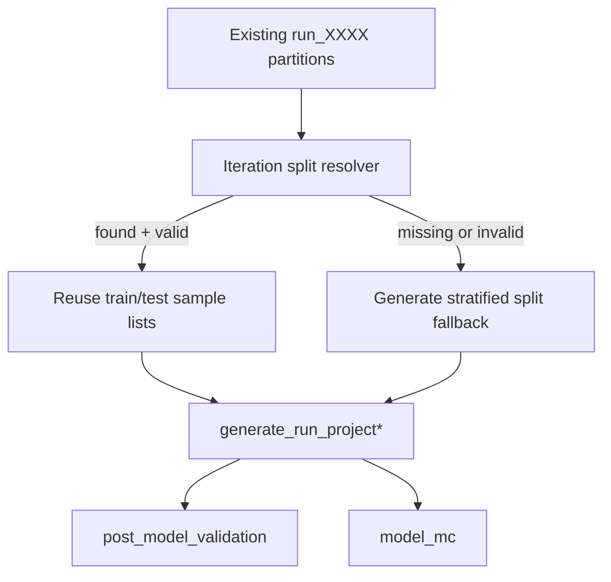

# Reuse Stability Splits for Fast Metric Distributions

## Goal
Use the train/test partitions already materialized during the stability Monte Carlo (`run_XXXX`) as the default split source for subsequent model evaluation Monte Carlo (`--post-model-validation` and `--model-mc`). This avoids re-partitioning and enables direct reuse of known splits across stages.

## Current Baseline
- Stability/default MC creates deterministic per-iteration splits and stores them in run folders via project generation in [`/home/ubuntu/MethylPipeline/packages/methylvalidation/methyl_validation/project_gen.py`](/home/ubuntu/MethylPipeline/packages/methylvalidation/methyl_validation/project_gen.py).
- Post-model and model-mc currently regenerate splits in CLI loops using `stratified_split*` in [`/home/ubuntu/MethylPipeline/packages/methylvalidation/methyl_validation/cli.py`](/home/ubuntu/MethylPipeline/packages/methylvalidation/methyl_validation/cli.py).

## Proposed Design
- Add an internal split-loading path in MethylValidation that, for each iteration, first checks for existing `run_XXXX` partition files under the default output root and uses them when found.
- Keep current random split generation as fallback when a reusable run is missing or invalid.
- Apply this reuse logic consistently in both:
  - post-model validation loop
  - model-mc shared/backend run preparation
- Validate compatibility before reuse:
  - matching iteration count availability (`run_0001..run_N`)
  - cohort/class label coverage compatible with current mode (binary/multiclass/hierarchical)
  - basic split sanity (non-empty train/test per expected group)

## Data Flow (Target)

## Implementation Steps
- Add a reusable split resolver helper in [`/home/ubuntu/MethylPipeline/packages/methylvalidation/methyl_validation/cli.py`](/home/ubuntu/MethylPipeline/packages/methylvalidation/methyl_validation/cli.py) (or small dedicated module under `methyl_validation/`) that:
  - maps `iteration -> run_XXXX` path
  - loads train/test membership from existing run CSVs
  - returns normalized structures already expected by `generate_run_project*`
  - emits clear logs on reuse vs fallback
- Integrate resolver in post-model path in `cli.py` where `stratified_split*` is currently called.
- Integrate resolver in model-mc path (`_build_model_mc_shared_runs` and backend path when relevant) to ensure consistent reuse behavior.
- Add lightweight compatibility checks and errors/warnings for malformed source runs.
- Update baseline manifest writing in [`/home/ubuntu/MethylPipeline/packages/methylvalidation/methyl_validation/cli.py`](/home/ubuntu/MethylPipeline/packages/methylvalidation/methyl_validation/cli.py) to record split source mode (e.g., `reused_from_runs` vs `generated`) for traceability.

## Testing and Validation
- Add/extend tests in methylvalidation package to cover:
  - successful reuse for binary and multiclass structures
  - fallback to generated split when `run_XXXX` missing
  - mismatch handling (label/cohort incompatibility)
  - identical iteration counts and deterministic iteration mapping
- Run targeted CLI dry/integration scenario:
  - execute stability/default MC once
  - execute `--post-model-validation` and `--model-mc`
  - verify logs/artifacts indicate split reuse and reduced redundant prep

## Acceptance Criteria
- `--post-model-validation` automatically reuses `run_XXXX` partitions by default when available.
- `--model-mc` automatically reuses `run_XXXX` partitions by default when available.
- No behavior regression when reusable runs are absent: existing stratified split logic still works.
- Output artifacts clearly indicate whether splits were reused or generated for each run set.