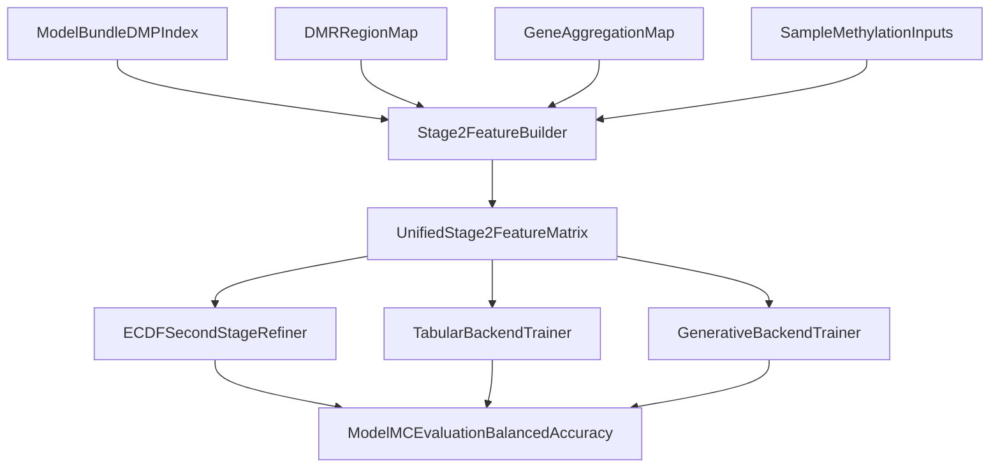

# Second-Stage Disease-Feature Upgrade Plan

## Goals
- Replace/augment chromosome-dominant second-stage signals with disease-specific signals using DMP-, DMR-, and gene-level variables.
- Apply a consistent feature contract across `ecdf`, `tabular_sklearn`, and `generative_hybrid` model backends.
- Preserve train/predict schema parity and model reproducibility while improving ranking on balanced accuracy in labeled validation.
- Close documentation gaps around second-stage behavior, feature semantics, and blind-sample interpretation.

## Current Technical Baseline
- Stage-2 exists for ECDF via [`/home/ubuntu/MethylPipeline/packages/methylvalidation/methyl_validation/ecdf_second_stage.py`](/home/ubuntu/MethylPipeline/packages/methylvalidation/methyl_validation/ecdf_second_stage.py), with feature construction in [`/home/ubuntu/MethylPipeline/packages/methylvalidation/methyl_validation/observed_feature_builder.py`](/home/ubuntu/MethylPipeline/packages/methylvalidation/methyl_validation/observed_feature_builder.py).
- Backend orchestration is controlled in [`/home/ubuntu/MethylPipeline/packages/methylvalidation/methyl_validation/trainer_api.py`](/home/ubuntu/MethylPipeline/packages/methylvalidation/methyl_validation/trainer_api.py).
- Configuration surface is in [`/home/ubuntu/MethylPipeline/packages/methylvalidation/methyl_validation/config.py`](/home/ubuntu/MethylPipeline/packages/methylvalidation/methyl_validation/config.py).
- Blind-mode behavior and labeled metrics constraints are documented/implemented in predictor and validation modules (no BA in blind-only inference).

## Proposed Architecture

## Implementation Workstreams
- **Unified disease-feature builder**
  - Extend/compose [`/home/ubuntu/MethylPipeline/packages/methylvalidation/methyl_validation/observed_feature_builder.py`](/home/ubuntu/MethylPipeline/packages/methylvalidation/methyl_validation/observed_feature_builder.py) to add:
    - DMP-derived disease summaries (beyond chromosome aggregates).
    - DMR/region aggregates keyed from stable DMP neighborhoods.
    - Gene-level aggregates keyed from DMP-to-gene mapping.
  - Keep strict deterministic column ordering and train/predict schema checks.

- **Backend integration (all three backends)**
  - ECDF: update [`/home/ubuntu/MethylPipeline/packages/methylvalidation/methyl_validation/ecdf_second_stage.py`](/home/ubuntu/MethylPipeline/packages/methylvalidation/methyl_validation/ecdf_second_stage.py) to consume the enriched stage-2 matrix.
  - Tabular: integrate same stage-2 feature contract in [`/home/ubuntu/MethylPipeline/packages/methylvalidation/methyl_validation/tabular_backend.py`](/home/ubuntu/MethylPipeline/packages/methylvalidation/methyl_validation/tabular_backend.py).
  - Generative: mirror integration in [`/home/ubuntu/MethylPipeline/packages/methylvalidation/methyl_validation/generative_backend.py`](/home/ubuntu/MethylPipeline/packages/methylvalidation/methyl_validation/generative_backend.py).
  - Orchestration: ensure consistent path selection and artifact writing in [`/home/ubuntu/MethylPipeline/packages/methylvalidation/methyl_validation/trainer_api.py`](/home/ubuntu/MethylPipeline/packages/methylvalidation/methyl_validation/trainer_api.py).

- **Configuration and compatibility**
  - Add config toggles to enable/disable feature families (DMP/DMR/gene), with safe defaults in [`/home/ubuntu/MethylPipeline/packages/methylvalidation/methyl_validation/config.py`](/home/ubuntu/MethylPipeline/packages/methylvalidation/methyl_validation/config.py).
  - Ensure backward compatibility with existing bundles and old runs.

- **Evaluation protocol (BA-focused, blind-aware)**
  - Use labeled validation/MC for balanced-accuracy model selection and ablation comparisons.
  - Keep blind predictions for deployment realism, but avoid interpreting blind outputs as BA.
  - Add per-backend ablation reports for: baseline, +DMP, +DMR, +gene, +all.

- **Testing updates**
  - Extend feature schema and parity tests in:
    - [`/home/ubuntu/MethylPipeline/packages/methylvalidation/tests/test_observed_feature_builder.py`](/home/ubuntu/MethylPipeline/packages/methylvalidation/tests/test_observed_feature_builder.py)
    - [`/home/ubuntu/MethylPipeline/packages/methylvalidation/tests/test_model_bundle_tabular_backend.py`](/home/ubuntu/MethylPipeline/packages/methylvalidation/tests/test_model_bundle_tabular_backend.py)
    - [`/home/ubuntu/MethylPipeline/packages/methylvalidation/tests/test_generative_backend.py`](/home/ubuntu/MethylPipeline/packages/methylvalidation/tests/test_generative_backend.py)
    - [`/home/ubuntu/MethylPipeline/packages/methylvalidation/tests/test_trainer_api_ecdf_second_stage.py`](/home/ubuntu/MethylPipeline/packages/methylvalidation/tests/test_trainer_api_ecdf_second_stage.py)

- **Documentation completion**
  - Update user-facing modeling docs and workflow diagrams:
    - [`/home/ubuntu/MethylPipeline/docs/WORKFLOW_DIAGRAM_PACK_Healthy_vs_PCa1-4-CG.md`](/home/ubuntu/MethylPipeline/docs/WORKFLOW_DIAGRAM_PACK_Healthy_vs_PCa1-4-CG.md)
    - [`/home/ubuntu/MethylPipeline/packages/methylvalidation/docs/USAGE.md`](/home/ubuntu/MethylPipeline/packages/methylvalidation/docs/USAGE.md)
    - [`/home/ubuntu/MethylPipeline/packages/methylvalidation/docs/IMPLEMENTATION.md`](/home/ubuntu/MethylPipeline/packages/methylvalidation/docs/IMPLEMENTATION.md)
    - [`/home/ubuntu/MethylPipeline/README.md`](/home/ubuntu/MethylPipeline/README.md)
  - Add a clear section distinguishing:
    - classifier/model inputs (DMP/DMR/gene engineered features),
    - chromosome fusion behavior,
    - interpretation outputs (mapper/enricher),
    - blind-output limitations.

## Success Criteria
- New disease-feature families are available and selectable in all three backends.
- No schema drift between training and prediction artifacts.
- Model-selection reports show reproducible BA comparison across ablations.
- Documentation explicitly covers second-stage logic, feature semantics, and blind-vs-labeled evaluation boundaries.