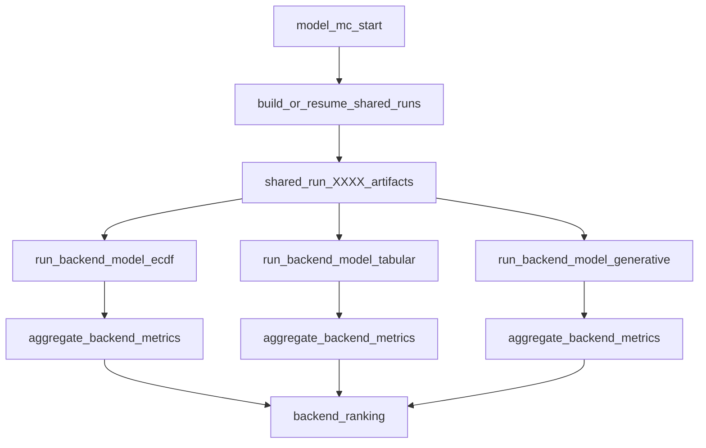

# Shared Model-MC Runs Across Backends

## Goal
Make `--model-mc --model-mc-all` generate one canonical set of MC runs and reuse it for `ecdf`, `tabular_sklearn`, and `generative_hybrid`, instead of regenerating splits/centroid/detector per backend.

## Current Bottleneck
- `main()` iterates backend-first and calls `_run_model_mc_backend(...)` independently per backend in [`/home/ubuntu/MethylPipeline/packages/methylvalidation/methyl_validation/cli.py`](/home/ubuntu/MethylPipeline/packages/methylvalidation/methyl_validation/cli.py).
- `_run_model_mc_backend(...)` currently performs both:
  - run preparation + `stratified_split*` + `generate_run_project*`
  - `run_pipeline_for_iteration*` (centroid+detector)
  - `run_pipeline_for_model` (backend-specific)
- This causes repeated expensive stages and non-identical random splits across backends.

## Proposed Design

### A) Introduce a shared-run phase (single execution)
- Add a shared-run executor in [`/home/ubuntu/MethylPipeline/packages/methylvalidation/methyl_validation/cli.py`](/home/ubuntu/MethylPipeline/packages/methylvalidation/methyl_validation/cli.py) that:
  - computes splits once (`stratified_split` / `stratified_split_multiclass`),
  - writes run projects once (`generate_run_project*`),
  - runs centroid+detector once (`run_pipeline_for_iteration*`),
  - stores outputs under a canonical shared root (e.g. `model_mc/shared/run_XXXX`).
- Preserve `--resume` semantics using the same `_resolve_resume_start_iteration(...)` policy.

### B) Decouple backend model stage from shared prep
- Extract backend-only execution from `_run_model_mc_backend(...)` into a dedicated function that:
  - loads each shared `run_XXXX/project.json`,
  - runs only `run_pipeline_for_model(...)` with `config.model_backend` override,
  - writes backend artifacts/metrics into `model_mc/<backend>/...`.
- Keep per-backend aggregation unchanged via `_write_model_mc_outputs(...)` and `_write_backend_ranking(...)`.

### C) Keep compatibility and operational clarity
- Keep existing behavior for single-backend `--model-mc` (works with/without shared phase).
- For `--model-mc-all`, default to shared-run reuse.
- Update progress logs so operators can distinguish:
  - `[model-mc:shared]` split/centroid/detector progress,
  - `[model-mc:<backend>]` model-stage progress.

## File-Level Change Plan
- **CLI orchestration:** refactor backend-first loop in [`/home/ubuntu/MethylPipeline/packages/methylvalidation/methyl_validation/cli.py`](/home/ubuntu/MethylPipeline/packages/methylvalidation/methyl_validation/cli.py) into:
  1) shared-run build/resume
  2) backend model passes over shared runs
- **Project generation reuse:** reuse existing generators in [`/home/ubuntu/MethylPipeline/packages/methylvalidation/methyl_validation/project_gen.py`](/home/ubuntu/MethylPipeline/packages/methylvalidation/methyl_validation/project_gen.py) with shared output root.
- **Pipeline boundaries:** keep using existing APIs in [`/home/ubuntu/MethylPipeline/packages/methylvalidation/methyl_validation/pipeline_runner.py`](/home/ubuntu/MethylPipeline/packages/methylvalidation/methyl_validation/pipeline_runner.py) (`run_pipeline_for_iteration*` for shared phase; `run_pipeline_for_model` for backend phase).
- **Docs:** update behavior docs/examples in [`/home/ubuntu/MethylPipeline/packages/methylvalidation/docs/USAGE.md`](/home/ubuntu/MethylPipeline/packages/methylvalidation/docs/USAGE.md) and optional implementation notes in [`/home/ubuntu/MethylPipeline/packages/methylvalidation/docs/IMPLEMENTATION.md`](/home/ubuntu/MethylPipeline/packages/methylvalidation/docs/IMPLEMENTATION.md).

## Validation Strategy
- Unit/integration check path:
  - run `--model-mc --model-mc-all` on a small fixture;
  - verify exactly one `model_mc/shared/run_XXXX` set;
  - verify all three `model_mc/<backend>/` outputs exist with summaries;
  - verify identical run IDs/split manifests used across backends.
- Regression checks:
  - single-backend `--model-mc --model-backend ecdf` still works;
  - `--resume` rebuild behavior remains deterministic.

## Risks and Mitigations
- **Resume complexity across two phases:** enforce clear phase checkpoints and per-phase cleanup rules before rerun.
- **Path coupling in backend code:** ensure backend model steps read shared `project.json` but write backend outputs under backend roots.
- **Metric comparability drift:** pin run IDs/splits through shared manifests and validate consistency before ranking.