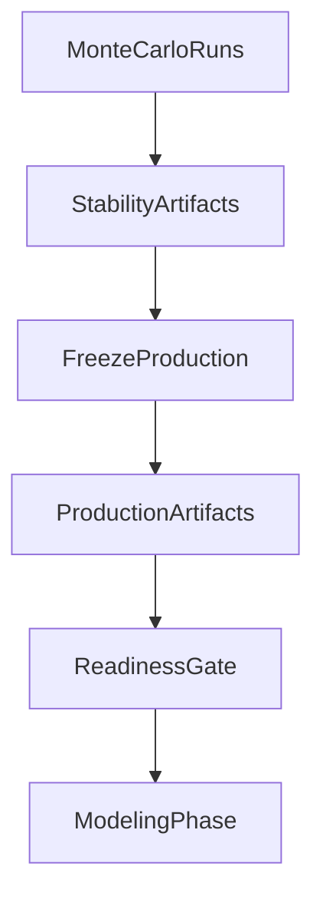

# Stability and Freeze Readiness Analysis

## Scope
Analyze whether the existing stability-selected DMP panel and frozen production artifacts are biologically and operationally ready for model building, using current pipeline outputs and implementation behavior in:
- [`/home/ubuntu/MethylPipeline/packages/methylvalidation/methyl_validation/stability.py`](/home/ubuntu/MethylPipeline/packages/methylvalidation/methyl_validation/stability.py)
- [`/home/ubuntu/MethylPipeline/packages/methylvalidation/methyl_validation/pipeline_runner.py`](/home/ubuntu/MethylPipeline/packages/methylvalidation/methyl_validation/pipeline_runner.py)
- [`/home/ubuntu/MethylPipeline/packages/methyldetector/methyl_detector/core/methyldetector.py`](/home/ubuntu/MethylPipeline/packages/methyldetector/methyl_detector/core/methyldetector.py)
- [`/home/ubuntu/MethylPipeline/packages/methylvalidation/docs/USAGE.md`](/home/ubuntu/MethylPipeline/packages/methylvalidation/docs/USAGE.md)

## Workflow Map

## Analysis Plan
1. **Stability quality audit (run-level + panel-level)**
   - Inspect `monte_carlo_runs/stability/stability_summary.json`, `dmp_frequency.csv`, and selected panel outputs (`stable_dmps_production.csv`, plus strict/relaxed/tiered files when present).
   - Quantify:
     - number of qualifying runs used in frequency denominator,
     - recurrence distribution (core vs long tail),
     - effect-size/score concentration in retained panel,
     - chromosome/context balance and potential over-concentration.
   - Validate that thresholds used (`stability_dmp_freq`, BA gate, dual-cutoff/tier settings) match project intent.

2. **Progression coherence analysis (biological trajectory check)**
   - Use progression artifacts (if generated): `progression/modules_long.csv`, `pathways_long.csv`, `genes_long.csv`, `entities_progression_labels.csv`, `summary.json`.
   - For modules/pathways/genes across ordered stages, verify expected directional behavior (early/late/stable/monotonic labels) and identify contradictions.
   - Produce a stage-by-stage narrative linking module-score shifts to disease progression expectations.

3. **Freeze integrity audit (artifact correctness)**
   - Confirm `production/project.json` points `step_config.detection.fixed_dmp_panel` to `production/stable_dmps_genomewide.csv`.
   - Verify freeze logs/timings (`production/logs/*.log`, `production/step_timings.csv`, `production/production_summary.json`) show successful centroid/detector/mapper/enricher/progression completion (as configured).
   - Check fixed-panel feasibility: retained loci overlap with centroid coverage (no pathological drop to near-empty effective panel at detector runtime).

4. **Pre-model readiness gates (go/no-go criteria)**
   - Define explicit pass criteria before modeling:
     - Stability panel size within acceptable range (not too sparse, not too noisy).
     - Progression signals are coherent with expected stage biology.
     - Freeze run has no blocking errors and produces complete production artifacts.
     - No stale/removed detector config keys in active run/freeze projects.
   - Classify outcomes as `go`, `go_with_risks`, or `no_go` with concrete remediation steps.

5. **Deliverable package before modeling**
   - A concise readiness report containing:
     - key metrics and thresholds actually observed,
     - strongest supporting evidence for biological coherence,
     - top residual risks/assumptions,
     - recommended config adjustments (if needed) before launching `--model`.

## Primary files and outputs to inspect
- Stability artifacts under each project:
  - `.../monte_carlo_runs/stability/stability_summary.json`
  - `.../monte_carlo_runs/stability/dmp_frequency.csv`
  - `.../monte_carlo_runs/stability/stable_dmps_production.csv`
- Freeze artifacts:
  - `.../monte_carlo_runs/production/project.json`
  - `.../monte_carlo_runs/production/stable_dmps_genomewide.csv`
  - `.../monte_carlo_runs/production/production_summary.json`
  - `.../monte_carlo_runs/production/step_timings.csv`
  - `.../monte_carlo_runs/production/logs/`
- Progression artifacts (when enabled in freeze flow):
  - `.../progression/modules_long.csv`
  - `.../progression/pathways_long.csv`
  - `.../progression/genes_long.csv`
  - `.../progression/entities_progression_labels.csv`
  - `.../progression/summary.json`

## Expected outcome
A defensible decision on whether the stable DMP panel and frozen production outputs are sufficiently robust and biologically coherent to proceed to the modeling phase, with clear corrective actions if they are not.