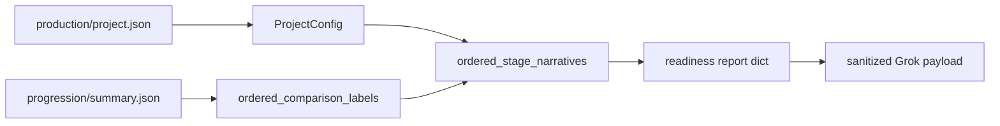

# Stage descriptions for Grok readiness

## Context

- Stage strata live on [`GroupConfig`](packages/methylutils/methyl_utils/pipeline_config.py) as optional nested `stages: List[GroupConfig]` (each child has `label`, `sample_paths`; no `description` today).
- Progression order comes from `monte_carlo_runs/production/progression/summary.json` → `ordered_comparison_labels`, which must match project `comparisons` tokens the same way [`resolve_stage_specs`](packages/methyldiseaseprogression/methyl_disease_progression/progression.py) resolves them (`by_disease_group` / `by_label` keyed by `comparison_label or disease_group`).
- Readiness already reads raw [`production/project.json`](packages/methylvalidation/methyl_validation/stability_freeze_readiness.py) for `disease_term`; Grok payload is built in [`build_sanitized_ai_payload`](packages/methylvalidation/methyl_validation/grok_readiness.py) under `progression_summary`.

## 1. Pydantic: optional `description` on `GroupConfig`

**File:** [`packages/methylutils/methyl_utils/pipeline_config.py`](packages/methylutils/methyl_utils/pipeline_config.py)

- Add `description: Optional[str] = Field(default=None, description="Human-readable stage/cohort meaning (e.g. clinical stage); omit sample paths.")` to `GroupConfig`.
- Optional `@field_validator` on `description` to strip whitespace and coerce `""` → `None` (keeps JSON clean).
- No change to `stages_mutually_exclusive_with_parent_samples` required (description does not conflict with sample_paths/stages rules).

## 2. `ProjectConfig`: resolve description by disease leaf + ordered tokens

**Same file:** add two focused helpers (private + public):

1. **`_description_for_disease_group(self, disease_group: str) -> Optional[str]`**  
   Walk `self.disease.groups` (if present): for each top-level `g`, if `g.stages`, find child `st` where `f"{g.label}_{st.label}" == disease_group` (and optionally handle level-expanded labels `f"{g.label}_{st.label}_{level}"` by matching longest prefix / same strategy as label resolution if you already have conventions—if ambiguous, document that descriptions apply to base `parent_child` leaves only). For groups without `stages`, match `g.label == disease_group` and return `g.description`.

2. **`get_ordered_stage_narratives(self, ordered_tokens: Sequence[str]) -> List[Dict[str, Any]]`**  
   For each token in `ordered_tokens`, resolve the `ComparisonSpec` using the same lookup as progression (`by_disease_group.get(token) or by_label.get(token)` built from `get_comparisons()`). Emit dicts like `{"comparison_label": token, "disease_group": spec.disease_group, "description": _description_for_disease_group(spec.disease_group)}` (omit or null `description` when unknown). **Do not** include `sample_paths` in return values (Grok payload stays path-free).

## 3. Readiness: load project + attach narrative, feed Grok

**File:** [`packages/methylvalidation/methyl_validation/stability_freeze_readiness.py`](packages/methylvalidation/methyl_validation/stability_freeze_readiness.py)

- After reading `production_project_path`, **try** `load_project(production_project_path)` from `methyl_utils.pipeline_config` (methylvalidation already depends on methylutils).
- On success: compute `ordered_tokens = list(progression_summary.get("ordered_comparison_labels") or project.get_ordered_comparison_labels())` (same fallback order as progression when summary omits labels).
- Set `report["progression"]["ordered_stage_narratives"] = project.get_ordered_stage_narratives(ordered_tokens)` (or a shorter key name you prefer, documented once).
- On `ValidationError` / `FileNotFoundError`: leave field absent or empty list (readiness stays read-only and tolerant).

**File:** [`packages/methylvalidation/methyl_validation/grok_readiness.py`](packages/methylvalidation/methyl_validation/grok_readiness.py)

- Extend `build_sanitized_ai_payload` → under `progression_summary`, include the new list (e.g. `ordered_stage_narratives`) so Grok sees explicit stage order **and** clinical text. Existing path scrubbing applies to string values (descriptions should remain free of absolute paths by convention; no extra PII beyond what the user put in JSON).

**Optional UX:** append a short **“Stage definitions (from project config)”** subsection in `render_markdown` when the list is non-empty (labels + descriptions only), so humans see the same context as Grok.

## 4. Tests

- **methylutils:** extend [`packages/methylutils/tests/test_pipeline_config_contracts.py`](packages/methylutils/tests/test_pipeline_config_contracts.py) (or add a small test) with a minimal project JSON that includes `stages[].description` and assert `ProjectConfig.model_validate` succeeds and `get_ordered_stage_narratives` returns aligned rows.
- **methylvalidation:** extend [`packages/methylvalidation/tests/test_stability_freeze_readiness.py`](packages/methylvalidation/tests/test_stability_freeze_readiness.py) minimal `project.json` under `_write_minimal_project` with optional `disease` + `stages` + `comparisons` + descriptions; assert `build_sanitized_ai_payload` contains those strings and still passes path-like checks.

## 5. Docs

- Brief note in [`packages/methylvalidation/docs/STABILITY_FREEZE_READINESS.md`](packages/methylvalidation/docs/STABILITY_FREEZE_READINESS.md): optional `description` per stage in project config is forwarded to Grok when present.
- If you maintain cohort tree docs, one line in [`packages/methylutils/docs/COHORT_TREE.md`](packages/methylutils/docs/COHORT_TREE.md) (if it exists) pointing to the new field.

## Flow (data)

## Notes / edge cases

- **`comparison_label` differs from `disease_group`:** attach description to the **stage** identified by `disease_group` (folder identity); narrative list keyed by progression **token** (`comparison_label` if set).
- **Subcluster-derived disease labels:** if no matching `GroupConfig`, `description` is `None` (acceptable).
- **Do not** pass `sample_paths` into Grok context (only labels + descriptions).
