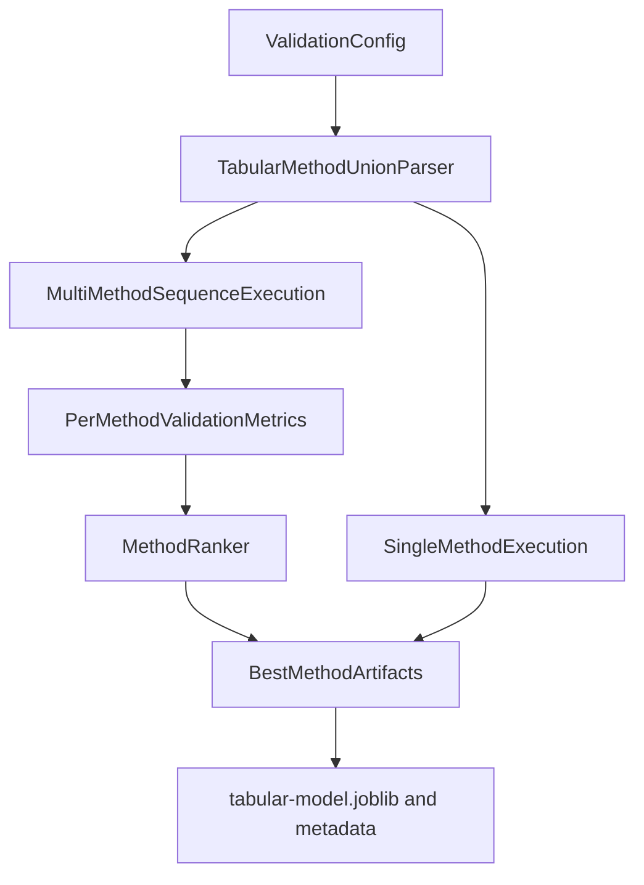

# Tabular Method Config Extension Plan

## Goal
Replace the current flat `tabular_model_type` string + implicit defaults with explicit nested method configs validated by Pydantic, while also supporting sequential evaluation of multiple tabular methods in one run.

## Current Baseline
- Config currently uses flat fields in [`/home/ubuntu/MethylPipeline/packages/methylvalidation/methyl_validation/config.py`](/home/ubuntu/MethylPipeline/packages/methylvalidation/methyl_validation/config.py), mainly `tabular_model_type` and `tabular_max_dmps`.
- Estimator creation is hardcoded in `_build_estimator(model_type, random_state)` in [`/home/ubuntu/MethylPipeline/packages/methylvalidation/methyl_validation/tabular_backend.py`](/home/ubuntu/MethylPipeline/packages/methylvalidation/methyl_validation/tabular_backend.py).
- Trainer orchestration passes a single `model_type` via [`/home/ubuntu/MethylPipeline/packages/methylvalidation/methyl_validation/trainer_api.py`](/home/ubuntu/MethylPipeline/packages/methylvalidation/methyl_validation/trainer_api.py).
- CLI currently overrides only flat `--tabular-model-type` in [`/home/ubuntu/MethylPipeline/packages/methylvalidation/methyl_validation/cli.py`](/home/ubuntu/MethylPipeline/packages/methylvalidation/methyl_validation/cli.py).

## Proposed Configuration Model
- Add a discriminated-union schema (Pydantic) under `step_config.validation`, e.g.:
  - `tabular_methods: [ ... ]` (ordered list, one or more entries)
  - each entry has `method` discriminator and a method-specific nested `params`
- First supported method models:
  - `random_forest`
  - `hist_gradient_boosting`
  - `logistic_regression`
- Add optional selector fields:
  - `tabular_method_selection_metric` (default `balanced_accuracy`)
  - `tabular_method_selection_stat` (default `mean` for single holdout; later extensible)

## Data Flow


## Implementation Steps
- **Config schema + validation**
  - In [`/home/ubuntu/MethylPipeline/packages/methylvalidation/methyl_validation/config.py`](/home/ubuntu/MethylPipeline/packages/methylvalidation/methyl_validation/config.py):
    - Add typed method models (`RandomForestMethodConfig`, `HistGradientBoostingMethodConfig`, `LogisticRegressionMethodConfig`).
    - Add `TabularMethodConfig` discriminated union and `tabular_methods: List[TabularMethodConfig]`.
    - Add selector fields for ranking in multi-method mode.
    - Keep `tabular_model_type` for compatibility; synthesize default `tabular_methods` when new field absent.

- **Estimator factory refactor**
  - In [`/home/ubuntu/MethylPipeline/packages/methylvalidation/methyl_validation/tabular_backend.py`](/home/ubuntu/MethylPipeline/packages/methylvalidation/methyl_validation/tabular_backend.py):
    - Replace `_build_estimator(model_type, random_state)` with `_build_estimator_from_config(method_cfg)`.
    - Ensure per-method params are serialized in metadata (`method`, `params`, resolved defaults).

- **Sequential method execution (single pipeline invocation)**
  - Add a tabular sequence runner (in same module or small helper module) that:
    - loops configured methods in order,
    - trains/predicts each into method-specific subdirs,
    - collects metrics,
    - ranks methods by configured selection metric,
    - promotes best artifacts to canonical tabular output names for downstream compatibility.
  - Preserve existing outputs for single-method runs.

- **Trainer API wiring**
  - In [`/home/ubuntu/MethylPipeline/packages/methylvalidation/methyl_validation/trainer_api.py`](/home/ubuntu/MethylPipeline/packages/methylvalidation/methyl_validation/trainer_api.py):
    - pass `tabular_methods` and selection fields into tabular train path.
    - keep current behavior when only legacy config is present.

- **CLI compatibility strategy**
  - In [`/home/ubuntu/MethylPipeline/packages/methylvalidation/methyl_validation/cli.py`](/home/ubuntu/MethylPipeline/packages/methylvalidation/methyl_validation/cli.py):
    - retain `--tabular-model-type` as shorthand that populates a single-entry `tabular_methods` list.
    - optionally add `--tabular-methods-json` for advanced users (direct nested override).

- **Metadata/artifact contract**
  - Write method-level summaries:
    - `tabular_method_metrics.csv`
    - `tabular_method_ranking.json`
  - In canonical metadata, store:
    - chosen method,
    - evaluated methods,
    - ranking rationale (metric/stat).

- **Tests**
  - Update/add tests in:
    - [`/home/ubuntu/MethylPipeline/packages/methylvalidation/tests/test_model_bundle_tabular_backend.py`](/home/ubuntu/MethylPipeline/packages/methylvalidation/tests/test_model_bundle_tabular_backend.py)
    - [`/home/ubuntu/MethylPipeline/packages/methylvalidation/tests/test_cli_resume.py`](/home/ubuntu/MethylPipeline/packages/methylvalidation/tests/test_cli_resume.py) (if CLI override paths touched)
    - add dedicated config schema tests (new file) for union discrimination and backward compatibility.

## Backward Compatibility
- Old configs with only `tabular_model_type` continue to work unchanged.
- New nested schema is preferred and documented as canonical.
- Existing downstream consumers continue to read canonical tabular artifacts without changes.

## Example Target Config Shape
```json
"validation": {
  "model_backend": "tabular_sklearn",
  "tabular_methods": [
    {"method": "random_forest", "params": {"n_estimators": 500, "min_samples_leaf": 2, "class_weight": "balanced_subsample"}},
    {"method": "logistic_regression", "params": {"max_iter": 2000, "class_weight": "balanced", "C": 1.0}}
  ],
  "tabular_method_selection_metric": "balanced_accuracy"
}
```

## Acceptance Criteria
- Nested method configs are validated with method-specific Pydantic models.
- Multi-method sequence execution works and selects a best method deterministically.
- Canonical tabular artifacts remain compatible for downstream prediction/evaluation paths.
- Legacy flat config continues to run without user migration pressure.