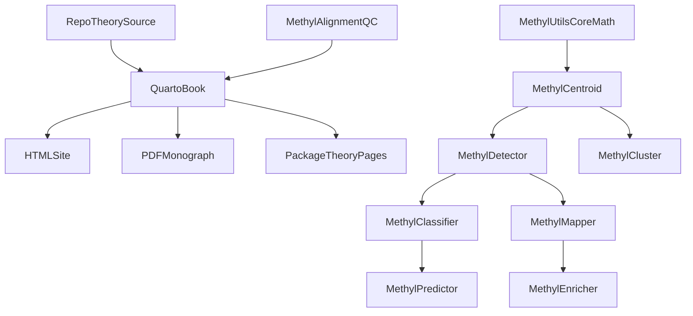

# Publication-Grade Theory Documentation Plan

## Why This Plan
The repo already claims a package-level `THEORY.md` contract in [/home/ubuntu/MethylPipeline/README.md](/home/ubuntu/MethylPipeline/README.md), but the current state is uneven:
- Existing theory pages are short and not publication-ready, for example [/home/ubuntu/MethylPipeline/packages/methylclassifier/docs/THEORY.md](/home/ubuntu/MethylPipeline/packages/methylclassifier/docs/THEORY.md) and [/home/ubuntu/MethylPipeline/packages/methylutils/docs/THEORY.md](/home/ubuntu/MethylPipeline/packages/methylutils/docs/THEORY.md).
- Several packages are missing theory docs entirely or only have operational docs, notably `methylcluster`, `methylmapper`, `methylenricher`, and `methylalignmentqc`.
- The current root docs site config at [/home/ubuntu/MethylPipeline/mkdocs.yml](/home/ubuntu/MethylPipeline/mkdocs.yml) points to many files that do not exist, so it is not a solid base for publication output.
- The repo narrative is a bit too clean: the ECDF-based detector/classifier core is real, but downstream packages also contain heuristics, independence assumptions, beta-based clustering distances, and external-service logic that should be documented as such, not upgraded rhetorically into theory.

## Recommended Output Architecture
Use a new Quarto book as the canonical mathematical/statistical source of truth, under a root docs area such as `docs/theory/`.

Proposed structure:
- `docs/theory/_quarto.yml`: book config for HTML + PDF output, cross-references, bibliography, TOC, chapter ordering.
- `docs/theory/index.qmd`: scope, notation, common symbols, data model.
- `docs/theory/chapters/01-methylutils.qmd`
- `docs/theory/chapters/02-methylcentroid.qmd`
- `docs/theory/chapters/03-methyldetector.qmd`
- `docs/theory/chapters/04-methylclassifier.qmd`
- `docs/theory/chapters/05-methylpredictor-and-validation.qmd`
- `docs/theory/chapters/06-methylcluster.qmd`
- `docs/theory/chapters/07-methylmapper.qmd`
- `docs/theory/chapters/08-methylenricher.qmd`
- `docs/theory/chapters/09-methylalignmentqc.qmd`
- `docs/theory/chapters/10-limitations-and-open-questions.qmd`
- `docs/theory/references.bib`: BibTeX bibliography for statistical methods, algorithms, and external resources.
- Optional `docs/theory/_extensions/` or CSL style if you want a journal-like reference style.

Then make package-local theory docs point into the book or contain concise package-specific summaries that stay consistent with the canonical Quarto chapters.

## Documentation Content Strategy
Write the book in layers instead of package silos only:
- Common mathematical preliminaries: methylation fractions, histogram/bin notation, ECDFs, spline interpolation, multiple-testing notation, weighting notation.
- Core statistical pipeline: `methylutils`, `methylcentroid`, `methyldetector`, `methylclassifier`, `methylpredictor`, `methylvalidation`.
- Downstream methods: `methylcluster`, `methylmapper`, `methylenricher`, `methylalignmentqc`.
- Critical appendix: assumptions, approximations, heuristics, external dependencies, and where claims should be softened.

This avoids repeating notation in every package chapter while still giving each package its own self-contained section.

## Critical Issues To Audit And Reflect In The Docs
These should be treated as first-class deliverables, not side notes:
- The top-level “ECDF-only pipeline” story in [/home/ubuntu/MethylPipeline/README.md](/home/ubuntu/MethylPipeline/README.md) is too broad for the whole monorepo. The detector/classifier core is ECDF-first, but clustering uses beta-based distances, mapper uses weighted Stouffer aggregation, enricher includes heuristic ranking and external services, and alignment QC is metric ingestion rather than inference.
- `methylutils` contains both principled and approximate procedures. The docs should distinguish exact definitions from approximations, especially for binned Mann–Whitney and large-sample KS p-values in [/home/ubuntu/MethylPipeline/packages/methylutils/methyl_utils/statistical_tests.py](/home/ubuntu/MethylPipeline/packages/methylutils/methyl_utils/statistical_tests.py).
- `methylclassifier` theory should match the actual implementation in [/home/ubuntu/MethylPipeline/packages/methylutils/methyl_utils/ecdf_classifier.py](/home/ubuntu/MethylPipeline/packages/methylutils/methyl_utils/ecdf_classifier.py): weighted mean log-likelihood, log-PDF capping, effective-position temperature scaling, and second-stage chromosome weighting are not a single clean generative model.
- `methylmapper` gene scores should explicitly state the independence caveat for weighted Stouffer aggregation over correlated DMPs in [/home/ubuntu/MethylPipeline/packages/methylmapper/methyl_mapper/bedtools_mapper.py](/home/ubuntu/MethylPipeline/packages/methylmapper/methyl_mapper/bedtools_mapper.py).
- `methylenricher` needs a sharp separation between statistical enrichment and heuristic module ranking. The current score in [/home/ubuntu/MethylPipeline/packages/methylenricher/methyl_enricher/module_scorer.py](/home/ubuntu/MethylPipeline/packages/methylenricher/methyl_enricher/module_scorer.py) uses hand-scaled constants and a prostate-specific prior, which should be described as an application prior, not general theory.
- `methylcluster` needs explicit justification for its beta-distance geometry relative to the ECDF-centered rest of the pipeline.

## Expected Deliverables
- A Quarto book that builds to high-quality HTML and PDF.
- Expanded, reference-backed theory chapters for every first-party package.
- A bibliography and citation workflow that can support publication-quality references.
- Clear notation tables, equations, algorithm boxes, and assumption/limitation callouts.
- Reconciled package docs and README language so public claims match implementation.
- Build instructions for Linux and Windows 11, including Quarto, a TeX engine, and any supporting tools.

## References To Cover
The book should cite the primary literature for:
- ECDFs and monotone interpolation / PCHIP
- Kolmogorov–Smirnov testing
- Mann–Whitney / Wilcoxon rank methods and the caveat of binned approximations
- Storey FDR / q-values
- Naive Bayes and calibration
- Stouffer meta-analysis
- HDBSCAN, k-means, hierarchical clustering, silhouette scoring
- Over-representation analysis / Enrichr usage
- Any external database or service presented as evidence, not inference

## Implementation Notes
- Quarto is the best fit because it gives one authoring source for math-heavy HTML and PDF without forcing the repo into Sphinx.
- The current MkDocs setup should either be slimmed down to a lightweight landing page that links to Quarto output or retired if it adds maintenance burden.
- Package `docs/THEORY.md` files should not become independent competing sources. They should be synchronized summaries or stable entry points into the canonical Quarto chapters.