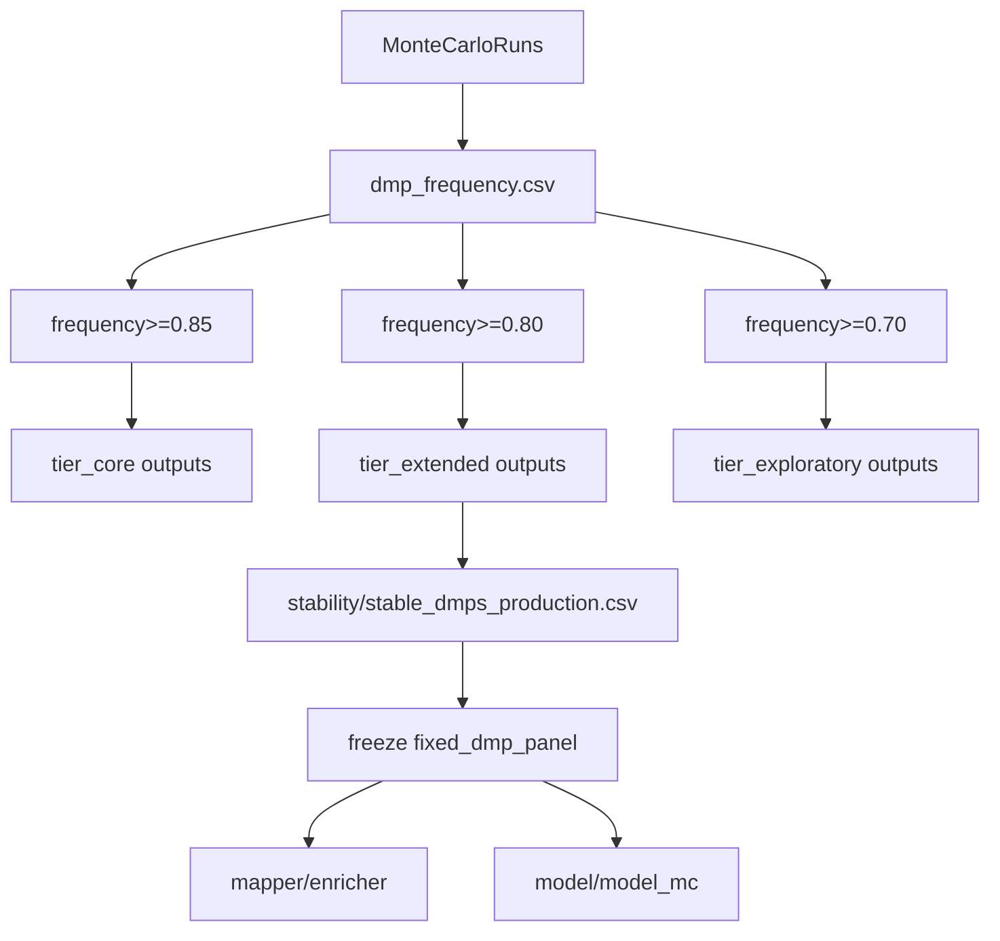

# Tiered Stability Across Full Pipeline

## Goal
Adopt tiered DMP stability outputs and wire them through the full workflow using:

- Core: `frequency >= 0.85`
- Extended: `frequency >= 0.80` (chosen default for freeze/modeling)
- Exploratory: `frequency >= 0.70`

Keep existing MC results reusable (no mandatory reruns), and make tier choice explicit for downstream steps.

## Implementation Scope
- Stability generation and summaries: [`/home/ubuntu/MethylPipeline/packages/methylvalidation/methyl_validation/stability.py`](/home/ubuntu/MethylPipeline/packages/methylvalidation/methyl_validation/stability.py)
- Validation config surface: [`/home/ubuntu/MethylPipeline/packages/methylvalidation/methyl_validation/config.py`](/home/ubuntu/MethylPipeline/packages/methylvalidation/methyl_validation/config.py)
- CLI integration and freeze wiring: [`/home/ubuntu/MethylPipeline/packages/methylvalidation/methyl_validation/cli.py`](/home/ubuntu/MethylPipeline/packages/methylvalidation/methyl_validation/cli.py)
- Freeze execution path behavior: [`/home/ubuntu/MethylPipeline/packages/methylvalidation/methyl_validation/pipeline_runner.py`](/home/ubuntu/MethylPipeline/packages/methylvalidation/methyl_validation/pipeline_runner.py)
- User-facing docs: [`/home/ubuntu/MethylPipeline/packages/methylvalidation/docs/USAGE.md`](/home/ubuntu/MethylPipeline/packages/methylvalidation/docs/USAGE.md)
- Stability tests: [`/home/ubuntu/MethylPipeline/packages/methylvalidation/tests/test_stability_dual_cutoff.py`](/home/ubuntu/MethylPipeline/packages/methylvalidation/tests/test_stability_dual_cutoff.py), [`/home/ubuntu/MethylPipeline/packages/methylvalidation/tests/test_stability_detector_parameters.py`](/home/ubuntu/MethylPipeline/packages/methylvalidation/tests/test_stability_detector_parameters.py)

## Tier Model and Artifact Layout
Use tier subfolders under `stability/` (your selected layout):

- `stability/tier_core/` (>=0.85)
- `stability/tier_extended/` (>=0.80)
- `stability/tier_exploratory/` (>=0.70)

Each tier folder contains:

- `stable_dmps_production.csv` (tier-local production alias)
- `stable_dmps_strict.csv`
- `stable_dmps_relaxed.csv`
- `stable_dmps_scored.csv`
- diagnostics JSON/CSV

Root-level `stability/stable_dmps_production.csv` should point to/copy **extended** panel so freeze defaults to extended.

## Full-Pipeline Implications to Handle
- **Freeze default**: `--freeze` currently reads `freeze_stable_dmp_csv` defaulting to `stability/stable_dmps_production.csv` in CLI logic; this will now resolve to extended tier by default.
- **Modeling** (`--model`, `--model-mc`): remains unchanged operationally, but inputs will now come from extended tier unless overridden.
- **Mapper/enricher**: consume freeze outputs as today; no internal API changes required if stable panel path remains CSV-compatible.
- **Back-compat**: existing runs without tier folders must still work (legacy root files honored).
- **Reproducibility**: write tier thresholds and selected default tier into `stability_summary.json` to avoid ambiguity.

## Concrete Code Plan
1. Extend stability orchestration to support multi-tier generation in one pass from the same `dmp_frequency.csv` DataFrame.
2. Introduce tier configuration in `MonteCarloConfig`:
   - thresholds for core/extended/exploratory
   - enabled flag for tiered mode
   - default freeze tier (`extended`)
3. Implement tier folder writing in `run_stability_analysis()` by calling the existing dual-panel writer per threshold.
4. Materialize root `stability/stable_dmps_production.csv` from the selected default tier (extended).
5. Extend summary payload with tier paths, thresholds, counts, and selected default tier.
6. Update CLI output messages to report per-tier counts and active freeze default.
7. Update docs with tier semantics and recommended usage:
   - core: highest confidence
   - extended: default production/modeling
   - exploratory: broad discovery
8. Add regression tests for:
   - tier folder creation
   - extended-as-default alias behavior
   - freeze path compatibility when `freeze_stable_dmp_csv` is unset
   - legacy non-tier mode unchanged.

## Validation Strategy
- Unit/integration tests in methylvalidation test suite.
- Dry-run stability recomputation on existing MC outputs to verify tier folders and summary fields.
- Confirm freeze path resolution still succeeds with no explicit `freeze_stable_dmp_csv`.

## Data Flow

## Rollout Notes
- Phase 1: introduce tier outputs + extended default, preserve legacy files.
- Phase 2 (optional): allow downstream commands to accept `--stability-tier` directly for explicit tier selection without manual path overrides.