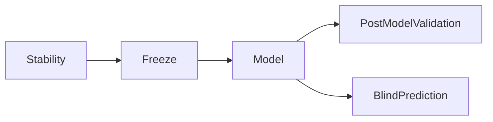

# Separate User Manual Implementation Plan

## Goal
Create a **new, standalone Quarto manual** focused on practical operation (not theory-first), with complete guidance for:
- individual package usage,
- orchestrated usage via `methyl-validation`,
- full final-solution stages: `stability`, `freeze`, `model`, `post-model validation`, and `blind prediction`.

Manual location:
- [`/home/ubuntu/MethylPipeline/docs/usage/`](/home/ubuntu/MethylPipeline/docs/usage/)

## Why Separate Project
A sibling Quarto project avoids disrupting the current theory book and keeps responsibilities clear:
- theory/reference remains in [`/home/ubuntu/MethylPipeline/docs/theory/`](/home/ubuntu/MethylPipeline/docs/theory/),
- operations/how-to manual lives in `docs/usage`.

## Source-of-Truth Inputs
Use these as canonical references while authoring:
- [`/home/ubuntu/MethylPipeline/packages/methylvalidation/methyl_validation/cli.py`](/home/ubuntu/MethylPipeline/packages/methylvalidation/methyl_validation/cli.py)
- [`/home/ubuntu/MethylPipeline/packages/methylvalidation/methyl_validation/config.py`](/home/ubuntu/MethylPipeline/packages/methylvalidation/methyl_validation/config.py)
- [`/home/ubuntu/MethylPipeline/packages/methylvalidation/docs/USAGE.md`](/home/ubuntu/MethylPipeline/packages/methylvalidation/docs/USAGE.md)
- [`/home/ubuntu/MethylPipeline/packages/methylvalidation/docs/IMPLEMENTATION.md`](/home/ubuntu/MethylPipeline/packages/methylvalidation/docs/IMPLEMENTATION.md)
- [`/home/ubuntu/MethylPipeline/docs/WORKFLOW_DIAGRAM_PACK_Healthy_vs_PCa1-4-CG.md`](/home/ubuntu/MethylPipeline/docs/WORKFLOW_DIAGRAM_PACK_Healthy_vs_PCa1-4-CG.md)
- [`/home/ubuntu/MethylPipeline/README.md`](/home/ubuntu/MethylPipeline/README.md)
- [`/home/ubuntu/MethylPipeline/docs/theory/chapters/11-project-configuration.qmd`](/home/ubuntu/MethylPipeline/docs/theory/chapters/11-project-configuration.qmd)
- [`/home/ubuntu/MethylPipeline/docs/theory/chapters/12-two-workflows.qmd`](/home/ubuntu/MethylPipeline/docs/theory/chapters/12-two-workflows.qmd)
- [`/home/ubuntu/MethylPipeline/docs/reference/configuration-reference.qmd`](/home/ubuntu/MethylPipeline/docs/reference/configuration-reference.qmd)
- [`/home/ubuntu/MethylPipeline/docs/usage/index.qmd`](/home/ubuntu/MethylPipeline/docs/usage/index.qmd)
- [`/home/ubuntu/MethylPipeline/docs/theory/chapters/15-model-creation-and-validation.qmd`](/home/ubuntu/MethylPipeline/docs/theory/chapters/15-model-creation-and-validation.qmd)

## Information Architecture (Full Manual)
Create a complete chapter set in first pass:
- `index.qmd` (how to use this manual + reading paths)
- `01-prerequisites-and-environment.qmd`
- `02-project-config-and-layout.qmd`
- `03-package-reference-individual-usage.qmd`
- `04-stage-stability.qmd`
- `05-stage-freeze.qmd`
- `06-stage-model.qmd`
- `07-stage-post-model-validation.qmd`
- `08-stage-blind-prediction.qmd`
- `09-artifacts-and-qa-checks.qmd`
- `10-troubleshooting-and-recovery.qmd`
- `11-command-cookbook.qmd`

Each chapter includes:
- purpose,
- prerequisites,
- exact commands,
- minimal config snippets,
- expected outputs/paths,
- “success checks”,
- common failure cases and fixes,
- links to theory chapters for deeper background.

## Diagram Strategy
Use Mermaid diagrams (workflow-first) in each stage chapter:

Per-stage diagrams will show:
- package execution chain,
- required input artifacts,
- output artifact handoff to next stage,
- optional branches (`model_backend`, `model-mc-all`, `predictor-only` constraints).

## Authoring and Build Setup
- Add a new Quarto config file at `docs/usage/_quarto.yml` with:
  - `project.type: book`,
  - output to `docs/usage/_book/`,
  - HTML + PDF formats,
  - chapter navigation order matching the architecture above.
- Keep rendering independent from theory book:
  - `quarto render docs/usage --to html`
  - `quarto render docs/usage --to pdf`

## Cross-Link and Discoverability Updates
After authoring manual chapters, add discoverability links:
- update [`/home/ubuntu/MethylPipeline/docs/index.md`](/home/ubuntu/MethylPipeline/docs/index.md) with a “User Manual” section,
- update [`/home/ubuntu/MethylPipeline/README.md`](/home/ubuntu/MethylPipeline/README.md) under documentation references,
- optionally add pointer in [`/home/ubuntu/MethylPipeline/docs/theory/README.md`](/home/ubuntu/MethylPipeline/docs/theory/README.md) indicating theory vs operations split.

## Content Quality Rules
- Keep statements code-traceable to CLI/config implementation.
- Clearly separate:
  - `methyl-validation` orchestrated flows,
  - standalone package usage (especially `methyl-predictor` blind mode outside validation orchestrator).
- For each stage, include “Do not do this” notes for common misuse (e.g. blind-only settings with `methyl-validation`).
- Use one terminology glossary across chapters (`run_XXXX`, `production/project.json`, `model_mc`, `post_model_validation`).

## Validation and Acceptance
Manual is complete when:
- all requested stages are fully documented with commands + diagrams,
- package-level individual usage chapter exists and cross-re