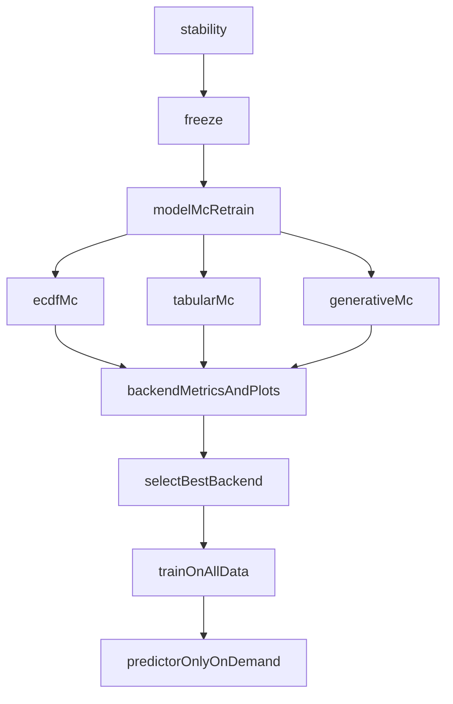

# Realign MethylValidation Workflow

## Target Behavior
Adopt this workflow:
1. `--stability`: discover stable DMPs via MC centroid+detector.
2. `--freeze`: single production biological pipeline (centroid -> detector fixed panel -> mapper/enricher/progression).
3. New backend MC model stage: full retrain+test Monte Carlo for each backend (`ecdf`, `tabular_sklearn`, `generative_hybrid`).
4. Select best backend/model and train final model on all data.
5. Use final model for on-demand prediction.

## Code Changes
- **CLI and mode semantics** in [/home/ubuntu/MethylPipeline/packages/methylvalidation/methyl_validation/cli.py](/home/ubuntu/MethylPipeline/packages/methylvalidation/methyl_validation/cli.py)
  - Introduce/rename model-MC mode to represent **full retraining per split** (not frozen-only evaluation).
  - Keep `--post-model-validation` as optional descriptive frozen-eval mode only if desired, but no longer the primary Step 3.
  - Add explicit backend sweep option (single backend or all backends).
  - Route outputs to backend-isolated roots (see below).

- **Pipeline orchestration** in [/home/ubuntu/MethylPipeline/packages/methylvalidation/methyl_validation/pipeline_runner.py](/home/ubuntu/MethylPipeline/packages/methylvalidation/methyl_validation/pipeline_runner.py) and [/home/ubuntu/MethylPipeline/packages/methylvalidation/methyl_validation/trainer_api.py](/home/ubuntu/MethylPipeline/packages/methylvalidation/methyl_validation/trainer_api.py)
  - Build per-iteration execution chains for each backend in Step 3 with retraining:
    - `ecdf`: centroid -> detector -> classifier -> predictor
    - `tabular_sklearn`: centroid -> detector -> bundle -> train -> predict
    - `generative_hybrid`: centroid -> detector -> bundle -> train -> predict
  - Ensure each iteration writes comparable scalar metrics.

- **Metrics + backend isolation** in [/home/ubuntu/MethylPipeline/packages/methylvalidation/methyl_validation/validator_metrics.py](/home/ubuntu/MethylPipeline/packages/methylvalidation/methyl_validation/validator_metrics.py)
  - Write backend-specific artifacts under isolated roots, e.g.:
    - `monte_carlo_runs/model_mc/ecdf/...`
    - `monte_carlo_runs/model_mc/tabular_sklearn/...`
    - `monte_carlo_runs/model_mc/generative_hybrid/...`
  - Preserve per-backend `all_metrics.csv`, `metrics_summary.json`, `step_timings.csv`, and Plotly KDE/ECDF chart.
  - Add optional cross-backend summary (ranking table by chosen selection metric).

- **Final model selection + train-all-data**
  - Add a selection command path in CLI to pick best backend based on configurable criterion (default `balanced_accuracy` median or mean).
  - Trigger final all-data train for selected backend and write canonical production artifacts under `production/`.

## Documentation Updates
- Update workflow narrative and command examples in:
  - [/home/ubuntu/MethylPipeline/packages/methylvalidation/docs/USAGE.md](/home/ubuntu/MethylPipeline/packages/methylvalidation/docs/USAGE.md)
  - [/home/ubuntu/MethylPipeline/packages/methylvalidation/docs/IMPLEMENTATION.md](/home/ubuntu/MethylPipeline/packages/methylvalidation/docs/IMPLEMENTATION.md)
  - [/home/ubuntu/MethylPipeline/docs/theory/chapters/14-user-guide.qmd](/home/ubuntu/MethylPipeline/docs/theory/chapters/14-user-guide.qmd)
- Clarify distinction between:
  - Step 3: **model-selection MC retraining** (primary)
  - Optional frozen descriptive validation (secondary)

## Test Plan
- Extend/add tests for:
  - CLI routing for new Step 3 semantics and backend sweep.
  - Per-backend retrain iteration chains.
  - Output isolation correctness (no collisions between backends).
  - Metric aggregation and Plotly output per backend.
  - Final selection + train-all-data workflow.
  - Non-regression for `--stability`, `--freeze`, `--model`, `--predictor-only`.

## Proposed Flow
