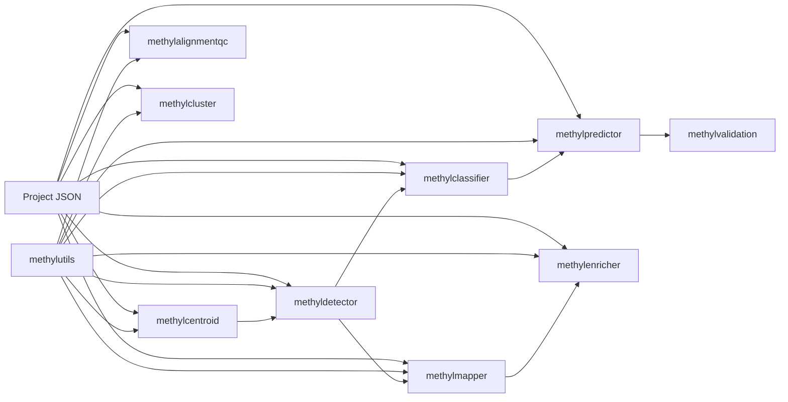

# Architecture

This document summarizes the active repository architecture and the package boundaries that support the canonical MethylPipeline workflow.

## System Shape

MethylPipeline is a monorepo built around one shared project contract and a small set of package-specific resolvers.



## Shared Contracts

The main shared contract is `packages/methylutils/methyl_utils/pipeline_config.py`.

It defines:

- project schema normalization
- resolved groups and comparisons
- canonical output directories
- step-config access
- sample-path resolution helpers

Each downstream package has a `project_resolver.py` that translates that shared contract into step-specific config models.

## Canonical Runtime Flow

```text
sample HDF5 dirs
  -> centroids
  -> detections
  -> classifier bundles
  -> predictor metrics
```

Optional branches:

- detections -> mapper -> enricher
- samples -> alignment_qc
- samples -> clustering -> derived centroid groups

## Directory Layout

Given `project_root = {output_base}/{project_name}`:

```text
{project_root}/
├── centroids/
├── detections/<control_group>/<disease_group>/
├── mapper/<control_group>/<disease_group>/
├── enricher/<control_group>/<disease_group>/
├── classifiers/<control_group>/<disease_group>/
├── predictors/<control_group>/<disease_group>/
├── alignment_qc/
└── clustering/
```

## Package Boundaries

| Package | Boundary |
|---------|----------|
| `methylutils` | Shared data structures, centroid math, ECDF classifier helpers, GPU/IO utilities, project config |
| `methylcentroid` | Sample aggregation into centroids |
| `methyldetector` | DMP detection, filtering, export, classifier packaging |
| `methylclassifier` | Sample scoring from saved classifier bundles |
| `methylpredictor` | Holdout-set scoring and metrics |
| `methylvalidation` | Monte Carlo split generation, orchestration, aggregation |
| `methylmapper` | DMP-to-gene and feature mapping |
| `methylenricher` | Enrichment from mapper outputs |
| `methylalignmentqc` | Alignment QC extraction |
| `methylcluster` | Optional subclustering |

## Design Notes

- The active classifier path is ECDF-based, not Beta/BMM-based.
- Comparison-specific downstream directories are canonical and avoid overwriting when projects contain multiple disease groups.
- Compatibility layers still exist in some packages, but the repository should document only one primary workflow.
