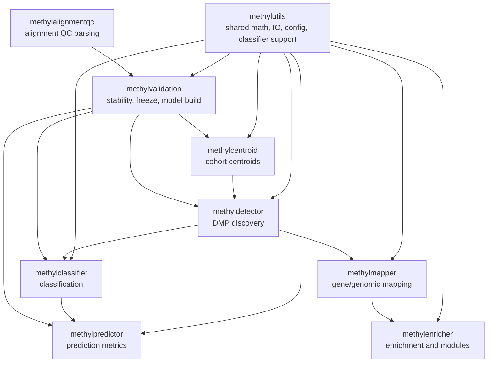
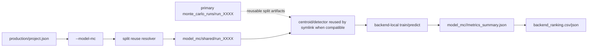

```mermaid
flowchart LR
    A["project.json"] --> B["--stability"]
    subgraph S1["Stage A: Stability Discovery"]
      B --> C["Repeated train/validation splits"]
      C --> D["centroid -> detector per split"]
      D --> E["stable_dmps_production.csv"]
    end
    E --> F["--freeze"]
    subgraph S2["Stage B: Production Freeze"]
      F --> G["all-sample centroid -> detector(fixed) -> mapper -> enricher"]
      G --> H["production/project.json"]
      G --> H2["production/model_bundle/mapper_dmp_annotations.csv"]
    end
    H --> I["--model-mc --model-mc-all"]
    subgraph S3["Stage C: Backend Model-MC"]
      I --> J["shared runs + backend-local train/predict"]
      J --> K["model_mc/backend_ranking.json"]
    end
    K --> L["--select-best-model"]
    subgraph S4["Stage D: Final Production Model"]
      L --> M["production/classifiers/*"]
    end
```

# Executive Summary

MethylPipeline is a monorepo for DNA methylation analysis. Its core supervised path centers on empirical cumulative distribution functions (ECDFs) and histogram-backed centroid summaries rather than forcing the full workflow into a single parametric family. Around that core, the repository adds packages for gene mapping, enrichment, prediction, repeated validation, and alignment quality control.

At a practical level, the repository supports three major modes of work:

1. building a stable production model from repeated train-validation splits, and
2. performing backend model-selection Monte Carlo (`--model-mc`) over frozen production context, and
3. applying frozen artifacts for holdout evaluation (`--post-model-validation` and `--predictor-only`).

The codebase is organized as cooperating packages with `methylutils` as the shared mathematical and utility layer.

# What The Repository Contains

## Core Statistical Path

The central supervised pipeline is:

1. `methylcentroid` builds cohort summaries from per-sample methylation values.
2. `methyldetector` screens loci for differential methylation and exports classifier-ready DMP panels.
3. `methylclassifier` fits or applies classification logic over the detected loci.
4. `methylpredictor` evaluates trained models on holdout or blind samples.
5. `methylvalidation` orchestrates repeated validation, stability analysis, production freeze, and final model creation.

This path is the most tightly coupled statistical spine of the repository.

## Downstream Interpretation And Support Packages

- `methylmapper` maps DMPs to genes and genomic regions.
- `methylenricher` performs enrichment analysis, graph clustering, and module ranking.
- `methyldiseaseprogression` aggregates staged mapper/enricher outputs into progression summaries and labels.
- `methylalignmentqc` parses alignment/QC outputs from upstream sequencing workflows.
- `methylutils` provides shared data structures, ECDF reconstruction, overlap metrics, tests, logging, configuration utilities, and classifier support code.

# Package Architecture

The package graph is easier to understand as a layered system: shared utilities at the bottom, the supervised methylation workflow in the center, and biological interpretation or QC around it.

::: {.content-visible when-format="html"}

:::

::: {.content-visible when-format="pdf"}
```{=latex}
\begin{figure}[htbp]
\centering
\begin{tikzpicture}[
  scale=0.86,
  every node/.style={transform shape},
  node distance=0.9cm and 0.9cm,
  base/.style={draw, rounded corners=3pt, align=center, font=\footnotesize, minimum height=0.82cm, text width=3.0cm},
  shared/.style={base, fill=blue!8},
  core/.style={base, fill=green!8},
  support/.style={base, fill=orange!10},
  arr/.style={-{Latex[length=2mm]}, thick}
]
\node[shared] (utils) {methylutils\\shared math, IO, config, classifier support};

\node[core, above left=1.4cm and 2.2cm of utils] (centroid) {methylcentroid\\cohort centroids};
\node[core, above=1.4cm of utils] (detector) {methyldetector\\DMP discovery};
\node[core, above right=1.4cm and 2.2cm of utils] (classifier) {methylclassifier\\classification};
\node[core, right=3.8cm of classifier] (predictor) {methylpredictor\\prediction metrics};
\node[core, left=3.8cm of centroid] (validation) {methylvalidation\\stability, freeze, model build};

\node[support, below=1.5cm of utils] (mapper) {methylmapper\\gene and region mapping};
\node[support, below right=1.5cm and 2.2cm of utils] (enricher) {methylenricher\\enrichment and modules};
\node[support, right=3.8cm of enricher] (qc) {methylalignmentqc\\alignment QC parsing};

\draw[arr] (utils) -- (centroid);
\draw[arr] (utils) -- (detector);
\draw[arr] (utils) -- (classifier);
\draw[arr] (utils) -- (predictor);
\draw[arr] (utils) -- (validation);
\draw[arr] (utils) -- (mapper);
\draw[arr] (utils) -- (enricher);
\draw[arr] (centroid) -- (detector);
\draw[arr] (detector) -- (classifier);
\draw[arr] (classifier) -- (predictor);

\draw[arr] (validation) -- (centroid);
\draw[arr] (validation) -- (detector);
\draw[arr] (validation) -- (classifier);
\draw[arr] (validation) -- (predictor);

\draw[arr] (detector) -- (mapper);
\draw[arr] (mapper) -- (enricher);
\draw[arr] (qc) -- (validation);
\end{tikzpicture}
\caption{High-level package architecture of MethylPipeline.}
\end{figure}
```
:::

# Shared Data Model

At its lowest common layer, the code works with methylated and unmethylated counts at genomic loci. For sample $s$ and position $i$,

$$
x_{si} = \frac{m_{si}}{m_{si} + u_{si}},
$$

where $m_{si}$ is the methylated count and $u_{si}$ is the unmethylated count.

Centroid-building packages summarize cohorts through per-locus sufficient statistics:

$$
N_i = \sum_s 1, \qquad
S_{x,i} = \sum_s x_{si}, \qquad
S_{x^2,i} = \sum_s x_{si}^2.
$$

These support the implemented cohort mean and variance estimates:

$$
\hat\mu_i = \frac{S_{x,i}}{N_i},
\qquad
\hat\sigma_i^2 =
\max\!\left(
\frac{S_{x^2,i} - S_{x,i}^2 / N_i}{\max(N_i - 1, 1)},
\varepsilon
\right).
$$

In the ECDF-centered path, each locus also stores histogram counts over fixed methylation bins. Those histograms are used to reconstruct empirical distribution views, approximate overlap metrics, and rank-based or distribution-based comparisons at scale.

# Main Workflows

## Workflow 1: Model Creation

Model creation is the longer production workflow. It is intentionally separated into three stages:

1. `--stability`: repeated train-validation splits that rerun centroid and detector on the training subset only.
2. `--freeze`: rerun the stable panel on all samples and produce downstream biological interpretation.
3. `--model-mc`: run backend model-selection Monte Carlo from frozen production context.
4. `--select-best-model`: rank backends and train final all-data production model.

This split matters statistically because it reduces leakage between feature discovery and final model construction, even though it is still an internal workflow rather than external validation on an independent cohort.

Canonical command sequence:

```bash
methyl-validation --project configs/my_project.json --stability
methyl-validation --project configs/my_project.json --freeze
methyl-validation --project configs/my_project.json --model-mc --model-mc-all
methyl-validation --project configs/my_project.json --select-best-model --model-mc-all
```

### Workflow 1 Diagram

::: {.content-visible when-format="html"}

:::

::: {.content-visible when-format="pdf"}
```{=latex}
\begin{figure}[htbp]
\centering
\begin{tikzpicture}[
  scale=0.74,
  every node/.style={transform shape},
  node distance=0.52cm and 0cm,
  cmd/.style={draw, rounded corners=2pt, text width=7.2cm, align=center, font=\footnotesize\bfseries, minimum height=0.56cm, fill=blue!10},
  proc/.style={draw, rounded corners=2pt, text width=7.2cm, align=center, font=\footnotesize, minimum height=0.56cm, fill=green!10},
  art/.style={draw, rounded corners=2pt, text width=7.2cm, align=center, font=\footnotesize\ttfamily, minimum height=0.56cm, fill=orange!14},
  arr/.style={-{Latex[length=2mm]}, thick}
]
\node[art] (A) {\texttt{project.json}};
\node[cmd, below=of A] (B) {\texttt{--stability}};
\node[proc, below=of B] (C) {Repeated train/validation splits};
\node[proc, below=of C] (D) {Per split: centroid $\to$ detector};
\node[art, below=of D] (E) {\texttt{stable\_dmps\_production.csv}};
\node[cmd, below=of E] (F) {\texttt{--freeze}};
\node[proc, below=of F] (G) {All-sample: centroid $\to$ detector(fixed) $\to$ mapper $\to$ enricher};
\node[art, below=of G] (H) {\texttt{production/project.json}};
\node[art, below=of H] (H2) {\texttt{production/model\_bundle/mapper\_dmp\_annotations.csv}};
\node[cmd, below=of H2] (I) {\texttt{--model-mc --model-mc-all}};
\node[proc, below=of I] (J) {Shared runs + backend-local train/predict};
\node[art, below=of J] (K) {\texttt{model\_mc/backend\_ranking.json}};
\node[cmd, below=of K] (L) {\texttt{--select-best-model}};
\node[art, below=of L] (M) {\texttt{production/classifiers/*}};
\draw[arr] (A)--(B);
\draw[arr] (B)--(C);
\draw[arr] (C)--(D);
\draw[arr] (D)--(E);
\draw[arr] (E)--(F);
\draw[arr] (F)--(G);
\draw[arr] (G)--(H);
\draw[arr] (H)--(H2);
\draw[arr] (H2)--(I);
\draw[arr] (I)--(J);
\draw[arr] (J)--(K);
\draw[arr] (K)--(L);
\draw[arr] (L)--(M);
\end{tikzpicture}
\caption{Workflow 1 for stable production model creation with explicit freeze and model-MC artifacts.}
\end{figure}
```
:::

## Workflow 2: Backend Model-Selection Monte Carlo

The second workflow assumes a frozen production project already exists and evaluates backend model behavior across repeated holdout splits:

- `--model-mc --model-backend <backend>` evaluates one backend.
- `--model-mc --model-mc-all` builds shared split+centroid+detector runs once, then executes backend-local model stages.
- when a split is compatible with primary MC runs, centroid/detector artifacts are symlinked instead of recomputed.

### Workflow 2 Diagram

::: {.content-visible when-format="html"}

:::

::: {.content-visible when-format="pdf"}
```{=latex}
\begin{figure}[htbp]
\centering
\begin{tikzpicture}[
  scale=0.74,
  every node/.style={transform shape},
  node distance=0.52cm and 0cm,
  cmd/.style={draw, rounded corners=2pt, text width=7.2cm, align=center, font=\footnotesize\bfseries, minimum height=0.56cm, fill=blue!10},
  proc/.style={draw, rounded corners=2pt, text width=7.2cm, align=center, font=\footnotesize, minimum height=0.56cm, fill=green!10},
  art/.style={draw, rounded corners=2pt, text width=7.2cm, align=center, font=\footnotesize\ttfamily, minimum height=0.56cm, fill=orange!14},
  arr/.style={-{Latex[length=2mm]}, thick},
  reuse/.style={-{Latex[length=2mm]}, thick, dashed}
]
\node[art] (A) {\texttt{production/project.json}};
\node[cmd, below=of A] (B) {\texttt{--model-mc} (\texttt{--model-mc-all} optional)};
\node[proc, below=of B] (C) {Split reuse resolver (seed/fraction/layout compatibility)};
\node[art, below=of C] (D) {\texttt{model\_mc/shared/run\_XXXX}};
\node[proc, below=of D] (E) {Centroid/detector artifacts linked when reusable};
\node[proc, below=of E] (F) {Backend-local train/predict (ecdf, tabular, generative)};
\node[art, below=of F] (G) {\texttt{model\_mc/<backend>/metrics\_summary.json}};
\node[art, below=of G] (H) {\texttt{model\_mc/backend\_ranking.csv/json}};
\node[art, right=2.0cm of E] (R) {\texttt{primary monte\_carlo\_runs/run\_XXXX/}\\\texttt{centroids + detections}};
\draw[arr] (A)--(B);
\draw[arr] (B)--(C);
\draw[arr] (C)--(D);
\draw[arr] (D)--(E);
\draw[reuse] (R)--(E);
\draw[arr] (E)--(F);
\draw[arr] (F)--(G);
\draw[arr] (G)--(H);
\end{tikzpicture}
\caption{Workflow 2 backend model-selection Monte Carlo with explicit split/artifact reuse path.}
\end{figure}
```
:::

## Workflow 3: Frozen-Artifact Holdout Evaluation

This workflow evaluates frozen artifacts without retraining:

- `--post-model-validation` runs Monte Carlo holdout evaluation using frozen production artifacts (backend-aware dispatch).
- `--predictor-only` executes repeated predictor-only runs that reuse frozen paths.

It answers a deployment-style question: how stable are frozen-model metrics across sampled validation subsets when training is fixed.

# Statistical Character

MethylPipeline mixes several methodological categories, and the documentation should keep them distinct:

- principled methods such as standard hypothesis tests, multiple-testing correction, and established classifiers,
- approximate methods where empirical distributions are reconstructed from summaries or discretized histograms,
- heuristic rules for ranking, thresholding, or aggregation,
- external-service-backed steps in downstream interpretation layers.

That distinction is important because the repository is strongest when it speaks precisely about what is implemented. The core centroid-detector-classifier path is grounded in empirical-distribution summaries, while downstream interpretation layers may depend on graph heuristics, curated databases, or external enrichment services.

# Typical Outputs

Common outputs across the repository include:

- centroid files summarizing cohort-level methylation behavior,
- detector outputs containing DMP statistics and filtered panels,
- classifier artifacts and predictor metrics,
- stability summaries across Monte Carlo iterations,
- model-MC shared/backend roots with split-reuse diagnostics and backend ranking,
- mapping and enrichment outputs for downstream biological interpretation,
- mapper annotation cache files under `production/model_bundle/` for mapped-family model builds,
- aggregated ECDF OvR artifacts (`ecdf_aggregated_ovr.pkl` + `.meta.json`) for observed-hybrid ECDF mode,
- QC summaries extracted from external alignment reports.

A typical production-oriented run produces a `monte_carlo_runs/production/` tree containing the frozen project, stable panel outputs, downstream interpretation products, and final deployable model artifacts.

# Rendering Notes

This file is intended to render directly with Quarto on a machine that has LaTeX support available. The PDF format is configured to use `lualatex`, and the TikZ diagrams are injected through `include-in-header`.

Example commands:

```bash
quarto render docs/MethylPipeline-overview.qmd --to html
quarto render docs/MethylPipeline-overview.qmd --to pdf
```

If your Quarto installation already has TinyTeX, TeX Live, or MiKTeX available, the PDF build should render the TikZ diagrams without extra changes.
