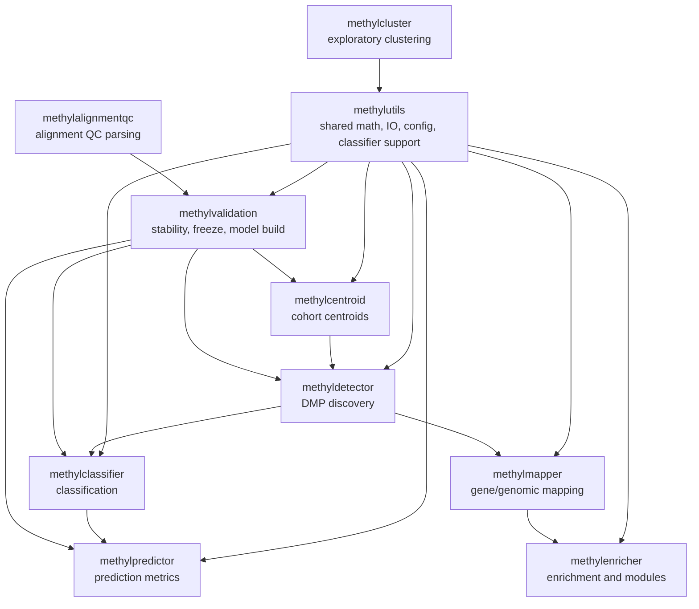
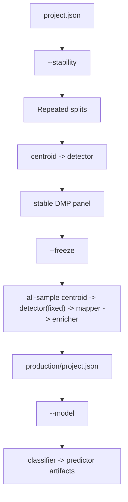
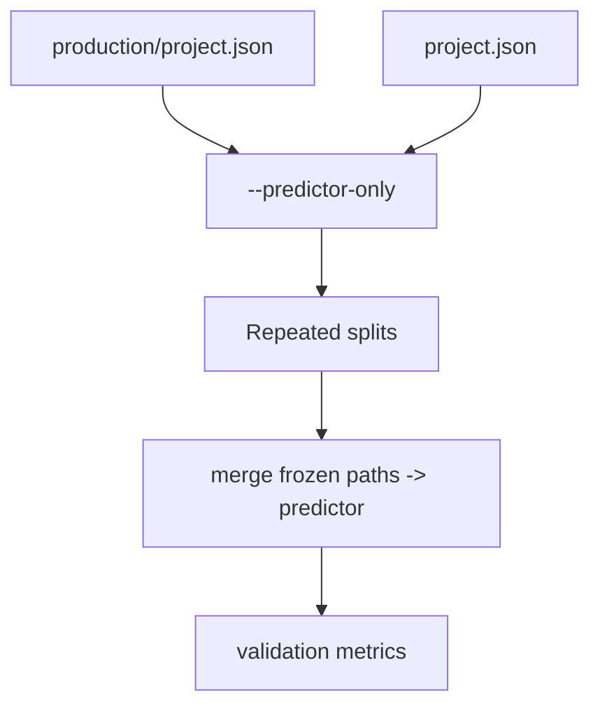

# Executive Summary

MethylPipeline is a monorepo for DNA methylation analysis. Its core supervised path centers on empirical cumulative distribution functions (ECDFs) and histogram-backed centroid summaries rather than forcing the full workflow into a single parametric family. Around that core, the repository adds packages for clustering, gene mapping, enrichment, prediction, repeated validation, and alignment quality control.

At a practical level, the repository supports two major modes of work:

1. building a stable production model from repeated train-validation splits, and
2. applying a frozen model for predictor-only evaluation.

The codebase is organized as cooperating packages with `methylutils` as the shared mathematical and utility layer.

# What The Repository Contains

## Core Statistical Path

The central supervised pipeline is:

1. `methylcentroid` builds cohort summaries from per-sample methylation values.
2. `methyldetector` screens loci for differential methylation and exports classifier-ready DMP panels.
3. `methylclassifier` fits or applies classification logic over the detected loci.
4. `methylpredictor` evaluates trained models on holdout or blind samples.
5. `methylvalidation` orchestrates repeated validation, stability analysis, production freeze, and final model creation.

This path is the most tightly coupled statistical spine of the repository.

## Downstream Interpretation And Support Packages

- `methylmapper` maps DMPs to genes and genomic regions.
- `methylenricher` performs enrichment analysis, graph clustering, and module ranking.
- `methylalignmentqc` parses alignment/QC outputs from upstream sequencing workflows.
- `methylcluster` provides exploratory clustering utilities outside the main production path.
- `methylutils` provides shared data structures, ECDF reconstruction, overlap metrics, tests, logging, configuration utilities, and classifier support code.

# Package Architecture

The package graph is easier to understand as a layered system: shared utilities at the bottom, the supervised methylation workflow in the center, and biological interpretation or QC around it.

::: {.content-visible when-format="html"}

:::

::: {.content-visible when-format="pdf"}
```{=latex}
\begin{figure}[htbp]
\centering
\begin{tikzpicture}[
  node distance=0.9cm and 0.9cm,
  base/.style={draw, rounded corners=3pt, align=center, font=\small, minimum height=0.95cm, text width=3.4cm},
  shared/.style={base, fill=blue!8},
  core/.style={base, fill=green!8},
  support/.style={base, fill=orange!10},
  arr/.style={-{Latex[length=2mm]}, thick}
]
\node[shared] (utils) {methylutils\\shared math, IO, config, classifier support};

\node[core, above left=1.4cm and 2.2cm of utils] (centroid) {methylcentroid\\cohort centroids};
\node[core, above=1.4cm of utils] (detector) {methyldetector\\DMP discovery};
\node[core, above right=1.4cm and 2.2cm of utils] (classifier) {methylclassifier\\classification};
\node[core, right=3.8cm of classifier] (predictor) {methylpredictor\\prediction metrics};
\node[core, left=3.8cm of centroid] (validation) {methylvalidation\\stability, freeze, model build};

\node[support, below left=1.5cm and 2.2cm of utils] (cluster) {methylcluster\\exploratory clustering};
\node[support, below=1.5cm of utils] (mapper) {methylmapper\\gene and region mapping};
\node[support, below right=1.5cm and 2.2cm of utils] (enricher) {methylenricher\\enrichment and modules};
\node[support, right=3.8cm of enricher] (qc) {methylalignmentqc\\alignment QC parsing};

\draw[arr] (utils) -- (centroid);
\draw[arr] (utils) -- (detector);
\draw[arr] (utils) -- (classifier);
\draw[arr] (utils) -- (predictor);
\draw[arr] (utils) -- (validation);
\draw[arr] (utils) -- (mapper);
\draw[arr] (utils) -- (enricher);
\draw[arr] (utils) -- (cluster);

\draw[arr] (centroid) -- (detector);
\draw[arr] (detector) -- (classifier);
\draw[arr] (classifier) -- (predictor);

\draw[arr] (validation) -- (centroid);
\draw[arr] (validation) -- (detector);
\draw[arr] (validation) -- (classifier);
\draw[arr] (validation) -- (predictor);

\draw[arr] (detector) -- (mapper);
\draw[arr] (mapper) -- (enricher);
\draw[arr] (qc) -- (validation);
\end{tikzpicture}
\caption{High-level package architecture of MethylPipeline.}
\end{figure}
```
:::

# Shared Data Model

At its lowest common layer, the code works with methylated and unmethylated counts at genomic loci. For sample $s$ and position $i$,

$$
x_{si} = \frac{m_{si}}{m_{si} + u_{si}},
$$

where $m_{si}$ is the methylated count and $u_{si}$ is the unmethylated count.

Centroid-building packages summarize cohorts through per-locus sufficient statistics:

$$
N_i = \sum_s 1, \qquad
S_{x,i} = \sum_s x_{si}, \qquad
S_{x^2,i} = \sum_s x_{si}^2.
$$

These support the implemented cohort mean and variance estimates:

$$
\hat\mu_i = \frac{S_{x,i}}{N_i},
\qquad
\hat\sigma_i^2 =
\max\!\left(
\frac{S_{x^2,i} - S_{x,i}^2 / N_i}{\max(N_i - 1, 1)},
\varepsilon
\right).
$$

In the ECDF-centered path, each locus also stores histogram counts over fixed methylation bins. Those histograms are used to reconstruct empirical distribution views, approximate overlap metrics, and rank-based or distribution-based comparisons at scale.

# Main Workflows

## Workflow 1: Model Creation

Model creation is the longer production workflow. It is intentionally separated into three stages:

1. `--stability`: repeated train-validation splits that rerun centroid and detector on the training subset only.
2. `--freeze`: rerun the stable panel on all samples and produce downstream biological interpretation.
3. `--model`: train the final deployable classifier and predictor artifacts using the frozen production project.

This split matters statistically because it reduces leakage between feature discovery and final model construction, even though it is still an internal workflow rather than external validation on an independent cohort.

### Workflow 1 Diagram

::: {.content-visible when-format="html"}

:::

::: {.content-visible when-format="pdf"}
```{=latex}
\begin{figure}[htbp]
\centering
\begin{tikzpicture}[
  node distance=0.6cm and 0cm,
  box/.style={draw, rounded corners=2pt, text width=8.5cm, align=center, font=\small, minimum height=0.7cm, fill=gray!8},
  arr/.style={-{Latex[length=2mm]}, thick}
]
\node[box] (A) {\texttt{project.json}};
\node[box, below=of A] (B) {\texttt{--stability}};
\node[box, below=of B] (C) {Repeated train-validation splits};
\node[box, below=of C] (D) {Per split: centroid $\to$ detector};
\node[box, below=of D] (E) {Stable DMP panel};
\node[box, below=of E] (F) {\texttt{--freeze}};
\node[box, below=of F] (G) {All-sample rerun: centroid $\to$ detector(fixed) $\to$ mapper $\to$ enricher};
\node[box, below=of G] (H) {\texttt{production/project.json}};
\node[box, below=of H] (I) {\texttt{--model}};
\node[box, below=of I] (J) {Classifier and predictor artifacts};
\draw[arr] (A)--(B);
\draw[arr] (B)--(C);
\draw[arr] (C)--(D);
\draw[arr] (D)--(E);
\draw[arr] (E)--(F);
\draw[arr] (F)--(G);
\draw[arr] (G)--(H);
\draw[arr] (H)--(I);
\draw[arr] (I)--(J);
\end{tikzpicture}
\caption{Workflow 1 for creating a stable production model.}
\end{figure}
```
:::

## Workflow 2: Frozen-Model Prediction

The second workflow assumes a frozen production project already exists. It runs predictor-only evaluation across repeated splits while reusing the frozen model artifacts.

This workflow answers a different question from Workflow 1. Instead of re-discovering loci and re-training the pipeline for each split, it asks how stable the frozen model's prediction metrics are across sampled validation subsets.

### Workflow 2 Diagram

::: {.content-visible when-format="html"}

:::

::: {.content-visible when-format="pdf"}
```{=latex}
\begin{figure}[htbp]
\centering
\begin{tikzpicture}[
  node distance=0.6cm and 0cm,
  box/.style={draw, rounded corners=2pt, text width=8.5cm, align=center, font=\small, minimum height=0.7cm, fill=gray!8},
  arr/.style={-{Latex[length=2mm]}, thick}
]
\node[box] (A) {\texttt{production/project.json} (frozen model)};
\node[box, below=of A] (B) {\texttt{project.json} (cohorts and validation settings)};
\node[box, below=of B] (C) {\texttt{--predictor-only}};
\node[box, below=of C] (D) {Repeated splits};
\node[box, below=of D] (E) {Merge frozen paths $\to$ predictor};
\node[box, below=of E] (F) {Validation metrics and aggregated summaries};
\draw[arr] (A)--(B);
\draw[arr] (B)--(C);
\draw[arr] (C)--(D);
\draw[arr] (D)--(E);
\draw[arr] (E)--(F);
\end{tikzpicture}
\caption{Workflow 2 for predictor-only evaluation of a frozen model.}
\end{figure}
```
:::

# Statistical Character

MethylPipeline mixes several methodological categories, and the documentation should keep them distinct:

- principled methods such as standard hypothesis tests, multiple-testing correction, and established classifiers,
- approximate methods where empirical distributions are reconstructed from summaries or discretized histograms,
- heuristic rules for ranking, thresholding, or aggregation,
- external-service-backed steps in downstream interpretation layers.

That distinction is important because the repository is strongest when it speaks precisely about what is implemented. The core centroid-detector-classifier path is grounded in empirical-distribution summaries, while downstream interpretation layers may depend on graph heuristics, curated databases, or external enrichment services.

# Typical Outputs

Common outputs across the repository include:

- centroid files summarizing cohort-level methylation behavior,
- detector outputs containing DMP statistics and filtered panels,
- classifier artifacts and predictor metrics,
- stability summaries across Monte Carlo iterations,
- mapping and enrichment outputs for downstream biological interpretation,
- QC summaries extracted from external alignment reports.

A typical production-oriented run produces a `monte_carlo_runs/production/` tree containing the frozen project, stable panel outputs, downstream interpretation products, and final deployable model artifacts.

# Rendering Notes

This file is intended to render directly with Quarto on a machine that has LaTeX support available. The PDF format is configured to use `lualatex`, and the TikZ diagrams are injected through `include-in-header`.

Example commands:

```bash
quarto render docs/MethylPipeline-overview.qmd --to html
quarto render docs/MethylPipeline-overview.qmd --to pdf
```

If your Quarto installation already has TinyTeX, TeX Live, or MiKTeX available, the PDF build should render the TikZ diagrams without extra changes.
