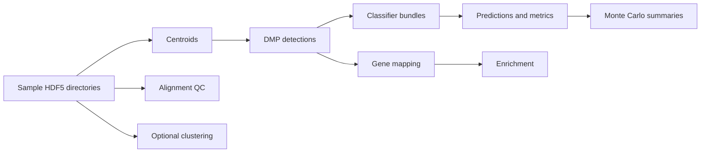

# Theory And Packages

This document gives the current high-level theory map for MethylPipeline and points to the package-level theory and implementation documents that act as the detailed source of truth.

## Active Statistical Story

The active pipeline is ECDF-based end to end:

- `MethylCentroid` builds centroid summaries and binned methylation statistics.
- `MethylDetector` compares centroids with KS-on-ECDF or Mann-Whitney-from-bin-counts, then applies Storey q-values and biological filtering.
- `MethylClassifier` scores samples with ECDF/PCHIP-derived likelihoods, weighted mean log-likelihoods, and temperature-scaled posteriors.
- `MethylPredictor` evaluates trained classifiers on holdout samples.
- `MethylValidation` repeats the train/test process across Monte Carlo splits.

The repository no longer treats Beta, Beta-Binomial, or BMM classifiers as the canonical workflow.

## Package Roles

| Package | Role | Detailed docs |
|---------|------|---------------|
| `methylutils` | Shared data structures, HDF5 I/O, centroid comparison math, ECDF classifier utilities, project config loading | `packages/methylutils/docs/MethylUtils_Theoretical_Foundation.md`, `packages/methylutils/docs/METHYLUTILS_IMPLEMENTATION.md` |
| `methylcentroid` | Build centroids for configured control and disease groups | `packages/methylcentroid/docs/MethylCentroid_Theoretical_Foundation.md`, `packages/methylcentroid/docs/METHYLCENTROID_IMPLEMENTATION.md` |
| `methylcluster` | Optional subgroup clustering before centroid generation | package README and implementation docs in `packages/methylcluster/docs/` |
| `methyldetector` | Detect DMPs, export detector outputs, and build classifier bundles | `packages/methyldetector/docs/MethylDetector_Theoretical_Foundation.md`, `packages/methyldetector/docs/METHYLDETECTOR_IMPLEMENTATION.md` |
| `methylclassifier` | Load classifier bundles and score new samples | `packages/methylclassifier/docs/MethylClassifier_Theoretical_Foundation.md`, `packages/methylclassifier/docs/METHYLCLASSIFIER_IMPLEMENTATION.md` |
| `methylmapper` | Map DMPs to genes/features; project-aware bedtools flow is primary | package README |
| `methylenricher` | Run enrichment analyses over mapper outputs | package README and docs |
| `methylalignmentqc` | Optional alignment QC parsing and export | package README |
| `methylpredictor` | Holdout-set evaluation and metrics | `packages/methylpredictor/docs/MethylPredictor_Theoretical_Foundation.md`, `packages/methylpredictor/docs/METHYLPREDICTOR_IMPLEMENTATION.md` |
| `methylvalidation` | Monte Carlo validation over repeated splits | `packages/methylvalidation/docs/MethylValidation_Theoretical_Foundation.md`, `packages/methylvalidation/docs/METHYLVALIDATION_IMPLEMENTATION.md` |

## Canonical Data Flow



## Canonical Project Contract

The code-level project contract lives in `packages/methylutils/methyl_utils/pipeline_config.py`.

Preferred schema:

- `controls`
- `diseases`
- `comparisons`
- `step_config`

Preferred downstream layout:

```text
detections/<control_group>/<disease_group>/
mapper/<control_group>/<disease_group>/
enricher/<control_group>/<disease_group>/
classifiers/<control_group>/<disease_group>/
predictors/<control_group>/<disease_group>/
```

## Notes

- `MethylMapper` still carries legacy Azure SQL compatibility code, but the supported workflow is the project-aware bedtools mapper.
- `MethylCluster` is optional and defaults to centroid-based clustering.
- `MethylValidation` is currently binary-only at the Monte Carlo orchestration level.

For run instructions, see [OPERATIONS_MANUAL.md](OPERATIONS_MANUAL.md). For the exact project schema, see [UNIFIED_PROJECT_CONFIG_GUIDE.md](UNIFIED_PROJECT_CONFIG_GUIDE.md).
