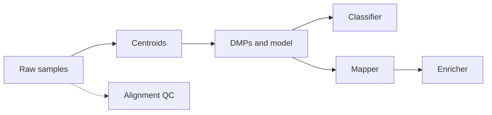

# Theory and Packages Reference

This document gives an overview of MethylPipeline and the theoretical foundations of each of its **8 packages**. All mathematics use LaTeX so they render correctly in the documentation site and can be printed or exported to PDF.

---

## Table of Contents

1. [Project and Architecture](#project-and-architecture)
2. [MethylUtils](#methylutils)
3. [MethylCentroid](#methylcentroid)
4. [MethylCluster](#methylcluster)
5. [MethylDetector (MethylModeler)](#methyldetector-methylmodeler)
6. [MethylClassifier](#methylclassifier)
7. [MethylMapper](#methylmapper)
8. [MethylEnricher](#methylenricher)
9. [MethylAlignmentQC](#methylalignmentqc)

---

## Project and Architecture

MethylPipeline is a unified genomics pipeline for methylation-based biomarker discovery and classification. It provides:

- **Data processing**: Raw methylation samples (HDF5) → centroids → differentially methylated positions (DMPs) → classifiers and reports
- **Statistical rigor**: Storey’s q-value FDR, likelihood-ratio tests for Beta distributions, balanced accuracy
- **Bayesian classification**: Exact Beta (and optional Beta mixture) likelihoods, posterior probabilities
- **GPU acceleration**: Shared via MethylUtils across packages

### The Eight Packages

| # | Package | Role |
|---|---------|------|
| 1 | **MethylUtils** | Foundation: core types, GPU/IO, distance metrics, Beta statistics |
| 2 | **MethylCentroid** | Build representative centroids (sufficient statistics) per group |
| 3 | **MethylCluster** | Exploratory clustering and QC (HDBSCAN, hierarchical, centroid-based) |
| 4 | **MethylDetector** | DMP detection, biological filters, classifier training, model packaging *(documented as MethylModeler)* |
| 5 | **MethylClassifier** | Load packaged models and score samples (posterior probabilities) |
| 6 | **MethylMapper** | Map DMPs to genes/features; optional disease enrichment (Grok, Open Targets, DisGeNET) |
| 7 | **MethylEnricher** | ORA/Enrichr enrichment on gene lists from MethylMapper |
| 8 | **MethylAlignmentQC** | Parse alignment QC metrics (e.g. Parabricks) to per-sample JSON *(optional)* |

**Note:** The DMP detection and model-packaging component is implemented by the **methyldetector** package and is referred to in user-facing docs as **MethylModeler**.

### High-Level Data Flow

1. **Samples** → **Centroids** (MethylCentroid, per group).
2. **Centroids** → **DMPs and classifier bundle** (MethylDetector).
3. **Classifier bundle** + centroid dirs → **MethylClassifier** (predict new samples).
4. **DMP outputs** → **MethylMapper** (genes/features, optional disease enrichment).
5. **Mapper gene lists** → **MethylEnricher** (pathway/ORA enrichment).
6. **Alignment QC** (optional): sample directories → MethylAlignmentQC → per-sample JSON.

---

## MethylUtils

**Role:** Core library used by all other packages. Provides `MethylSample`, `MethylCentroidPair`, GPU detection and memory helpers, HDF5 I/O, and seven distance/effect-size metrics for Beta distributions.

**Theory:** Methylation at a position is modeled as Beta$(\alpha,\beta)$. Mean and variance:

$$
\mu = \frac{\alpha}{\alpha+\beta}, \qquad
\sigma^2 = \frac{\alpha\beta}{(\alpha+\beta)^2(\alpha+\beta+1)}
$$

Method-of-moments from methylation fraction $m$ and coverage $n$: $\alpha = m(n-1)$, $\beta = (1-m)(n-1)$ (with clamping and fallback to Beta$(1,1)$ for invalid/low coverage). Distance metrics include:

- **Jeffreys**: $J = D_{\mathrm{KL}}(P_1 \| P_2) + D_{\mathrm{KL}}(P_2 \| P_1)$
- **Bhattacharyya coefficient** (overlap): $BC = \exp\bigl(\ln B(\frac{\alpha_1+\alpha_2}{2},\frac{\beta_1+\beta_2}{2}) - \frac{1}{2}[\ln B(\alpha_1,\beta_1)+\ln B(\alpha_2,\beta_2)]\bigr)$
- **Bhattacharyya distance**: $BD = -\ln(BC)$
- **Hellinger**: $H = \sqrt{1 - BC}$ (normalized to $[0,1]$)
- **Jensen–Shannon**: JSD from midpoint $M$; distance $d_{\mathrm{JS}} = \sqrt{\mathrm{JSD}/\ln 2}$
- **Wasserstein**: moment-based approximation using means and variances above
- **Effect size**: $\frac{|\Delta\mu|}{\sqrt{\sigma_1^2+\sigma_2^2}}(1-BC)^\gamma$

**Reference:** [MethylUtils Comprehensive Documentation](../packages/methylutils/docs/METHYLUTILS_COMPREHENSIVE_DOCUMENTATION.md)

---

## MethylCentroid

**Role:** Build per-group representative methylation profiles (centroids) from sample cohorts. Stores sufficient statistics (e.g. $N$, $S_x$, $S_{x^2}$, $\log X$, $\log(1-X)$, and optional extended stats) so that multiple distributional models can be fitted without keeping the full sample matrix.

**Theory:** For position $i$ across samples, $x_i = mC_i/n_i$ (methylation fraction). Centroid aggregates:

$$
N = \sum_i 1, \quad S_x = \sum_i x_i, \quad S_{x^2} = \sum_i x_i^2, \quad \log X = \sum_i \log x_i, \quad \log(1-X) = \sum_i \log(1-x_i)
$$

and optionally $\Sigma n$, $\Sigma mC$, $\Sigma uC$, higher moments, and binned counts for Beta mixture modeling.

- **Normal (approximation):** $\hat{\mu} = S_x/N$, $\hat{\sigma}^2 = (S_{x^2} - S_x^2/N)/\max(N-1,1)$.
- **Beta:** Sufficient statistics $(N, \log X, \log(1-X))$; MLE for $\alpha,\beta$; mean $\mu = \alpha/(\alpha+\beta)$, variance $\sigma^2 = \frac{\alpha\beta}{(\alpha+\beta)^2(\alpha+\beta+1)}$.
- **Beta-Binomial:** Uses count aggregates for over-dispersion; comparison uses pooled $(\alpha,\beta)$ from log-sum statistics.
- **Beta Mixture (BMM):** $x \sim \sum_k w_k \mathrm{Beta}(\alpha_k,\beta_k)$; optional binned stats or masked refinement.

**Reference:** [MethylCentroid Comprehensive Documentation](../packages/methylcentroid/docs/METHYLCENTROID_COMPREHENSIVE_DOCUMENTATION.md), [METHYLCENTROID_DISTRIBUTIONS.tex](../packages/methylcentroid/docs/METHYLCENTROID_DISTRIBUTIONS.tex) for full derivations.

---

## MethylCluster

**Role:** Exploratory clustering and QC: compute pairwise distances (using MethylUtils metrics, e.g. Jensen–Shannon, Hellinger), then run HDBSCAN, hierarchical, or centroid-based clustering. Supports forced group labels and soft memberships.

**Theory:** Samples (or centroids) are compared with the same Beta-based distance metrics as in MethylUtils. Clustering is distance-based; no additional probability model is required. Choice of metric (e.g. JS vs Hellinger) affects which positions contribute most to the distance.

**Reference:** [MethylCluster Comprehensive Documentation](../packages/methylcluster/docs/METHYLCLUSTER_COMPREHENSIVE_DOCUMENTATION.md)

---

## MethylDetector (MethylModeler)

**Role:** Detect differentially methylated positions between two (or more) centroids, apply biological filters (e.g. $\Delta\mu$, overlap, effect size), train and validate a classifier, and export a model bundle for MethylClassifier.

**Theory:**

- **LRT:** For each position, test $H_0$: same Beta vs $H_1$: different Beta; statistic $\Lambda = -2\ln(\mathcal{L}(H_0)/\mathcal{L}(H_1))$; under $H_0$, $\Lambda \sim \chi^2_2$.
- **FDR:** Storey’s q-value from p-values; $\hat{\pi}_0$ and q-values control false discovery rate.
- **Effect size and importance:** Delta mean $|\mu_1-\mu_2|$, Bhattacharyya coefficient (overlap), effect size $\propto |\Delta\mu|(1-BC)^\gamma/\sqrt{\sigma_1^2+\sigma_2^2}$; biological importance combines effect size, variance reliability, and context weights.

**Reference:** [MethylModeler Comprehensive Documentation](../packages/methyldetector/docs/METHYLMODELER_COMPREHENSIVE_DOCUMENTATION.md)

---

## MethylClassifier

**Role:** Load a packaged classifier (from MethylDetector), compute likelihoods under Beta (and optionally Beta mixture) models at each DMP, and output posterior class probabilities. Supports binary and multi-class, temperature scaling, and Platt calibration.

**Theory:** Naive Bayes: likelihood $P(\mathbf{x} \mid \text{class } k) = \prod_i \mathrm{BetaPDF}(x_i; \alpha_{k,i}, \beta_{k,i})$. Posterior:

$$
P(\text{class } k \mid \mathbf{x}) = \frac{P(\mathbf{x} \mid k)\,P(k)}{\sum_j P(\mathbf{x} \mid j)\,P(j)}
$$

Computation is in log-space for stability; posteriors via softmax (log-sum-exp). Optional Beta mixture overrides at selected positions when BMM centroids are available.

**Reference:** [MethylClassifier Comprehensive Documentation](../packages/methylclassifier/docs/METHYLCLASSIFIER_COMPREHENSIVE_DOCUMENTATION.md)

---

## MethylMapper

**Role:** Map DMPs to genes and genomic features (e.g. promoter, gene body, exon) using bedtools-based overlap or legacy Azure SQL. Optionally enrich with disease associations (Grok, Open Targets, DisGeNET).

**Theory:** Proximity and overlap rules (e.g. distance to TSS, overlap with exons/introns); no probabilistic model. Gene-level aggregation (e.g. by gene name) and optional weighting by DMP statistics. Disease enrichment is external API–driven.

**Reference:** [MethylMapper README](../packages/methylmapper/README.md), [Quick Start](../packages/methylmapper/QUICK_START.md)

---

## MethylEnricher

**Role:** Over-representation analysis (ORA) on gene lists (e.g. from MethylMapper) using Enrichr (KEGG, Reactome, GO, MSigDB, WikiPathways, etc.).

**Theory:** ORA tests whether a set of genes is over-represented in a pathway/term compared to a background. Typically a hypergeometric (or equivalent) null: under random draws of the same size from the background, the number of “hits” in the term is the test statistic; p-values are adjusted (e.g. FDR). Enrichr provides the databases and APIs; MethylEnricher wraps input/output and filtering (e.g. q-value $\le 0.05$).

**Reference:** [MethylEnricher README](../packages/methylenricher/README.md)

---

## MethylAlignmentQC

**Role:** Parse alignment QC outputs (e.g. NVIDIA Parabricks / bwa-mem2) into **per-sample JSON** files for storage or downstream dashboards. Optional step in the pipeline.

**Inputs:** Sample directories or a metrics root containing QC text files (e.g. `*deduplicate_metrics.txt`, `*duplication_metrics.txt`).  
**Outputs:** One JSON per sample under `{output_dir}/{sample_basename}.json`.

No distributional or statistical theory; purely parsing and schema validation.

**Reference:** [MethylAlignmentQC README](../packages/methylalignmentqc/README.md)
