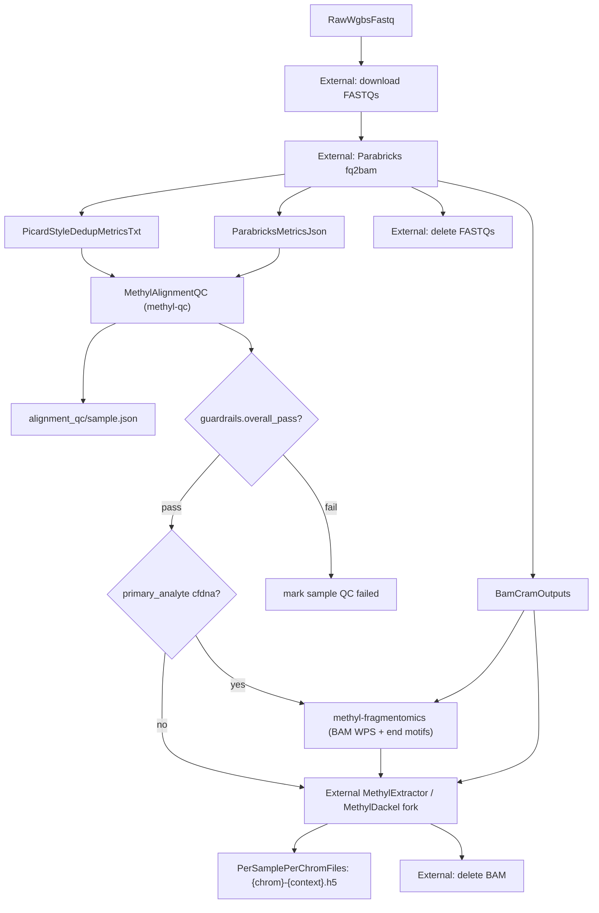
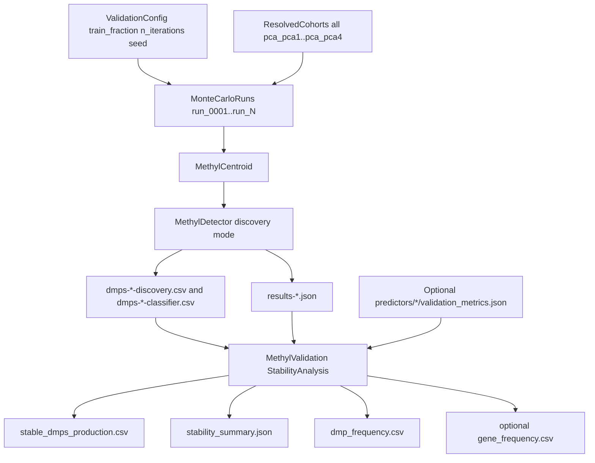
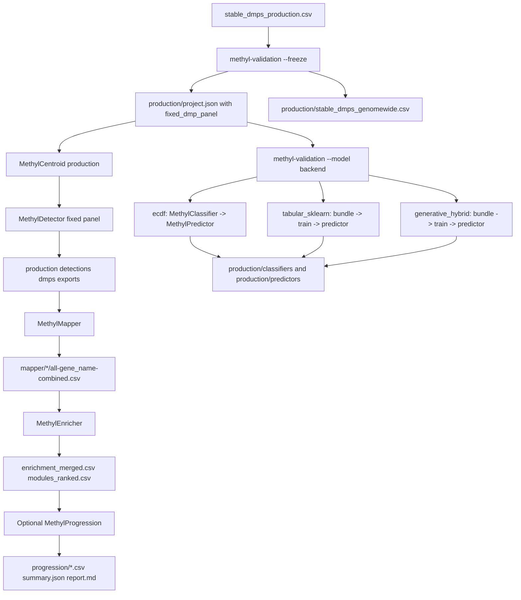
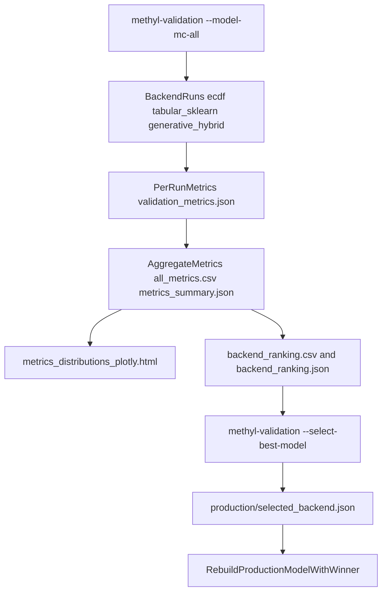
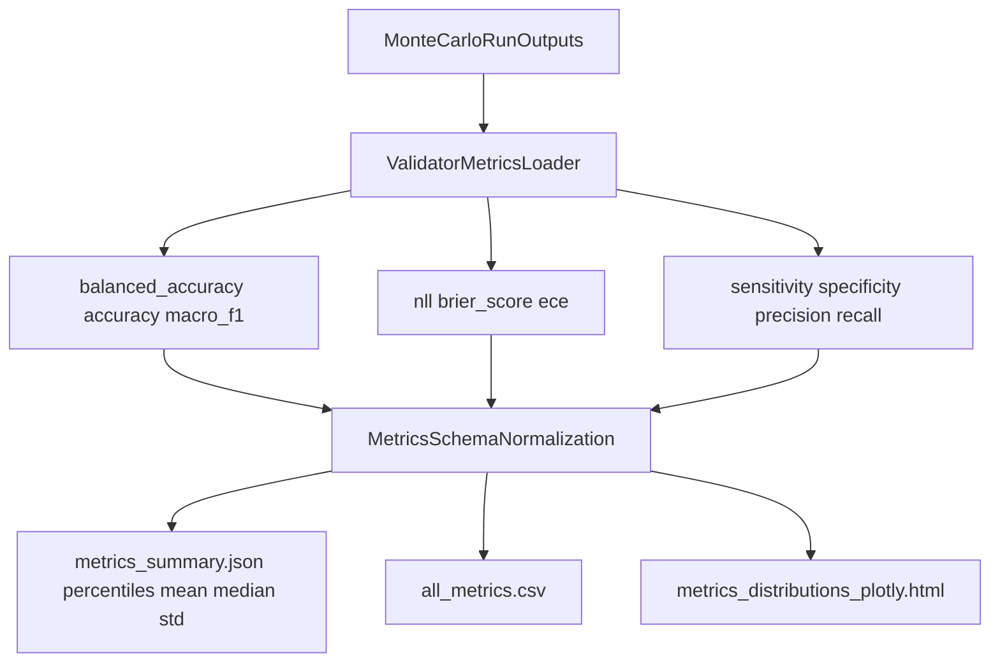
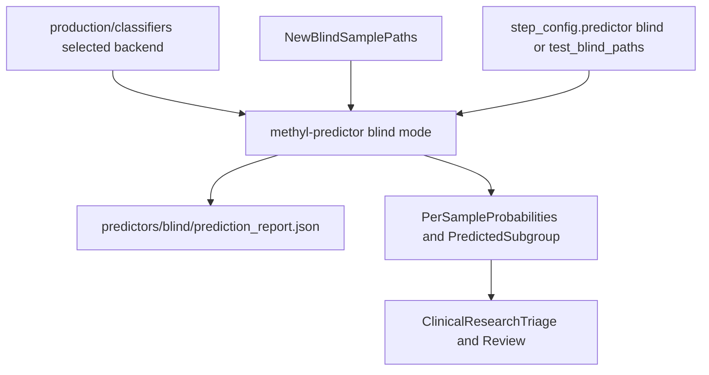

# Workflow Diagram Pack: `Healthy_vs_PCa1-4-CG`

This pack uses your project configuration at `/work/projects/prostate-cancer/configs/project_Healthy_vs_PCa1-4-CG.json` and separates:

- **External preprocessing** (Parabricks alignment and methyl extraction)
- **MethylPipeline-native stages** (AlignmentQC onward, MC/stability/freeze/model/predictor)

## Legend

- **External**: not orchestrated/implemented by MethylPipeline codebase, but upstream-required.
- **Optional**: branch controlled by config/flags.
- **Primary artifacts**: most relevant outputs for each stage.
- **Cohort mapping used here**:
  - Control: `all`
  - Disease leaves: `pca_pca1`, `pca_pca2`, `pca_pca3`, `pca_pca4`

---

## 1) Raw WGBS -> per-chromosome methylation HDF5

Orchestrated by **SamplePrepPipeline** ([`workflow_engine/sql/SamplePrepFlow.md`](../workflow_engine/sql/SamplePrepFlow.md), source: [`sample_prep.program.json`](../workflow_engine/domain/fixtures/sample_prep.program.json)). Two QC gates: **alignment** (`methyl-qc`, optional fastp remediation) then **extraction** (`methyl-extraction-qc`). Fragmentomics is conditional on `primary_analyte: cfdna`.

**Primary outputs**
- Alignment QC JSONs: `.../alignment_qc/<sample>.json` (or sample-dir sidecar from methyl-qc)
- cfDNA fragmentomics (when enabled): `{project}/fragmentomics/{sample_id}/`
- Per-sample methylation files consumed downstream: `{chrom}-{context}.h5` (for this project, context is `CG`)

---

## 2) Search for a stable set of DMPs

**Primary outputs**
- `.../monte_carlo_runs/stability/stable_dmps_production.csv`
- `.../monte_carlo_runs/stability/stability_summary.json`

---

## 3) Frozen DMP panel analysis chain (Mapper/Enricher/Classifier/Progression/Predictor)

**Primary outputs**
- Frozen project: `.../monte_carlo_runs/production/project.json`
- Biology analysis: mapper/enricher/progression outputs
- Model artifacts: `.../monte_carlo_runs/production/classifiers/` and `.../production/predictors/`

### Stage-2 disease feature families (all model backends)

When `feature_mode` is `observed_hybrid`, backend training can now use a unified second-stage feature contract:

- **DMP-derived summaries** (global/quantiles + disease-comparison aggregates)
- **DMR/region aggregates** (from explicit region metadata or fallback genomic windows)
- **Gene aggregates** (when DMP rows contain gene annotations)
- **Chromosome aggregates** (optional; still supported but no longer the only aggregate family)

For model-evaluation runs, backend predictor outputs now also include `feature_family_ablation.json`, which records active feature families and a recommended ablation matrix (`baseline`, `+DMP`, `+DMR`, `+gene`, `all`) to structure balanced-accuracy comparisons.

---

## 4) Search for the best model

**Selection controls**
- Metric: typically `balanced_accuracy`
- Statistic: typically `median`

---

## 5) Monte Carlo quality metric distributions (BA and others)

**What this gives**
- Distribution-aware confidence in model quality, not just single-point BA.

---

## 6) Final model -> prediction of blind newly arrived samples

**Primary outputs**
- `.../predictors/blind/prediction_report.json`
- Per-sample subgroup probabilities and predicted classes

---

## Project-specific path map (as used by diagrams)

- Base output: `/work/projects/prostate-cancer/Healthy_vs_PCa1-4-CG/`
- Monte Carlo runs: `/work/projects/prostate-cancer/Healthy_vs_PCa1-4-CG/monte_carlo_runs/`
- Production freeze/model root: `/work/projects/prostate-cancer/Healthy_vs_PCa1-4-CG/monte_carlo_runs/production/`

