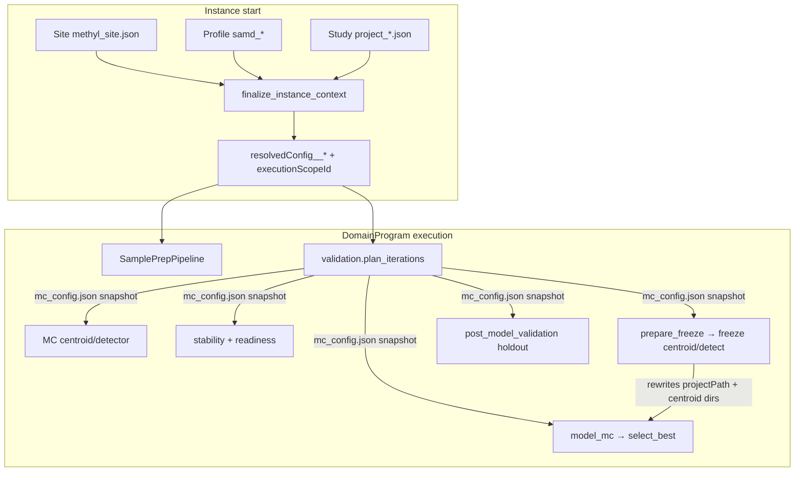

# Config propagation — DNA methylation process pack

How tunable science parameters and path/identity bindings flow through a long methylation run: SamplePrep → Monte Carlo stability → freeze → model → holdout validation (buffy coat or cfDNA).

**Related:** [layer model](layer-model.md), [action parameter contract](../reference/action-parameter-contract.md), [end-to-end workflow](end-to-end-workflow.md), [config parameter matrix](../reference/config-parameter-matrix.md).

> **Status:** Production enforcement — null-clearing `deep_merge`, study-owned analyte, `full_lifecycle` includes `model_mc`, pack modality gates, scenario experiments. See [`docs/plans/production-config-enforcement.plan.md`](../plans/production-config-enforcement.plan.md) and [`config-propagation-analysis.plan.md`](../plans/config-propagation-analysis.plan.md).

---

## End-to-end model



**Typical programs:** [`sample_prep.program.json`](../../workflow_engine/domain/fixtures/sample_prep.program.json) then [`samd_research`](../../workflow_engine/domain/fixtures/samd_research.program.json) / [`samd_holdout_enrichment`](../../workflow_engine/domain/fixtures/samd_holdout_enrichment.program.json) / [`study_validation_lifecycle`](../../workflow_engine/domain/fixtures/study_validation_lifecycle.program.json) / [`samd_pivotal`](../../workflow_engine/domain/fixtures/samd_pivotal.program.json) / [`full_lifecycle`](../../workflow_engine/domain/fixtures/full_lifecycle.program.json) (includes `validation.model_mc` before `select_best_model`).

---

## Bake at instance start

`finalize_instance_context` ([`workflow_context.py`](../../workflow_engine/domain/workflow_context.py)):

1. Sync study membership from `cfg` onto `/work` when applicable.
2. Enrich context (`projectPath`, samples, comparisons, …).
3. Bake flattened scope vars `resolvedConfig__<action_key>` from merged site/profile/instance overlays.
4. Set `executionScopeId` (CAAS / hyperparam labeling) from those slices.

**Merge order** (`resolve_action_config` in [`action_config_resolver.py`](../../packages/methylutils/methyl_utils/action_config_resolver.py)):

1. Site `actionConfig` slice (base)
2. Profile `actionConfig` section (`deep_merge` — wins over site)
3. Program / instance overlays (`deep_merge` — highest among overlays)
4. Analyte fill-missing-only (`merge_step_config` / `_deep_setdefault` — never overwrites keys already set)

JSON **`null` deletes** the key in `deep_merge` (clear / uncap site or profile knobs). Instance start also enforces pack pairing and study-owned `primary_analyte` for methylation ([`modality_gate.py`](../../packages/methylutils/methyl_utils/modality_gate.py)).

Program `stepOverride` / node `with` is **task-scoped** at claim/execute time; it is not written into `resolvedConfig__*` at bake.

**Worker contract:** when task input carries `resolvedConfig` (or CLI `--resolved-config`), workers must not re-read profiles, `METHYL_*` env, or study `step_config` for tool knobs. `projectPath` is identity and path derivation only ([action-parameter-contract](../reference/action-parameter-contract.md)).

---

## Stage-by-stage binding

| Stage | Tunable source | Path / identity source | Holdout role |
|-------|----------------|------------------------|--------------|
| SamplePrep | `resolvedConfig__parabricks` / `alignment_qc` / `methyl_extract` / … | sample lists; genomes from site | none |
| `plan_iterations` | `resolvedConfig__validation` | study `projectPath` | exclude `validation_partitions` into train pools; write [`queue/mc_config.json`](../../packages/methylvalidation/methyl_validation/mc_config_load.py) |
| MC centroid/detector | centroid/detection slices + program `stepOverride` | `centroidSeedGroups`, comparison FOREACH | holdouts already removed from samples |
| stability / readiness | validation slice (+ MC snapshot backfill) | study paths | panel gates |
| `prepare_freeze` | validation holdout/freeze knobs | **rebinds** `projectPath`→`production/project.json`, `centroid1Dir`/`centroid2Dir`/`detectOutDir`, `fixedDmpPanel` | writes holdout sidecars |
| freeze detect/mapper | detection/mapper + `fixedDmpPanel` | production dirs from prepare_freeze scope | train-only production cohorts |
| model_mc / select_best | validation backends | production + mc_root | — |
| post_model_validation | `holdout_eval`, `holdout_partition` | holdout CSVs / `locked_test` or `pivotal_validation` | scores locked patients |

### Path rebinding at prepare_freeze

Live handler ([`validation.py`](../../workers/methyl_worker/handlers/validation.py)) and CAAS replay enricher ([`action_skip.py`](../../workers/methyl_worker/action_skip.py)) share [`production_centroid_detect_dirs`](../../workers/methyl_worker/handler_helpers.py):

- Expand comparisons via `ProjectConfig.get_comparisons()` (supports shorthand `"control_vs_each_disease"` / `"all_pairs"`).
- Bind centroids with `get_centroid_dir("control"|"disease", label)`.
- Bind detection with `get_detection_output_dir(control, disease)` → `detections/{control}/{disease}` (not `detections/{label}`).

Local scheduler additionally refreshes scope `comparisons` after prepare_freeze ([`scheduler.py`](../../workflow_engine/local/scheduler.py)); the DB/gateway path relies on task output bindings + FOREACH templates and does **not** run that refresh.

### MC snapshot

`plan_iterations` writes `monte_carlo_runs/queue/mc_config.json`. Downstream MC/stability/freeze/model nodes may backfill validation knobs from that snapshot when task `resolvedConfig` is incomplete — still not a license to re-read live profiles on the worker.

---

## Study-owned analyte

Procedure profiles (`samd_*`, staged) must **not** pin `primary_analyte`. The study decides:

| Study class | Typical `regulatory.primary_analyte` |
|-------------|--------------------------------------|
| Liquid biopsy / Alzheimer-style | `cfdna` |
| Buffy / blood leukocyte | `buffy_coat` |
| Solid tumor / tissue | `tissue` |
| Plant packs | `plant_tissue` |

`finalize_instance_context` copies study `regulatory` into `resolvedConfig__validation.regulatory` and fails closed if a methylation run lacks `primary_analyte`.

| Concern | Buffy coat | cfDNA |
|---------|------------|--------|
| Study `regulatory.primary_analyte` | `buffy_coat` | `cfdna` |
| Analyte fill-ins | buffy step defaults (fill-missing) | cfdna step defaults |
| Cell deconvolution | Houseman / HiTIMED immune-rooted tree | HiTIMED plasma tree may expose `tumor_fraction` |

Do not encode analyte-specific caps in Python; set site/profile `actionConfig` and study `regulatory`.

---

## Process-pack ownership (shared vs pack-owned)

| Layer | Shared (generic) | Methyl pack | RNA pack | Proteomics pack |
|-------|------------------|-------------|----------|-----------------|
| Engine | DomainProgram IR, scheduler, CAAS, cfg/wf | — | — | — |
| Sample I/O | download/archive/delete patterns | bisulfite align + methyl extract/QC | rna_fq2bam / kallisto + rna_qc | DIA-NN/Sage ingest + proteomics_qc |
| Study science | tabular / covariates / `omics_features` DE seam | centroid → detect → stability → prepare_freeze → deconv → model_mc → PMV | `rna_de_select` | `protein_de_select` |
| Profiles | — | `samd_*`, staged methyl | `rnaseq_research` | `proteomics_research` |
| Programs | — | `sample_prep`, `full_lifecycle`, SaMD ladder | `sample_prep_rnaseq`, `rnaseq_study_lifecycle` | `sample_prep_proteomics`, `proteomics_study_lifecycle` |

Instance start rejects mismatched `(program, pipelineProfile, primary_modality)`. Methyl-only actions refuse under non-methyl modality.

---

## Scenario experiments (no mandatory grid)

To confirm an assumption or hit a stability target without a Cartesian search:

```bash
methyl-study-start scenario-start <<'EOF'
{
  "project_path": "/work/projects/my-study/configs/project_X.json",
  "pipeline_profile": "samd_research",
  "display_name": "ba-target-0.85",
  "overrides": {
    "validation.stability_target_balanced_accuracy": 0.85,
    "validation.stability_gene_featurecuts_max_dmps": null
  }
}
EOF
```

Overlay → `finalize_instance_context` → one `wf` instance + `executionScopeId`. Optional cfg single-trial ledger for later score/compare. Grid search remains available via `hyperparam-grid-start`. See [portal remote control](portal-remote-control.md) and [usage ch.15](../usage/15-optional-hyperparameter-search.qmd).

---

## SaMD ladder — config deltas (operator view)

| Ladder rung | Typical profile / program | Config emphasis |
|-------------|---------------------------|-----------------|
| Research | `samd_research` | Exploratory MC, looser gates |
| Holdout enrichment | `samd_holdout_enrichment` | Locked-test partitions excluded from train |
| Lifecycle / pivotal | `study_validation_lifecycle` / `samd_pivotal` | Freeze → model_mc → post_model holdout |

Key validation knobs live under `actionConfig.validation` (stability caps, holdout partition name, BA gates). Gene FeatureCuts caps may also appear under `actionConfig.gene_selection` aliases — both resolve into the validation / gene-select slice at bake.

---

## Verified risks

### Critical (fixed) — shorthand comparisons broke prepare_freeze binding

Iterating `list(prod_cfg.comparisons)` when `comparisons` is the string `"control_vs_each_disease"` walks **characters**, so `centroid1Dir` / `centroid2Dir` / `detectOutDir` stayed `None`. Affects Alzheimer/plant/staged oncology fixtures and examples under `docs/examples/samd/`.

**Mitigation:** always `get_comparisons()` + shared helper (live + CAAS).

### High (fixed) — wrong `detectOutDir` shape

Building `…/detections/{label}` diverged from canonical `detections/{control}/{disease}`.

**Mitigation:** `get_detection_output_dir(control, disease)`.

### Medium — group1/group2 fallback

`ComparisonSpec` exposes `control_group` / `disease_group`. Flat `group1`/`group2` projects yield empty `get_comparisons()`. Soft getattr fallback remains for odd mocks; real manifests use control/disease sides.

### Remaining gaps

| Gap | Notes |
|-----|--------|
| Local-only comparison refresh after prepare_freeze | Gateway/DB scope does not re-run `enrich_comparisons_from_project` |
| `resolve_from_task_input` env/profile fallback | If `resolvedConfig` missing, older paths may still touch env/profile — avoid in production workers |

---

## Operator checklist (new pack / new study)

1. **Study manifest** — `control`/`disease` (or `controls`/`diseases`), `comparisons` list or shorthand, `validation_partitions`, **`regulatory.primary_analyte`** (study-owned), chromosomes/contexts. No `step_config`.
2. **Profile** — SaMD rung matching claim stage; confirm `actionConfig.validation` holdout and stability keys (no nested analyte).
3. **Site** — genomes, GTF, cluster defaults, deployment caps under `actionConfig`.
4. **Instance start** — matching program × profile × `primary_modality`; inspect `resolvedConfig__*` and `executionScopeId`.
5. **SamplePrep** — pass QC; archive H5; keep paths under `/work/samples` + study data CSVs.
6. **plan_iterations** — confirm holdouts excluded; `queue/mc_config.json` present.
7. **After prepare_freeze** — `projectPath` points at `production/project.json`; `centroid1Dir`/`centroid2Dir`/`detectOutDir` non-null and match `detections/{control}/{disease}`.
8. **Holdout eval** — sidecars under production; post_model_validation partition matches locked/pivotal intent.
9. **Scenarios** — use `scenario-start` for assumption checks; use `hyperparam-grid-start` only when sweeping axes.

---

## Implementation map

| Concern | Code |
|---------|------|
| Bake / scope | `workflow_engine/domain/workflow_context.py` |
| Merge layers | `packages/methylutils/methyl_utils/action_config_resolver.py` |
| Pack / analyte gates | `packages/methylutils/methyl_utils/modality_gate.py` |
| Comparisons / detect dirs | `packages/methylutils/methyl_utils/pipeline_config.py` |
| prepare_freeze path bind | `workers/methyl_worker/handler_helpers.py` → validation handler + `action_skip` |
| Scenario start | `workflow_engine/ops/hyperparam_grid.py` (`start_scenario_trial`) |
| MC snapshot load | `packages/methylvalidation/methyl_validation/mc_config_load.py` |
