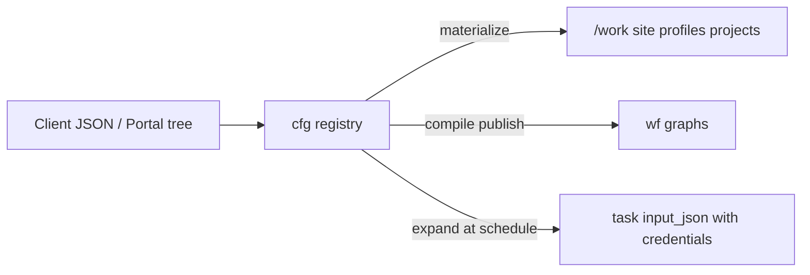

# Configuration registry (cfg)

> **Status: Implemented (spine)** — database schema + `methyl-cfg` CLI + file-backed store for local/CI; materialize onto `/work`; credentials never written to shared storage.

## Mental model

| Layer | Role |
|-------|------|
| **`cfg` schema** | Source of truth for sites, profiles, DomainProgram IR, studies, storage endpoints/credentials, reference assets, action definitions |
| **`wf` schema** | Compiled workflow graphs, instances, task queue (unchanged) |
| **`/work`** | Materialization target for workers (paths only; **no secrets**) |
| **Git** | Code, JSON Schema contracts, CI fixtures |



## CLI

```bash
source .venv/bin/activate
export METHYL_CFG_STORE=/work/epimethyl/cfg-store
export PYTHONPATH=workflow_engine:$PYTHONPATH

methyl-cfg import-fs --repo-root . --work-root /work
methyl-cfg sync-actions --from-json
methyl-cfg materialize --work-root /work

# Named cloud endpoints (secrets stay in store)
methyl-cfg upsert credential --file lab_keys.json --name lab-aws-keys --provider s3 --publish
methyl-cfg upsert storage_endpoint --file lab_s3.json --name lab-aws \
  --credential-name lab-aws-keys --provider s3 --publish
methyl-cfg expand-endpoint lab-aws --prefix plasma/S1/

methyl-cfg publish-program SamplePrepPipeline --work-root /work
methyl-cfg scaffold-action demo.echo --define --capability demo
methyl-cfg provision-assets --name grch38 --work-root /work --dry-run
```

`METHYL_CFG_STORE` defaults to `/work/epimethyl/cfg-store` (file-backed stand-in that mirrors `cfg.*` tables). Production DDL: `workflow_engine/sql_{pg,mssql}/cfg_*.sql` (wired into `deploy_azure.sh`).

## Storage endpoints and credentials

See [`schemas/domain/storage_location.schema.json`](../schemas/domain/storage_location.schema.json):

| Provider | Location fields | Credential `authMode` |
|----------|-----------------|----------------------|
| `s3` | bucket, region, endpointUrl | `explicit_keys`, `instance_profile` |
| `azure_blob` | account, container | `account_key`, `connection_string`, **`sas_token`**, **`sas_url`**, `default_credential` |
| `gcs` | bucket, projectId | `service_account_json`, `hmac_keys`, `application_default` |
| `file` | basePath | (none) |
| `https` | baseUrl | optional `bearer` |

Workers still receive typed `fastqSource` / destination JSON; `cfg.storage_expand.expand_storage_endpoint` builds that payload at schedule time.

## Portal

- `portal.sp_list_domain_programs` / `sp_get_domain_program` / `sp_upsert_domain_program` — tree editor against `cfg.domain_program`
- `portal.sp_list_cfg_actions` / `sp_get_cfg_action` — action catalog from `cfg.action_definition` (not the worker gateway)

## Related

- [layer-model.md](layer-model.md)
- [distributed-runtime.md](distributed-runtime.md)
- Usage: [docs/usage/19-config-registry.qmd](../usage/19-config-registry.qmd)
