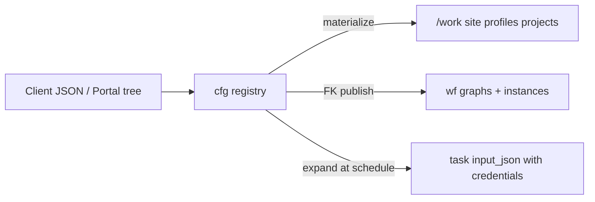

# Configuration registry (cfg)

> **Status: Implemented (spine)** — database schema + `methyl-cfg` CLI + file-backed store for local/CI; materialize onto `/work`; credentials never written to shared storage.

## Mental model

| Layer | Role |
|-------|------|
| **`cfg` schema** | Source of truth for sites, profiles, DomainProgram IR, studies, storage endpoints/credentials, reference assets, action definitions |
| **`wf` schema** | Compiled workflow graphs, instances, task queue |
| **`/work`** | Materialization target for workers (paths only; **no secrets**) |
| **Git** | Code, JSON Schema contracts, CI fixtures |

### Relationships (`cfg` ↔ `wf`)

Deployed by `cfg_wf_relationships.sql` (after `cfg_registry_tables.sql`):

| From | To | Purpose |
|------|----|---------|
| `cfg.domain_program.workflow_def_id` | `wf.workflow_def.id` | Stable published graph identity |
| `cfg.domain_program.compiled_workflow_version_id` | `wf.workflow_version.id` | Active compiled IR revision |
| `cfg.program_publish` | `domain_program` + `workflow_def` + `workflow_version` | Audit of each publish |
| `cfg.action_definition.workflow_action_id` | `wf.workflow_action.id` | Catalog row used by engine nodes (unique when set) |
| *(via `workflow_action_id`)* | `wf.workflow_action_schema` (input/output) | Task I/O JSON Schemas — see `cfg.v_action_definition_wf` |
| `cfg.reference_asset.storage_endpoint_id` | `cfg.storage_endpoint.id` | Primary download/provision source |
| `cfg.site_reference_asset` | `cfg.site` + `cfg.reference_asset` | Site roles: `reference_genome`, `annotation_gtf`, `pangenome_bundle`, … |
| `cfg.study_instance_link` | `cfg.study` + `wf.workflow_instance` (+ optional program/profile/site) | Which study/config started a run |
| `cfg.storage_endpoint.credential_id` | `cfg.credential.id` | Internal (not wf) |
| `cfg.study_group.study_row_id` | `cfg.study.id` | Analysis arm (`control` / `disease`) |
| `cfg.study_group_member.portal_sample_id` | `portal.Samples.ID` | Enrolled clinical sample (MSSQL FK) |
| `cfg.study_group_member.lab_sample_id` | `portal.LabSamples.ID` | Optional lab run / processing key source |

Views: `cfg.v_domain_program_wf`, `cfg.v_action_definition_wf`, `cfg.v_reference_asset`, `cfg.v_site_reference_asset`, `cfg.v_study_instance`.

Procs: `cfg.cfg_repo_set_compiled_version`, `cfg.cfg_repo_link_action`, `cfg.cfg_repo_link_study_instance`, `cfg.cfg_repo_link_reference_asset`, `cfg.cfg_repo_link_site_asset`, `cfg.cfg_repo_set_study_group`, `cfg.cfg_repo_set_study_group_members`, `cfg.cfg_repo_materialize_study_lists`.


## CLI

```bash
source .venv/bin/activate
export METHYL_CFG_STORE=/work/epimethyl/cfg-store
export PYTHONPATH=workflow_engine:$PYTHONPATH

methyl-cfg import-fs --repo-root . --work-root /work
methyl-cfg sync-actions --from-json
methyl-cfg materialize --work-root /work

# Named cloud endpoints (secrets stay in store)
methyl-cfg upsert credential --file lab_keys.json --name lab-aws-keys --provider s3 --publish
methyl-cfg upsert storage_endpoint --file lab_s3.json --name lab-aws \
  --credential-name lab-aws-keys --provider s3 --publish
methyl-cfg expand-endpoint lab-aws --prefix plasma/S1/

methyl-cfg publish-program SamplePrepPipeline --work-root /work
methyl-cfg scaffold-action demo.echo --define --capability demo
methyl-cfg provision-assets --name grch38 --work-root /work --dry-run
```

`METHYL_CFG_STORE` defaults to `/work/epimethyl/cfg-store` (file-backed stand-in that mirrors `cfg.*` tables). Production DDL: `workflow_engine/sql_{pg,mssql}/cfg_*.sql` (wired into `deploy_azure.sh`).

## Storage endpoints and credentials

See [`schemas/domain/storage_location.schema.json`](../schemas/domain/storage_location.schema.json):

| Provider | Location fields | Credential `authMode` |
|----------|-----------------|----------------------|
| `s3` | bucket, region, endpointUrl | `explicit_keys`, `instance_profile` |
| `azure_blob` | account, container | `account_key`, `connection_string`, **`sas_token`**, **`sas_url`**, `default_credential` |
| `gcs` | bucket, projectId | `service_account_json`, `hmac_keys`, `application_default` |
| `file` | basePath | (none) |
| `https` | baseUrl | optional `bearer` |

Workers still receive typed `fastqSource` / destination JSON; `cfg.storage_expand.expand_storage_endpoint` builds that payload at schedule time.

## Study membership (portal.Samples → cfg → CSV)

1. Institutions/Labs import into **`portal.Samples`** / **`portal.LabSamples`**.
2. Operators enroll samples into **`cfg.study_group`** / **`cfg.study_group_member`** (not `portal.Groups` — those are customer UI cohorts).
3. `methyl-cfg materialize` (or `cfg_repo_materialize_study_lists`) writes `/work/projects/<study>/data/*.csv` and syncs `controls`/`diseases` `sample_paths` on the study document.

File-backed store keeps the same structure under `study.extra.studyGroups`. CLI: `set-study-group`, `set-study-group-members`, `list-study-groups`, `materialize-study-lists`.

**Run start always syncs:** `ensure_study_work_synced` runs from `finalize_instance_context`, `create_workflow_instance`, sample-prep/validation start, and `methyl-workflow-run`. Membership CSVs are rewritten from cfg before tasks see `/work`. Explicit materialize is optional admin/bootstrap only.

## Portal

- `portal.sp_list_domain_programs` / `sp_get_domain_program` / `sp_upsert_domain_program` — tree editor against `cfg.domain_program`
- `portal.sp_list_cfg_actions` / `sp_get_cfg_action` — action catalog from `cfg.action_definition` (not the worker gateway)
- `portal.sp_set_study_group` / `sp_set_study_group_members` / `sp_list_study_groups` / `sp_materialize_study_lists` — study arm enrollment
- `portal.sp_list_samples_for_study_enrollment` (MSSQL) — picker over `portal.Samples` + `LabSamples`

## Related

- [layer-model.md](layer-model.md)
- [distributed-runtime.md](distributed-runtime.md)
- Usage: [docs/usage/19-config-registry.qmd](../usage/19-config-registry.qmd)
