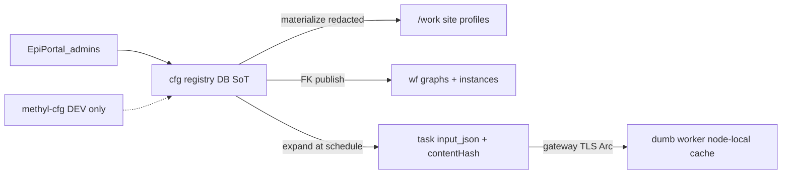

# Configuration registry (cfg)

> **Status: Implemented (spine)** — database schema + `methyl-cfg` CLI + file-backed store for local/CI; materialize onto `/work`; credentials never written to shared storage.

## Mental model

| Layer | Role |
|-------|------|
| **`cfg` schema** | Source of truth for sites, profiles, assay procedures, analytes, DomainProgram IR, studies, storage endpoints/credentials, reference assets |
| **`wf` schema** | Compiled workflow graphs, instances, task queue, **`wf.data_type`** (JSON Schema document + SQL field index), **`wf.workflow_action`** (dispatch + I/O type FKs) |
| **`portal`** | Clinical samples; sample-extras / `portal.sample_field_contract.schema_json` (flexible covariates) |
| **`/work`** | Materialization target for workers (paths only; **no secrets**) |
| **Git** | Code, JSON Schema / Pydantic / Mojo contracts that **seed** `wf.data_type.schema_json` (and the field index) |

### Relationships (`cfg` ↔ `wf`)

Deployed by `cfg_wf_relationships.sql` (after `cfg_registry_tables.sql`):

| From | To | Purpose |
|------|----|---------|
| `cfg.domain_program.workflow_def_id` | `wf.workflow_def.id` | Stable published graph identity |
| `cfg.domain_program.compiled_workflow_version_id` | `wf.workflow_version.id` | Active compiled IR revision |
| `cfg.program_publish` | `domain_program` + `workflow_def` + `workflow_version` | Audit of each publish |
| `wf.workflow_action.input_type_id` / `output_type_id` | `wf.data_type.id` | Action I/O types (`schema_json` is the editor document; fields are a SQL index) |
| `cfg.reference_asset.storage_endpoint_id` | `cfg.storage_endpoint.id` | Primary download/provision source |
| `cfg.site_reference_asset` | `cfg.site` + `cfg.reference_asset` | Site roles: `reference_genome`, `annotation_gtf`, `pangenome_bundle`, `houseman_seed_basis`, `hitimed_hierarchy_basis`, … **One asset per (`site_id`, `asset_role`)** (`uq_cfg_sra_site_role`). `ck_cfg_sra_role` has no WGBS pangenome role; stock d9-1.70 and WGBS d9-bs-1.70 both compete for `pangenome_bundle`. Site-link seed attaches the stock bundle; swap `@links` for a WGBS site. Dual bind is a model change (widen CHECK + unique). |
| `cfg.study_instance_link` | `cfg.study` + `wf.workflow_instance` (+ optional program/profile/site) | Which study/config started a run |
| `cfg.storage_endpoint.credential_id` | `cfg.credential.id` | Internal (not wf) |
| `cfg.study.default_analyte_id` | `cfg.analyte.id` | Study specimen/matrix (dual-writes `regulatory.primary_analyte`) |
| `cfg.assay_procedure.analyte_id` | `cfg.analyte.id` | Typed analyte expectation (string `primary_analyte` kept) |
| `portal.Samples.analyte_id` | `cfg.analyte.id` | Clinical sample matrix (enrollment hard-filter) |
| `cfg.study_group.study_row_id` | `cfg.study.id` | Analysis arm (`control` / `disease`) |
| `cfg.study_group_member.portal_sample_id` | `portal.Samples.ID` | Enrolled clinical sample (**FK on both Azure SQL and PostgreSQL** after `legacy_cross_schema_fks.sql`) |
| `cfg.study_group_member.lab_sample_id` | `portal.LabSamples.ID` | Optional lab run / processing key source (**FK on both backends**) |

Views: `cfg.v_domain_program_wf`, `cfg.v_action_definition_wf` (now a **wf** action + type browse view; `cfg.action_definition` retired), `cfg.v_reference_asset`, `cfg.v_site_reference_asset`, `cfg.v_study_instance`, `cfg.v_analyte`, `cfg.v_assay_procedure`.

Procs: `cfg.cfg_repo_set_compiled_version`, `cfg.cfg_repo_link_study_instance`, `cfg.cfg_repo_link_reference_asset`, `cfg.cfg_repo_link_site_asset`, `cfg.cfg_repo_set_study_group`, `cfg.cfg_repo_set_study_group_members`, `cfg.cfg_repo_materialize_study_lists`. (`cfg.cfg_repo_link_action` raises — retired with `cfg.action_definition`.)

### Actions and types (not cfg)

| Concern | Lives in |
|---------|----------|
| Reusable types | `wf.data_type.schema_json` (JSON Schema for SchemaPropertyGrid) + `wf.data_type_field` / enum values (SQL index) |
| Action dispatch + I/O type FKs | `wf.workflow_action` |
| Worker claim/submit bodies | JSON **values** conforming to those types (wire only) |
| Flexible sample extras / future covariates | `portal.sample_field_contract.schema_json` |
| Git generators | Pydantic / Mojo / `schemas/domain`, `schemas/tasks`, `schemas/config` (guardrail editor types) → `seed_data_types.py` |

`cfg.action_definition` and seeding of `wf.workflow_action_schema` blobs are **retired**. Use `methyl-cfg sync-actions` (seeds wf, including SamplePrep guardrail types from `schemas/config`) and portal `sp_list/get_workflow_actions` / `sp_list/get_data_type`.

## SamplePrep guardrails (site window + overlays)

The published WGBS/extraction QC window is **site data**, not a Python constant and not four copies of `AlignmentQCConfig`.

| `wf.data_type` name | Bind | Persist |
|---------------------|------|---------|
| `sample_prep_guardrails` | Platform → Site grid | Full `alignment_qc` + `extraction_qc` slice |
| `sample_prep_guardrails_overlay` | Profile / procedure grids | Sparse diff vs inherited |
| `study_action_config_overlay` | Studies → Guardrails | Same overlay model (alias so existing IA/Delphi wiring does not break) |

Merge for overlay editors: site (full) → profile overlay → procedure overlay → study overlay. **Analyte fill-missing** still happens at instance bake (`finalize_instance_context`), not in SQL GET. Portal procs: `portal.sp_get/set_*_guardrails_editor` in `portal_guardrails_editor.sql` (twins). Do not bind `alignment_qc.schema.json`.


## CLI

```bash
source .venv/bin/activate
export METHYL_CFG_STORE=/work/epimethyl/cfg-store
export PYTHONPATH=workflow_engine:$PYTHONPATH

methyl-cfg import-fs --repo-root . --work-root /work
methyl-cfg link-site-assets --site default --deploy-db   # cfg.cfg_repo_link_site_asset
methyl-cfg sync-actions          # seeds wf.workflow_action + wf.data_type
methyl-cfg materialize --work-root /work

# Named cloud endpoints (secrets stay in store)
methyl-cfg upsert credential --file lab_keys.json --name lab-aws-keys --provider s3 --publish
methyl-cfg upsert storage_endpoint --file lab_s3.json --name lab-aws \
  --credential-name lab-aws-keys --provider s3 --publish
methyl-cfg expand-endpoint lab-aws --prefix plasma/S1/

methyl-cfg publish-program SamplePrepPipeline --work-root /work
methyl-cfg scaffold-action demo.echo --define --capability demo   # git stubs; then sync-actions
methyl-cfg sync-library-presets   # enrichment library presets → cfg (kind enrichment_library_preset)
# Genomes inventory (epimethyl/genomes → /work/genomes); pins from site reference_selection
methyl-cfg provision-assets --selected-only --site default --work-root /work --dry-run
methyl-cfg provision-assets --name linear-grch38-ensembl-116 --version 1 --work-root /work --dry-run
```

**Canonical genomes tree** (QNAP + `/work`): `linear/GRCh38/ensembl-116/` (default pin; 114 remains published), `annotation/gencode/v50/` (default; v49 remains), `pangenome/GRCh38/d9/1.70/`. Site `reference_selection` pins active versions; `cfg.storage_endpoint` `epimethyl-genomes` (`prefixBase: genomes/`) + `cfg.reference_asset` recipes drive `s3_sync` provision. Phase 0 helper: `scripts/provision_selected_genomes.sh`. Operator upload/provision map: [reference-inventory-qnap.md](../deployment/reference-inventory-qnap.md). `cfg.cfg_repo_link_site_asset` is the **only** writer of `cfg.site_reference_asset`. Asset seed does not fill the grid. Construction callers: [`cfg_site_reference_assets_seed.sql`](../../workflow_engine/sql_mssql/cfg_site_reference_assets_seed.sql) (after `cfg.site default@1` exists) and `methyl-cfg link-site-assets --deploy-db` (bootstrap after `import-fs`).

`METHYL_CFG_STORE` defaults to `/work/epimethyl/cfg-store` (file-backed stand-in that mirrors `cfg.*` tables). Production DDL: `workflow_engine/sql_{pg,mssql}/cfg_*.sql` (wired into `deploy_azure.sh`).

## Enrichment library presets

`cfg` kind **`enrichment_library_preset`** holds named Enrichr library sets (e.g.
`cancer-core`, `neuro-core`) as config rather than a Python dict, mirroring the action
catalog:

- **Source of truth:** `packages/methylenricher/methyl_enricher/data/library_presets.json` (validated by `LibraryPresetCatalog`; schema `schemas/config/library_presets.schema.json`).
- **Sync:** `methyl-cfg sync-library-presets` upserts one object per preset (resolved library list); `materialize` writes them to `/work/site/enrichment/`.
- **Consumers:** `methyl_enricher.resolve_enrichr_libraries` loads the registry (not code); the Alzheimer cfDNA pack selects `neuro-core` via `actionConfig.enricher.library_preset`.

Presets are config, not workflow nodes, so they are **not** seeded into `wf.workflow_action`.

## Storage endpoints and credentials

**Production source of truth:** Azure SQL `cfg.storage_endpoint` + `cfg.credential`, authored only by **lab admins** / **infrastructure admins** via EpiPortal (`portal.sp_*` upsert/publish). Secrets are **not** authored with `methyl-cfg` in production (CLI remains for **dev / CI / bootstrap** only).

File-store bootstrap: `import-fs` loads endpoint + reference_asset fixtures but **not** credentials. Use the placeholder shape in [`workflow_engine/domain/fixtures/credentials/epimethyl-archive-keys.example.json`](../../workflow_engine/domain/fixtures/credentials/epimethyl-archive-keys.example.json) (`methyl-cfg upsert credential …` after replacing `REPLACE_WITH_*`), or env keys with `scripts/sync_genomes_to_s3.sh`.

See [`schemas/domain/storage_location.schema.json`](../../schemas/domain/storage_location.schema.json):

| Provider | Location fields | Credential `authMode` |
|----------|-----------------|----------------------|
| `s3` | bucket, region, endpointUrl, optional `scope` | `explicit_keys`, `instance_profile` (+ optional `azure_key_vault` / `encrypted_file`) |
| `azure_blob` | account, container | `account_key`, `connection_string`, **`sas_token`**, **`sas_url`**, `default_credential` |
| `gcs` | bucket, projectId | `service_account_json`, `hmac_keys`, `application_default` |
| `file` | basePath | (none) |
| `https` | baseUrl | optional `bearer` |

**Schedule-time expand** (`cfg.storage_expand.expand_storage_endpoint`) builds worker `fastqSource` / destination JSON with concrete auth fields (or vault/encrypted **refs**) plus change tokens `credentialName`, `credentialVersion`, `contentHash`. Materialize to `/work/site/storage_endpoints/` stays **redacted** (no secret bodies).

**Dumb workers:** receive credentials only via gateway claim `input_json` (TLS). They compare `contentHash` to a **node-local** Fernet cache under `/var/lib/methyl/storage-credentials/` (wrap key `/etc/methyl/storage-credential.key`). Never cache secrets on shared `/work`. Azure Key Vault on the worker is an optional escape hatch, not the default.

**Portal RBAC (EpiPortal):** lab admin → lab ingress endpoints; infrastructure admin → archive / shared / site storage; other users → select published redacted endpoints only.

Portal procs: `portal.sp_list/get/upsert/publish_storage_endpoint`, `portal.sp_list/get/upsert/publish_credential` (list/get never return `secret_json`).

Archive defaults: `portal.resource_profile` should reference `sampleStorageEndpoint` (cfg name); study start expands via `ResourceProfileReader`.

## Study membership (portal.Samples → cfg → CSV)

1. Institutions/Labs import into **`portal.Samples`** / **`portal.LabSamples`**.
2. Operators enroll samples into **`cfg.study_group`** / **`cfg.study_group_member`** (not `portal.Groups` — those are customer UI cohorts).
3. `methyl-cfg materialize` (or `cfg_repo_materialize_study_lists`) writes `/work/projects/<study>/data/*.csv` and syncs `controls`/`diseases` `sample_paths` on the study document.

File-backed store keeps the same structure under `study.extra.studyGroups`. CLI: `set-study-group`, `set-study-group-members`, `list-study-groups`, `materialize-study-lists`.

**Run start always syncs:** `ensure_study_work_synced` runs from `finalize_instance_context`, `create_workflow_instance`, sample-prep/validation start, and `methyl-workflow-run`. Membership CSVs are rewritten from cfg before tasks see `/work`. Explicit materialize is optional admin/bootstrap only.

## Portal

- `portal.sp_list_domain_programs` / `sp_get_domain_program` / `sp_upsert_domain_program` — tree editor against `cfg.domain_program`
- `portal.sp_list/get_workflow_actions` — action catalog from `wf` (input/output **type names**; deprecated aliases `sp_list/get_cfg_action`)
- `portal.sp_list/get_data_types` (+ field result sets / `sp_list_data_type_fields`) — DataType Registry; **GET returns `schema_json` for SchemaPropertyGrid**
- `portal.sp_get_action_schema` — action I/O JSON Schema (`wf.data_type.schema_json`, then legacy blob)
- `portal.sp_list/get_sample_field_contracts` — sample extras / covariate JSON Schema
- `portal.sp_set_study_group` / `sp_set_study_group_members` / `sp_list_study_groups` / `sp_materialize_study_lists` — study arm enrollment
- `portal.sp_list_samples_for_study_enrollment` (MSSQL) — picker over `portal.Samples` + `LabSamples` (hard-filters by study `default_analyte_id` when set)
- `portal.sp_set_sample_analyte` — bind `portal.Samples.analyte_id` → `cfg.analyte`
- `portal.sp_list/get/upsert/publish_storage_endpoint` + `…_credential` — storage SoT for EpiPortal admins
- `portal.sp_list_pipeline_profile_catalog` / `sp_list_assay_procedure_catalog` / `sp_list_analyte_catalog` — operator pickers (Study + Start wizard)
- `portal.sp_list/get_pipeline_profile` / `sp_list/get_assay_procedure` / `sp_list/get_analyte` — Platform admin browse (incl. retired)
- `portal.sp_get/set_study_process_defaults` — study-bound `pipelineProfile` / `pipelineProcedure` / `analyte` / `researchMode` (dual-writes `regulatory.primary_analyte`)

Process-pack and analyte documents in git carry a `catalog` block; `scripts/sync_cfg_profiles_and_action_catalog.py` upserts `cfg.pipeline_profile`, `cfg.assay_procedure`, and `cfg.analyte` with `published` vs `retired` from that metadata and binds assay FKs (`default_pipeline_profile_id`, SamplePrep/lifecycle `domain_program` ids, `primary_analyte` / `analyte_id`). SQL contracts (native `json` / `jsonb` — no `nvarchar(max)` payloads):

- [`cfg_process_pack_catalog.sql`](../../workflow_engine/sql_mssql/cfg_process_pack_catalog.sql) + [PG](../../workflow_engine/sql_pg/cfg_process_pack_catalog.sql)
- [`cfg_assay_procedure_links.sql`](../../workflow_engine/sql_mssql/cfg_assay_procedure_links.sql) + [PG](../../workflow_engine/sql_pg/cfg_assay_procedure_links.sql) — study defaults FKs, `study_instance_link.assay_procedure_id`, `cfg.v_assay_procedure`
- [`cfg_analyte_catalog.sql`](../../workflow_engine/sql_mssql/cfg_analyte_catalog.sql) + [PG](../../workflow_engine/sql_pg/cfg_analyte_catalog.sql) — `cfg.analyte`, study/sample/assay analyte FKs, catalog + enrollment filter

Day-2: [`scripts/deploy_process_pack_catalog.sh`](../../scripts/deploy_process_pack_catalog.sh). UI: [portal-ia.md](portal-ia.md). Customer process-pack entitlements (`Contract.ContractProcessPackEntitlements`, `portal.sp_*` + catalog `@scope_id`) are documented in [portal-ia](portal-ia.md#contracts-customers-limited-to-process-packs).

## Related

- [layer-model.md](layer-model.md)
- [distributed-runtime.md](distributed-runtime.md)
- [portal_resource_profile.md](../deployment/portal_resource_profile.md)
- [portal-ia.md](portal-ia.md)
- Usage: [docs/usage/19-config-registry.md](../usage/19-config-registry.md)
