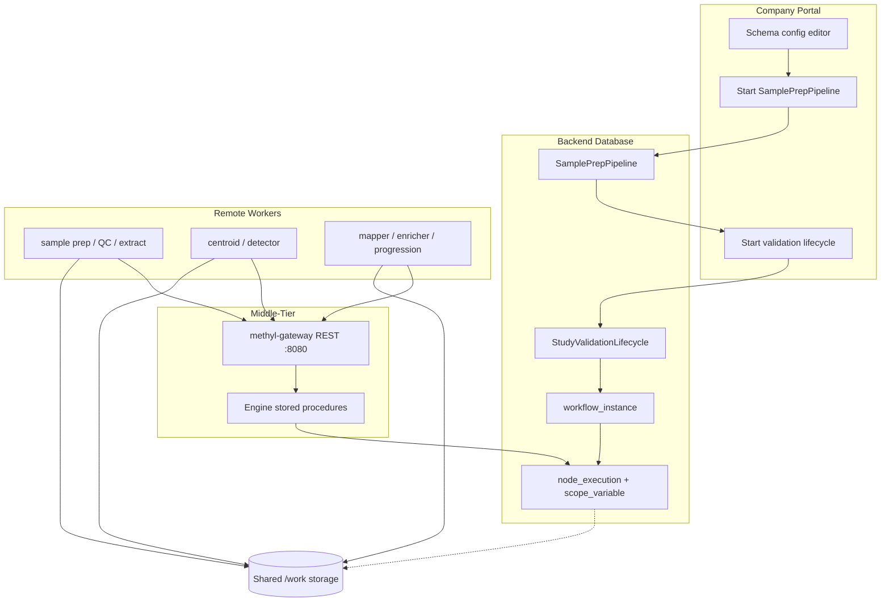

# Distributed Runtime

Four-layer architecture: company portal, workflow database, stateless middle-tier, and remote workers on shared storage.

| Layer | Technology | Responsibility |
|-------|------------|----------------|
| Portal | `methyl-config-editor` web | Edit study manifest against JSON Schema; start runs |
| Database | Azure SQL or PostgreSQL (`wf` schema) | Workflow tree, instances, executions, leases |
| Middle-tier | `methyl-gateway` (uvicorn) | Stateless HTTP; invokes engine procedures |
| Workers | `methyl-worker` + package CLIs | Poll tasks by capability; read/write shared paths |

Pre-rendered figure: [`../diagrams/out/distributed-runtime.svg`](../diagrams/out/distributed-runtime.svg)

**Deep dive:** [`workflow_engine/docs/pipeline_architecture.md`](../../workflow_engine/docs/pipeline_architecture.md) (Quarto HTML/PDF via `build_pipeline_architecture_qmd.py`).

**Worker protocol:** [`workers/WORKER_PROTOCOL.md`](../../workers/WORKER_PROTOCOL.md). **OpenAPI:** [`contracts/openapi.yaml`](../../contracts/openapi.yaml).
