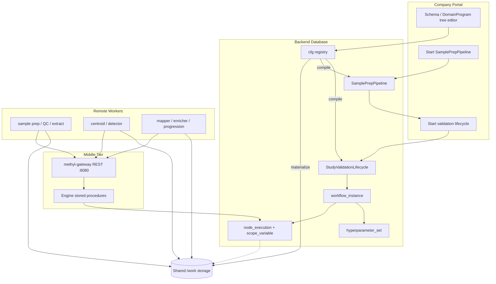

# Distributed Runtime

Four-layer architecture: company portal, workflow database, stateless middle-tier, and remote workers on shared storage.

| Layer | Technology | Responsibility |
|-------|------------|----------------|
| Portal | config editor + SQL portal API | Edit study/program/action config; start runs |
| Config registry | `cfg` schema + `methyl-cfg` (dev) / EpiPortal `portal.sp_*` (prod storage/credentials) | Sites, profiles, programs, studies, storage endpoints/credentials, assets |
| Database engine | Azure SQL or PostgreSQL (`wf`) | Workflow tree, instances, executions, leases |
| Middle-tier | `methyl-gateway` (uvicorn) | Stateless HTTP; worker claim/submit only |
| Workers | `methyl-worker` + package CLIs | Poll tasks by capability; read/write shared paths |

Optional pre-rendered figure (repo-only / Marp): `docs/diagrams/out/distributed-runtime.svg`.

**Deep dive:** [`workflow_engine/docs/pipeline_architecture.md`](../../workflow_engine/docs/pipeline_architecture.md) (Quarto HTML/PDF via `build_pipeline_architecture_qmd.py`).

**Worker protocol:** [`workers/WORKER_PROTOCOL.md`](../../workers/WORKER_PROTOCOL.md). **OpenAPI:** [`contracts/openapi.yaml`](../../contracts/openapi.yaml).
