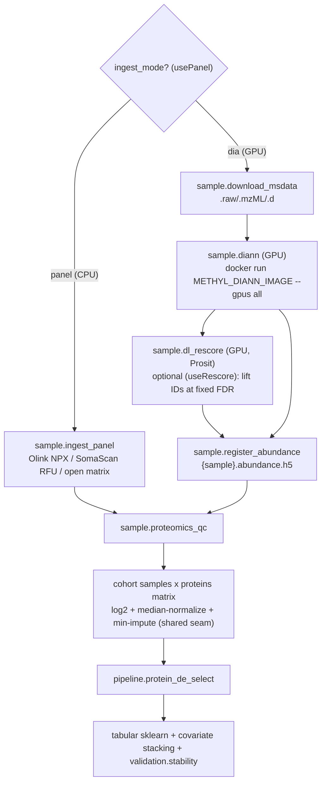

# Proteomics - end-to-end workflow

> **Per-process docs.** This document covers the **proteomics (mass-spec + affinity panel)** process pack. For DNA methylation see [end-to-end workflow](end-to-end-workflow.md); for RNA-Seq see [RNA-Seq](end-to-end-workflow-rnaseq.md). All packs share one control plane (DomainProgram, typed actions, scheduler, cfg/wf, CAAS); only the science layer differs.

**Audience:** operators and engineers running proteomics cohorts from raw MS data or vendor panel matrices through quantification, QC, a per-sample abundance contract, differential-abundance selection, and tabular classification.

**Selected by** `regulatory.primary_modality: proteomics`. Proteomics is **not** a Parabricks drop-in: the front of the pipeline is a mass-spec search engine (GPU DIA-NN) or a direct panel-matrix ingest; the back is the shared `samples x features` seam (also used by RNA-Seq).

**Sources of truth:** [`sample_prep_proteomics.program.json`](../../workflow_engine/domain/fixtures/sample_prep_proteomics.program.json), [`proteomics_study_lifecycle.program.json`](../../workflow_engine/domain/fixtures/proteomics_study_lifecycle.program.json), [`proteomics_research.profile.json`](../../workflow_engine/domain/profiles/proteomics_research.profile.json). Packages: `proteomics_features` (ingest + DE), `proteomics_qc`, shared `omics_features`. Operator guide: [Usage ch.22](../usage/22-proteomics-process-pack.qmd).

---

## 1. Big picture



Casanovo de novo (`sample.casanovo`, GPU) is available as a complementary/alternate ingest action for novel/variant peptides; it is not on the mainline sample-prep branch.

## 2. What is reused vs new

| Layer | Reused (already exists) | New for proteomics |
|-------|-------------------------|--------------------|
| Downstream modeling | `tabular_sklearn`, `covariate_preprocessor`, `ecdf_second_stage`, `validation.stability`, Monte Carlo orchestration | `feature_mode="proteomics_abundance"` |
| Feature seam | shared `omics_features` (per-sample HDF5 -> cohort matrix -> DE), also used by RNA-Seq | proteomics adapter (`proteomics_features`) |
| GPU dispatch | capability-gated GPU-Docker pattern, `--gpus all`, image env | DIA-NN / Prosit / Casanovo images (own envs) |
| Storage / QC-gate | `fastqSource`/`sampleDestination`, `${qcPass}` gate, cfg `reference_asset` (DL model weights) | MS-data ingest, panel ingest, proteomics QC, normalization/imputation |

Methylation-only steps (centroid/DMP/ECDF, Houseman/HiTIMED, bisulfite QC) do **not** apply.

## 3. Ingest modes

`actionConfig.proteomics_quant.ingest_mode` selects the path (`pipeline_profiles.py` derives `${usePanel}`); `rescore: true` adds Prosit (`${useRescore}`).

| Mode | Action(s) | GPU? | Output |
|------|-----------|------|--------|
| `dia` (default) | `sample.diann` (+ optional `sample.dl_rescore`) -> `sample.register_abundance` | Yes | DIA-NN `report.tsv` -> `abundance.h5` |
| `panel` | `sample.ingest_panel` | No (CPU) | Olink NPX / SomaScan RFU / open matrix -> `abundance.h5` |

`sample.diann` runs a DIA-NN container (`METHYL_DIANN_IMAGE`, `--gpus all`) against the site `proteomics_reference` (protein FASTA + optional spectral library; library-free with `--predictor` when no library). `sample.ingest_panel` reads a cohort panel matrix and writes the same per-sample contract - no MS search, no GPU.

## 4. Abundance contract + QC

`sample.register_abundance` (and `ingest_panel`) write `{sample}.abundance.h5` (`feature_id`, `value`) via the shared `omics_features` store - the RNA/proteomics-agnostic analogue of the methylation HDF5. `sample.proteomics_qc` (package `proteomics_qc`) gates on proteins identified and (with a configured panel size) missingness fraction; `guardrails.overall_pass` drives `${qcPass}`.

## 5. Study modeling

`proteomics_study_lifecycle` runs `pipeline.protein_de_select` per comparison: build the cohort `samples x proteins` matrix (log2 + median normalize + per-protein min imputation for the high, non-random missingness typical of proteomics), rank proteins by Welch differential abundance, train the shared tabular classifier (optionally stacking covariates), and emit a recurrence-friendly protein-panel CSV for `validation.stability`.

## 6. GPU / GH200

The DIA-NN / Prosit / Casanovo actions run on the same Lambda/Nebius GH200 nodes as Parabricks, gated by GPU + their image env (`METHYL_DIANN_IMAGE`, etc.). Because workers run host-native (no `--platform`), on Grace/Hopper (`aarch64`) these images must be linux/arm64 or multi-arch. See [gpu_worker_runbook.md](../deployment/gpu_worker_runbook.md#proteomics-gpu-tools-dia-nn--prosit--casanovo).

## 7. Operator run order

```bash
methyl-study-init --study-id my-prot-study --name Healthy_vs_Disease \
  --modality proteomics --binary --output-root /work/projects

# Sample prep (DIA by default; set proteomics_quant.ingest_mode=panel to switch)
methyl-workflow-run \
  --program workflow_engine/domain/fixtures/sample_prep_proteomics.program.json \
  --context '{"projectPath":".../configs/project_Healthy_vs_Disease.json","pipelineProfile":"proteomics_research"}'

# Study modeling
methyl-workflow-run \
  --program workflow_engine/domain/fixtures/proteomics_study_lifecycle.program.json \
  --context '{"projectPath":".../configs/project_Healthy_vs_Disease.json","pipelineProfile":"proteomics_research","proteinDeOutputDir":".../protein_de"}'
```

## 8. What this document is not

- Not an FDA submission or SaMD evidence package - see [`docs/regulatory/`](../regulatory/README.md).
- DDA/MSFragger is not included (commercial license; later addition).
