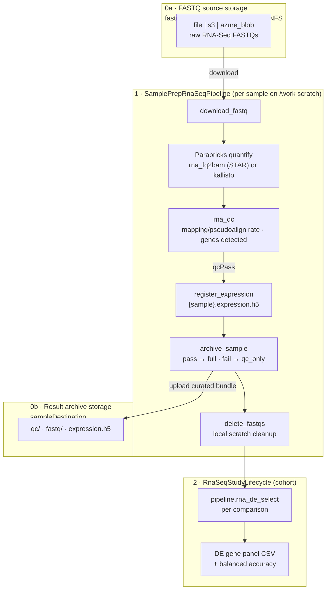
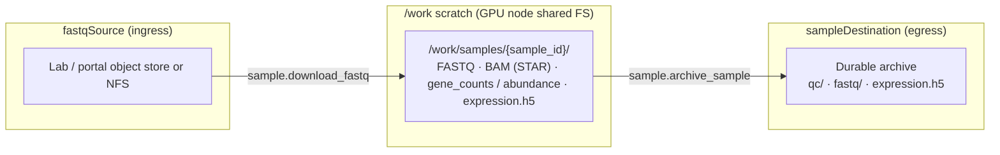
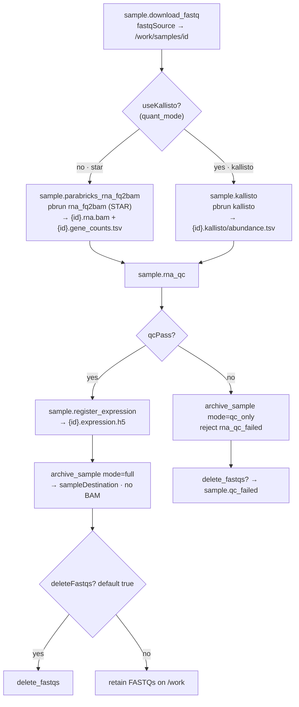
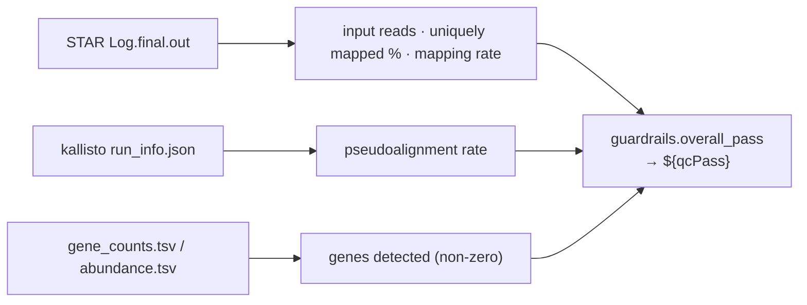
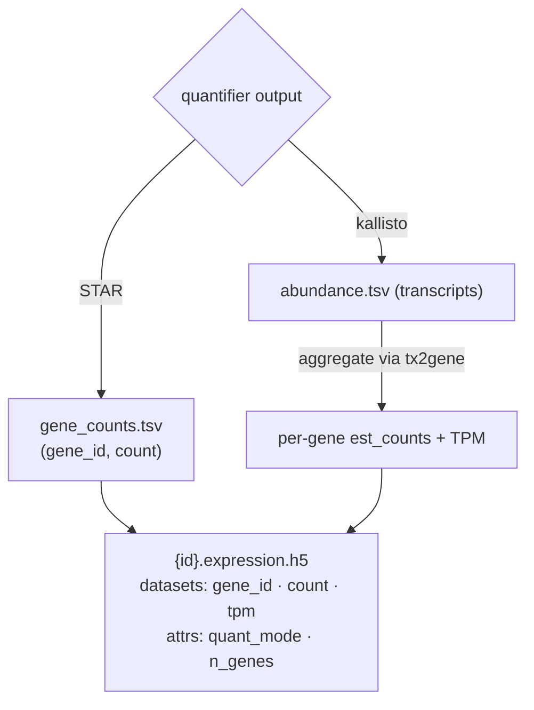
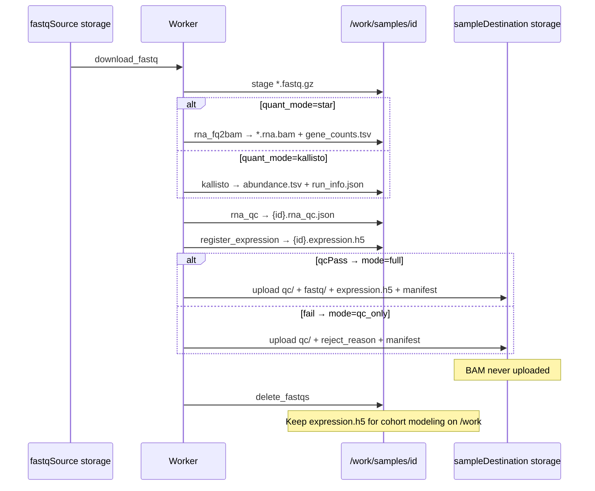
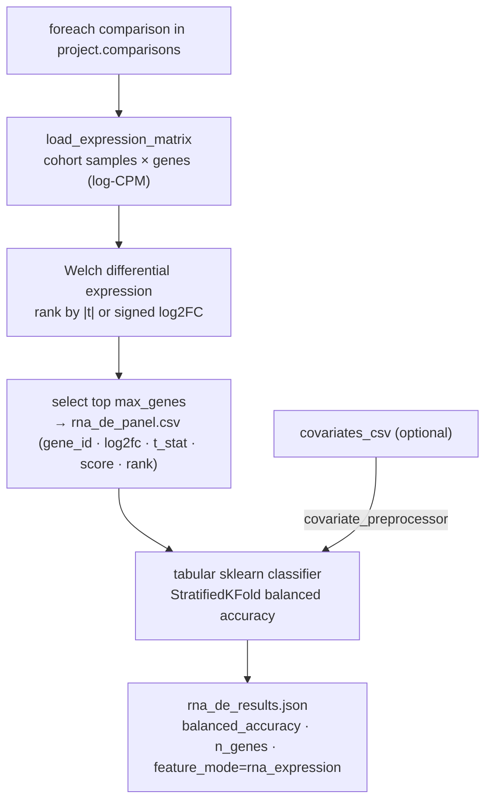
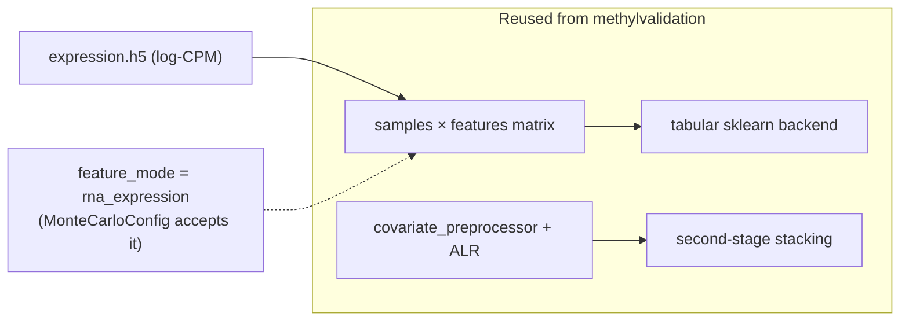
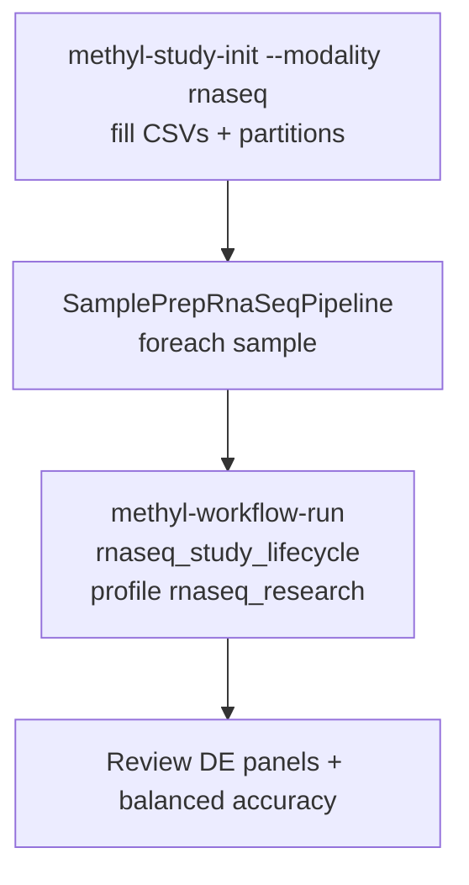
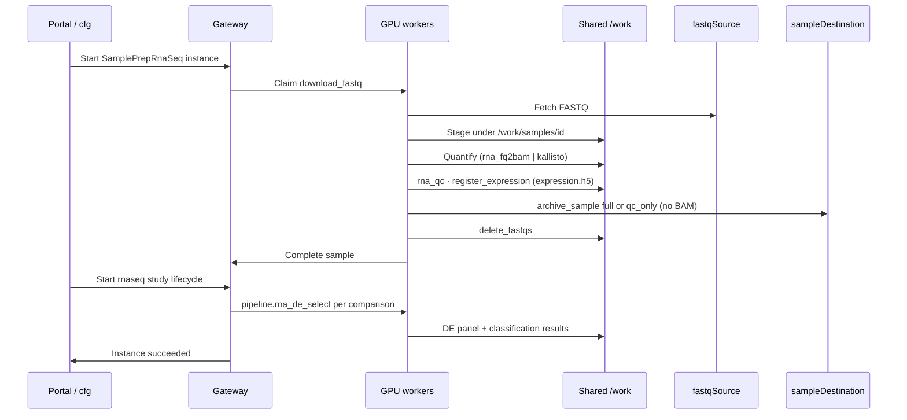

# RNA-Seq — end-to-end workflow

> **Per-process docs.** This document covers the **RNA-Seq (transcriptomics)** process pack. For DNA methylation see [end-to-end workflow](end-to-end-workflow.md). Both packs share one control plane (DomainProgram, typed actions, scheduler, cfg/wf, CAAS); only the science layer differs.

**Audience:** operators, statisticians, and engineers who need one clear picture from external RNA-Seq FASTQ ingest through quantification, RNA QC, the per-sample expression contract, differential-expression gene selection, and tabular classification.

**Selected by** `regulatory.primary_modality: rnaseq` in the study manifest. Modality is independent of `primary_analyte` (which is the DNA-methylation sample matrix).

**Sources of truth (programs / profile):**

| Phase | Artifact |
|-------|----------|
| Per-sample prep | [`sample_prep_rnaseq.program.json`](../../workflow_engine/domain/fixtures/sample_prep_rnaseq.program.json) |
| Study modeling | [`rnaseq_study_lifecycle.program.json`](../../workflow_engine/domain/fixtures/rnaseq_study_lifecycle.program.json) |
| Profile | [`rnaseq_research.profile.json`](../../workflow_engine/domain/profiles/rnaseq_research.profile.json) |
| Operator guide | [Usage ch.20 RNA-Seq process pack](../usage/20-rnaseq-process-pack.qmd) |

Packages: `rna_alignment_qc` (RNA QC), `rna_express` (expression contract + DE selection). Quantifier runners: `workers/methyl_worker/rna_fq2bam_runner.py`, `kallisto_runner.py`.

---

## 1. Big picture

Two DomainPrograms run in sequence, mirroring the methylation pack but swapping the science:

1. **SamplePrepRnaSeqPipeline** — one sample at a time (parallel across samples): download → quantify (STAR `rna_fq2bam` **or** `kallisto`) → RNA QC → register expression → archive.
2. **RnaSeqStudyLifecycle** — cohort-level: per-comparison differential-expression gene-panel selection + tabular classification (`pipeline.rna_de_select`).



**What is reused vs replaced (relative to methylation):**

| Reused as-is | Replaced for RNA-Seq |
|--------------|----------------------|
| DomainProgram / scheduler / CAAS / cfg-wf | `fq2bam_meth` / giraffe → `rna_fq2bam` / `kallisto` |
| Storage split (`fastqSource` / `sampleDestination`) | `methyl_extract` (HDF5 β) → `register_expression` (gene counts/TPM) |
| QC-gate pattern (`${qcPass}`) | bisulfite / CpG-coverage QC → RNA mapping / genes-detected QC |
| Tabular sklearn + covariate stacking (`covariate_preprocessor`, `ecdf_second_stage`) | centroid / detector / ECDF-on-β → Welch DE gene selection |
| Monte Carlo orchestration in `methylvalidation` | Houseman / HiTIMED cell deconvolution, info measures (dropped) |

---

## 2. Where data lives

Same two-endpoint model as methylation, with an RNA-specific reference bundle.



**Site reference bundle** (`rna_reference`, pinned once per cluster — see [`site_grch38.example.json`](../../workflow_engine/domain/profiles/site_grch38.example.json)):

| Key | Used by | Role |
|-----|---------|------|
| `star_index_dir` | `rna_fq2bam` | STAR genome index |
| `gtf` | `rna_fq2bam` | gene annotation for STAR counts |
| `kallisto_index` | `kallisto` | prebuilt transcriptome index (`.idx`) |
| `transcriptome_fasta` | index build | source for the kallisto index |
| `tx2gene` | `register_expression` | transcript→gene map to aggregate kallisto abundances |

Provision with [`scripts/download_rna_reference_grch38.sh`](../../scripts/download_rna_reference_grch38.sh). Reference resolution: `methyl_utils.action_config_resolver.resolve_rna_reference` + site slice for `rna_align` / `rna_qc`.

---

## 3. Sample prep — arrival to expression

### 3.1 Quantifier selection

The quantifier is chosen like the methylation linear/pangenome switch. Set `actionConfig.rna_align.quant_mode`; `pipeline_profiles.py` derives the `${useKallisto}` program flag (parallel to `${usePangenome}`).



**Quantifier outputs:**

| Quantifier | Action | Files |
|------------|--------|-------|
| STAR | `sample.parabricks_rna_fq2bam` | `{id}.rna.bam`, `{id}.gene_counts.tsv` (gene_id, count) |
| kallisto | `sample.kallisto` | `{id}.kallisto/abundance.tsv` (transcript est_counts + TPM), `run_info.json` |

### 3.2 RNA QC (gate)

`sample.rna_qc` (package `rna_alignment_qc`) parses whichever quantifier output is present and gates on RNA-relevant metrics — **not** bisulfite conversion or CpG coverage. Thresholds are operator-set under `actionConfig.rna_qc`.



### 3.3 Expression contract

`sample.register_expression` (package `rna_express`) normalizes the quantifier output into a canonical per-sample HDF5 so downstream cohort code is quantifier-agnostic.



Domain handle: [`expression_matrix_ref.schema.json`](../../schemas/domain/expression_matrix_ref.schema.json) (embedded in `rna_sample_ref.schema.json`), the RNA analogue of `methylation_matrix_ref`.

### 3.4 Per-sample artifact timeline



---

## 4. Study modeling — DE gene panel + classification

After enough samples pass prep, start `rnaseq_study_lifecycle` with `projectPath` pointing at the study manifest (groups, comparisons, holdout partitions) and `rnaDeOutputDir` in the instance context. It runs `pipeline.rna_de_select` per comparison.





- The gene-panel CSV uses a recurrence-friendly schema (one row per selected `gene_id`) so `validation.stability` aggregation can count gene recurrence across Monte Carlo runs, exactly as it counts DMP recurrence for methylation.
- Cell-type deconvolution (Houseman / HiTIMED) and read-level information measures are **methylation-only** and do not run for RNA-Seq. Covariate stacking (e.g. an externally supplied `cell_fractions.csv` or clinical covariates) still works via `covariate_preprocessor`.

---

## 5. Operator run order (canonical)



Example (production-style paths):

```bash
# 1) Sample prep (STAR by default; set quant_mode=kallisto in the profile to switch)
methyl-workflow-run \
  --program /work/epimethyl/current/runtime-bundle/domain/fixtures/sample_prep_rnaseq.program.json \
  --context '{"projectPath":"/work/projects/my-rna-study/configs/project_Healthy_vs_Disease.json","pipelineProfile":"rnaseq_research"}'

# 2) Study modeling
methyl-workflow-run \
  --program /work/epimethyl/current/runtime-bundle/domain/fixtures/rnaseq_study_lifecycle.program.json \
  --context '{"projectPath":"/work/projects/my-rna-study/configs/project_Healthy_vs_Disease.json","pipelineProfile":"rnaseq_research","rnaDeOutputDir":"/work/projects/my-rna-study/RnaSeq/rna_de"}' \
  --parallel-workers 1 -v
```

---

## 6. End-to-end swimlane (systems)



---

## 7. Checklist — “ready for modeling”

| Gate | Evidence |
|------|----------|
| Modality set | Study `regulatory.primary_modality: rnaseq` |
| Reference pinned | Site `rna_reference` (STAR index or kallisto index for the chosen `quant_mode`) |
| Samples registered | `/work/samples/{id}/{id}.expression.h5` present |
| RNA QC | `{id}.rna_qc.json` with `guardrails.overall_pass` |
| Study groups | Manifest comparisons match sample IDs |
| DE panels | `rna_de_panel.csv` + `rna_de_results.json` per comparison |

---

## 8. What this document is not

- Not an FDA submission or SaMD evidence package — see [`docs/regulatory/`](../regulatory/README.md).
- Not the methylation workflow — see [end-to-end workflow](end-to-end-workflow.md).
- Not the config-registry / credential runbook — see [config registry](config-registry.md) and [Usage ch.19](../usage/19-config-registry.qmd).

Operator detail: [Usage ch.20 RNA-Seq process pack](../usage/20-rnaseq-process-pack.qmd). Plan: [`docs/plans/rna-seq-process-pack.plan.md`](../plans/rna-seq-process-pack.plan.md).
