# MethylPipeline end-to-end workflow

**Audience:** operators, statisticians, and engineers who need one clear picture from external sample ingest through Monte Carlo stability, cell deconvolution, information-theoretic covariates, model training, and holdout validation.

**Sources of truth (programs):**

| Phase | DomainProgram |
|-------|----------------|
| Per-sample prep | [`workflow_engine/domain/fixtures/sample_prep.program.json`](../../workflow_engine/domain/fixtures/sample_prep.program.json) |
| Study MC → freeze → model | [`full_lifecycle.program.json`](../../workflow_engine/domain/fixtures/full_lifecycle.program.json) / [`study_validation_lifecycle.program.json`](../../workflow_engine/domain/fixtures/study_validation_lifecycle.program.json) |
| SaMD profile ladder | [`docs/usage/18-samd-study-lifecycle.qmd`](../usage/18-samd-study-lifecycle.qmd) |

Related stage chapters: [ch.03 Sample prep](../usage/03-sample-prep-and-qc.qmd) · [ch.05 Stability](../usage/05-stage-stability.qmd) · [ch.06 Freeze](../usage/06-stage-freeze.qmd) · [ch.07 Model](../usage/07-stage-model.qmd) · [ch.08 Post-model](../usage/08-stage-post-model-validation.qmd).

---

## 1. Big picture

Two DomainPrograms run in sequence for a typical study:

1. **SamplePrepPipeline** — one sample at a time (parallel across samples): download → align → QC → optional trim/realign → extract → archive.
2. **Study validation lifecycle** — cohort-level: Monte Carlo centroid/detector iterations → stability → freeze panel → mapper / derived measures / **CellDeconv** / **info measures** → enricher → model selection → holdout / post-model validation.

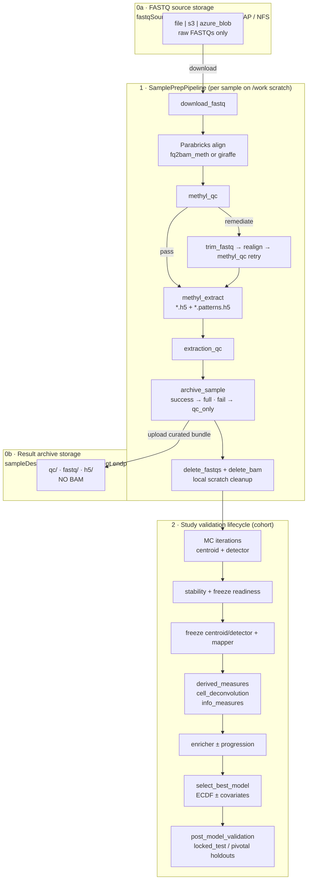

**Storage split:** ingress (`fastqSource`) and egress (`sampleDestination`) are independent typed locations in the `cfg` registry. They may be the same bucket/prefix or two different accounts; BAM stays on `/work` only and is deleted after archive — it is never part of the remote archive bundle.

**Local FASTQ cleanup:** `sample.delete_fastqs` runs after archive/terminal QC when scope `deleteFastqs` is true (**default**). Set instance `deleteFastqs: false` or profile `actionConfig.sample_prep.delete_fastqs: false` to keep FASTQs under `/work/samples/{id}/` (BAM deletion is unchanged).
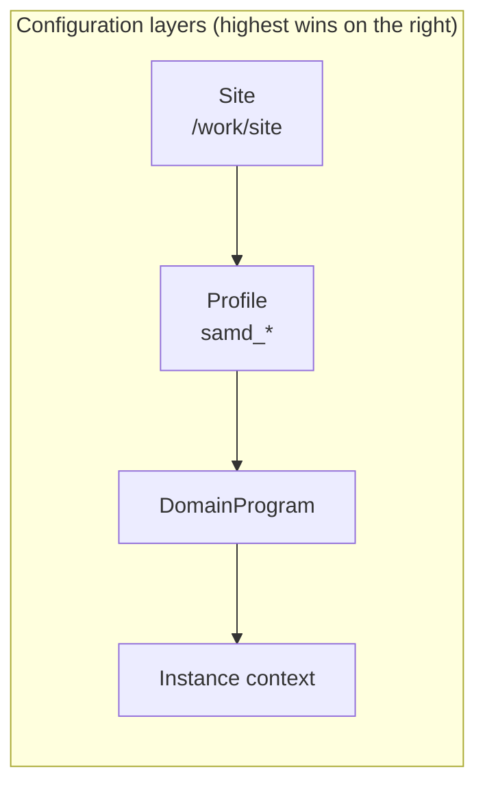

Study science lives under `/work/projects/<study>/`; sample archives under `/work/samples/{sample_id}/`. Credentials stay in the `cfg` registry — never under project trees.

---

## 2. Where data lives

SamplePrep uses **two storage endpoints** plus a local scratch tree:

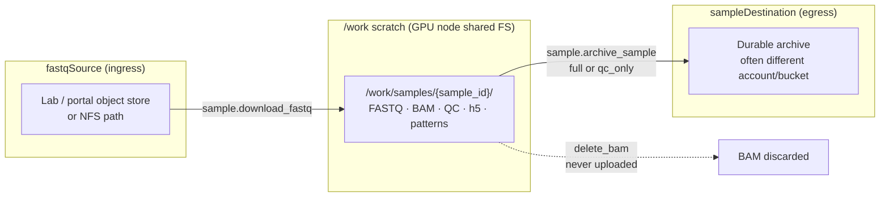

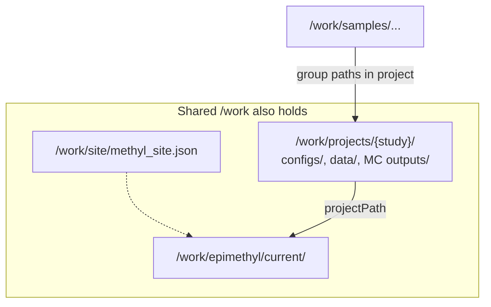

| Location | Config key | Role |
|----------|------------|------|
| FASTQ source | `fastqSource` on download task / study sample mapping | Read-only ingress (`file` / `s3` / `azure_blob`) |
| Local scratch | `/work/samples/{id}/` | Align, QC, extract; BAM is **transient** |
| Result archive | `sampleDestination` (alias `sampleStorage` / deprecated `h5Destination`) | Durable egress after success **or** terminal failure |
| Study outputs | `/work/projects/{study}/…` | MC, freeze, covariates, models |

If `sampleDestination` is unset, archive is skipped (`skipReason: sample_destination_not_configured`); local `/work` files remain for analysis. Details: [sample-preparation-flow — storage topology](../implementation/sample-preparation-flow.md#storage-topology-sample-sources-and-result-archival).

### Archive bundle (no BAM)

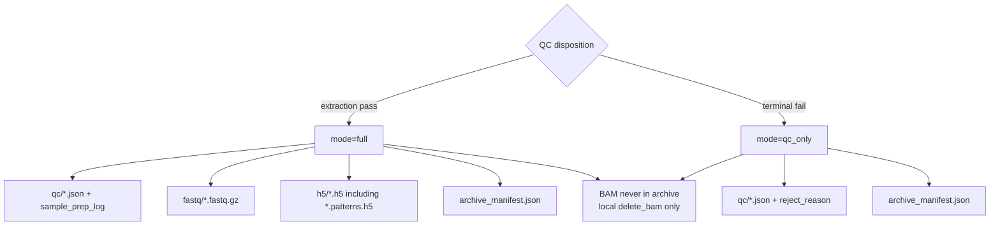

---

## 3. Sample prep — arrival to extract

### 3.1 Happy path

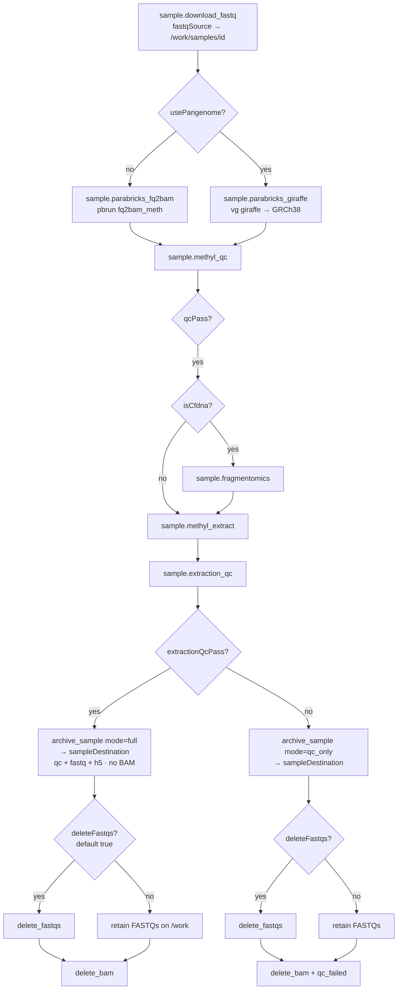

**Extract outputs** (read-level enabled by default on SaMD/research profiles):

| File | Content |
|------|---------|
| `{chrom}-{ctx}.h5` | Marginal per-CpG counts (`mC`, `uC`, coverage) |
| `{chrom}-{ctx}.patterns.h5` | Read-level co-methylation tile histograms (MethylInfoTheory input) |

If patterns are missing, extract warns and continues; later `pipeline.info_measures` skips without failing the study.

### 3.2 Alignment QC fail → trim → realign → retry

FASTQs are **kept** until QC is fully resolved so remediation can trim and realign.

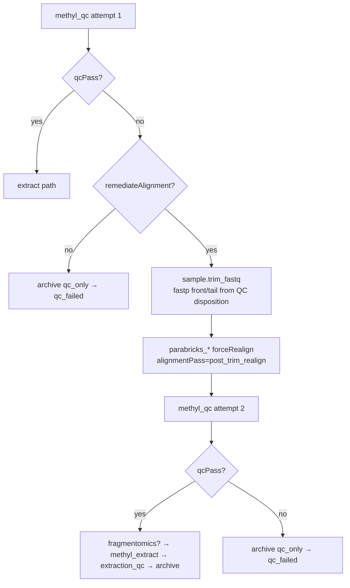

Typical remediation trigger: Read-2 start low quality (`READ2_START_LOW_QUALITY`) → `trimFront2` / related trim knobs from the QC screening report.

### 3.3 Per-sample artifact timeline

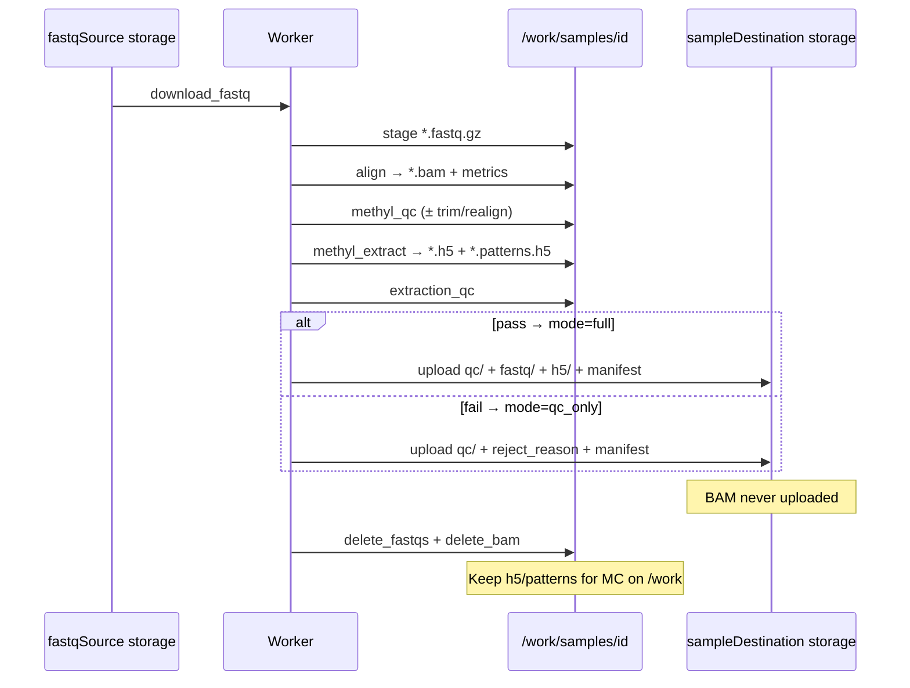

---

## 4. Study lifecycle — Monte Carlo to freeze

After enough samples pass prep, start the study program with `projectPath` pointing at the study manifest (groups, chromosomes, contexts, comparisons, holdout partitions).

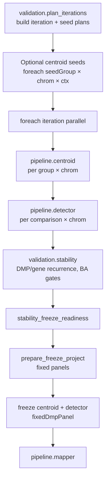

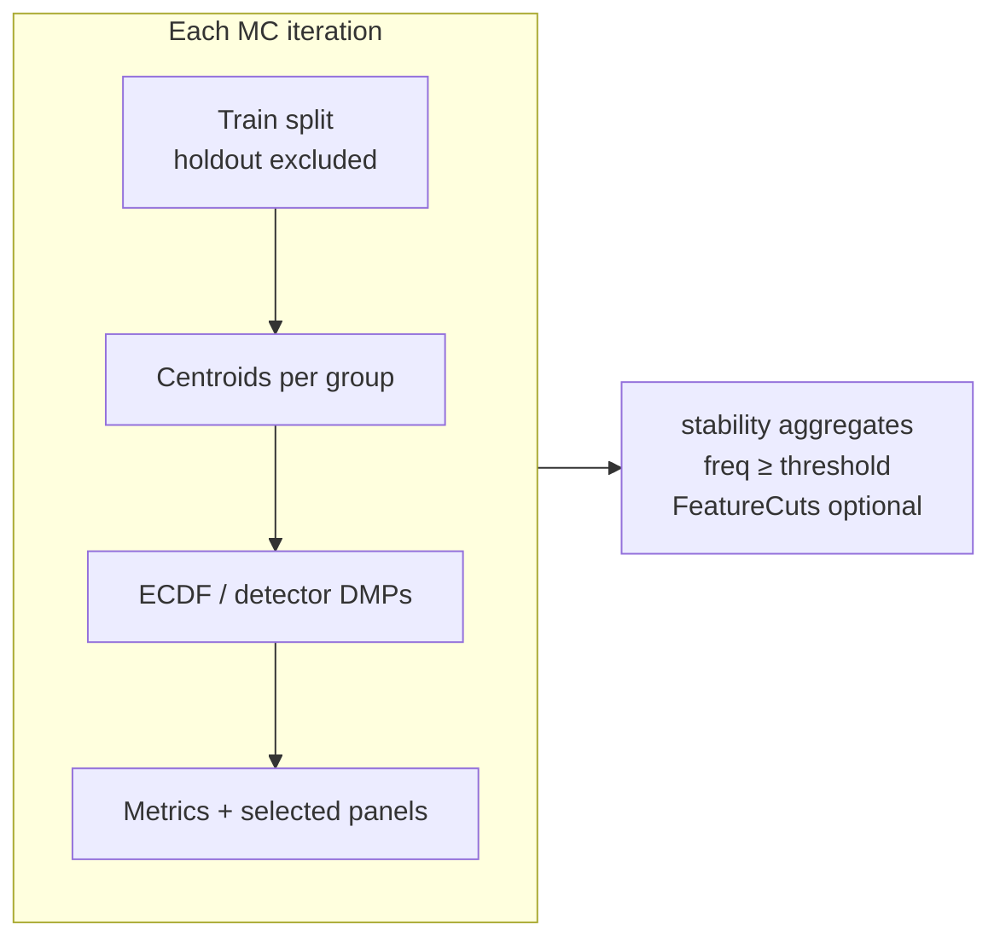

Holdouts configured in the study manifest (`validation_partitions.locked_test`, later `pivotal_validation`) are **excluded from training** when the profile sets `holdout_exclude_from_training: true` (SaMD profiles).

---

## 5. Cohort covariates after freeze

These nodes run **after** freeze mapper work and **before** final model selection. They enrich each sample with biology that ECDF alone does not see.

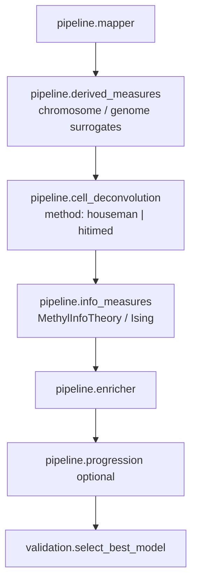

### 5.1 Cell deconvolution (Ω)

`pipeline.cell_deconvolution` exposes a `method` switch: **`houseman`** (default; one flat constrained projection against the FlowSorted/IDOL 6-cell blood basis) or **`hitimed`** (an analyte-driven hierarchical tree that reuses the same `houseman_qp` at every node). Both share one output contract, so downstream profiles do not change.

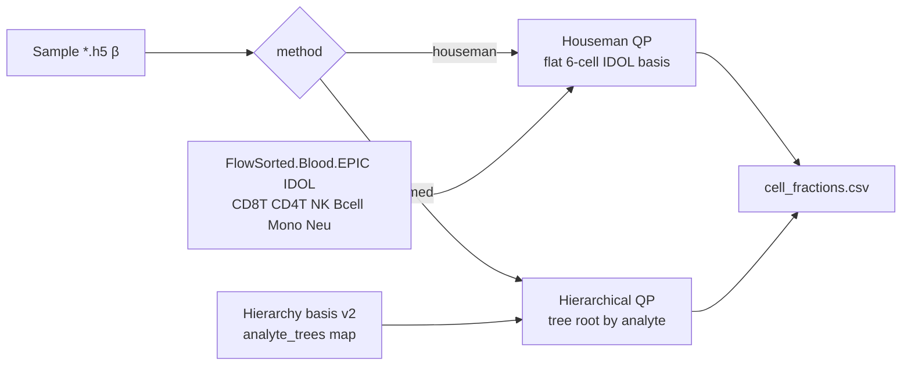

Houseman writes the 6 immune fractions (`CD8T CD4T NK Bcell Mono Neu`). HiTIMED picks the tree **root from the sample analyte** (`analyte` config field, defaulting to the study `regulatory.primary_analyte`) via the basis `analyte_trees` map, then multiplies node QP weights down each path so the collected leaf columns sum to 1:

| Analyte | Tree root | Leaf columns |
|---------|-----------|--------------|
| `buffy_coat` | immune subtree | immune leaves only (no tumor compartment) |
| `cfdna` | plasma top split | `tumor_fraction` + immune leaves (ctDNA burden as a covariate) |
| `tissue` | full tumor/immune/stromal tree | tumor + immune + stromal leaves |

- Written under `{output_base}/cell_fractions/cell_fractions.csv`; `cell_fractions.manifest.json` records `method` and, for HiTIMED, `analyte` and `tree_root`.
- Same column contract as Houseman for the ECDF/tabular `covariates_path`; HiTIMED only grows the column set (e.g. cfDNA `tumor_fraction`).
- Listed on profile `covariates_path` for tabular / ECDF second-stage.
- Auto-infer **excludes** `group` / `qp_status` (label leakage guard).
- Theory: [ch.07a MethylDeconv](../theory/chapters/07a-methyldeconv.qmd). Plan: [`docs/plans/hitimed-hierarchical-deconvolution.plan.md`](../plans/hitimed-hierarchical-deconvolution.plan.md).

### 5.2 Information measures (read-level)

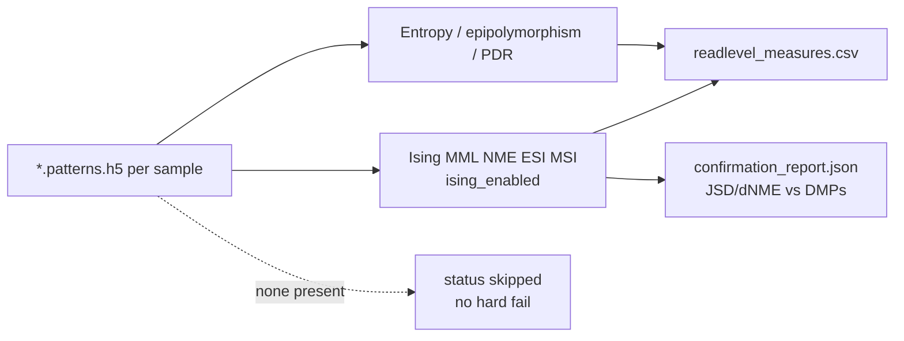

### 5.3 How covariates reach the model

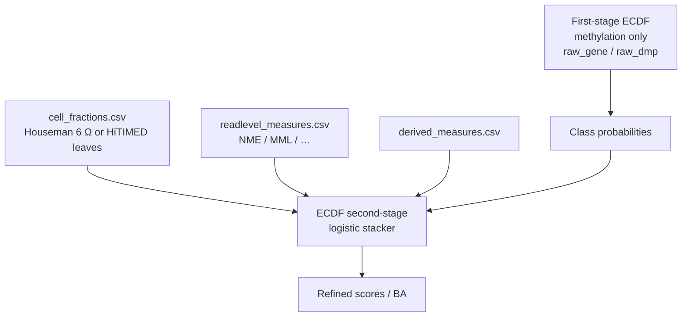

Profiles such as `samd_research` merge those CSV paths under `backend_profiles.ecdf.params.covariates_path`. Missing files in the list are skipped with a warning so studies can proceed before full re-extract.

---

## 6. Model selection and holdout validation

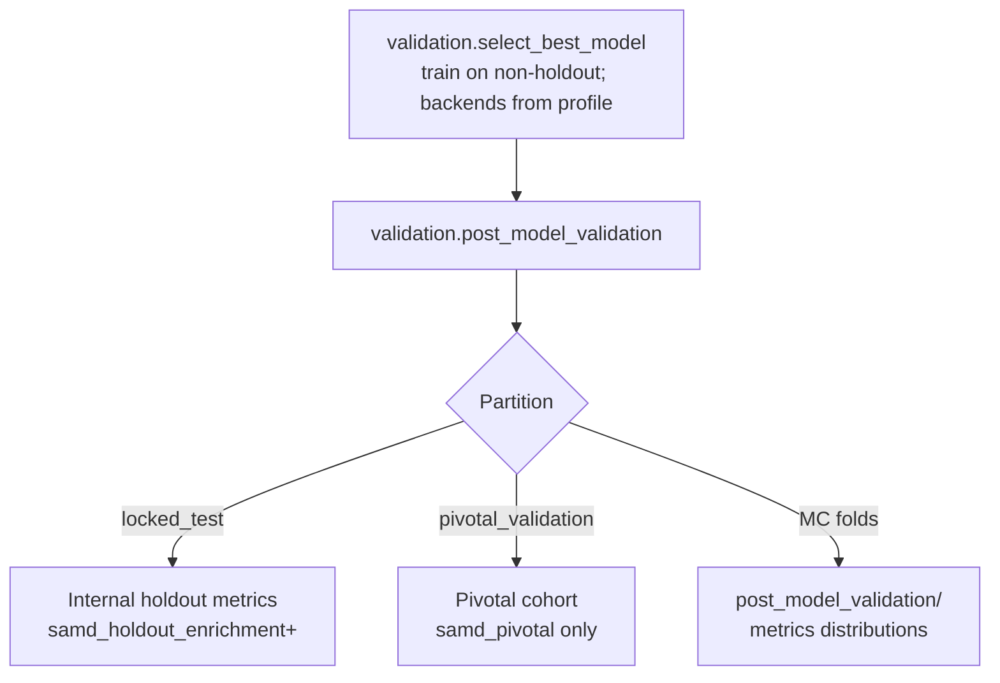

### SaMD ladder (claim-oriented studies)

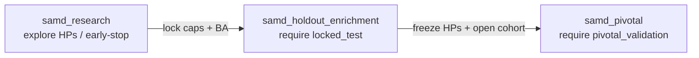

| Partition | When | Rule |
|-----------|------|------|
| `locked_test` | Research recommended; enrichment required | Never trained; evaluate after lock |
| `pivotal_validation` | Pivotal only | Never used in research/enrichment training |
| Independence keys | Always | Same `patient_id` cannot sit in train and holdout |

Clinical performance claims are blocked until `regulatory.stage = pivotal_validation`.

---

## 7. Operator run order (canonical)

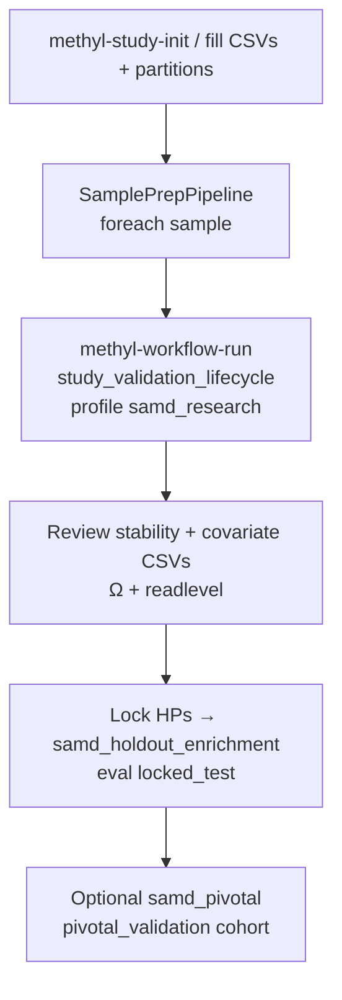

Example (production-style paths):

```bash
# 1) Sample prep (gateway or local engine)
methyl-workflow-run \
  --program /work/epimethyl/current/runtime-bundle/domain/fixtures/sample_prep.program.json \
  --context '{"projectPath":"/work/projects/my-study/configs/project_Healthy_vs_Disease.json"}'

# 2) Study lifecycle
methyl-workflow-run \
  --program /work/epimethyl/current/runtime-bundle/domain/fixtures/study_validation_lifecycle.program.json \
  --context '{"projectPath":"/work/projects/my-study/configs/project_Healthy_vs_Disease.json","pipelineProfile":"samd_research"}' \
  --parallel-workers 1 -v
```

---

## 8. End-to-end swimlane (systems)

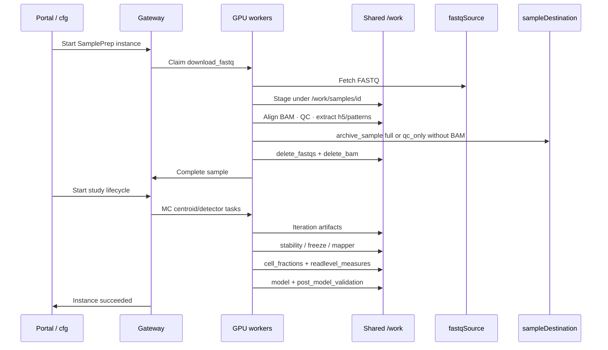

---

## 9. Checklist — “ready for holdout validation”

| Gate | Evidence |
|------|----------|
| Samples archived | `/work/samples/{id}/*-CG.h5` present; BAM optional after delete |
| Patterns (preferred) | `*.patterns.h5` or info_measures skipped cleanly |
| Study groups | Manifest groups match sample IDs |
| Holdouts | `locked_test` non-empty before enrichment claims |
| MC stability | Freeze readiness passed for profile BA/freq gates |
| Ω CSV | `cell_fractions/cell_fractions.csv` with six columns |
| Info CSV | `info_measures/readlevel_measures.csv` when patterns exist |
| Model | `select_best_model` artifacts; ECDF ± second-stage covariates |
| Holdout metrics | `post_model_validation/` (and partition-specific eval as configured) |

---

## 10. What this document is not

- Not an FDA submission or SaMD evidence package — see [`docs/regulatory/`](../regulatory/README.md).
- Not a substitute for package THEORY/USAGE docs (centroid math, ECDF details, Ising formulas).
- Not the storage-credential runbook — see [config registry](config-registry.md) and [Usage ch.19](../usage/19-config-registry.qmd).

For a shorter stage DAG only, see [pipeline-stages.md](pipeline-stages.md). For SamplePrep QC dispositions, see [Usage ch.03](../usage/03-sample-prep-and-qc.qmd).
