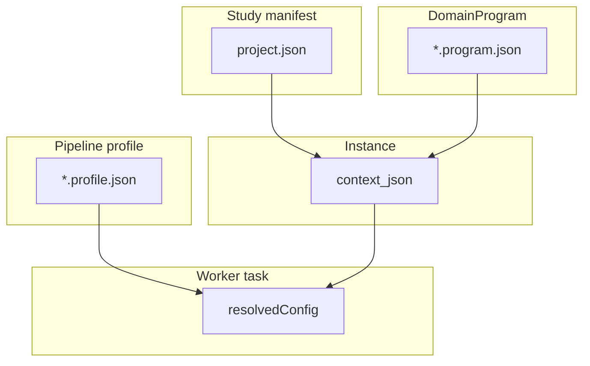

# Layer Model

Study configuration is split across layers so pipeline structure stays in version-controlled DomainPrograms while study-specific cohorts and paths live on shared storage.

| Layer | Artifact | Role |
|-------|----------|------|
| Study manifest | `project.json` / `ProjectConfig` | Cohorts, sample paths, chromosomes, comparisons, stages, `regulatory`, `validation_partitions` |
| Site manifest | `/work/site/methyl_site.json` | Genomes, GTF, caches, cluster defaults |
| Pipeline profile | `*.profile.json` | Reusable `actionConfig` packs + scope booleans |
| Workflow IR | `*.program.json` / `DomainProgram` | `for`, `if`, `parallel`, `do` — pipeline structure |
| Deploy spec | `compiled_workflow.json` | Nodes, edges, templates, bindings for engine |
| Instance | `context_json` | `projectPath`, `pipelineProfile`, `samples[]`, … |
| Task input | `resolvedConfig` | Merged action parameters at worker claim time |
| Execution | Action catalog + `methyl_worker.handlers` | CLI / in-process dispatch |
| Orchestration | DB engine + gateway **or** `LocalWorkflowEngine` | Graph scheduling |

**Storage rule:** DomainPrograms, profiles, and schemas live in the **git repository**. Study manifests (`project_*.json`), sample CSVs, and run artifacts live on **`/work/<disease>/`**.

Parameter precedence (highest wins): instance override → program `with` / `stepOverride` → profile `actionConfig` → analyte defaults → site manifest → *(no Python fallback for tunable science knobs)*. Code **resolves and validates** merged config; it must not inject operational defaults when config is missing (see [`config-not-code`](../../.cursor/rules/config-not-code.mdc)). Non-tunable structural constants (paths, storage keys) may still live in code.

Pre-rendered figure: [`../diagrams/out/layer-model.svg`](../diagrams/out/layer-model.svg)

See also [orchestration-paths.md](orchestration-paths.md) and [simplify-study-config plan](../plans/simplify-study-config.plan.md).
