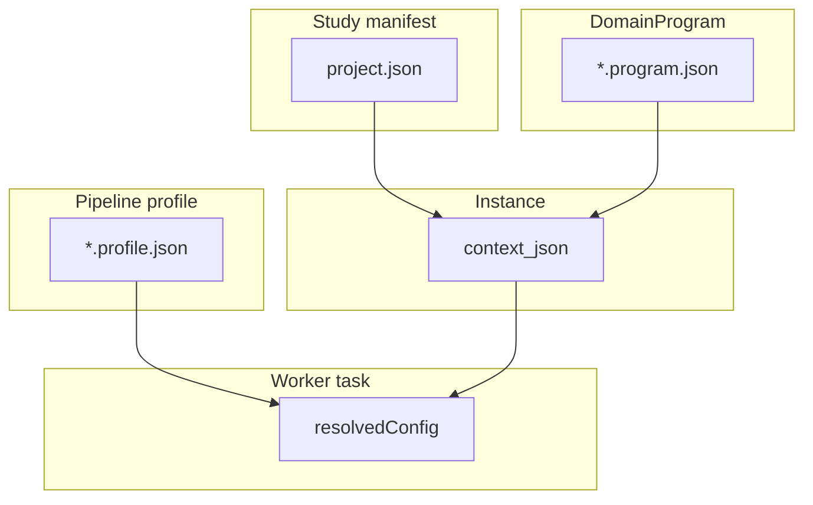

# Layer Model

Study configuration is split across layers so pipeline structure stays in version-controlled DomainPrograms while study-specific cohorts and paths live on shared storage.

| Layer | Artifact | Role |
|-------|----------|------|
| Study manifest | `project.json` / `ProjectConfig` | Cohorts, sample paths, chromosomes, comparisons, stages, `regulatory`, `validation_partitions` |
| Site manifest | `/work/site/methyl_site.json` | Genomes, GTF, caches, cluster defaults |
| Pipeline profile | `*.profile.json` | Reusable `actionConfig` packs + scope booleans |
| Workflow IR | `*.program.json` / `DomainProgram` | `for`, `if`, `parallel`, `do` — pipeline structure |
| Deploy spec | `compiled_workflow.json` | Nodes, edges, templates, bindings for engine |
| Instance | `context_json` | `projectPath`, `pipelineProfile`, `samples[]`, …; optional `hyperparamSetId` (hash of merged `resolvedConfig__*` slices) labels one config combination for CAAS cross-instance reuse — see [Usage ch.17](../usage/17-content-addressed-action-store.qmd) |
| Task input | `resolvedConfig` | Merged action parameters baked at instance configuration (`resolvedConfig__*` scope vars) |
| Task input | `resolvedProject` | Optional materialized study paths/cohorts from `context.resolve_project` |
| Execution | Action catalog + `methyl_worker.handlers` | CLI / in-process dispatch |
| Orchestration | DB engine + agnostic gateway **or** `LocalWorkflowEngine` | Graph scheduling; gateway does not resolve config at claim |

**Storage rule:** The **`cfg` registry** (database) is the source of truth for DomainPrograms, pipeline profiles, sites, studies, storage endpoints/credentials, and reference assets. Shared storage **`/work`** is a **materialization** of published non-secret objects for workers. Git keeps code, JSON Schema contracts, and CI fixtures. See [config-registry.md](config-registry.md). Study sample CSVs and run artifacts still live on `/work/projects/<study>/`.

Parameter precedence (highest wins): instance override → program `with` / `stepOverride` → profile `actionConfig` → analyte defaults → site manifest → *(no Python fallback for tunable science knobs)*. Code **resolves and validates** merged config; it must not inject operational defaults when config is missing (see [`config-not-code`](../../.cursor/rules/config-not-code.mdc)). Non-tunable structural constants (paths, storage keys) may still live in code.

Pre-rendered figure: [`../diagrams/out/layer-model.svg`](../diagrams/out/layer-model.svg)

See also [orchestration-paths.md](orchestration-paths.md) and [simplify-study-config plan](../plans/simplify-study-config.plan.md).
