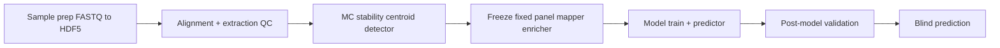

# Pipeline Stages

End-to-end study lifecycle from sample ingest through blind prediction.

**Detailed Mermaid walkthrough (ingest → holdouts):** [`end-to-end-workflow.md`](end-to-end-workflow.md)

| Stage | Usage chapter | Primary packages |
|-------|---------------|------------------|
| Sample prep | [ch.03](../usage/03-sample-prep-and-qc.qmd) | workers, `methylalignmentqc`, native-Mojo methylGrapher (pangenome_wgbs) or explicit Parabricks/extract |
| Stability | [ch.05](../usage/05-stage-stability.qmd) | `methylcentroid`, `methyldetector`, `methylvalidation` |
| Freeze | [ch.06](../usage/06-stage-freeze.qmd) | + `methylmapper`, `methylenricher`, optional `methyldiseaseprogression` |
| Model | [ch.07](../usage/07-stage-model.qmd) | `methylclassifier`, `methylpredictor` |
| Post-model validation | [ch.08](../usage/08-stage-post-model-validation.qmd) | `methylvalidation` |
| Blind prediction | [ch.09](../usage/09-stage-blind-prediction.qmd) | `methylpredictor` |

Pre-rendered figure: [`../diagrams/out/pipeline-stages.svg`](../diagrams/out/pipeline-stages.svg)

**Example study diagram pack:** [`WORKFLOW_DIAGRAM_PACK_Healthy_vs_PCa1-4-CG.md`](../WORKFLOW_DIAGRAM_PACK_Healthy_vs_PCa1-4-CG.md)

**Theory:** [two workflows](../theory/chapters/12-two-workflows.qmd), [model creation theory](../theory/chapters/15-model-creation-and-validation.qmd).
