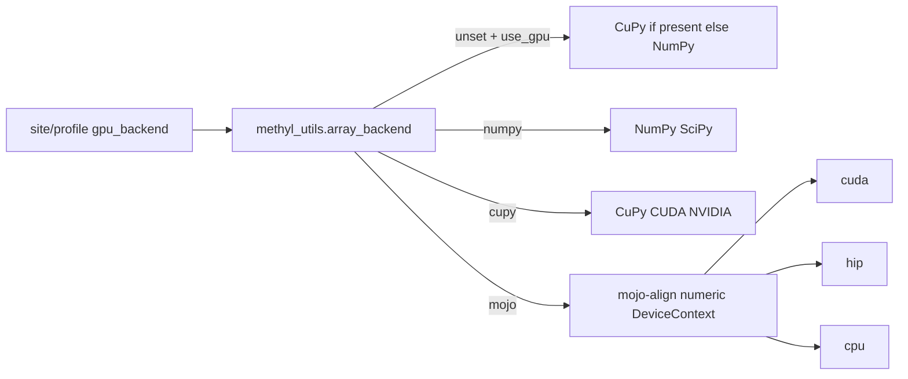

# Portable GPU numeric backend

How post-align science compute picks an array backend. Alignment DeviceContext (mojo-align Giraffe / fq2bam-meth) is a **different** stack — see [alignment-engines.md](../usage/alignment-engines.md) and [sample-prep-tooling.md](sample-prep-tooling.md).

Plan: [portable-gpu-numeric-backend.plan.md](../plans/portable-gpu-numeric-backend.plan.md).

## Operator knobs

| Knob | Where | Meaning |
|------|--------|---------|
| `use_gpu` | Existing centroid / info_measures / cell_deconv config | Prefer an accelerator when the selected backend can use one |
| `gpu_backend` | `actionConfig` / centroid config (`default=None`) | `numpy` \| `cupy` \| `mojo`. **Unset** keeps today’s CuPy-or-NumPy auto |
| `METHYL_DISABLE_GPU` | Host env | Force NumPy for auto and CuPy paths |

Do not encode a Python default backend. Site/profile set `gpu_backend` when they want Mojo or an explicit CuPy pin:

```json
"actionConfig": {
  "centroid": {
    "use_gpu": true,
    "gpu_backend": "mojo"
  }
}
```

Unset `gpu_backend` keeps today’s CuPy-or-NumPy auto. `gpu_backend=cupy` stays the native NVIDIA option.



When `gpu_backend=mojo` and a known GPU is required, DeviceContext failure is **fail-closed**. The runtime does **not** silently switch to CuPy.

## Inventory

### Real compute (methylutils first)

| Hot path | File | Ops | GPU today | Mojo |
|----------|------|-----|-----------|------|
| **Centroid stream build** | `methyl_utils/core/centroid_builder.py` | Position merge, scatter-add, bin histogram, sufficient stats | Optional CuPy | **This Feature** — `numeric/` kernels |
| **Beta distances** | `metrics_core.py`, `gpu_utils.py` | JS/KL/Hellinger + digamma/betaln | Optional CuPy | Later (special functions) |
| **ECDF / ranks** | `statistical_tests.py`, `array_backend.py` | Mann–Whitney, Bhattacharyya, CDF interp | Optional; parity tests exist | Follow-on |
| **Centroid pair** | `methyl_centroid_pair.py` | Calls ECDF/rank stats | Optional | Follows ECDF |
| **Ising MLE** | methylinfotheory via `get_array_module` | `einsum`, `linalg.solve` | Optional | Later (batched solver) |
| **MethylFrame GPU tables** | `core/methyl_frame.py` | cuDF + CuPy bit-decode | CuPy **and** cuDF | Do not port |
| **EAT / beta_log_pdf** | `transformations.py`, `beta_analytics.py` | Light array + SciPy special | Optional / incomplete | After special functions |

### Telemetry (keep NVIDIA helpers)

- `gpu_detection.py`, `memory_manager.py`, `performance_profiler.py`
- MethylCentroid VRAM probes (`cupy.cuda.runtime.memGetInfo`)
- methyldetector `GPUConfig` (duplicate of `get_special_backend`)
- Worker `cleanup_gpu_memory()` after actions

Mojo path reuses mojo-align `gpu-common/python/gpu_mem.py` (`nvidia-smi` / `rocm-smi`) instead of NVML.

### Not this stack

- Clara Parabricks (`pbrun`) — vendor Docker
- Align DeviceContext — already portable
- Trainium / TPU image tags — no Neuron/XLA path in mojo-align yet

### Downstream callers

| Package | GPU use |
|---------|---------|
| methylcentroid | Numeric work in `MethylCentroidBuilder`; local CuPy is memory only |
| methyldetector | `MethylCentroidPair` + cleanup |
| methylcluster | `metrics_factory.compute_distance(use_gpu=)` |
| methylinfotheory | Ising on `xp` |
| methyldeconv | `get_cupy()` touch; QP is SciPy CPU |
| methylpredictor | Row-normalize |
| methylclassifier | No GPU path |

## Feasibility

**Possible, with a split.** This Feature ports the centroid stream (merge, scatter-add, histogram). CuPy remains first-class (`gpu_backend=cupy`). Detector/cluster distances stay on CuPy or CPU until special functions and ECDF kernels exist in Mojo.

mojo-align `gpu-common` supplies device select, HBM preflight, and k-mer seeds. Centroid math is new kernels under `numeric/`.
