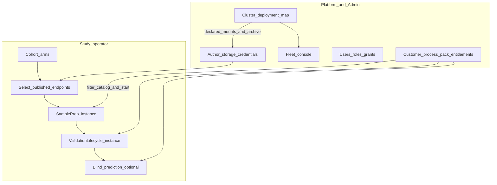
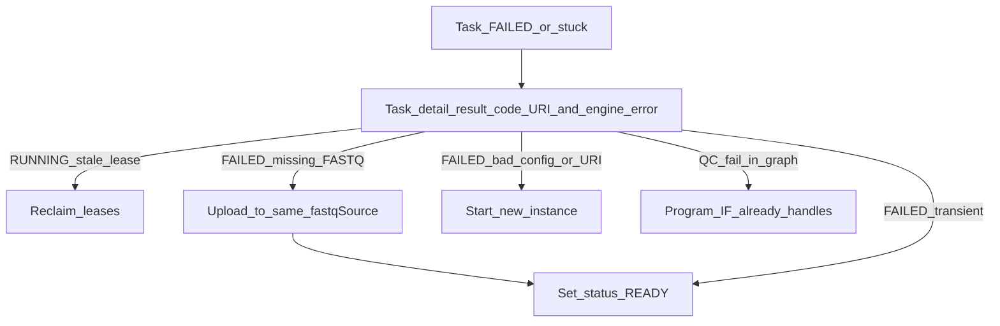

# EpiPortal information architecture

Operator-facing UI for the full pipeline (cohort → sample prep → study lifecycle →
prediction), plus **Platform** (system administrator: clusters, workers,
deployment) and **Admin** (RBAC) / **Contracts** (process-pack entitlements).
EpiPortal (`portal.epimethyl.com`) is the day-2 control plane; this repo owns
**SQL contracts** (`portal.sp_`*) and domain identity — not the Delphi/uniGUI app.

**Companion:** [Portal remote control](portal-remote-control.md) (UI→DB vs
workers→gateway; HPO grids). **Fleet control:** [Constrained worker ops](constrained-worker-ops-actions.md).
**Config layers:** [Layer model](layer-model.md), [Config registry](config-registry.md).
**Science stages:** [Pipeline stages](pipeline-stages.md), [End-to-end workflow](end-to-end-workflow.md),
[Portal staged study lifecycle](../../workflow_engine/docs/portal_study_lifecycle.md).
**Cluster deployment:** [Production platform](../deployment/production-platform.md)
(Phase 0 `/work` layout), [QNAP inventory](../deployment/reference-inventory-qnap.md),
[Distributed runtime](distributed-runtime.md).
**Retry / leases:** [Workflow idempotency](workflow-idempotency-retry-lease.md),
[Usage ch.11](../usage/11-troubleshooting-and-recovery.md).
**Plan:** [portal-pipeline-ia](../plans/portal-pipeline-ia.plan.md),
[portal-ui-sql-actions](../plans/portal-ui-sql-actions.plan.md).

## Guiding contracts

1. A **workflow run** is a `wf.workflow_instance` of a **published**
  `wf.workflow_version` (compiled from a DomainProgram). **Study operators
   and study leads never modify a workflow.** They start instances of a
   published version, set study overlays, and recover runs. **Program
   author** (or **platform admin**) drafts, saves, and publishes the graph.
2. Organize the UI around the **operator pipeline**, **system-administrator
  cluster/deployment**, and **admin RBAC/contracts** — not around schema
   names. Hide nav the role cannot use (no disabled tease).
3. **Project manifests** (`project_*.json`) hold cohorts and paths — never tool
  knobs. Tunables are schema-driven overlays (site / profile / procedure /
   instance) → baked `resolvedConfig` on tasks. Do not treat QC guardrail
   defaults as DomainProgram / `input_json` bindings — see
   [Task input: workflow bindings vs science knobs](#task-input-workflow-bindings-vs-science-knobs).
4. Portal talks `portal.sp_*` **only** (Azure SQL today; PG twin). Workers talk
  **gateway only**. Never reverse those paths. Do not call `RBAC.`* / `Contract.*`
   write procs from new screens — wrap them as `portal.sp_*`.
5. **Fleet control ≠ instance lifecycle ≠ science knobs ≠ task retry ≠
  cluster deployment.** Drain/Stop worker, pause/cancel run, `actionConfig`,
   `FAILED`→`READY`, and the declared `/work` + published-archive map are
   five different surfaces. The **system administrator** owns clusters,
   workers, **and** that deployment map — not study science.




## Schema swimlanes (not nav)


| Schema                        | Owns                                                                | Operator meaning                                      |
| ----------------------------- | ------------------------------------------------------------------- | ----------------------------------------------------- |
| **portal**                    | Sample identity (`Samples`, `LabSamples`, import, `AlignmentQC`)    | Who/what the specimen is                              |
| **cfg**                       | Study arms, storage endpoints, process packs, `study_instance_link` | Which samples, from where, which procedure, which run |
| **wf**                        | Published graphs + `workflow_instance` / `node_execution`           | Execution                                             |
| **RBAC** (+ Meta, Onboarding) | Users, roles, scoped grants, sessions, invitations                  | Who may see/do each floor                             |
| **Contract**                  | Customer terms, scopes, pack entitlements, quotas                   | Which process packs a tenant may run                  |


Three different “groups” must not share a UI label:


| Table             | UI label                                   |
| ----------------- | ------------------------------------------ |
| `cfg.study_group` | **Study arms** (control / disease)         |
| `portal.Groups`   | **Customer cohorts** (legacy clinical nav) |
| `RBAC.Groups`     | **User groups** (role inheritance)         |


## Top-level navigation (≤6)


| Nav                  | Default audience                    | Purpose                                                                                                                        |
| -------------------- | ----------------------------------- | ------------------------------------------------------------------------------------------------------------------------------ |
| **Home / Ops board** | Operator / system administrator     | Running/failed instances, lease alerts, fleet strip — `sp_list_ops_instances`, `sp_list_worker_health`, `sp_list_stale_leases` |
| **Studies**          | Operator / study lead               | **Pipeline workspace** (primary operator home)                                                                                 |
| **Workflows**        | **Program author** / platform admin | Definitions, versions, **graph edit / publish** — hidden from operator and study lead                                          |
| **Platform**         | Lab / **system administrator**      | Site, packs, storage **authoring**, **cluster deployment** (`/work` + endpoints), fleet console                                |
| **Hyperparameters**  | Study lead / operator               | Grids, trials, scores (also linked from Study)                                                                                 |
| **Admin**            | Platform admin                      | **RBAC** + **Contracts** (customers, entitled process packs)                                                                   |


---


## Control model (fleet vs in-flight vs run vs retry)

Operators remote-control workers **without SSH**. See
[constrained-worker-ops-actions.md](constrained-worker-ops-actions.md).


| Layer          | Operator verb                                                               | Mechanism                                                          | Status                                      |
| -------------- | --------------------------------------------------------------------------- | ------------------------------------------------------------------ | ------------------------------------------- |
| **Fleet**      | Resume claiming / Drain / Stop worker                                       | `wf.worker.desired_state` via `portal.sp_set_worker_desired_state` | **Shipped**                                 |
| **In-flight**  | Abort or cooperative-pause the current task                                 | Catalog `can_pause` / `can_continue` / `can_stop`                  | **Shipped** (most: stoppable, not pausable) |
| **Task retry** | Set a **FAILED** node back to **READY**                                     | `portal.sp_retry_failed_node`                                      | **Shipped** (this IA)                       |
| **Run**        | Cancel / fail the **instance** (drain queued work; no later-stage continue) | `portal.sp_cancel_instance` / `sp_fail_instance`                   | **Shipped**                                 |
| **Run pause**  | Cooperative pause / resume of the instance                                  | Requires catalog `can_pause` on in-flight work                     | **Deferred**                                |


| UI label                    | Backend                                                     | Notes                                                                                                            |
| --------------------------- | ----------------------------------------------------------- | ---------------------------------------------------------------------------------------------------------------- |
| **Resume claiming**         | `desired_state=ACTIVE`                                      | Fleet layer                                                                                                      |
| **Drain**                   | `DRAINING`                                                  | Finish current work; no new claims                                                                               |
| **Stop worker**             | `STOPPING`                                                  | Abort in-flight only if `can_stop`                                                                               |
| **Retry this action**       | `FAILED` → `READY`                                          | Same baked `input_json`; bump `attempt_no`                                                                       |
| **Stop this task**          | `portal.sp_stop_node` → heartbeat `command=STOP` / **4099** | Distinct from fleet Stop and from Retry                                                                          |
| **Fail this queued action** | `portal.sp_fail_node` (`READY`/`PENDING` → `FAILED`, 4098)  | FOREACH siblings keep running                                                                                    |
| **Cancel this run**         | `portal.sp_cancel_instance`                                 | Queued nodes `CANCELLED`; optional in-flight stop; engine will not activate later stages after in-flight success |
| **Fail this run**           | `portal.sp_fail_instance`                                   | Same drain; instance `FAILED`; same continue guard                                                               |


Affinity keys are **opaque** — show them; never hard-code SamplePrep stickiness
in UI logic ([worker-affinity-dispatch](../plans/worker-affinity-dispatch.plan.md)).

---


## Studies — operator pipeline

```
Studies / {Study}
  Overview                 stage rollup across instances
  Cohort                   enroll portal.Samples into cfg.study_group arms
  Storage                  pick published fastqSource + sampleDestination
  Guardrails (next run)    study overlay only — do not POST to site/profile/procedure
  Sample prep              Instance 1: download → align → QC → extract → archive
  Study lifecycle          Instance 2: stability → freeze → model → validation
  Prediction               optional blind / predictor-only (gated; not accuracy)
  Runs                     all linked instances → {Instance} monitor
  Start next stage…        wizard: next published DomainProgram only
```

Two DomainPrograms in sequence, then optional prediction
([portal_study_lifecycle.md](../../workflow_engine/docs/portal_study_lifecycle.md)):

1. **SamplePrepPipeline** — download (`fastqSource`) → align → QC → extract →
  **archive** (`sampleDestination`, `full` / `qc_only`; BAM never uploaded).
2. **StudyValidationLifecycle** — MC → stability → freeze → mapper/enricher →
  model MC → selection → hold-out.
3. **Blind prediction** — standalone `pipeline.predictor`; **not** a validation
  accuracy claim ([ch.09](../usage/09-stage-blind-prediction.md)).


### Screens


| Screen                  | Purpose                                                              | Primary `portal.sp_*`                                                                                                                                                                                                                                                                  |
| ----------------------- | -------------------------------------------------------------------- | -------------------------------------------------------------------------------------------------------------------------------------------------------------------------------------------------------------------------------------------------------------------------------------- |
| Study list              | Published cfg studies                                                | `sp_list_studies`, `sp_get_study`, `sp_upsert_study`                                                                                                                                                                                                                                   |
| Study overview          | Bound procedure/profile/analyte, `projectPath`, **stage rollup**     | `sp_get_study_process_defaults`, `sp_get_study_pipeline_progress`                                                                                                                                                                                                                      |
| Study process defaults  | Persist default profile / procedure / analyte / researchMode         | `sp_set/get_study_process_defaults`; pickers: `sp_list_*_catalog` **filtered by contract** when `@scope_id` is set                                                                                                                                                                     |
| Cohort (samples & arms) | Enrollment, study arms, membership                                   | `sp_list_samples_for_study_enrollment`, `sp_set_sample_analyte`, `sp_list/set_study_group(s)`, `sp_set_study_group_members`, `sp_materialize_study_lists`                                                                                                                              |
| Storage                 | Select **published redacted** `fastqSource` + `sampleDestination`    | `sp_list_storage_endpoints` (redacted); persist with `sp_get/set_study_storage`; authoring stays on Platform                                                                                                                                                                           |
| Guardrails (next run)   | Edit **effective** `alignment_qc` / `extraction_qc` (inherited + overlay) | `sp_get/set_study_guardrails_editor` binds `wf.data_type` `study_action_config_overlay` (alias of `sample_prep_guardrails_overlay`). Save stores a sparse diff on **this study only**. Deep-link caption to Platform Site / Profile / Procedure. Raw `sp_get/set_study_action_config_overlay` stays for HPO promote — **not** a mid-run rebake |
| Project manifests       | Cohort paths under `/work/projects/<study>/`                         | `sp_project_list/get/save`; **no** `actionConfig` knobs                                                                                                                                                                                                                                |
| Runs                    | Instances for this study                                             | `sp_list_study_instances`                                                                                                                                                                                                                                                              |
| **Instance detail**     | Gantt, tasks, errors, **recovery verbs**                             | `sp_get_workflow_instance_header`, `sp_get_instance_tasks`, `sp_get_instance_sample_progress`, `sp_get_instance_config`, `sp_get_node_execution_detail`, `sp_retry_failed_node`, `sp_reclaim_expired_leases`, `sp_stop_node`, `sp_fail_node`, `sp_cancel_instance`, `sp_fail_instance` |
| **Start next stage**    | Next-stage wizard queues intent                                      | `sp_list_study_start_stages` + `sp_preview_study_start` + `sp_request_study_start` (poll `sp_get_study_start_request`). Python `methyl-study-start drain-requests` bakes and calls `sp_create_and_start_instance`. |


**Storage:** operators **select** published endpoints. Lab admins author
ingress; **system administrators** author archive/shared/site and see the
cluster **Deployment** map. Do not put credentials on the study screen.

### Task input: workflow bindings vs science knobs

Both kinds can appear on a claimed task, but they are **not** the same kind of
`input_json` field. Distinguish them by **layer**, not by “whether they have a
default.” Contract: [action-parameter-contract](../reference/action-parameter-contract.md).

**Workflow-baked** fields are **identity and bindings**. The DomainProgram
template names them; the engine substitutes `${var.*}` into top-level
`input_json` (`sampleId`, `sampleDir`, `projectPath`, `fastqSource`, trim
counts, `alignmentMode`, …). Retry reuses this payload.

**Science knobs** (QC guardrails, extract thresholds, validation caps) are
**operator overlays**, not graph parameters. They live under
`actionConfig.<action_config_key>` (e.g. `alignment_qc.core_guardrails`). The
workflow injects the whole slice as one envelope:
`"resolvedConfig": "${var.resolvedConfig__alignment_qc}"`. Changing them is a
**new instance**, not Retry.


| Question                 | Workflow-baked                          | Guardrail / tool defaults                              |
| ------------------------ | --------------------------------------- | ------------------------------------------------------ |
| Who names the key?       | Catalog `context_vars` + program `with` | Catalog `action_config_key` (e.g. `alignment_qc`)      |
| Schema                   | `schemas/tasks/*.input.schema.json`     | Guardrails editor: `study_action_config_overlay.schema.json`. Tool runtimes still use `alignment_qc.schema.json` / extraction QC models. |
| Operator edits           | Study manifest / storage / sample list  | Site, profile, procedure, or **Guardrails (next run)** |
| Shape on the task        | Top-level `sampleId`, `sampleDir`, …    | Nested `resolvedConfig.core_guardrails.*`              |
| Can **Retry** change it? | No — same baked payload                 | No — overlay + **Start new instance**                  |


Example claimed `sample.methyl_qc` task:

```json
{
  "tool": "MethylAlignmentQc",
  "sampleId": "S001",
  "sampleDir": "/work/samples/S001",
  "projectPath": "/work/projects/…/project_….json",
  "alignmentMode": "pangenome_wgbs",
  "resolvedConfig": {
    "core_guardrails": { "median_insert_min_bp": 150, "max_gc_dropout": 5.0 }
  }
}
```

`sampleId` is workflow. `median_insert_min_bp` is not — it only rides inside
`resolvedConfig`.

**Portal surfaces (keep them distinct):**


| Screen                    | Shows                                              | Proc                                     |
| ------------------------- | -------------------------------------------------- | ---------------------------------------- |
| **Task detail**           | Workflow-baked identity (URI, sample, trim)        | `sp_get_node_execution_detail`           |
| **Config snapshot**       | What *this run* baked under `resolvedConfig__`*    | `sp_get_instance_config` (read-only)     |
| **Guardrails (next run)** | Effective next-run `alignment_qc` / `extraction_qc` (type-enforced grid) | `sp_get/set_study_guardrails_editor` |


**Guardrails editor contract (two `wf.data_type` documents, four screens):**

| Screen | `schema_id` | Persist |
|--------|-------------|---------|
| Platform → Site → Guardrails | `sample_prep_guardrails` | **Full** published `alignment_qc` + `extraction_qc` window (no `sample_paths` / `output_dir`) |
| Platform → Pipeline profile → Guardrails | `sample_prep_guardrails_overlay` | Sparse diff vs site; SET upserts a **draft** version, UI calls `sp_publish_pipeline_profile` |
| Platform → Assay procedure → Guardrails | `sample_prep_guardrails_overlay` | Sparse vs site+profile; SET upserts a **draft**; UI calls `sp_publish_assay_procedure` |
| Studies → Guardrails (next run) | `study_action_config_overlay` (alias of the overlay type) | Sparse vs site+profile+procedure; **study row only** |

Inherited merge for overlay editors: site (full) → profile overlay → procedure overlay → study overlay. Analyte fill-missing stays at instance bake (caption on the grid; **not** in SQL GET). Python `CoreGuardrailsConfig` defaults remain fail-closed if a site slice is still empty during migration.

1. Bind `SchemaPropertyGrid` from `portal.sp_get_data_type(name)` using GET `schema_id`. Overlay knobs are optional with bounds; the site document carries the published-window numbers. There are **no** `sample_paths` / `output_dir`.
2. Overlay screens bind to **`effective_guardrails`** (inherited + this layer’s pins). Site GET has no sparse overlay column — `effective_guardrails` **is** the stored full slice.
3. Overlay save: send the **full working document** as `edited_effective`. The setter diffs against inherited layers (`omit` = inherit, JSON `null` = clear). Site save replaces the QC slice with the full edited window and **rejects** a partial core/extraction window. Non-guardrail `actionConfig` keys are preserved.
4. Caption + deep-link: show site / profile / procedure identity; study lead opens Platform screens read-only if entitled, but the study grid **must not POST** to shared layers.
5. Do **not** bind `AlignmentQCConfig` / `ExtractionQCConfig` / `alignment_qc.schema.json` as the editor schema.

`sp_get/set_study_action_config_overlay` remains the wholesale
`document_json.actionConfig` accessor for HPO promote
(`fn_apply_dotted_action_config` first). Operators never edit that blob by
hand.

**EpiPortal (Delphi) — what to add**

Four SchemaPropertyGrid leaves. Studies grid writes **only**
`sp_set_study_guardrails_editor`. Platform grids write the matching
`sp_set_*_guardrails_editor`. From an instance, take `study_row_id` from
`sp_get_workflow_instance_header` and open the study Guardrails screen.
Do not write `resolvedConfig` or `input_json`.

| Piece | What to ship |
| ----- | ------------ |
| Schema files | Bind via `wf.data_type.schema_json` (`sp_get_data_type`). Copies: `sample_prep_guardrails.schema.json` (site) and `sample_prep_guardrails_overlay.schema.json` / `study_action_config_overlay.schema.json` (overlay). Match `schema_id` from GET. |
| Load | Site: `sp_get_site_guardrails_editor`. Profile: `sp_get_profile_guardrails_editor`. Procedure: `sp_get_assay_procedure_guardrails_editor`. Study: `sp_get_study_guardrails_editor`. |
| Bind | Overlay: `SchemaPropertyGrid.Bind(schema, effective_guardrails)`. Site: same column (full window). Caption: identity + “pinned vs inherited” + analyte bake note. |
| Save | `sp_set_*_guardrails_editor(..., edited_effective)` with the **full** working document. Profile/procedure SET returns a **draft** `version`/`status`; call `sp_publish_*` when the operator publishes. |
| After save | Rebind from the result set. Study GET `schema_id` stays `study_action_config_overlay`. |
| Do not | Bind `alignment_qc.schema.json` / `ExtractionQCConfig`. Let the study screen POST to site/profile/procedure. Edit a running instance. Use Retry to pick up knob changes (start a **new** instance). |

Study GET columns: `study_row_id`, `study_name`, `site_name`, `pipeline_profile`,
`pipeline_procedure`, `schema_id`, `inherited_guardrails`,
`study_guardrail_overlay`, `effective_guardrails`.

Profile GET adds `version`, `status`, `profile_guardrail_overlay`. Procedure GET
adds `version`, `status`, `procedure_guardrail_overlay`. Site GET:
`schema_id = sample_prep_guardrails`, `effective_guardrails` only.

RBAC: **system administrator** edits site; **platform admin** edits packs
(profile/procedure) then publish; **study lead** (and above) edits the study
overlay. Hide Platform pack editors from study operators.

Many profiles ship `"alignment_qc": {}`. Instance bake then stores an empty
slice, and `methylalignmentqc` fills the published WGBS window from
`CoreGuardrailsConfig` / the alignment-qc JSON Schema **only if the site window
is still empty**. Prefer publishing the window on the site document. Those
numbers never appear as DomainProgram parameters. If operators set them on site,
profile, procedure, or the study overlay, they *are* baked — still only as
`resolvedConfig`, still not as workflow `input_json` keys.

CI: `scripts/check_task_input_config_boundary.py` fails when a wire field name
overlaps a package config schema key (identity allowlist excluded).

### Start-run wizard (must-have UX)

Portal **queues** a start request. It does **not** bake `resolvedConfig` and does
**not** call `portal.sp_create_and_start_instance`. Ops Python
(`methyl-study-start drain-requests`) claims `cfg.study_start_request`, loads
site/profile/procedure from materialized `/work` (`methyl-cfg materialize` must
have run), runs `finalize_instance_context` once, then creates/starts/links via
SQL.

1. Select a **published** `cfg.study`.
2. Select **next stage** (SamplePrep or StudyValidationLifecycle only), filtered
  by published graphs with a root node and what the study already has.
3. Confirm the **published version** (active + has root).
4. Process pack (profile / procedure / researchMode / analyte) is prefilled from
  `sp_get_study_process_defaults`. Overrides stay among published rows. Hide the
  pack when the study modality is not entitled.
5. Cohort is read-only from `cfg.study_group` / members.
6. Storage / reference are captions (`sp_resolve_study_archive`, site assets).
7. Guardrails caption: inherited vs pinned (`sp_get_study_guardrails_editor`).
  Editing stays on Studies → Guardrails.
8. Preview **intent** JSON (the request). Baked `resolvedConfig` appears on
  Monitor / instance Config after the daemon finishes.
9. **Queue start** → poll `sp_get_study_start_request` → jump to Monitor with the
  new `workflow_instance_id`.

Always rebuild the request from current controls at submit (no stale context
cache). Pass `@scope_id` only when the session already has it; otherwise NULL
(contract quota UI is out of this slice).

Do **not** open DomainProgram IR editing on this path — that is **Workflows**
authoring, not Study. Binding a published procedure/profile or a next-run
`actionConfig` overlay is **not** modifying the graph. Do **not** list
deprecated `mc_*` aliases or `visibility=hidden` packs. Hide unentitled packs
(no disabled tease). Prediction / hold-out is out of this slice.

### Process-pack catalog rules


| Surface                       | Data                                                | Who sees retired/unentitled                             |
| ----------------------------- | --------------------------------------------------- | ------------------------------------------------------- |
| Start wizard / Study defaults | `sp_list_*_catalog` (+ `@scope_id`)                 | Never                                                   |
| Platform → Process packs      | `sp_list_pipeline_profiles` / procedures / analytes | Retired: yes (admin). Unentitled: N/A (platform browse) |


A **process pack** is an omics modality (`methylation`  `rnaseq`  `proteomics`),
not an assay procedure and not a disease application pack
([assay-procedure-packs](../plans/assay-procedure-packs.plan.md)).

---


## Study / workflow monitoring, failure, and recovery

First-class operator UX. The engine does **not** auto-requeue `FAILED` nodes
([idempotency doc](workflow-idempotency-retry-lease.md)). Lease expiry requeues
**stuck RUNNING** only.


| Screen                      | What they see                                                                                                                         |
| --------------------------- | ------------------------------------------------------------------------------------------------------------------------------------- |
| Home / Ops                  | Running/failed instances, stale leases, fleet strip                                                                                   |
| Study Overview              | Stage rollup (download / align / QC / extract / archive / MC / stability / freeze / model / validation / prediction) with fail counts |
| Study → Runs → **Instance** | Gantt + task table; click a failed row                                                                                                |
| **Task / action detail**    | Why it failed + which recovery verb applies                                                                                           |


### Instance detail layout

1. **Header:** study · definition@version · status · procedure/profile · times
2. **Progress:** stage rollup + Gantt of `node_execution`
3. **Tasks:** action × status × affinity key × lease worker × lease age × `engine_error_`*
4. **Controls (RBAC) — split clearly:**
  - **Retry this action** (`FAILED` → `READY`) — study operator
  - **Leases:** reclaim expired
  - **Stop this task** only when catalog `can_stop` (in-flight) — `sp_stop_node`
  - **Fail this queued action** — `sp_fail_node` (`READY`/`PENDING` only)
  - **Cancel / fail this run** — `sp_cancel_instance` / `sp_fail_instance`
  - **Related workers:** deep-link to fleet console (Drain/Stop) and the
  cluster **Deployment** map (mounts / published endpoints)
5. **Task detail:** `result_code`, `engine_error_code` / `engine_error_message`
  (incl. `4098` `OPERATOR_FAILED`, `4099` `WORKER_STOPPED`), truncated `output_json`, **source URI(s)** for download
   actions, pointer to `/work` `.action_results` (portal does not SSH)
6. **Config snapshot:** `sp_get_instance_config` (redacted `context_json` + `resolvedConfig__`* slices). Read-only; change knobs via study overlay + new instance. This is the baked **science** envelope, not the workflow identity fields on `input_json` ([bindings vs knobs](#task-input-workflow-bindings-vs-science-knobs)).

Enable **Stop this task** only when `can_stop` is true. Disable (with reason)
when `can_stop=false`.

### Recovery verbs (keep them distinct)


| UI verb                               | When                                                                     | Backend                                  | Do not confuse with              |
| ------------------------------------- | ------------------------------------------------------------------------ | ---------------------------------------- | -------------------------------- |
| **Reclaim expired leases**            | Node `RUNNING`, lease expired (worker crash)                             | `sp_reclaim_expired_leases`              | Fleet Drain/Stop                 |
| **Retry this action** (set **READY**) | Node `FAILED`; same `input_json` still correct after an **external** fix | `sp_retry_failed_node`                   | New instance; editing baked JSON |
| **Start new instance**                | Science/config/URI was wrong                                             | Start wizard                             | Reclaim / Retry                  |
| **Stop this task**                    | In-flight, `can_stop`                                                    | `sp_stop_node` (heartbeat `STOP` / 4099) | Fleet Stop                       |
| **Fail this queued action**           | Node `READY`/`PENDING`                                                   | `sp_fail_node`                           | Retry; instance fail             |
| **Cancel this run**                   | Drain queued work; do not schedule later stages                          | `sp_cancel_instance`                     | Fleet Drain                      |
| **Fail this run**                     | Drain queued work; instance `FAILED`; do not schedule later stages       | `sp_fail_instance`                       | Task Retry                       |


In-graph QC remediation (trim → realign) is **program control flow**, not Retry.

**Worked case — missing FASTQ on source.** `sample.download_fastq` fails because
the object is not at the lab ingress URI in `input_json`. The portal does **not**
upload the FASTQ. A lab operator puts the file on the **same** `fastqSource`
path, then clicks **Retry**. The next claim uses the same baked URI. Task detail
must show the expected source URI(s). Optional confirm: *I have placed the
missing files at this source location.*

Do **not** treat this as a config change. Do **not** require `forceRerun`. Do
**not** expose a generic status dropdown — only this gated READY transition.

Operator copy: *Sets this task back to READY with the same inputs so a worker
will claim it again. If you changed profile/procedure knobs or the sample URI,
start a new run instead.*




One sample `fail_task` does **not** fail the whole instance (FOREACH siblings
keep running). Graph-level failures do mark `workflow_instance` `FAILED`; Retry
reopens the instance to `RUNNING` when that node was blocking.

---


## Workflows (definition vs instance)

**Who may change a workflow** (the graph / DomainProgram / published version):


| Role                 | See published catalog                     | Edit draft / save graph / activate version |
| -------------------- | ----------------------------------------- | ------------------------------------------ |
| Study operator       | Only inside **Start next stage** (picker) | **No**                                     |
| Study lead           | Same picker + study process defaults      | **No**                                     |
| Program author       | Yes                                       | **Yes** — this is their floor              |
| Platform admin       | Yes                                       | **Yes**                                    |
| System administrator | No (not their floor)                      | **No**                                     |


Hide the **Workflows** nav from operator and study lead (no disabled tease).
Do not call `sp_upsert_domain_program`, `sp_save_workflow_graph`,
`sp_create_workflow_graph`, or `sp_activate_workflow_version` from a Study
session.

Binding `pipelineProfile` / `pipelineProcedure` on the study, or a next-run
`actionConfig` overlay, is **not** a workflow edit. Those choose or overlay a
**published** pack; they do not rewrite `spec_json`.

```
Workflows          (program author / platform admin only)
  ├─ Definitions
  │    └─ {workflow_def}
  │         ├─ Versions (immutable once published)
  │         ├─ Graph (DomainProgram draft → compile → activate)
  │         └─ Instances of this version
  └─ All instances (global ops filter)
```


| Concept                | Layer                          | UI label       |
| ---------------------- | ------------------------------ | -------------- |
| DomainProgram          | Authoring IR                   | Program draft  |
| `wf.workflow_def`      | Named published identity       | Definition     |
| `wf.workflow_version`  | Immutable `spec_json`          | Version        |
| `wf.workflow_instance` | One execution + `context_json` | Run / Instance |


| Screen                    | Procs                                                                                                                         | Who                                              |
| ------------------------- | ----------------------------------------------------------------------------------------------------------------------------- | ------------------------------------------------ |
| Definition list (read)    | `sp_list_workflow_definitions`                                                                                                | Start wizard (operator/lead); Workflows (author) |
| Version / graph **write** | `sp_list/get/upsert_domain_program`, `sp_create_workflow_graph`, `sp_get/save_workflow_graph`, `sp_activate_workflow_version` | **Program author / platform admin only**         |
| Action browser            | `sp_list/get_workflow_actions`; bind grid to `sp_get_action_schema.schema_json` or `sp_get_data_type.schema_json` | Author / platform                                |
| Global instances          | `sp_list_ops_instances`, `sp_list_recent_instances`                                                                           | Ops / author                                     |


**EpiPortal (Delphi) — DataType / action I/O editor**

`SchemaPropertyGrid` needs a JSON Schema document. `wf.data_type_field` is a
lossy SQL index (no `ge`/`le`, descriptions, `additionalProperties`) and
cannot drive the grid. Bind:

1. Action I/O — `portal.sp_get_action_schema(action_name, 'input'|'output')`
   → `schema_json` (from `wf.data_type.schema_json`).
2. Named type — `portal.sp_get_data_type(name)` header row → `schema_json`
   (appended after `updated_at_utc`; MSSQL still returns fields/enums as
   result sets 2–3).

Do not write a VCL form per numbered type. Do not reconstruct a schema from
field rows.


---


## Platform (admin)

**System administrators** live here. Their job is not study science. They own
**clusters**, **workers**, and **deployment** — the declared share those
workers mount and the published endpoints that feed and archive samples.


| Concern        | Screen                                                     | Not the same as                      |
| -------------- | ---------------------------------------------------------- | ------------------------------------ |
| **Clusters**   | `wf.cluster` rows (`cluster_key`, CIDRs, Arc, mounts)      | A study or a DomainProgram           |
| **Workers**    | Fleet console (`desired_state`, leases, enroll)            | Cancel / fail a run; task Retry      |
| **Deployment** | `/work` roots + bound published endpoints for that cluster | Operator **Storage** pick on a study |


```
Platform
  ├─ Site
  │    └─ Guardrails            full published QC window (sample_prep_guardrails)
  ├─ Process packs          (full list incl. retired — not the operator catalog)
  │    ├─ Pipeline profiles
  │    │    └─ Guardrails       sparse overlay vs site (draft + publish)
  │    └─ Assay procedures
  │         └─ Guardrails       sparse overlay vs site+profile (draft + publish)
  ├─ Domain programs
  ├─ Action catalog
  ├─ DataType Registry
  ├─ Sample field contracts
  ├─ Storage & credentials  (lab ingress vs archive/shared/site)
  ├─ Reference assets
  └─ Clusters & workers
       ├─ Clusters          key, status, CIDRs, Arc, mount fields
       ├─ Deployment        /work map + bound endpoints (this cluster / site)
       ├─ Workers           health, Drain / Stop / Resume
       └─ Enrollment        public IP + external key before gateway enroll
```


| Screen                 | Procs / notes                                                                                                                                        |
| ---------------------- | ---------------------------------------------------------------------------------------------------------------------------------------------------- |
| Site                   | `sp_list/get/upsert/publish_site`, `sp_list_site_reference_assets`, **`sp_get/set_site_guardrails_editor`** (full window) |
| Storage endpoints      | `sp_list/get/upsert/publish_storage_endpoint`                                                                                                        |
| Credentials            | `sp_list/get/upsert/publish_credential` (never to `/work`)                                                                                           |
| Pipeline profiles      | `sp_list/get_pipeline_profile`, **`sp_upsert/publish_pipeline_profile`**, **`sp_get/set_profile_guardrails_editor`**                                  |
| Assay procedures       | `sp_list/get_assay_procedure`, **`sp_upsert/publish_assay_procedure`**, **`sp_get/set_assay_procedure_guardrails_editor`**                            |
| Analytes               | `sp_list/get_analyte`                                                                                                                                |
| Clusters               | `sp_upsert/list_cluster` — `shared_storage_uri`, `worker_mount_path`                                                                                 |
| **Deployment**         | Compose `sp_list_clusters` + `sp_list/get_site` + `sp_list_storage_endpoints` (redacted) + `sp_list_site_reference_assets` — **no new path grammar** |
| Fleet console          | `sp_list_worker_health`, `sp_set_worker_desired_state`                                                                                               |
| Enrollment             | `sp_upsert/list/revoke_worker_enrollment`                                                                                                            |
| Domain programs        | `sp_list/get/upsert/publish_domain_program`                                                                                                          |
| Action catalog         | `sp_list/get_workflow_actions`                                                                                                                       |
| DataType Registry      | `sp_list/get_data_types` (`schema_json` on GET), `sp_list_data_type_fields`                                                                          |
| Sample field contracts | `sp_list/get_sample_field_contract` — covariate JSON Schema                                                                                          |
| Reference assets       | `sp_list/get_reference_asset`                                                                                                                        |


Storage RBAC: **lab admin** → `lab_ingress`; **system administrator** (infra)
→ archive / shared / site + cluster deployment; operators → published
redacted endpoints only.

### Deployment map (system administrator)

Workers on a cluster share one filesystem. Convention: mount at `/work`,
recorded on `wf.cluster.worker_mount_path` / `shared_storage_uri`.
`portal.sp_upsert_cluster` defaults those fields to `/work/epimethyl` — that
is the **promoted release** tree, not the sample scratch and not the QNAP
archive prefix. The share root is `/work`
([production-platform Phase 0](../deployment/production-platform.md)).

This is why `s3://epimethyl/samples/` (sometimes written path-style as
`/samples/epimethyl`) is **not** a Studies nav leaf. It is a **deployment
fact** on a published archive endpoint (`epimethyl-archive`), shown here
next to the cluster mount. Operators still only **select** that published
redacted endpoint on Study → Storage.


| Role                        | Path / URI                                                                                        | Who authors                        | Who uses                                |
| --------------------------- | ------------------------------------------------------------------------------------------------- | ---------------------------------- | --------------------------------------- |
| Cluster share               | `/work` (`worker_mount_path`)                                                                     | System administrator (cluster row) | Every worker on the cluster             |
| Release / runtime           | `/work/epimethyl/current`                                                                         | Promote pipeline                   | Workers (no git)                        |
| Sample scratch              | `/work/samples/{sample_id}/`                                                                      | `init_work_layout.sh`              | Baked `sampleDir` / `samples_base_path` |
| Study outputs               | `/work/projects/<study>/`                                                                         | Layout + study upsert              | Operator `projectPath`                  |
| Genomes / site              | `/work/genomes/`, `/work/site/`                                                                   | Provision + site publish           | Site pins                               |
| Lab FASTQ ingress           | published `fastqSource`                                                                           | Lab admin                          | Study operator (select)                 |
| Durable sample / H5 archive | published `sampleDestination` (company example: `s3://epimethyl/samples/` on `epimethyl-archive`) | System administrator               | Study operator (select)                 |


`/work/epimethyl` ≠ `/work/samples` ≠ the archive prefix. Do not hard-code
any of those strings into Study UI logic. The portal does not SSH; this
screen shows **declared** cluster + site + endpoint rows
([QNAP inventory](../deployment/reference-inventory-qnap.md),
[end-to-end workflow §2](end-to-end-workflow.md#2-where-data-lives)).

### Home / Ops board — fleet strip

Worker counts by `desired_state`, exclusive-action occupancy, lease-age alerts,
quick Drain / Stop / Resume (system administrator). Deep-link the cluster
name to **Deployment** (mounts / endpoints), not only to Drain/Stop.

---


## Hyperparameters

```
Hyperparameters / {Search}
  ├─ Spec (grid / scenario)
  ├─ Trials → each trial = workflow instance
  ├─ Scores / promote winner (operator-gated)
  └─ Status
```

Procs: `sp_start_hyperparam_grid`, `sp_add_hyperparam_trial`,
`sp_get_hyperparam_search`, `sp_list_hyperparam_searches`,
`sp_score_hyperparam_trial`, `sp_set_hyperparam_search_status`.
Winners are **never** auto-written into a published profile.
Details: [portal-remote-control.md](portal-remote-control.md).

---


## Admin — RBAC and Contracts

Platform admin only. Study lead never sees Users or Contracts.

```
Admin
  Users                    RBAC.Users + Active + ExternalIdentities
  User groups              RBAC.Groups / Group_Users / Group_Roles
  Roles and permissions    Roles, Role_Permissions → Meta.Objs/Operations
  Scoped grants            UserRoleGrants + Scopes (Institution / Lab)
  Bypass-scope approvals   BypassScopeApprovals (GLOBAL grants)
  Invitations              Onboarding.InvitationBatches / Invitations
  Nav grants               portal.Role2Node + NavTree
  Sessions and audit       Sessions, Session_Roles, effective permissions
  Contracts                portal.Customers + Contract.Contracts
    ├─ Scopes covered        ContractScopes → RBAC.Scopes
    ├─ Process packs         entitled modalities
    ├─ Graph quotas          derived ContractWorkflowEntitlements + usage counters
    ├─ Role policies         ContractRolePolicies
    └─ Limits                ContractLimits
```

Session/nav stays `RBAC.spGetUserNavTree` + `usp_session_is_authorized` at login.
**CRUD** for these screens is `portal.sp_`*. There is no `e_portal`
schema. Do not call leftover `portal.spAddUserRole` from new screens — use
`portal.sp_grant_user_role` / `sp_revoke_user_role`.

### Contracts — customers limited to process packs

Commercial grain is **process pack** (`regulatory.primary_modality`), not raw
`wf.workflow_def` ids. `Contract.ContractWorkflowEntitlements` remain for
**quota** on derived SamplePrep / lifecycle graphs.


| Today (legacy)                        | Operator product                                     |
| ------------------------------------- | ---------------------------------------------------- |
| Entitlement on `WorkflowDefID`        | Licensed for `methylation` / `rnaseq` / `proteomics` |
| Catalog lists every operator pack     | Pickers show **only entitled** packs                 |
| `spContractValidateWorkflowExecution` | Also `PROCESS_PACK_NOT_ENTITLED` at start            |


v1 does **not** SKU individual assay procedures (buffy vs EM-Seq) or application
packs. `PlanCode` / `BillingCycle` are metadata — no billing UI.

---


## RBAC matrix


| Role                             | Home                          | Can                                                                                                           | Cannot                                                                                                                                |
| -------------------------------- | ----------------------------- | ------------------------------------------------------------------------------------------------------------- | ------------------------------------------------------------------------------------------------------------------------------------- |
| **Study operator**               | Studies → Runs                | Enroll samples, start **published** instances, view tasks, **Retry** / reclaim, view entitled packs           | Edit/save/activate a workflow graph; DomainProgram publish; site; secrets; fleet Drain/Stop; cluster **Deployment**; Users; Contracts; **shared-layer guardrails** |
| **Study lead**                   | Studies                       | Operator + bind **published** procedure/profile, **study Guardrails overlay**, validation lifecycle / HPO     | **Same graph writes as operator** — no draft, save, compile, or activate; Platform publish; fleet; Admin; **must not POST study grid to site/profile/procedure** |
| **Lab admin**                    | Platform → Storage (ingress)  | Lab ingress endpoints + credentials                                                                           | Archive/shared/site; fleet Stop unless also system administrator; workflow graph writes                                               |
| **System administrator** (infra) | Platform → Clusters & workers | Cluster upsert + mounts, enrollment, fleet Drain/Stop/Resume, archive/shared/site storage, **deployment map**, **site Guardrails (full window)** | Clinical PHI edits; study science knobs; Users / Contracts; workflow graph writes                                                     |
| **Program author**               | Workflows → Definitions       | Edit drafts, save graph, compile, **publish / activate** versions                                             | Start production studies without a study role                                                                                         |
| **Platform admin**               | All                           | Roles, Contracts, invitations, enrollment revoke, global reclaim, fleet bulk, **workflow publish**, **profile/procedure Guardrails + pack publish** | —                                                                                                                                     |


Day-2 operators use **portal UI only** (company identity / MFA) — not SQL tools,
not gateway admin HTTP ([component-boundaries](component-boundaries.md)).

---


## Screen → procedure inventory

MSSQL + PG twins under `workflow_engine/sql_mssql/` and `sql_pg/`.

### Workflow, monitor, recovery


| Procedure                                        | UI use                                                                           |
| ------------------------------------------------ | -------------------------------------------------------------------------------- |
| `portal.sp_list_workflow_definitions`            | Start wizard / Workflows list (`@scope_id` optional)                             |
| `portal.sp_create_workflow_graph`                | Publish compiled graph (author)                                                  |
| `portal.sp_create_and_start_instance`            | Daemon last step after bake; optional `@scope_id` + `@study_row_id` link |
| `portal.sp_preview_study_start` / `sp_request_study_start` | Start wizard intent + queue |
| `portal.sp_get_study_start_request`              | Start wizard poll |
| `portal.sp_claim_study_start_request`            | `methyl-study-start drain-requests` |
| `portal.sp_link_study_instance`                  | Attach an existing run (e.g. instance 67) to a cfg study                         |
| `portal.sp_get_workflow_instance`                | Thin id/status (compat)                                                          |
| `portal.sp_get_workflow_instance_header`         | Instance header (study, profile, counts)                                         |
| `portal.sp_get_instance_config`                  | Config tab (redacted context + `resolvedConfig`)                                 |
| `portal.sp_get_instance_sample_progress`         | Sample × stage matrix                                                            |
| `portal.sp_list_ops_instances`                   | Home / Ops board                                                                 |
| `portal.sp_list_recent_instances`                | Monitor picker (not study-filtered)                                              |
| `portal.sp_list_study_instances`                 | Study → Runs                                                                     |
| `portal.sp_get_study_pipeline_progress`          | Study Overview stage rollup                                                      |
| `portal.sp_get_instance_tasks`                   | Task table / Gantt (`engine_error_*`, affinity, lease, source URI)               |
| `portal.sp_get_node_execution_detail`            | Task detail                                                                      |
| `portal.sp_retry_failed_node`                    | Retry (`FAILED` → `READY`)                                                       |
| `portal.sp_fail_node`                            | Operator fail queued task (`READY`/`PENDING`)                                    |
| `portal.sp_stop_node`                            | Request in-flight stop (`can_stop`)                                              |
| `portal.sp_cancel_instance` / `sp_fail_instance` | Drain queued work; cancel or fail the run; engine will not activate later stages |
| `portal.sp_reclaim_expired_leases`               | Ops reclaim                                                                      |
| `portal.sp_list/get_workflow_actions`            | Action catalog                                                                   |
| `portal.sp_list/get_data_types`                  | DataType Registry; GET `schema_json` is the SchemaPropertyGrid document              |
| `portal.sp_list_data_type_fields`                | DataType Registry fields (SQL index; do not hand-build UI from this)                 |
| `portal.sp_get_action_schema`                    | Action I/O JSON Schema (`wf.data_type.schema_json`)                                  |


### Cfg / study / storage / catalogs


| Procedure                                                         | UI use                                                             |
| ----------------------------------------------------------------- | ------------------------------------------------------------------ |
| `portal.sp_list/get/upsert/publish_domain_program`                | Program authoring                                                  |
| `portal.sp_list/set_study_group(s)`, `sp_set_study_group_members` | Study arms                                                         |
| `portal.sp_materialize_study_lists`                               | Materialize CSVs to `/work`                                        |
| `portal.sp_list_samples_for_study_enrollment`                     | Enrollment picker                                                  |
| `portal.sp_set_sample_analyte`                                    | Bind sample → `cfg.analyte`                                        |
| `portal.sp_get/set_study_storage`                                 | Persist published `fastqSource` + `sampleDestination` on the study |
| `portal.sp_get/set_study_action_config_overlay`                   | Wholesale next-run `actionConfig` (HPO promote)                    |
| `portal.sp_get/set_study_guardrails_editor`                       | Study overlay grid (`study_action_config_overlay`); sparse out     |
| `portal.sp_get/set_site_guardrails_editor`                        | Site full QC window (`sample_prep_guardrails`)                     |
| `portal.sp_get/set_profile_guardrails_editor`                     | Profile sparse overlay vs site; SET upserts a draft                |
| `portal.sp_get/set_assay_procedure_guardrails_editor`             | Procedure sparse overlay vs site+profile; SET upserts a draft      |
| `portal.sp_upsert/publish_pipeline_profile`                       | Platform pack authoring (wraps `cfg.cfg_repo_*`)                   |
| `portal.sp_upsert/publish_assay_procedure`                        | Platform procedure authoring                                       |
| `portal.sp_list/get/upsert/publish_storage_endpoint`              | Storage admin                                                      |
| `portal.sp_list/get/upsert/publish_credential`                    | Credential admin                                                   |
| `portal.sp_list/get_pipeline_profile`                             | Platform process-pack browse                                       |
| `portal.sp_list_pipeline_profile_catalog`                         | Start wizard (`@scope_id`)                                         |
| `portal.sp_list/get_assay_procedure`                              | Platform procedure browse                                          |
| `portal.sp_list_assay_procedure_catalog`                          | Start wizard (`@analyte`, `@scope_id`)                             |
| `portal.sp_list/get_analyte`                                      | Platform analyte browse                                            |
| `portal.sp_list_analyte_catalog`                                  | Start wizard (`@scope_id`)                                         |
| `portal.sp_get/set_study_process_defaults`                        | Study defaults                                                     |
| `portal.sp_list/get/upsert/publish_site`                          | Platform → Site                                                    |
| `portal.sp_list_studies`, `sp_get/upsert_study`                   | Study list                                                         |
| `portal.sp_project_list/get/save`, `sp_project_resolve_archive`   | Manifest / archive                                                 |


### Workers / fleet / deployment


| Procedure                                                  | UI use                                                       |
| ---------------------------------------------------------- | ------------------------------------------------------------ |
| `portal.sp_upsert/list_cluster`                            | Clusters — include `shared_storage_uri`, `worker_mount_path` |
| `portal.sp_list/get_site`, `sp_list_site_reference_assets` | Deployment map (pins + provisioned genomes)                  |
| `portal.sp_list_storage_endpoints`                         | Deployment map (redacted published ingress / archive)        |
| `portal.sp_upsert/list/revoke_worker_enrollment`           | Enrollment                                                   |
| `portal.sp_list_worker_health`                             | Fleet console (desired_state, heartbeat, leases)             |
| `portal.sp_set_worker_desired_state`                       | Drain / Stop / Resume                                        |
| `portal.sp_list_stale_leases`                              | Ops board                                                    |


### Hyperparameters


| Procedure                                  | UI use                                                                                                                                    |
| ------------------------------------------ | ----------------------------------------------------------------------------------------------------------------------------------------- |
| `portal.sp_start_hyperparam_grid`          | Start search                                                                                                                              |
| `portal.sp_add_hyperparam_trial`           | Trial ↔ instance                                                                                                                          |
| `portal.sp_get/list_hyperparam_search(es)` | Monitor                                                                                                                                   |
| `portal.sp_score_hyperparam_trial`         | Score                                                                                                                                     |
| `portal.sp_set_hyperparam_search_status`   | Pause / complete                                                                                                                          |
| `portal.sp_promote_hyperparam_winner`      | Deep-merge winning **dotted** overrides onto the existing **study overlay** (never a published profile; does not wipe sibling guardrails) |


### Admin RBAC (`portal_rbac_api`)


| Procedure                                                                            | UI use                    |
| ------------------------------------------------------------------------------------ | ------------------------- |
| `portal.sp_list/get/upsert_user`                                                     | Users                     |
| `portal.sp_list_user_identities`                                                     | ExternalIdentities (read) |
| `portal.sp_list_roles`, `sp_list_permissions`                                        | Roles                     |
| `portal.sp_grant/revoke_user_role`, `sp_list_user_role_grants`                       | Scoped / GLOBAL grants    |
| `portal.sp_list/get_scopes`                                                          | Scopes                    |
| `portal.sp_list_user_groups`, `sp_set_user_group_members`, `sp_set_user_group_roles` | User groups               |
| `portal.sp_list_user_sessions`                                                       | Sessions (read)           |
| `portal.sp_revoke_user_session`                                                      | End a session             |
| `portal.sp_list/create/decide_bypass_scope_approval`                                 | Bypass-scope approvals    |
| `portal.sp_list/grant/deny_role_nav_nodes`                                           | Nav grants                |
| `portal.sp_list/create/revoke_invitation`, `sp_create_invitation_batch`              | Onboarding                |


### Contracts (`portal_contract_api`)


| Procedure                                                                                                 | UI use                                                            |
| --------------------------------------------------------------------------------------------------------- | ----------------------------------------------------------------- |
| `portal.sp_list/get/upsert_contract`                                                                      | Contract header                                                   |
| `portal.sp_list/set_contract_process_packs`                                                               | Entitled modalities                                               |
| `portal.sp_list/set_contract_scopes`, `sp_list/set_contract_limits`, `sp_list/set_contract_role_policies` | Admin panels                                                      |
| `portal.sp_list_contract_usage`                                                                           | Quota counters (read)                                             |
| `portal.sp_contract_entitled_modalities`                                                                  | Catalog filter helper                                             |
| `Contract.spContractValidateWorkflowExecution`                                                            | Called from `sp_create_and_start_instance` (not directly from UI) |


### Legacy clinical navguar

Older `portal.spGetSamples*`, `spNavTree*`, `spGetCollectionItems` may still back
clinical trees. Prefer study-arm APIs for new Study UX. The `e_portal` schema
does not exist; former `e_portal.*` helpers that remain are `portal.*`
(`spGetUserNavTree`, `spAddUserRole`) and are not the Admin contract.

### Remaining gaps

- Cooperative **instance pause / resume** (`can_pause` is false for almost all actions; use Cancel + drain)
- Assay-procedure SKUs inside a pack; billing/invoicing
- Auto-start Instance 2 when SamplePrep finishes (gated Start next stage only)
- EpiPortal **Deployment** screen (compose existing cluster / site / endpoint procs; no new SQL)

**Already shipped (do not re-list as gaps):** `sp_list_ops_instances`,
`sp_list_worker_health`, `sp_list_sites` / `sp_get_site`, `sp_list_studies`.

---


## EpiPortal build priority

1. Study pipeline workspace + **monitor / failure / retry** (incl. missing-FASTQ → READY).
2. Admin RBAC façade.
3. Contracts + entitled process-pack catalogs.
4. Wire already-shipped ops/fleet procs into chrome, plus the system-administrator
  **Deployment** map (cluster mounts + published endpoints).
5. Wire cancel/fail/stop + config snapshot + study overlay (shipped SQL; EpiPortal screens in the other repo).


## Design principles

1. **Study-centric for operators; definition-centric for authors; instance-centric for ops.**
2. Never conflate project manifest with `actionConfig`. Never conflate
  workflow-baked `input_json` identity with `resolvedConfig` science knobs
   (QC guardrails are the latter).
3. **Publish before run** — only published versions/procedures/profiles in Start.
  Study operator / study lead never open graph edit.
4. One primary object per screen; deep-link Study → Run → Task.
5. Contract-filter catalogs; hide unentitled packs.
6. Config snapshot (`sp_get_instance_config`) is read-only; change knobs on the study overlay and start a new run.
7. **Fleet ≠ science knobs ≠ instance lifecycle ≠ task retry ≠ cluster deployment.**
8. Enable Stop from catalog `can_stop`, not role guesswork.
9. **Affinity is opaque** — show the key.
10. Retry is operator-gated `FAILED`→`READY` with the same inputs — never a free-form status editor.
11. **System administrator** sees clusters, workers, **and** the declared `/work` + published-archive map. Do not hide deployment inside Study Storage, and do not put a site prefix (`s3://epimethyl/samples/`) in nav.


## Related

- [Portal remote control](portal-remote-control.md)
- [Constrained worker ops](constrained-worker-ops-actions.md)
- [Action provider registry](action-provider-registry.md)
- [Distributed runtime](distributed-runtime.md)
- [Component boundaries](component-boundaries.md)
- [Action parameter contract](../reference/action-parameter-contract.md)
- [Config registry](config-registry.md)
- [Layer model](layer-model.md)
- [Workflow idempotency, retry, and leases](workflow-idempotency-retry-lease.md)
- [Usage ch.11 — Troubleshooting](../usage/11-troubleshooting-and-recovery.md)
- [Production platform](../deployment/production-platform.md) (Phase 0 `/work`)
- [QNAP reference inventory](../deployment/reference-inventory-qnap.md)
- [Portal pipeline IA plan](../plans/portal-pipeline-ia.plan.md)
- [Portal UI SQL actions plan](../plans/portal-ui-sql-actions.plan.md)
- [Portal IA canvas](../canvas/README.md#portal-ia)
- [Deployment — portal resource profile](../deployment/portal_resource_profile.md)

