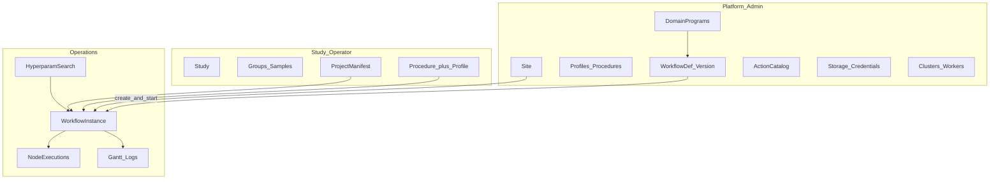

# EpiPortal information architecture

Recommended hierarchical UI for Administrators and RBAC-limited operators.
EpiPortal (`portal.epimethyl.com`) is the day-2 control plane; this repo owns
**SQL contracts** (`portal.sp_*`) and domain identity — not the React app.

**Companion:** [Portal remote control](portal-remote-control.md) (UI→DB vs
workers→gateway; HPO grids). **Config layers:** [Layer model](layer-model.md),
[Config registry](config-registry.md).

## Guiding contracts

1. A **workflow run** is a `wf.workflow_instance` of a **published**
   `wf.workflow_version` (compiled from a DomainProgram). Operators start
   instances; authors publish definitions.
2. **Three floors:** Platform (what the cluster can run) → Study (science) →
   Operations (what is running). RBAC maps to floors, then refines by study
   membership / storage scope.
3. **Project manifests** (`project_*.json`) hold cohorts and paths — never tool
   knobs. Tunables are schema-driven overlays (site / profile / procedure /
   instance) → baked `resolvedConfig` on tasks.
4. Portal talks **Azure SQL `portal.sp_*` only**. Workers talk **gateway only**.
   Never reverse those paths.



## Top-level navigation (≤6)

| Nav | Default audience | Purpose |
|-----|------------------|---------|
| **Home / Ops board** | Operator | Running/failed instances, lease alerts, worker health |
| **Studies** | Operator / study lead | Science workspace + start/monitor runs |
| **Workflows** | Author / admin | Definitions, versions, graph; cross-study instance list |
| **Platform** | Lab / infra admin | Site, packs, storage, catalog, workers |
| **Hyperparameters** | Study lead / operator | Grids, trials, scores (also linked from Study) |
| **Admin** | Platform admin | Principals, roles, audit, enrollment revoke |

Hide nav items the role cannot use; do not show disabled Platform as a tease.

---

## Floor 1 — Studies (operator home)

```
Studies
  └─ {Study}
       ├─ Overview
       ├─ Samples & groups
       ├─ Project manifests
       ├─ Runs
       │    └─ {Instance}     ← primary ops screen
       ├─ Start run…          ← wizard (published version only)
       └─ Hyperparam grids
```

### Screens

| Screen | Purpose | Primary `portal.sp_*` / notes |
|--------|---------|-------------------------------|
| Study list | Filter by status / modality | `cfg.study` via portal list (extend if missing); clinical samples via legacy `portal.spGet*` where still used |
| Study overview | Bound procedure/profile, `projectPath`, recent runs | Read `cfg.study` + latest instances |
| Samples & groups | Enrollment, arms, membership | `sp_list_samples_for_study_enrollment`, `sp_list/set_study_group(s)`, `sp_set_study_group_members`, `sp_materialize_study_lists` |
| Project manifests | View/edit cohort paths under `/work/projects/<study>/` | File/cfg study document; **no** `actionConfig` knobs |
| Runs list | Instances for this study | Filter `wf.workflow_instance` by study/context |
| **Instance detail** | Timeline, tasks, config snapshot, controls | `sp_get_instance_tasks`; reclaim via `sp_reclaim_expired_leases` |
| **Start run wizard** | Definition@version → procedure/profile → manifest → start | `sp_list_workflow_definitions`, `sp_create_and_start_instance` |

### Start-run wizard (must-have UX)

1. Select **published** workflow definition + version (e.g. SamplePrepPipeline).
2. Select **assay procedure** + **pipeline profile** (and research mode if any).
3. Confirm **project manifest** / sample subset / `executionScopeId` if needed.
4. Create instance — UI copy: *Instance of `SamplePrepPipeline` @ v12*.

Do **not** open DomainProgram IR editing on this path.

### Instance detail layout

1. **Header:** study · definition@version · status · procedure/profile · times  
2. **Progress:** stage rollup + Gantt of `node_execution`  
3. **Tasks:** sample × action × status × worker × lease age (`sp_get_instance_tasks`)  
4. **Controls (RBAC):** pause / resume / cancel / reclaim expired leases  
5. **Config:** read-only merged `resolvedConfig` with provenance (site / profile / procedure / instance)  
6. **Errors:** `engine_error_*` on failed nodes  

---

## Floor 2 — Workflows (definition vs instance)

```
Workflows
  ├─ Definitions
  │    └─ {workflow_def}
  │         ├─ Versions (immutable)
  │         ├─ Graph (DomainProgram / compiled)
  │         └─ Instances of this version
  └─ All instances (global ops filter)
```

| Concept | Layer | UI label |
|---------|-------|----------|
| DomainProgram | Authoring IR (`*.program.json` / `cfg.domain_program`) | Program draft |
| `wf.workflow_def` | Named published identity | Definition |
| `wf.workflow_version` | Immutable `spec_json` | Version |
| `wf.workflow_instance` | One execution + `context_json` | Run / Instance |

| Screen | Purpose | Procs |
|--------|---------|-------|
| Definition list | Browse published graphs | `sp_list_workflow_definitions` |
| Version / graph | Author & publish | `sp_list/get/upsert_domain_program`, `sp_create_workflow_graph` |
| Action browser | JSON Schema for knobs | `sp_list_workflow_actions`, `sp_get_action_schema`, `sp_list/get_cfg_action` |
| Global instances | Cross-study ops | `sp_get_instance_tasks` (+ instance list query) |

---

## Floor 3 — Platform (admin)

```
Platform
  ├─ Site
  ├─ Process packs
  │    ├─ Pipeline profiles
  │    └─ Assay procedures
  ├─ Domain programs
  ├─ Action catalog
  ├─ Storage & credentials
  │    ├─ Lab ingress
  │    └─ Archive / shared / site
  ├─ Reference assets
  └─ Clusters & workers
```

| Term | Meaning | Operator touchpoint |
|------|---------|---------------------|
| **Process pack** | Modality capability (WGBS, RNA-Seq, …) | Usually invisible; implied by study modality |
| **Pipeline profile** | SaMD / research mode + `actionConfig` | Selected in Start run |
| **Assay procedure** | Library/aligner/FeatureCuts recipe | Selected in Start run |
| **Site** | Cluster genomes, caches, site `actionConfig` | Admin edit; operators consume |

| Screen | Purpose | Procs / notes |
|--------|---------|---------------|
| Storage endpoints | Upsert/publish by scope | `sp_list/get/upsert/publish_storage_endpoint` |
| Credentials | Upsert/publish (never to `/work`) | `sp_list/get/upsert/publish_credential` |
| Clusters / workers | Enroll, list, revoke | `sp_upsert/list_cluster`, `sp_upsert/list/revoke_worker_enrollment` |
| Domain programs | Draft → publish → linked version | `sp_list/get/upsert_domain_program` |
| Action catalog | Browse schemas | `sp_list/get_cfg_action`, `sp_get_action_schema` |

Storage RBAC (enforced in EpiPortal / DB roles): **lab admin** → `lab_ingress`;
**infra admin** → archive / shared / site; operators → select **published
redacted** endpoints only ([config-registry](config-registry.md),
[portal_resource_profile](../deployment/portal_resource_profile.md)).

---

## Floor 4 — Hyperparameters

```
Hyperparameters
  └─ {Search}
       ├─ Spec (grid / scenario)
       ├─ Trials → each trial = workflow instance
       ├─ Scores / promote winner (operator-gated)
       └─ Status
```

| Screen | Purpose | Procs |
|--------|---------|-------|
| Start grid / scenario | Typed overlay expand → N instances | `sp_start_hyperparam_grid`, middle-tier / `methyl-study-start` for expand |
| Trial ledger | Map trial ↔ instance + scope | `sp_add_hyperparam_trial` |
| Monitor search | Live status join | `sp_get_hyperparam_search` |
| Score trial | Persist objective J | `sp_score_hyperparam_trial` |
| Pause / complete search | Status transitions | `sp_set_hyperparam_search_status` |

Winners are **never** auto-written into a published profile — export overlay for
operator publish via `methyl-cfg` / cfg ops. Details:
[portal-remote-control.md](portal-remote-control.md).

---

## RBAC matrix

| Role | Home | Can | Cannot |
|------|------|-----|--------|
| **Study operator** | Studies → Runs | Enroll samples, start/pause/cancel instances, view tasks + config snapshot, view published procedures/profiles | Edit site, storage secrets, DomainProgram publish |
| **Study lead** | Studies | Operator + bind procedure/profile, start validation lifecycle / HPO | Platform publish |
| **Lab admin** | Platform → Storage (ingress) | Upsert/publish lab ingress endpoints + credentials | Archive/shared/site storage |
| **Infra admin** | Platform | Site, workers, archive/shared storage, catalog sync | Clinical PHI sample edits (if separated) |
| **Program author** | Workflows → Definitions | Edit DomainProgram drafts, publish version | Start production studies without study role |
| **Platform admin** | All | Roles, enrollment revoke, global reclaim | — |

Day-2 operators use **portal UI only** (company identity / MFA) — not SQL tools,
not gateway admin HTTP ([component-boundaries](component-boundaries.md)).

---

## Screen → procedure inventory

Complete contract surface shipped in this repo (MSSQL + PG twins under
`workflow_engine/sql_mssql/` / `sql_pg/`):

### Workflow & ops

| Procedure | UI use |
|-----------|--------|
| `portal.sp_list_workflow_definitions` | Start wizard / Workflows list |
| `portal.sp_create_workflow_graph` | Publish compiled graph (author) |
| `portal.sp_create_and_start_instance` | Start run |
| `portal.sp_get_instance_tasks` | Instance task table / Gantt |
| `portal.sp_reclaim_expired_leases` | Ops reclaim control |
| `portal.sp_list_workflow_actions` | Action catalog browse |
| `portal.sp_get_action_schema` | Schema-driven forms |

### Cfg / study / storage

| Procedure | UI use |
|-----------|--------|
| `portal.sp_list/get/upsert_domain_program` | Program authoring |
| `portal.sp_list/get_cfg_action` | Catalog |
| `portal.sp_list/set_study_group(s)`, `sp_set_study_group_members` | Cohorts |
| `portal.sp_list_study_group_members` | Membership |
| `portal.sp_materialize_study_lists` | Materialize study lists to `/work` |
| `portal.sp_list_samples_for_study_enrollment` | Enrollment picker |
| `portal.sp_list/get/upsert/publish_storage_endpoint` | Storage admin |
| `portal.sp_list/get/upsert/publish_credential` | Credential admin |

### Workers

| Procedure | UI use |
|-----------|--------|
| `portal.sp_upsert/list_cluster` | Clusters |
| `portal.sp_upsert/list/revoke_worker_enrollment` | Worker enrollment |

### Hyperparameters

| Procedure | UI use |
|-----------|--------|
| `portal.sp_start_hyperparam_grid` | Start search |
| `portal.sp_add_hyperparam_trial` | Record trial ↔ instance |
| `portal.sp_get_hyperparam_search` | Monitor |
| `portal.sp_score_hyperparam_trial` | Score |
| `portal.sp_set_hyperparam_search_status` | Pause / complete |

### Legacy clinical nav (MethylPipeline.sql)

Older `portal.spGetSamples*`, `spNavTree*`, `spGetCollectionItems` may still
back clinical sample/nav trees. Prefer study-group APIs for new Study UX;
migrate gradually.

### Known gaps (UI may need thin new procs)

Documented for EpiPortal backlog — keep workers/gateway unchanged:

- List/filter `wf.workflow_instance` by study / status / definition version  
- Pause / resume / cancel instance (today often gateway/DB ops or status update)  
- List/get published **pipeline profiles** and **procedures** for Start wizard  
- List/get **site** document for Platform → Site  
- Instance `context_json` / baked `resolvedConfig` read API for Config tab  

Until those exist, portal middle-tier may read `wf`/`cfg` tables with the same
RBAC rules; prefer adding `portal.sp_*` twins for parity.

---

## Design principles

1. **Study-centric for operators; definition-centric for authors; instance-centric for ops.**  
2. Never conflate project manifest with `actionConfig`.  
3. **Publish before run** — only published versions/procedures/profiles in Start.  
4. One primary object per screen; deep-link Study → Run → Task → Action schema.  
5. Schema-driven forms from `sp_get_action_schema` / cfg action documents — not free-text JSON for operators.  
6. Config snapshot shows **where** a knob was set (site / profile / procedure / instance).

## Related

- [Portal remote control](portal-remote-control.md)  
- [Distributed runtime](distributed-runtime.md)  
- [Component boundaries](component-boundaries.md)  
- [Storage SoT / RBAC plan](../plans/storage-db-sot.plan.md)  
- [Portal multi-instance HPO plan](../plans/portal-multi-instance-hpo.plan.md)  
- [Deployment — portal resource profile](../deployment/portal_resource_profile.md)  
- [Regulatory — deployment and supervision](../regulatory/deployment-and-supervision.md)  
