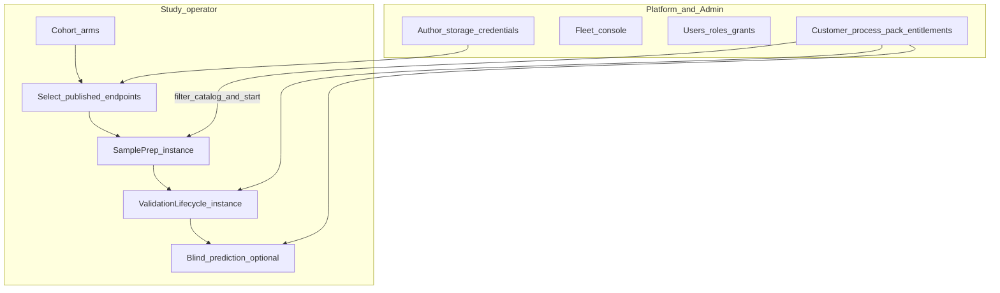
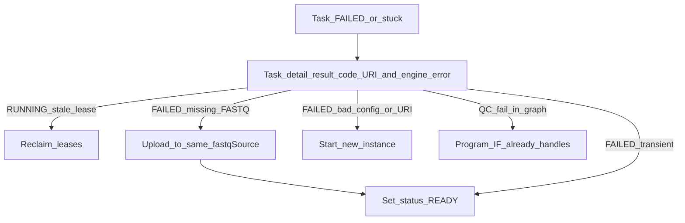

# EpiPortal information architecture

Operator-facing UI for the full pipeline (cohort → sample prep → study lifecycle →
prediction), plus **Admin** (RBAC) and **Contracts** (process-pack entitlements).
EpiPortal (`portal.epimethyl.com`) is the day-2 control plane; this repo owns
**SQL contracts** (`portal.sp_*`) and domain identity — not the Delphi/uniGUI app.

**Companion:** [Portal remote control](portal-remote-control.md) (UI→DB vs
workers→gateway; HPO grids). **Fleet control:** [Constrained worker ops](constrained-worker-ops-actions.md).
**Config layers:** [Layer model](layer-model.md), [Config registry](config-registry.md).
**Science stages:** [Pipeline stages](pipeline-stages.md), [End-to-end workflow](end-to-end-workflow.md),
[Portal staged study lifecycle](../../workflow_engine/docs/portal_study_lifecycle.md).
**Retry / leases:** [Workflow idempotency](workflow-idempotency-retry-lease.md),
[Usage ch.11](../usage/11-troubleshooting-and-recovery.md).
**Plan:** [portal-pipeline-ia](../plans/portal-pipeline-ia.plan.md).

## Guiding contracts

1. A **workflow run** is a `wf.workflow_instance` of a **published**
   `wf.workflow_version` (compiled from a DomainProgram). Operators start
   instances; authors publish definitions.
2. Organize the UI around the **operator pipeline** and **admin RBAC/contracts**,
   not around schema names. Hide nav the role cannot use (no disabled tease).
3. **Project manifests** (`project_*.json`) hold cohorts and paths — never tool
   knobs. Tunables are schema-driven overlays (site / profile / procedure /
   instance) → baked `resolvedConfig` on tasks.
4. Portal talks **`portal.sp_*` only** (Azure SQL today; PG twin). Workers talk
   **gateway only**. Never reverse those paths. Do not call `RBAC.*` / `Contract.*`
   write procs from new screens — wrap them as `portal.sp_*`.
5. **Fleet control ≠ instance lifecycle ≠ science knobs ≠ task retry.**
   Drain/Stop worker, pause/cancel run, `actionConfig`, and `FAILED`→`READY`
   are four different surfaces.



## Schema swimlanes (not nav)

| Schema | Owns | Operator meaning |
|--------|------|------------------|
| **portal** | Sample identity (`Samples`, `LabSamples`, import, `AlignmentQC`) | Who/what the specimen is |
| **cfg** | Study arms, storage endpoints, process packs, `study_instance_link` | Which samples, from where, which procedure, which run |
| **wf** | Published graphs + `workflow_instance` / `node_execution` | Execution |
| **RBAC** (+ Meta, Onboarding) | Users, roles, scoped grants, sessions, invitations | Who may see/do each floor |
| **Contract** | Customer terms, scopes, pack entitlements, quotas | Which process packs a tenant may run |

Three different “groups” must not share a UI label:

| Table | UI label |
|-------|----------|
| `cfg.study_group` | **Study arms** (control / disease) |
| `portal.Groups` | **Customer cohorts** (legacy clinical nav) |
| `RBAC.Groups` | **User groups** (role inheritance) |

## Top-level navigation (≤6)

| Nav | Default audience | Purpose |
|-----|------------------|---------|
| **Home / Ops board** | Operator / infra | Running/failed instances, lease alerts, fleet strip — `sp_list_ops_instances`, `sp_list_worker_health`, `sp_list_stale_leases` |
| **Studies** | Operator / study lead | **Pipeline workspace** (primary operator home) |
| **Workflows** | Author / admin | Definitions, versions, graph; cross-study instance list |
| **Platform** | Lab / infra admin | Site, packs, storage **authoring**, catalog, fleet console |
| **Hyperparameters** | Study lead / operator | Grids, trials, scores (also linked from Study) |
| **Admin** | Platform admin | **RBAC** + **Contracts** (customers, entitled process packs) |

---

## Control model (fleet vs in-flight vs run vs retry)

Operators remote-control workers **without SSH**. See
[constrained-worker-ops-actions.md](constrained-worker-ops-actions.md).

| Layer | Operator verb | Mechanism | Status |
|-------|---------------|-----------|--------|
| **Fleet** | Resume claiming / Drain / Stop worker | `wf.worker.desired_state` via `portal.sp_set_worker_desired_state` | **Shipped** |
| **In-flight** | Abort or cooperative-pause the current task | Catalog `can_pause` / `can_continue` / `can_stop` | **Shipped** (most: stoppable, not pausable) |
| **Task retry** | Set a **FAILED** node back to **READY** | `portal.sp_retry_failed_node` | **Shipped** (this IA) |
| **Run** | Pause / resume / cancel the **instance** | Instance status API (not fleet Drain, not Retry) | **Gap** |

| UI label | Backend | Notes |
|----------|---------|-------|
| **Resume claiming** | `desired_state=ACTIVE` | Fleet layer |
| **Drain** | `DRAINING` | Finish current work; no new claims |
| **Stop worker** | `STOPPING` | Abort in-flight only if `can_stop` |
| **Retry this action** | `FAILED` → `READY` | Same baked `input_json`; bump `attempt_no` |
| **Stop this task** | `fail_task` / **4099** `WORKER_STOPPED` | Distinct from fleet Stop and from Retry |

Affinity keys are **opaque** — show them; never hard-code SamplePrep stickiness
in UI logic ([worker-affinity-dispatch](../plans/worker-affinity-dispatch.plan.md)).

---

## Studies — operator pipeline

```
Studies / {Study}
  Overview                 stage rollup across instances
  Cohort                   enroll portal.Samples into cfg.study_group arms
  Storage                  pick published fastqSource + sampleDestination
  Sample prep              Instance 1: download → align → QC → extract → archive
  Study lifecycle          Instance 2: stability → freeze → model → validation
  Prediction               optional blind / predictor-only (gated; not accuracy)
  Runs                     all linked instances → {Instance} monitor
  Start next stage…        wizard: next published DomainProgram only
```

Two DomainPrograms in sequence, then optional prediction
([portal_study_lifecycle.md](../../workflow_engine/docs/portal_study_lifecycle.md)):

1. **SamplePrepPipeline** — download (`fastqSource`) → align → QC → extract →
   **archive** (`sampleDestination`, `full` / `qc_only`; BAM never uploaded).
2. **StudyValidationLifecycle** — MC → stability → freeze → mapper/enricher →
   model MC → selection → hold-out.
3. **Blind prediction** — standalone `pipeline.predictor`; **not** a validation
   accuracy claim ([ch.09](../usage/09-stage-blind-prediction.md)).

### Screens

| Screen | Purpose | Primary `portal.sp_*` |
|--------|---------|------------------------|
| Study list | Published cfg studies | `sp_list_studies`, `sp_get_study`, `sp_upsert_study` |
| Study overview | Bound procedure/profile/analyte, `projectPath`, **stage rollup** | `sp_get_study_process_defaults`, `sp_get_study_pipeline_progress` |
| Study process defaults | Persist default profile / procedure / analyte / researchMode | `sp_set/get_study_process_defaults`; pickers: `sp_list_*_catalog` **filtered by contract** when `@scope_id` is set |
| Cohort (samples & arms) | Enrollment, study arms, membership | `sp_list_samples_for_study_enrollment`, `sp_set_sample_analyte`, `sp_list/set_study_group(s)`, `sp_set_study_group_members`, `sp_materialize_study_lists` |
| Storage | Select **published redacted** `fastqSource` + `sampleDestination` | `sp_list_storage_endpoints` (redacted); authoring stays on Platform |
| Project manifests | Cohort paths under `/work/projects/<study>/` | `sp_project_list/get/save`; **no** `actionConfig` knobs |
| Runs | Instances for this study | `sp_list_study_instances` |
| **Instance detail** | Gantt, tasks, errors, **recovery verbs** | `sp_get_instance_tasks`, `sp_get_node_execution_detail`, `sp_retry_failed_node`, `sp_reclaim_expired_leases`, `sp_get_workflow_instance` |
| **Start next stage** | Published version → packs → start | Catalog procs + `sp_list_workflow_definitions` + `sp_create_and_start_instance` (`@scope_id`) |

**Storage:** operators **select** published endpoints. Lab/infra **author** them
under Platform. Do not put credentials on the study screen.

### Start-run wizard (must-have UX)

1. Select **published** workflow definition + version (stage-aware: SamplePrep
   first; after prep completes, offer StudyValidationLifecycle; after freeze+model,
   offer hold-out / optional prediction).
2. Select **analyte** + **assay procedure** + **pipeline profile** (and research
   mode if any), **intersected with the session scope’s entitled process packs**.
   Prefill from `sp_get_study_process_defaults`. If the study’s
   `primary_modality` is not entitled, do **not** offer Start.
3. Confirm **project manifest** / sample subset / `executionScopeId` if needed.
4. Create instance with `context_json` carrying `pipelineProfile`,
   `pipelineProcedure`, `researchMode`, `projectPath`. Prefer
   `cfg.study_instance_link`.

Do **not** open DomainProgram IR editing on this path. Do **not** list deprecated
`mc_*` aliases or `visibility=hidden` packs. Hide unentitled packs (no disabled tease).

### Process-pack catalog rules

| Surface | Data | Who sees retired/unentitled |
|---------|------|-----------------------------|
| Start wizard / Study defaults | `sp_list_*_catalog` (+ `@scope_id`) | Never |
| Platform → Process packs | `sp_list_pipeline_profiles` / procedures / analytes | Retired: yes (admin). Unentitled: N/A (platform browse) |

A **process pack** is an omics modality (`methylation` \| `rnaseq` \| `proteomics`),
not an assay procedure and not a disease application pack
([assay-procedure-packs](../plans/assay-procedure-packs.plan.md)).

---

## Study / workflow monitoring, failure, and recovery

First-class operator UX. The engine does **not** auto-requeue `FAILED` nodes
([idempotency doc](workflow-idempotency-retry-lease.md)). Lease expiry requeues
**stuck RUNNING** only.

| Screen | What they see |
|--------|----------------|
| Home / Ops | Running/failed instances, stale leases, fleet strip |
| Study Overview | Stage rollup (download / align / QC / extract / archive / MC / stability / freeze / model / validation / prediction) with fail counts |
| Study → Runs → **Instance** | Gantt + task table; click a failed row |
| **Task / action detail** | Why it failed + which recovery verb applies |

### Instance detail layout

1. **Header:** study · definition@version · status · procedure/profile · times
2. **Progress:** stage rollup + Gantt of `node_execution`
3. **Tasks:** action × status × affinity key × lease worker × lease age × `engine_error_*`
4. **Controls (RBAC) — split clearly:**
   - **Retry this action** (`FAILED` → `READY`) — study operator
   - **Leases:** reclaim expired
   - **Stop this task** only when catalog `can_stop` (in-flight)
   - **Related workers:** deep-link to fleet console (Drain/Stop live there)
5. **Task detail:** `result_code`, `engine_error_code` / `engine_error_message`
   (incl. `4099`), truncated `output_json`, **source URI(s)** for download
   actions, pointer to `/work` `.action_results` (portal does not SSH)
6. **Config snapshot:** still a gap (`resolvedConfig` read API)

Enable **Stop this task** only when `can_stop` is true. Disable (with reason)
when `can_stop=false`.

### Recovery verbs (keep them distinct)

| UI verb | When | Backend | Do not confuse with |
|---------|------|---------|---------------------|
| **Reclaim expired leases** | Node `RUNNING`, lease expired (worker crash) | `sp_reclaim_expired_leases` | Fleet Drain/Stop |
| **Retry this action** (set **READY**) | Node `FAILED`; same `input_json` still correct after an **external** fix | `sp_retry_failed_node` | New instance; editing baked JSON |
| **Start new instance** | Science/config/URI was wrong | Start wizard | Reclaim / Retry |
| **Stop this task** | In-flight, `can_stop` | `fail_task` / 4099 | Instance cancel (gap) |

In-graph QC remediation (trim → realign) is **program control flow**, not Retry.

**Worked case — missing FASTQ on source.** `sample.download_fastq` fails because
the object is not at the lab ingress URI in `input_json`. The portal does **not**
upload the FASTQ. A lab operator puts the file on the **same** `fastqSource`
path, then clicks **Retry**. The next claim uses the same baked URI. Task detail
must show the expected source URI(s). Optional confirm: *I have placed the
missing files at this source location.*

Do **not** treat this as a config change. Do **not** require `forceRerun`. Do
**not** expose a generic status dropdown — only this gated READY transition.

Operator copy: *Sets this task back to READY with the same inputs so a worker
will claim it again. If you changed profile/procedure knobs or the sample URI,
start a new run instead.*



One sample `fail_task` does **not** fail the whole instance (FOREACH siblings
keep running). Graph-level failures do mark `workflow_instance` `FAILED`; Retry
reopens the instance to `RUNNING` when that node was blocking.

---

## Workflows (definition vs instance)

```
Workflows
  ├─ Definitions
  │    └─ {workflow_def}
  │         ├─ Versions (immutable)
  │         ├─ Graph (DomainProgram / compiled)
  │         └─ Instances of this version
  └─ All instances (global ops filter)
```

| Concept | Layer | UI label |
|---------|-------|----------|
| DomainProgram | Authoring IR | Program draft |
| `wf.workflow_def` | Named published identity | Definition |
| `wf.workflow_version` | Immutable `spec_json` | Version |
| `wf.workflow_instance` | One execution + `context_json` | Run / Instance |

| Screen | Procs |
|--------|-------|
| Definition list | `sp_list_workflow_definitions` (optional `@scope_id`) |
| Version / graph | `sp_list/get/upsert_domain_program`, `sp_create_workflow_graph`, `sp_get/save_workflow_graph`, `sp_activate_workflow_version` |
| Action browser | `sp_list/get_workflow_actions`; types via `sp_list/get_data_types` |
| Global instances | `sp_list_ops_instances`, `sp_list_recent_instances` |

---

## Platform (admin)

```
Platform
  ├─ Site
  ├─ Process packs          (full list incl. retired — not the operator catalog)
  │    ├─ Pipeline profiles
  │    └─ Assay procedures
  ├─ Domain programs
  ├─ Action catalog
  ├─ DataType Registry
  ├─ Sample field contracts
  ├─ Storage & credentials  (lab ingress vs archive/shared/site)
  ├─ Reference assets
  └─ Clusters & workers     (fleet console)
       ├─ Clusters
       ├─ Workers
       └─ Enrollment
```

| Screen | Procs / notes |
|--------|---------------|
| Site | `sp_list/get/upsert/publish_site`, `sp_list_site_reference_assets` |
| Storage endpoints | `sp_list/get/upsert/publish_storage_endpoint` |
| Credentials | `sp_list/get/upsert/publish_credential` (never to `/work`) |
| Pipeline profiles | `sp_list/get_pipeline_profile` — admin browse |
| Assay procedures | `sp_list/get_assay_procedure` |
| Analytes | `sp_list/get_analyte` |
| Fleet console | `sp_list_worker_health`, `sp_set_worker_desired_state`, `sp_upsert/list_cluster` |
| Enrollment | `sp_upsert/list/revoke_worker_enrollment` |
| Domain programs | `sp_list/get/upsert/publish_domain_program` |
| Action catalog | `sp_list/get_workflow_actions` |
| DataType Registry | `sp_list/get_data_types`, `sp_list_data_type_fields` |
| Sample field contracts | `sp_list/get_sample_field_contract` — **only** JSON Schema column in DB |
| Reference assets | `sp_list/get_reference_asset` |

Storage RBAC: **lab admin** → `lab_ingress`; **infra admin** → archive / shared /
site; operators → published redacted endpoints only.

### Home / Ops board — fleet strip

Worker counts by `desired_state`, exclusive-action occupancy, lease-age alerts,
quick Drain / Stop / Resume (infra admin).

---

## Hyperparameters

```
Hyperparameters / {Search}
  ├─ Spec (grid / scenario)
  ├─ Trials → each trial = workflow instance
  ├─ Scores / promote winner (operator-gated)
  └─ Status
```

Procs: `sp_start_hyperparam_grid`, `sp_add_hyperparam_trial`,
`sp_get_hyperparam_search`, `sp_list_hyperparam_searches`,
`sp_score_hyperparam_trial`, `sp_set_hyperparam_search_status`.
Winners are **never** auto-written into a published profile.
Details: [portal-remote-control.md](portal-remote-control.md).

---

## Admin — RBAC and Contracts

Platform admin only. Study lead never sees Users or Contracts.

```
Admin
  Users                    RBAC.Users + Active + ExternalIdentities
  User groups              RBAC.Groups / Group_Users / Group_Roles
  Roles and permissions    Roles, Role_Permissions → Meta.Objs/Operations
  Scoped grants            UserRoleGrants + Scopes (Institution / Lab)
  Bypass-scope approvals   BypassScopeApprovals (GLOBAL grants)
  Invitations              Onboarding.InvitationBatches / Invitations
  Nav grants               portal.Role2Node + NavTree
  Sessions and audit       Sessions, Session_Roles, effective permissions
  Contracts                portal.Customers + Contract.Contracts
    ├─ Scopes covered        ContractScopes → RBAC.Scopes
    ├─ Process packs         entitled modalities
    ├─ Graph quotas          derived ContractWorkflowEntitlements + usage counters
    ├─ Role policies         ContractRolePolicies
    └─ Limits                ContractLimits
```

Session/nav stays `RBAC.spGetUserNavTree` + `usp_session_is_authorized` at login.
**CRUD** for these screens is **`portal.sp_*`**. Deprecate `e_portal.spAddUserRole`
for new screens; keep twins until uniGUI cutover.

### Contracts — customers limited to process packs

Commercial grain is **process pack** (`regulatory.primary_modality`), not raw
`wf.workflow_def` ids. `Contract.ContractWorkflowEntitlements` remain for
**quota** on derived SamplePrep / lifecycle graphs.

| Today (legacy) | Operator product |
|----------------|------------------|
| Entitlement on `WorkflowDefID` | Licensed for `methylation` / `rnaseq` / `proteomics` |
| Catalog lists every operator pack | Pickers show **only entitled** packs |
| `spContractValidateWorkflowExecution` | Also `PROCESS_PACK_NOT_ENTITLED` at start |

v1 does **not** SKU individual assay procedures (buffy vs EM-Seq) or application
packs. `PlanCode` / `BillingCycle` are metadata — no billing UI.

---

## RBAC matrix

| Role | Home | Can | Cannot |
|------|------|-----|--------|
| **Study operator** | Studies → Runs | Enroll samples, start instances, view tasks, **Retry** / reclaim, view published packs | Site, secrets, DomainProgram publish, fleet Drain/Stop, Users, Contracts |
| **Study lead** | Studies | Operator + bind procedure/profile, validation lifecycle / HPO | Platform publish; fleet; Admin |
| **Lab admin** | Platform → Storage (ingress) | Lab ingress endpoints + credentials | Archive/shared/site; fleet Stop unless also infra |
| **Infra admin** | Platform | Site, fleet Drain/Stop/Resume, archive/shared storage, catalog sync | Clinical PHI edits (if separated) |
| **Program author** | Workflows → Definitions | Edit/publish DomainProgram drafts | Start production studies without study role |
| **Platform admin** | All | Roles, Contracts, invitations, enrollment revoke, global reclaim, fleet bulk | — |

Day-2 operators use **portal UI only** (company identity / MFA) — not SQL tools,
not gateway admin HTTP ([component-boundaries](component-boundaries.md)).

---

## Screen → procedure inventory

MSSQL + PG twins under `workflow_engine/sql_mssql/` and `sql_pg/`.

### Workflow, monitor, recovery

| Procedure | UI use |
|-----------|--------|
| `portal.sp_list_workflow_definitions` | Start wizard / Workflows list (`@scope_id` optional) |
| `portal.sp_create_workflow_graph` | Publish compiled graph (author) |
| `portal.sp_create_and_start_instance` | Start run; optional `@scope_id` pack check |
| `portal.sp_get_workflow_instance` | Instance header |
| `portal.sp_list_ops_instances` | Home / Ops board |
| `portal.sp_list_recent_instances` | Monitor picker (not study-filtered) |
| `portal.sp_list_study_instances` | Study → Runs |
| `portal.sp_get_study_pipeline_progress` | Study Overview stage rollup |
| `portal.sp_get_instance_tasks` | Task table / Gantt (`engine_error_*`, affinity, lease, source URI) |
| `portal.sp_get_node_execution_detail` | Task detail |
| `portal.sp_retry_failed_node` | Retry (`FAILED` → `READY`) |
| `portal.sp_reclaim_expired_leases` | Ops reclaim |
| `portal.sp_list/get_workflow_actions` | Action catalog |
| `portal.sp_list/get_data_types` | DataType Registry |
| `portal.sp_get_action_schema` | Legacy compat only |

### Cfg / study / storage / catalogs

| Procedure | UI use |
|-----------|--------|
| `portal.sp_list/get/upsert/publish_domain_program` | Program authoring |
| `portal.sp_list/set_study_group(s)`, `sp_set_study_group_members` | Study arms |
| `portal.sp_materialize_study_lists` | Materialize CSVs to `/work` |
| `portal.sp_list_samples_for_study_enrollment` | Enrollment picker |
| `portal.sp_set_sample_analyte` | Bind sample → `cfg.analyte` |
| `portal.sp_list/get/upsert/publish_storage_endpoint` | Storage admin |
| `portal.sp_list/get/upsert/publish_credential` | Credential admin |
| `portal.sp_list/get_pipeline_profile` | Platform process-pack browse |
| `portal.sp_list_pipeline_profile_catalog` | Start wizard (`@scope_id`) |
| `portal.sp_list/get_assay_procedure` | Platform procedure browse |
| `portal.sp_list_assay_procedure_catalog` | Start wizard (`@analyte`, `@scope_id`) |
| `portal.sp_list/get_analyte` | Platform analyte browse |
| `portal.sp_list_analyte_catalog` | Start wizard (`@scope_id`) |
| `portal.sp_get/set_study_process_defaults` | Study defaults |
| `portal.sp_list/get/upsert/publish_site` | Platform → Site |
| `portal.sp_list_studies`, `sp_get/upsert_study` | Study list |
| `portal.sp_project_list/get/save`, `sp_project_resolve_archive` | Manifest / archive |

### Workers / fleet

| Procedure | UI use |
|-----------|--------|
| `portal.sp_upsert/list_cluster` | Clusters |
| `portal.sp_upsert/list/revoke_worker_enrollment` | Enrollment |
| `portal.sp_list_worker_health` | Fleet console (desired_state, heartbeat, leases) |
| `portal.sp_set_worker_desired_state` | Drain / Stop / Resume |
| `portal.sp_list_stale_leases` | Ops board |

### Hyperparameters

| Procedure | UI use |
|-----------|--------|
| `portal.sp_start_hyperparam_grid` | Start search |
| `portal.sp_add_hyperparam_trial` | Trial ↔ instance |
| `portal.sp_get/list_hyperparam_search(es)` | Monitor |
| `portal.sp_score_hyperparam_trial` | Score |
| `portal.sp_set_hyperparam_search_status` | Pause / complete |

### Admin RBAC (`portal_rbac_api`)

| Procedure | UI use |
|-----------|--------|
| `portal.sp_list/get/upsert_user` | Users |
| `portal.sp_list_user_identities` | ExternalIdentities (read) |
| `portal.sp_list_roles`, `sp_list_permissions` | Roles |
| `portal.sp_grant/revoke_user_role`, `sp_list_user_role_grants` | Scoped / GLOBAL grants |
| `portal.sp_list/get_scopes` | Scopes |
| `portal.sp_list_user_groups`, `sp_set_user_group_members`, `sp_set_user_group_roles` | User groups |
| `portal.sp_list_user_sessions` | Sessions (read) |
| `portal.sp_list/grant/deny_role_nav_nodes` | Nav grants |
| `portal.sp_list/create/revoke_invitation`, `sp_create_invitation_batch` | Onboarding |

### Contracts (`portal_contract_api`)

| Procedure | UI use |
|-----------|--------|
| `portal.sp_list/get/upsert_contract` | Contract header |
| `portal.sp_list/set_contract_process_packs` | Entitled modalities |
| `portal.sp_list_contract_scopes`, `sp_list_contract_limits`, `sp_list_contract_role_policies` | Admin panels |
| `portal.sp_list_contract_usage` | Quota counters (read) |
| `portal.sp_contract_entitled_modalities` | Catalog filter helper |
| `Contract.spContractValidateWorkflowExecution` | Called from `sp_create_and_start_instance` (not directly from UI) |

### Legacy clinical nav

Older `portal.spGetSamples*`, `spNavTree*`, `spGetCollectionItems` may still back
clinical trees. Prefer study-arm APIs for new Study UX. `e_portal.*` remains for
live uniGUI until cutover.

### Remaining gaps

- Pause / resume / cancel **instance** (run lifecycle; **not** fleet Drain, **not** Retry)
- Instance `context_json` / baked `resolvedConfig` read API for Config tab
- Assay-procedure SKUs inside a pack; billing/invoicing
- Auto-start Instance 2 when SamplePrep finishes (gated Start next stage only)

**Already shipped (do not re-list as gaps):** `sp_list_ops_instances`,
`sp_list_worker_health`, `sp_list_sites` / `sp_get_site`, `sp_list_studies`.

---

## EpiPortal build priority

1. Study pipeline workspace + **monitor / failure / retry** (incl. missing-FASTQ → READY).
2. Admin RBAC façade.
3. Contracts + entitled process-pack catalogs.
4. Wire already-shipped ops/fleet procs into chrome.
5. Instance pause/cancel + config snapshot.

## Design principles

1. **Study-centric for operators; definition-centric for authors; instance-centric for ops.**
2. Never conflate project manifest with `actionConfig`.
3. **Publish before run** — only published versions/procedures/profiles in Start.
4. One primary object per screen; deep-link Study → Run → Task.
5. Contract-filter catalogs; hide unentitled packs.
6. Config snapshot shows **where** a knob was set (when the read API exists).
7. **Fleet ≠ science knobs ≠ instance lifecycle ≠ task retry.**
8. Enable Stop from catalog **`can_stop`**, not role guesswork.
9. **Affinity is opaque** — show the key.
10. Retry is operator-gated `FAILED`→`READY` with the same inputs — never a free-form status editor.

## Related

- [Portal remote control](portal-remote-control.md)
- [Constrained worker ops](constrained-worker-ops-actions.md)
- [Action provider registry](action-provider-registry.md)
- [Distributed runtime](distributed-runtime.md)
- [Component boundaries](component-boundaries.md)
- [Config registry](config-registry.md)
- [Workflow idempotency, retry, and leases](workflow-idempotency-retry-lease.md)
- [Usage ch.11 — Troubleshooting](../usage/11-troubleshooting-and-recovery.md)
- [Portal pipeline IA plan](../plans/portal-pipeline-ia.plan.md)
- [Portal IA canvas](../canvas/README.md#portal-ia)
- [Deployment — portal resource profile](../deployment/portal_resource_profile.md)
