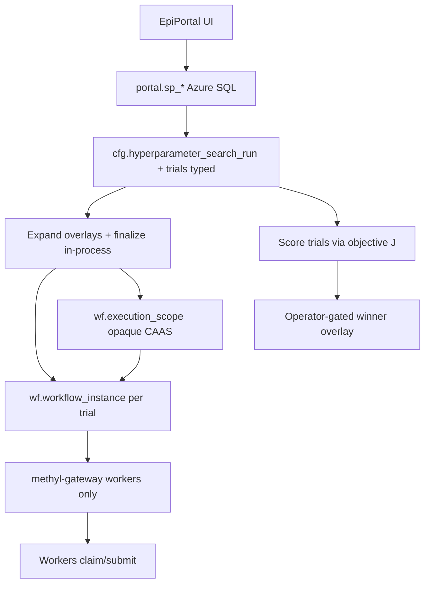

# Portal remote control (multi-instance HPO)

How the platform is driven end-to-end from the portal, and where hyperparameter
grids fit. The guiding rule: the **workflow engine (`wf`) stays disease- and
process-agnostic**; the domain meaning ("hyperparameter", "trial", "study") lives
in **`cfg`**; and only **workers** talk to the gateway.

## Access paths

| Client | Path | Knows about |
|--------|------|-------------|
| **EpiPortal UI** (`portal.epimethyl.com`) | Direct DB → `portal.sp_*` / `cfg` (Azure SQL) | Studies, hyperparameter grids, search runs, trial → instance map |
| **Portal middle-tier / ops** | Same SQL + in-process plan/finalize (or `methyl-study-start` for CI) | Expands the grid, starts the N instances |
| **Workers** | Python `methyl-gateway` daemon only (`/v1/workers/*`, [`contracts/openapi.yaml`](../../contracts/openapi.yaml)) | Claim/submit tasks with baked `resolvedConfig` |

The UI connects **directly to the database**; it never calls the gateway. The
gateway is **worker-only** and has **no** search or grid routes. If a new
worker-facing REST capability is ever needed, it is added to the existing Python
gateway daemon — there is no second HTTP service and no portal search API.

## Schema layering

| Schema | Owns | Does **not** know |
|--------|------|-------------------|
| **`wf`** | Generic actions, graphs, instances, tasks; opaque `execution_scope` + CAAS ledger | Disease, study, "hyperparameter", Tier-A meaning |
| **`cfg`** | Sites, profiles, studies, action definitions; **typed hyperparameter search/trial** entities; links `cfg` ↔ `wf` ↔ portal | Worker claim mechanics |
| **`portal`** | Clinical/project samples; UI-facing procs over `cfg`/`wf` | Engine graph internals |

The renamed wf concept is **`execution_scope`** (`wf.execution_scope`,
`workflow_instance.execution_scope_id`, `wf.execution_scope_action_entry`,
`wf_apply_execution_scope`). Context/task field is `executionScopeId` (legacy
`hyperparamSetId` accepted as an alias for one release).

## Scenario vs grid

| Path | When | CLI |
|------|------|-----|
| **Scenario** | Confirm an assumption or hit a stability target (BA gates, FeatureCuts caps, freq) without a Cartesian product | `methyl-study-start scenario-start` |
| **Grid** | Sweep discrete axes across N instances | `methyl-study-start hyperparam-grid-start` |

Both reuse `apply_overlay` → `finalize_instance_context` → `executionScopeId` / CAAS. JSON `null` in an override clears a site/profile knob. Scenarios may ledger as a single cfg trial for later score/compare.

Typical stability overlay keys: `validation.stability_min_balanced_accuracy`, `validation.stability_target_balanced_accuracy`, `validation.stability_dmp_freq`, `validation.stability_gene_freq`, `validation.stability_gene_featurecuts_max_dmps` / `_max_genes`, `validation.n_iterations`.

## Multi-instance grid flow

1. **Start** — `portal.sp_start_hyperparam_grid` records a search run; the portal
   middle-tier (or `methyl-study-start hyperparam-grid-start`) plans the base
   context once, applies each grid overlay to `actionConfig`, calls
   `finalize_instance_context` (baking `resolvedConfig__*` + `executionScopeId`),
   creates and starts one instance per point, and records each with
   `portal.sp_add_hyperparam_trial` (trial → `workflow_instance_id` +
   `execution_scope_key`). For a single assumption check use
   `methyl-study-start scenario-start` instead (no axes required).
2. **Monitor** — `portal.sp_get_hyperparam_search` returns trials joined to live
   instance status for the UI.
3. **Score** — after trials reach a terminal state, objective \(J\)
   (`optimization.objective_from_monte_carlo_artifacts`) scores each trial;
   `portal.sp_score_hyperparam_trial` persists the value/feasibility.
4. **Promote** — the winning trial's `actionConfig` overlay is exported for an
   operator to publish via `methyl-cfg` / portal cfg ops. Winners are **never**
   auto-written into a published profile.

## Typed contracts

Grid, trial overlay, search request, scenario request, and status are Pydantic models exported to
JSON Schema like every other config surface:

- `schemas/config/hyperparam_search_request.schema.json`
- `schemas/config/hyperparam_scenario_request.schema.json`
- `schemas/config/hyperparam_grid_spec.schema.json`
- `schemas/config/hyperparam_trial_overlay.schema.json`
- `schemas/config/hyperparam_search_status.schema.json`

Source models: [`packages/methylvalidation/methyl_validation/hyperparam_models.py`](../../packages/methylvalidation/methyl_validation/hyperparam_models.py).

## Legacy driver

The host `methyl-hyperparam-search` subprocess loop
([`packages/methylvalidation/methyl_validation/hyperparam_search.py`](../../packages/methylvalidation/methyl_validation/hyperparam_search.py))
remains for development and experimentation only (see
[usage ch.15](../usage/15-optional-hyperparameter-search.md)). It reuses the same
grid expansion (`grid_to_dicts`) and objective, but does not create workflow
instances or write the `cfg` ledger. Production uses the portal multi-instance
path. Grid is the only supported strategy in this slice (Random / Hyperband /
Bayesian remain out of scope).

## See also

- [Portal information architecture](portal-ia.md) — nav hierarchy, RBAC floors, fleet control, affinity display, screen → `portal.sp_*`
- [Config registry (cfg)](config-registry.md)
- [Component boundaries](component-boundaries.md)
- [Pipeline architecture — execution scopes and CAAS](../../workflow_engine/docs/pipeline_architecture.md)
- [Portal study lifecycle](../../workflow_engine/docs/portal_study_lifecycle.md)
- [Content-Addressed Action Store (usage ch.17)](../usage/17-content-addressed-action-store.md)
