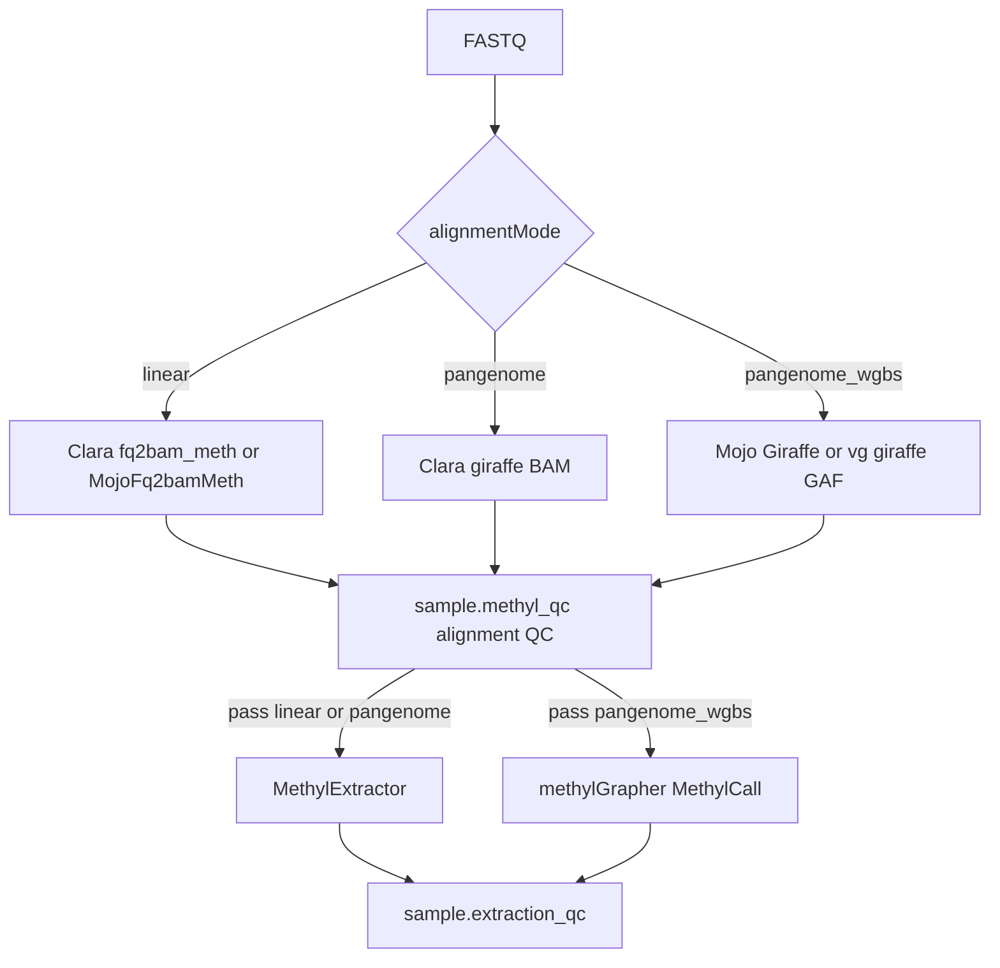

# SamplePrep tooling (cross-repo)

How MethylPipeline SamplePrep relates to **mojo-align**, **MethylExtractor**, and **NVIDIA Clara Parabricks**.

For the operator engine matrix see [Alignment engines](../usage/alignment-engines.md). For the full analysis and backlog see [cross-repo-tool-analysis plan](../plans/cross-repo-tool-analysis.plan.md) (AB#703). Post-align science GPU (centroid / methylutils) is a **separate** backend from Align DeviceContext — see [Portable GPU numeric](portable-gpu-numeric.md).

## Roles

| Component | Role |
|-----------|------|
| **MethylPipeline** | Orchestrator: DomainProgram branching, workers, `methylalignmentqc` / `methylextractionqc`, `/work` contracts |
| **mojo-align** | Canonical Mojo monorepo (`gpu-common`, `fq2bam-meth`, `giraffe`, `methylgrapher`, `numeric`) baked into `epimethyl/methylgrapher:1.70-mojo-*` |
| **MethylExtractor** | MethylDackel fork: BAM → per-chrom HDF5 + extraction JSON (linear / stock pangenome) |
| **Clara Parabricks** | Explicit linear / stock-pangenome engines; optional Picard `collectmultiplemetrics` |

## Alignment mode vs engine

`alignmentMode` is a **science** choice (procedure / instance). Align **engine** (Clara vs Mojo) is a **site / profile** choice under `actionConfig`.

| `alignmentMode` | Align action | Extract | Notes |
|-----------------|--------------|---------|-------|
| `linear` | `sample.parabricks_fq2bam` → Clara `fq2bam_meth` **or** `MojoFq2bamMeth` | `sample.methyl_extract` (MethylExtractor) | Mojo when `actionConfig.parabricks.engine=mojo` |
| `pangenome` | `sample.parabricks_giraffe` | MethylExtractor | Stock HPRC BAM; **not** mojo-align Giraffe |
| `pangenome_wgbs` | `sample.methylgrapher_wgbs_align` | `sample.methylgrapher_wgbs_extract` | Dual-graph GAF → MethylCall; Clara giraffe is **not** a GAF substitute |

Clara is never an automatic fallback when Mojo GPU alignment fails.



## Before / after comparison arms (originals retained)

Mojo / MethylExtractor / MethylCall are the preferred science path. **Do not remove** Clara `fq2bam_meth`, `vg giraffe` (`cpu_vg`), or optional upstream MethylDackel — they stay first-class for before/after bakeoffs. Production site defaults are **not** flipped by comparison runs.

| Arm | Align | Extract | Config knobs | Role |
|-----|-------|---------|--------------|------|
| Before (linear baseline) | Clara `fq2bam_meth` | MethylExtractor **or** optional MethylDackel | `parabricks.engine=parabricks` | Linear WGBS baseline |
| After (Mojo linear) | `MojoFq2bamMeth` | MethylExtractor | `parabricks.engine=mojo` | Portable Clara substitute |
| Before (graph oracle) | `vg giraffe` | MethylCall | `methylgrapher_wgbs.align_engine=cpu_vg` | Named-coordinate GAF baseline |
| After (Mojo WGBS) | MojoGiraffe | MethylCall / MergeCpG | `align_engine=gpu_giraffe` / `mojo_giraffe` | Preferred `pangenome_wgbs` |

Clara stock `pangenome` giraffe (BAM) remains for non-BS HPRC graphs; it is **not** a WGBS GAF substitute.

### Side-by-side sample layout

Canonical dirs under `/work/samples/<sampleId>/`. **Every SamplePrep instance** binds `sampleDir` to the arm leaf for its `alignmentMode` + engine so switching methods cannot overwrite another arm's BAM/QC/H5. FASTQs stay at the sample root and are hardlinked into the leaf. Compare harnesses use the same directories.

```text
/work/samples/<sampleId>/
  <sampleId>_1.fastq.gz          # shared FASTQs (sampleRoot)
  <sampleId>_2.fastq.gz
  align.linear.parabricks/       # sampleDir when linear + Clara
  align.linear.mojo/
  align.pangenome.parabricks/    # stock Clara giraffe (not WGBS)
  align.pangenome_wgbs.vg/
  align.pangenome_wgbs.mojo/
  extract.methylextractor/       # optional staging; production often writes H5 into sampleDir
  extract.methyldackel/          # optional A/B only — not a SamplePrep action
  .caas/                         # sample-identity skip store (not per-arm)
```

`sampleRoot` = `/work/samples/<sampleId>/` (FASTQ download, CAAS, `delete_fastqs`). `sampleDir` = `{sampleRoot}/{arm}` (align, QC, extract, BAM/H5 archive). Explicit `samples[].sampleDir` that already names an arm or legacy mode leaf is preserved.

Helpers: `methyl_utils.sample_arm_layout` (production bind) and `methyl_utils.testing.sample_prep_mode_compare` (bakeoff wrappers). Reports: `/work/samples/_comparisons/<stamp>/comparison.md` (+ JSON). Optional extract A/B: `scripts/compare_extract_methyldackel.sh`.

After a historical flat-root Clara run, `scripts/relocate_root_clara_products.py` moves root `{id}.bam` / `{id}.qc-metrics.tar` into `align.linear.parabricks/` without deleting existing `align.*` trees.

### Comparison vs production procedure packs

| Pack / overlay | Role | Notes |
|----------------|------|-------|
| `buffy_wgbs_pangenome_gene_fc` | **Production default** Buffy WGBS | Mojo Giraffe / MethylCall; do not flip away for bakeoffs |
| `buffy_wgbs_linear_gene_fc` | Comparison / Clara linear | Pins Clara `fq2bam_meth` + MethylExtractor |
| `buffy_wgbs_linear_mojo_gene_fc` | Comparison / Mojo linear | Pins `parabricks.engine=mojo` without changing site defaults |
| Instance overlay `actionConfig.methylgrapher_wgbs.align_engine=cpu_vg` | Comparison vg dual-map | Same WGBS procedure topology; engine overlay only vs production Mojo |

Example vg comparison overlay (instance / start payload — not a site edit):

```json
{
  "pipelineProcedure": "buffy_wgbs_pangenome_gene_fc",
  "actionConfig": {
    "methylgrapher_wgbs": { "align_engine": "cpu_vg" }
  }
}
```

Side-by-side dirs + report: `scripts/comparison_arms_report.py --sample-id … --ensure-arms`. Optional extract A/B: `scripts/compare_extract_methyldackel.sh` → `extract.methyldackel/` (host MethylDackel; version recorded in report JSON).

Release pins must keep Clara image + `vg` + MethylExtractor; MethylDackel is optional host tooling for extract A/B only.

See [comparison-arms-bakeoff plan](../plans/comparison-arms-bakeoff.plan.md).

## Two QC stages (do not conflate)

| Stage | Package / action | Inputs | Purpose |
|-------|------------------|--------|---------|
| **Alignment QC** | `methylalignmentqc` / `sample.methyl_qc` | Parabricks-shaped `{id}.json` / Picard tar, or methylGrapher `{id}.alignment_metrics.json` | Mapping / yield / cycle screening **before** extract |
| **Extraction QC** | `methylextractionqc` / `sample.extraction_qc` | `{id}.extraction_manifest.json` from MethylExtractor **or** methylGrapher extract | Coverage / conversion proxies / chromosome completeness **after** extract |

MethylExtractor’s `read_filtering` block is alignment-*adjacent* but is evaluated at **extraction** QC time. Alignment QC does not run MethylExtractor.

Metrics families for alignment QC:

- `parabricks` — Clara (or full Picard) linear / stock pangenome
- `mojo_linear` — MojoFq2bamMeth `metrics_source=samtools+placeholders` (real votes only; placeholders are not Clara-equivalent hard fails)
- `methylgrapher_wgbs` — pangenome_wgbs provenance

Task inputs must carry `alignmentMode` so family detection is fail-closed when artifacts from more than one family are present.

## Build / deploy pins

| Artifact | Typical path / pin |
|----------|-------------------|
| mojo-align → image | `MOJO_ALIGN_ROOT` → `scripts/stage_flat_image_tree.sh` → `build_mojo_align_image.sh` → `epimethyl/methylgrapher:1.70-mojo-{cuda,rocm}` |
| In-container prefix | `/opt/mojo-align` |
| Named-coords / overlays | `MOJO_ALIGN_OVERLAY`, `/work/epimethyl/images/*` — **not** hardcoded developer home paths |
| MethylExtractor | `/work/epimethyl/methyl-extractor-{aarch64\|amd64}/bin/MethylExtractor` via `METHYL_EXTRACTOR_BIN` |
| Clara | `METHYL_PARABRICKS_IMAGE` (e.g. `nvcr.io/nvidia/clara/clara-parabricks:4.7.0-1`) |

## Related docs

- [Mojo multi-GPU dual align](mojo-multi-gpu-dual-align.md)
- [Mojo fq2bam parity](../reference/mojo-fq2bam-meth-parity.md)
- [Sample preparation flow](../implementation/sample-preparation-flow.md)
- [methylalignmentqc USAGE](../../packages/methylalignmentqc/docs/USAGE.md)
- MethylExtractor `docs/extraction_qc_contract.md`
