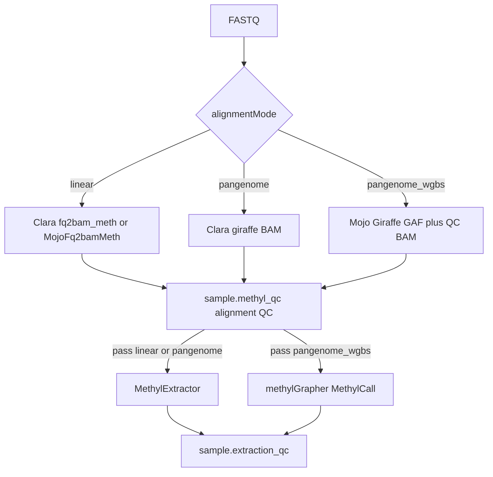

# SamplePrep tooling (cross-repo)

How MethylPipeline SamplePrep relates to **mojo-align**, **MethylExtractor**, legacy **methylGrapher-mojo**, and **NVIDIA Clara Parabricks**.

For the operator engine matrix see [Alignment engines](../usage/alignment-engines.md). For the full analysis and backlog see [cross-repo-tool-analysis plan](../plans/cross-repo-tool-analysis.plan.md) (AB#703).

## Roles

| Component | Role |
|-----------|------|
| **MethylPipeline** | Orchestrator: DomainProgram branching, workers, `methylalignmentqc` / `methylextractionqc`, `/work` contracts |
| **mojo-align** | Canonical Mojo monorepo (`gpu-common`, `fq2bam-meth`, `giraffe`, `methylgrapher`) baked into `epimethyl/methylgrapher:1.70-mojo-*` |
| **methylGrapher-mojo** | Pre-split monolith retained for rollback only — not for new development |
| **MethylExtractor** | MethylDackel fork: BAM → per-chrom HDF5 + extraction JSON (linear / stock pangenome) |
| **Clara Parabricks** | Explicit linear / stock-pangenome engines; optional Picard `collectmultiplemetrics` |

## Alignment mode vs engine

`alignmentMode` is a **science** choice (procedure / instance). Align **engine** (Clara vs Mojo) is a **site / profile** choice under `actionConfig`.

| `alignmentMode` | Align action | Extract | Notes |
|-----------------|--------------|---------|-------|
| `linear` | `sample.parabricks_fq2bam` → Clara `fq2bam_meth` **or** `MojoFq2bamMeth` | `sample.methyl_extract` (MethylExtractor) | Mojo when `actionConfig.parabricks.engine=mojo` |
| `pangenome` | `sample.parabricks_giraffe` | MethylExtractor | Stock HPRC BAM; **not** mojo-align Giraffe |
| `pangenome_wgbs` | `sample.methylgrapher_wgbs_align` | `sample.methylgrapher_wgbs_extract` | Dual-graph GAF → MethylCall; Clara giraffe is **not** a GAF substitute |

Clara is never an automatic fallback when Mojo GPU alignment fails.

## Two QC stages (do not conflate)

| Stage | Package / action | Inputs | Purpose |
|-------|------------------|--------|---------|
| **Alignment QC** | `methylalignmentqc` / `sample.methyl_qc` | Parabricks-shaped `{id}.json` / Picard tar, or methylGrapher `{id}.alignment_metrics.json` | Mapping / yield / cycle screening **before** extract |
| **Extraction QC** | `methylextractionqc` / `sample.extraction_qc` | `{id}.extraction_manifest.json` from MethylExtractor **or** methylGrapher extract | Coverage / conversion proxies / chromosome completeness **after** extract |

MethylExtractor’s `read_filtering` block is alignment-*adjacent* but is evaluated at **extraction** QC time. Alignment QC does not run MethylExtractor.

Metrics families for alignment QC:

- `parabricks` — Clara (or full Picard) linear / stock pangenome
- `mojo_linear` — MojoFq2bamMeth `metrics_source=samtools+placeholders` (real votes only; placeholders are not Clara-equivalent hard fails)
- `methylgrapher_wgbs` — pangenome_wgbs provenance

Task inputs must carry `alignmentMode` so family detection is fail-closed when artifacts from more than one family are present.

## Build / deploy pins

| Artifact | Typical path / pin |
|----------|-------------------|
| mojo-align → image | `METHYLGRAPHER_MOJO_ROOT` → `scripts/stage_flat_image_tree.sh` → `build_methylgrapher_mojo_image.sh` → `epimethyl/methylgrapher:1.70-mojo-{cuda,rocm}` |
| In-container prefix | `/opt/methylgrapher-mojo` (name is historical; source of truth is mojo-align) |
| Named-coords / overlays | `METHYLGRAPHER_MOJO_OVERLAY`, `/work/epimethyl/images/*` — **not** hardcoded developer home paths |
| MethylExtractor | `/work/epimethyl/methyl-extractor-{aarch64\|amd64}/bin/MethylExtractor` via `METHYL_EXTRACTOR_BIN` |
| Clara | `METHYL_PARABRICKS_IMAGE` (e.g. `nvcr.io/nvidia/clara/clara-parabricks:4.7.0-1`) |

## Related docs

- [Mojo multi-GPU dual align](mojo-multi-gpu-dual-align.md)
- [Mojo fq2bam parity](../reference/mojo-fq2bam-meth-parity.md)
- [Sample preparation flow](../implementation/sample-preparation-flow.md)
- [methylalignmentqc USAGE](../../packages/methylalignmentqc/docs/USAGE.md)
- MethylExtractor `docs/extraction_qc_contract.md`
