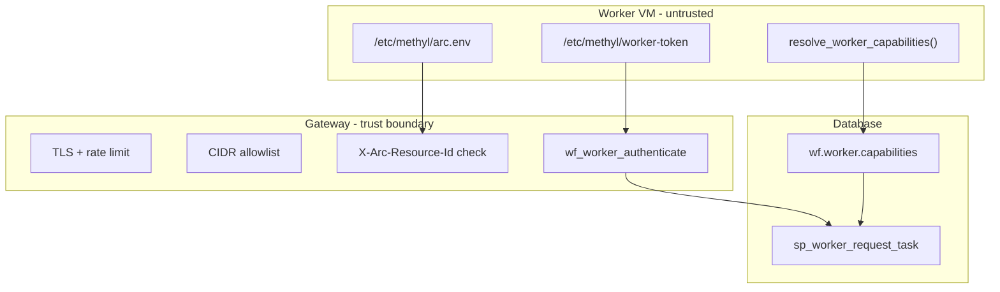

# Worker security review

> **Status:** Review complete (2026-07-01). Hardening items tracked in
> [`worker-transport-security.plan.md`](../plans/worker-transport-security.plan.md).

## Threat model

| Threat | Actor | Impact |
|--------|-------|--------|
| Stolen worker token | Compromised VM, leaked env file | Claim/submit tasks as that worker |
| Rogue worker registration | Attacker with DB or registration script access | Advertise false capabilities |
| Network interposition | MITM on worker→gateway path | Token replay, task tampering |
| Capability mismatch | CPU node claims GPU task (pre-fix) | Wasted lease, opaque runtime failure |
| Shared `/work` token leakage | Multi-tenant NFS | Cross-VM credential exposure |
| Unattested VM | Unmanaged GPU host | No Defender/Sentinel visibility |

**Assumptions:** Gateway and Azure SQL/PostgreSQL are in the trust zone. Workers are
**untrusted** except for their registered capability set and cluster membership.

## Layer-by-layer: current vs target

| Layer | Current | Target | Priority |
|-------|---------|--------|----------|
| **Network** | TLS via nginx; optional `GATEWAY_WORKER_IP_BIND` + cluster CIDR | Egress-only workers; per-cluster CIDR on gateway NSG; no public worker inbound | P0 |
| **Transport** | HTTPS REST JSON | Same (see [transport decision](worker-transport-decision.md)) | — |
| **Authentication** | `worker_id` + SHA2_256 token hash | Same + per-VM token file (600), Key Vault bootstrap | P0 |
| **Authorization (dispatch)** | Poll `capability` param only; `wf.worker.capabilities` ignored | **Capabilities authoritative** at `sp_worker_request_task`; poll param narrows only | P0 |
| **Attestation** | `GATEWAY_REQUIRE_ARC_ATTEST` exists; worker did not send header | Worker sends `X-Arc-Resource-Id` from `/etc/methyl/arc.env` | P1 |
| **Secrets** | `WORKER_TOKEN` in shared `/work/goliath/env/worker.env` | `/etc/methyl/worker-token` (root 600) + KV rotation via `wf.worker_token.expires_at_utc` | P0 |
| **Integrity** | Release bundle on shared storage | Cloud-init checksum verify before install (IaC) | P1 |
| **Audit** | `wf.worker.last_seen_at_utc`, action manifests on `/work` | Arc → Defender/Sentinel; gateway access logs | P1 |
| **Execute-time guard** | GPU tasks fail late in Docker/CLI | `handlers.py` rejects GPU-required actions without hardware | P2 |

## Prioritized recommendations

### P0 — Implemented in this increment

1. **Capability-based dispatch** — `sp_worker_request_task` joins `wf.worker.capabilities`;
   workers never receive tasks outside their registered set. Omnibus (`NULL`, `[]`, `"*"`) preserved
   for migration.
2. **Auto-detect capabilities at registration** — `resolve_worker_capabilities()` on the VM;
   provisioning registers concrete sets.
3. **Token off shared `/work`** — credentials written to `/etc/methyl/worker-token` (mode 600);
   systemd `EnvironmentFile` updated.
4. **Deploy env examples** — `deploy/env/gateway.env.example`, `worker.env.example`.

### P1 — Implemented / IaC scaffold

5. **Arc header end-to-end** — `WorkflowRestClient` sends `X-Arc-Resource-Id`.
6. **`verify_arc_prereqs.sh`** — requires live `azcmagent` Connected status (env file alone insufficient).
7. **Multi-cloud Terraform** — control plane on Azure; Nebius/Lambda workers via Arc + KV token fetch.
8. **Gateway security env** — document `GATEWAY_WORKER_IP_BIND`, `GATEWAY_REQUIRE_ARC_ATTEST`.

### P2 — Ongoing operations

9. **Token rotation** — issue new `wf.worker_token` row, update KV secret, rolling worker restart.
10. **Re-register after hardware change** — GPU swap or Parabricks install requires re-run
    `register_worker.py --auto-detect`.
11. **Omnibus deprecation** — migrate legacy workers from `NULL` capabilities to detected lists.

## Security controls map

## Runbook cross-links

- [Worker node deployment](../deployment/worker_node.md)
- [Distributed workers bootstrap](../deployment/distributed-workers-bootstrap.md)
- [Production runbook](../deployment/production_runbook.md)
- [Multi-cloud IaC](../deployment/multicloud-iac.md)

## References

- [`worker-transport-decision.md`](worker-transport-decision.md)
- [`workers/WORKER_PROTOCOL.md`](../../workers/WORKER_PROTOCOL.md)
- [`workflow_engine/contract/db_objects.md`](../../workflow_engine/contract/db_objects.md)
