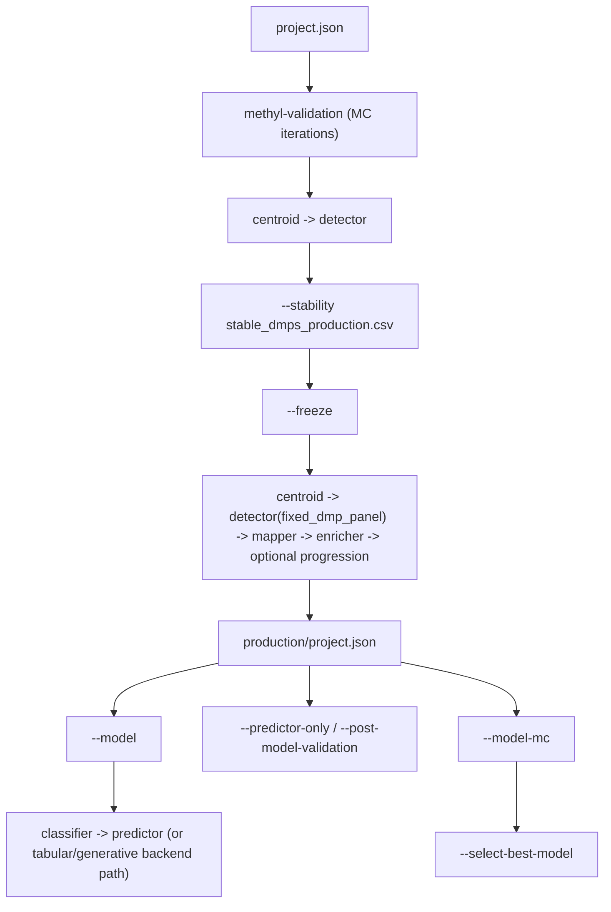

# MethylPipeline Code-First Discovery Report

Date: 2026-04-11  
Scope: analysis only (no documentation replacement in this phase)

## Status Note (Post-Cleanup)

This report preserves the discovery-time snapshot used to plan remediation.  
Some findings listed below (for example broken `06-methylcluster.qmd` links and active-workflow wording) were subsequently addressed during phase-2 documentation cleanup.

Current canonical status after cleanup:
- active workflow docs exclude `MethylCluster` from production-path sections
- broken links to `docs/theory/chapters/06-methylcluster.qmd` were removed/repointed
- legacy `MethylCluster` content is isolated to deprecated/compatibility contexts

## 1) Deprecated `MethylCluster` Reference Inventory

Classification policy used:
- **Remove**: references that keep `methylcluster` in the active workflow.
- **Move to appendix**: historical/deprecation notes that should exist only in a legacy appendix.
- **Retain**: references required for executable compatibility (package membership, CLI entry points).

### 1.1 User-facing docs with `MethylCluster` references

| File | Evidence | Classification | Reason |
|---|---|---|---|
| `README.md` | Package list includes `methylcluster` as active package | Remove from main workflow | Canonical docs should exclude it from active path |
| `docs/architecture/index.md` | Narrative + diagrams include `methylcluster` node | Remove from main workflow | Conflicts with deprecation direction |
| `docs/Next Steps.md` | Section `MethylCluster (Deprecated)` | Move to appendix | Keep historical context only |
| `docs/theory/DOCUMENTATION_PLAN.md` | Mentions `chapters/06-methylcluster.qmd` | Remove | Stale plan (chapter file absent) |
| `docs/theory/chapters/11-project-configuration.qmd` | Table row for `cluster` -> `methyl-cluster` | Move to appendix | Keep only as legacy compatibility note |
| `packages/methylcluster/docs/USAGE.md` | Links to missing `06-methylcluster.qmd`; CLI mention | Move to appendix + fix broken link | Package exists, but should be historical |
| `packages/methylcluster/docs/THEORY.md` | Canonical chapter link points to missing file | Move to appendix + fix broken link | Broken reference and deprecated narrative |
| `packages/methylcluster/docs/IMPLEMENTATION.md` | Active-style implementation narrative | Move to appendix | Keep only as legacy technical reference |
| `docs/theory/README.md` | Explicit migration note says MethylCluster removed | Retain | Already aligned with target state |
| `docs/reference/config-parameter-matrix.md` | Explicitly excludes `methylcluster` | Retain | Already aligned with target state |

### 1.2 Compatibility references that must remain (for now)

| File | Evidence | Classification |
|---|---|---|
| `pyproject.toml` | Workspace `pythonpath` includes `packages/methylcluster` | Retain |
| `scripts/install_all.sh` | Installs `methylcluster` package | Retain |
| `packages/methylcluster/pyproject.toml` | Exposes `methyl-cluster` CLI | Retain |
| `docker/docker-compose.yml` | Includes methylcluster in `PYTHONPATH` | Retain |

### 1.3 Broken/stale reference requiring cleanup in phase 2

- Missing target file: `docs/theory/chapters/06-methylcluster.qmd`
- Broken links currently present in:
  - `packages/methylcluster/docs/USAGE.md`
  - `packages/methylcluster/docs/THEORY.md`
  - `docs/theory/DOCUMENTATION_PLAN.md` (stale planning tree)

---

## 2) Code-Derived Architecture and Execution Map

## 2.1 Monorepo execution contracts from code/config

- Root environment + test contract is defined in `pyproject.toml`:
  - Python `>=3.10,<3.13`
  - monorepo `pythonpath` across package roots
  - tests under `packages/*/tests`
- Install orchestration is in `scripts/install_all.sh`, including dependency order:
  1. `methylutils`
  2. `methylcentroid`
  3. `methylcluster`
  4. `methyldetector`
  5. `methylmapper`
  6. `methylclassifier`
  7. `methylenricher`
  8. `methyldiseaseprogression`
  9. `methylalignmentqc`
  10. `methylpredictor`
  11. `methylvalidation`
- Canonical local test runner is `scripts/run_tests.sh` and always uses `.venv/bin/python -m pytest`.

## 2.2 Canonical CLI surface from package `pyproject.toml`

- `methyl-centroid`, `methyl-centroid-explorer`
- `methyl-detector`, `methyl-detector-explorer`
- `methyl-classifier`
- `methyl-predictor`
- `methyl-validation`
- `methyl-mapper`
- `methyl-enricher`
- `methyl-disease-progression`
- `methyl-alignment-qc` / `methyl-qc`
- legacy/deprecated path still present: `methyl-cluster`

## 2.3 End-to-end execution flow implemented today

Primary orchestration is in `packages/methylvalidation/methyl_validation/cli.py`, `pipeline_runner.py`, and `stability.py`.

## 2.4 Usage playbooks derived from code paths

### Installation

- Local/dev venv path enforced by scripts/rules:
  - create/activate `.venv`
  - install package stack in editable/develop mode
- Containerized install path:
  - `scripts/setup_dev.sh` builds container and runs `scripts/install_all.sh`
  - optional `--pipeline-reqs` and `--gpu-reqs` in `scripts/install_all.sh`

### Upgrade strategy (code-backed)

- Re-run package installs in dependency order via `scripts/install_all.sh`.
- Reinstall optional requirement sets when stack changes:
  - `requirements-pipeline.txt`
  - `requirements-gpu.txt`
- Re-run monorepo tests via `scripts/run_tests.sh` to validate upgrade integrity.

### Full project execution (production path)

1. Run MC iterations (`methyl-validation`) to generate run artifacts.
2. Run `--stability` to produce stable DMP panel.
3. Run `--freeze` (requires stable panel file) to create `production/project.json` with `fixed_dmp_panel`.
4. Run `--model` to train production model artifacts.
5. Optionally run `--post-model-validation` for frozen-model evaluation.

### Step-by-step execution boundaries (from `pipeline_runner.py`)

- MC iteration mode: `methyl-centroid` -> `methyl-detector`
- Freeze mode: `methyl-centroid` -> `methyl-detector` -> `methyl-mapper` -> `methyl-enricher` -> optional `methyl-disease-progression`
- Model mode: `methyl-classifier` -> `methyl-predictor`
- Predictor-only mode: `methyl-predictor` only, using frozen artifacts

---

## 3) Theoretical Foundations to Implementation Traceability

## 3.1 Core theory actually implemented

| Foundation | Implementation evidence | Runtime location |
|---|---|---|
| ECDF/PCHIP likelihood classification | `methyl_utils/ecdf_classifier.py` (`ECDFClassifier`, weighted log-likelihood, temperature/priors, Platt calibration) | classifier inference/training handoff |
| Nonparametric and aggregate hypothesis testing | `methyl_utils/statistical_tests.py` (`ecdf_ks_*`, Mann-Whitney, multiple p-value aggregation methods, Storey q-values) | detector significance + filtering |
| Effect size and overlap constructs | `effect_size_from_components`, `ecdf_effect_size` in `statistical_tests.py` | detector biological ranking/export |
| DMP screening and configurable selection | `methyl_detector/core/methyldetector.py` (q-value filtering, effect-size coverage, featurecuts, fixed panel bypass) | detector pipeline |
| Multi-class / OvR fusion + calibration | `methyl_classifier/core/classifier.py` (OvR support, isotonic calibration, chromosome weighting) | model build/predict |
| Metrics and probabilistic diagnostics | `methyl_predictor/core/predictor.py` (balanced accuracy, confusion matrix, probabilistic diagnostics) | evaluation and report artifacts |

## 3.2 Explicitly non-theoretical / operational controls

- Backend selection and rollout gating are operational/model-governance logic:
  - `methyl_validation/cli.py` (`--model-mc`, `--select-best-model`, `--rollout-compare`)
  - `methyl_validation/rollout.py` (baseline/candidate tolerance checks)
- Production model gate includes biological review guard in:
  - `methyl_validation/config.py` (`require_biological_review_for_model`, `biological_review_confirmed`)

---

## 4) Unused Code and Superseded/Legacy Parameter Audit

Confidence rubric:
- **High**: strong static evidence of no imports/usage in repo.
- **Medium**: backwards-compatible or metadata fields with little/no current pipeline consumption.
- **Low**: intentional compatibility shims or deprecated-but-still-active flags.

## 4.1 High-confidence likely unused/orphan code

| Finding | Evidence | Confidence | Status (2026-07) |
|---|---|---|---|
| `methyl_alignment_qc/core/wgbs_parabricks_qc.py` | Imported by `writer.py` and `scripts/alignment_qc_cohort_screening.py` | — | **Active — keep** |
| `methyl_cluster/methyl_cluster_dp.py` | Was orphan-only | High | **Removed** — no longer in tree |
| `methyl_utils/modeling/methyl_detector.py` | Was disconnected | High | **Removed** — no longer in tree |

## 4.2 Medium-confidence superseded or weakly used fields

| Finding | Evidence | Confidence | Action |
|---|---|---|---|
| `actionConfig.validator` superseded by `actionConfig.predictor` | `pipeline_config.normalize_predictor_step_key` copies + warns deprecation | Medium | Keep shim temporarily; remove from canonical docs and mark removal target |
| Project metadata fields (`disease_name`, `laboratory`, `batch`) are weakly consumed in runtime paths | Present in schema, not strongly represented in execution branches | Medium | Verify external consumers before deprecation |
| Legacy direct-script main block in centroid module | `methyl_centroid/methyl_centroid.py` has standalone `__main__` path while packaged CLI is canonical | Medium | Keep only if still used manually; otherwise remove |

## 4.3 Low-confidence (legacy but still functionally used)

| Finding | Evidence | Confidence | Action |
|---|---|---|---|
| Deprecated credential flags in mapper CLI (`--use-azure`, `--use-encrypted-file`) | Explicitly marked deprecated but still parsed in `main_credentials()` | Low | Document as legacy-only; remove in a breaking-change window |
| Duplicate DMP export path helpers | Intentional duplication with compatibility note between detector/util packages | Low | Keep synced with shared tests; consider wrapper refactor later |

---

## 5) Phase-2 Blueprint: Single Root Canonical Documentation

Target file (proposed): `README.md` as canonical root narrative, backed only by code/config evidence.

## 5.1 Required top-level structure

1. **Theoretical Foundations**
   - ECDF/PCHIP model, statistical tests, effect-size logic, calibration.
   - Cite only implementation files from section 3.

2. **Implementation**
   - Monorepo package map and CLI surface from package `pyproject.toml`.
   - Data/config contracts from `pipeline_config.py` and validation orchestration.

3. **Usage**
   - Installation (venv + container paths)
   - Upgrade procedure (reinstall order + test checks)
   - Full project execution (`MC -> stability -> freeze -> model -> post-model-validation`)
   - Step-by-step execution by CLI boundaries

4. **Strategy Playbooks**
   - Initial research
   - Disease characterization
   - Model creation
   - Final prediction based on best model

5. **Deprecated Appendix**
   - `MethylCluster` historical/compatibility references only (no active workflow placement)

## 5.2 Strategy playbooks (code-grounded skeleton)

### A) Initial research strategy

- Start with MC runs (`methyl-validation`) and detector outputs.
- Use stability outputs (`stable_dmps_production.csv`) as reproducible feature anchor.
- Generate mapping/enrichment during `--freeze` for interpretation context.

### B) Disease characterization strategy

- Use detector effect-size-ranked DMPs and q-value filtered panel.
- Use mapper/enricher outputs for gene/pathway-level interpretation.
- Optional progression synthesis via `actionConfig.progression.enabled`.

### C) Model creation strategy

- Run `--freeze` after stable panel generation.
- Run `--model` for production artifacts.
- For backend comparison, run `--model-mc` then rank with `--select-best-model`.

### D) Final prediction strategy (best model)

- Promote best backend from model-mc ranking.
- Build final all-data model (automatic in `--select-best-model` flow).
- Evaluate via `--post-model-validation` and/or predictor-only repeated runs.
- Use rollout gate (`--rollout-compare`) for baseline-vs-candidate promotion decision.

## 5.3 Phase-2 acceptance checks

- No active workflow section presents `MethylCluster`.
- Every claim in canonical root doc maps to code/config path.
- Usage commands align with implemented argument constraints in `methyl_validation/cli.py`.
- Legacy/deprecated material isolated in appendix only.

---

## Appendix A: Key source files used in this report

- `pyproject.toml`
- `scripts/install_all.sh`
- `scripts/run_tests.sh`
- `install.sh`
- `scripts/setup_dev.sh`
- `packages/methylvalidation/methyl_validation/cli.py`
- `packages/methylvalidation/methyl_validation/pipeline_runner.py`
- `packages/methylvalidation/methyl_validation/stability.py`
- `packages/methylvalidation/methyl_validation/config.py`
- `packages/methylvalidation/methyl_validation/rollout.py`
- `packages/methyldetector/methyl_detector/core/methyldetector.py`
- `packages/methyldetector/methyl_detector/models/config.py`
- `packages/methylutils/methyl_utils/ecdf_classifier.py`
- `packages/methylutils/methyl_utils/statistical_tests.py`
- `packages/methylutils/methyl_utils/pipeline_config.py`
- `packages/methylclassifier/methyl_classifier/core/classifier.py`
- `packages/methylpredictor/methyl_predictor/core/predictor.py`
- `packages/methyldiseaseprogression/methyl_disease_progression/cli.py`
