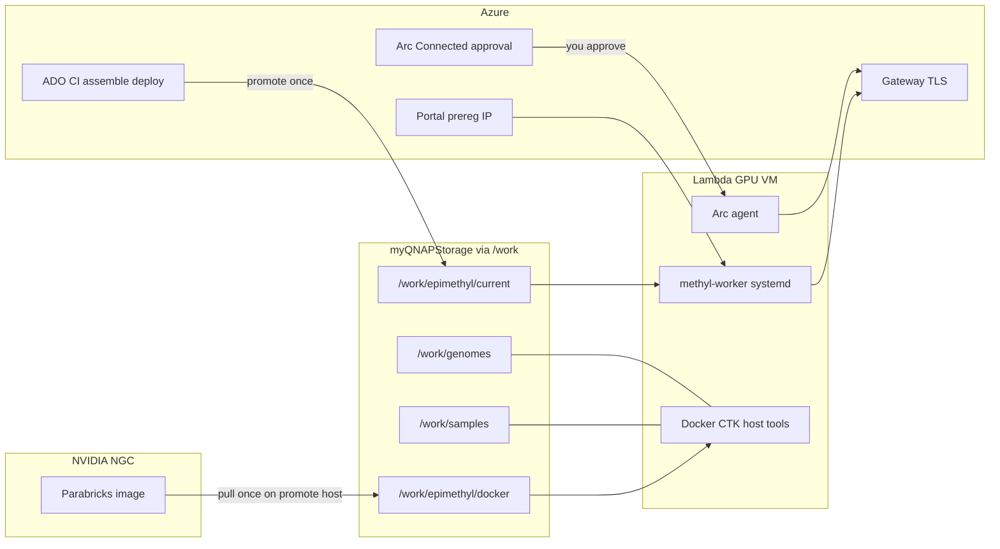

# Lambda GPU worker join (easy / safe / fast)

Canonical runbook for joining a **Lambda** (or similar) GPU VM to an existing Epimethyl cluster.
Deep dive for Arc policy: [arc_worker_runbook.md](arc_worker_runbook.md).
Platform phases: [production-platform.md](production-platform.md).

## Mental model — five roles, not one store

| Store / service | Holds | Who writes | Workers use it for |
|-----------------|-------|------------|--------------------|
| **Azure DevOps / Artifacts** | MethylPipeline wheels + runtime-bundle, MethylExtractor arch tarballs, assemble/deploy pipelines | CI on tag + manual assemble/deploy | Source of the **release** that gets promoted to QNAP |
| **myQNAPStorage → `/work`** | `epimethyl/` (current release, venvs, extractor, shared Docker data-root), `genomes/`, `samples/`, `site/`, projects | Deploy pipeline / ops / provision-assets | Day-2 runtime (no git on workers) |
| **NGC (not Azure)** | Clara Parabricks container layers | One promote host with NGC login → `/work/epimethyl/docker` | GPU SamplePrep linear/Giraffe paths |
| **Azure Arc** | Connected Machine inventory, policy, `X-Arc-Resource-Id` | You (human approval) or approved SP | Gateway attest — **not** release bits or enroll API |
| **Portal + gateway** | Preregistered public IP → one-time `worker_token` | Portal UI + `methyl-worker enroll` | Trust join for claim/submit |

**Containers are not in Azure.** Parabricks comes from NGC into shared `/work/epimethyl/docker`. methylGrapher-mojo (and similar GPU side-cars) are separate images — not part of Epimethyl-Release-Deploy. MethylPipeline and MethylExtractor stay as **wheels + native per-arch binaries** on the share (not omnibus containers).



## A. Cluster bootstrap (once per release / share) — not on every VM

1. Ops mounts QNAP so admin and workers see `/work/epimethyl`, `/work/genomes`, `/work/samples`, `/work/site`. Then `bash scripts/init_work_layout.sh --work /work` so `/work/samples` is other-writable and `/work/genomes` / `/work/epimethyl` stay worker-readable (`0755`).
2. Run **Epimethyl-Release-Assemble** + approved **Epimethyl-Release-Deploy** until `/work/epimethyl/current/manifest.json` exists (MethylPipeline + MethylExtractor only).
3. On a host that already sees that share and has NGC login: one Parabricks pull into `/work/epimethyl/docker` (first arch); later arches use `--skip-docker-pull` / `--skip-parabricks-pull`.
4. Genomes/site stay Phase 0 ([production-platform.md](production-platform.md#phase-0-shared-storage-and-site)) — separate from worker enroll.

## B. Per worker (including the “first” Lambda box)

`--join-mode auto` (default): if `current/manifest.json` is missing, this VM seeds shared `/work` then enrolls; if present, it enrolls first then installs only VM-local Docker/CTK/host tools.

### 1. Portal preregistration

In the EpiPortal UI, preregister this VM’s **public IP**, `cluster_key`, and worker `key` (usually `hostname -s`).

### 2. Mount + preflight (fail closed)

Ops mounts `/work`. Then:

```bash
export WORKER_API_BASE=https://<gateway-fqdn>/v1
bash /work/epimethyl/current/runtime-bundle/scripts/preflight_worker_join.sh \
  --gpu --require-api --require-current
```

If `current/manifest.json` is missing, **stop** and run Epimethyl-Release-Deploy on the share first. Do **not** promote from the worker by default.

### 3. Prepare (local install, no Arc)

```bash
sudo bash /work/epimethyl/current/runtime-bundle/scripts/provision_worker_node.sh \
  --gpu --join-mode join --prepare-only --cluster gpu-west
```

This installs host tools, Docker Engine + NVIDIA Container Toolkit, points Docker `data-root` at `/work/epimethyl/docker`, and refreshes local env — **without** Arc, enroll, or Parabricks re-pull.

### 4. Arc (human-gated, short step)

```bash
export AZ_SUBSCRIPTION_ID=… AZ_RESOURCE_GROUP=… AZURE_TENANT_ID=…

sudo bash /work/epimethyl/current/runtime-bundle/scripts/install_arc_agent.sh \
  --subscription-id "$AZ_SUBSCRIPTION_ID" \
  --resource-group "$AZ_RESOURCE_GROUP" \
  --tenant-id "$AZURE_TENANT_ID" \
  --tags "cluster_key=gpu-west,environment=prod" \
  --with-ama

# Approve Connected in Azure Portal (or approved SP path), then:
bash /work/epimethyl/current/runtime-bundle/scripts/verify_arc_prereqs.sh
```

### 5. Finish enroll + systemd

```bash
export WORKER_API_BASE=https://<gateway-fqdn>/v1
sudo bash /work/epimethyl/current/runtime-bundle/scripts/provision_worker_node.sh \
  --gpu --join-mode join --finish-enroll --require-arc \
  --enroll-worker --enable-systemd --detect-capabilities \
  --cluster gpu-west
```

Node 2..N: same B; never re-promote; never re-pull Parabricks.

### Optional one-shot (Arc already Connected)

```bash
sudo bash …/provision_worker_node.sh \
  --gpu --join-mode join --require-arc \
  --enroll-worker --enable-systemd --detect-capabilities \
  --cluster gpu-west
```

### Escape hatch: promote from a VM (`--join-mode first`)

Only when an admin intentionally promotes on a host that already has the release bundle + NGC credentials — **not** the Lambda happy path.

## Why staged Arc

| Approach | Problem |
|----------|---------|
| Arc inside long cloud-init | Machine sits half-configured waiting for approval; hard to resume |
| **Prepare → you approve → finish-enroll** | Local install finishes immediately; your session is only Arc + enroll |

Terraform `worker-common` cloud-init defaults to **`--prepare-only`**. After you approve Arc, run `--finish-enroll` (see [multicloud-iac.md](multicloud-iac.md)).

## Related

- [production-platform.md — Phase 4](production-platform.md#phase-4-each-gpu-worker-arc-enroll)
- [operator-journey.md](operator-journey.md)
- [gpu_worker_runbook.md](gpu_worker_runbook.md)
- [worker_provision.md](worker_provision.md)
