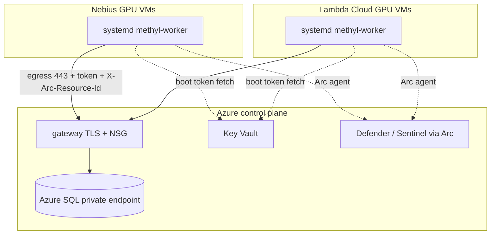

# Multi-cloud infrastructure (Terraform)

> **Status:** Scaffold deployed (2026-07-01). `terraform apply` is operator-only.

## Architecture

Azure hosts the **control plane** (gateway, Azure SQL with private endpoint, Key Vault,
Entra app registrations, Defender/Sentinel). GPU worker fleets run as **systemd VMs** on
Nebius and Lambda Cloud, onboarded via **Azure Arc** for cross-cloud governance.

Repository layout: [`deploy/terraform/README.md`](../../deploy/terraform/README.md).

## Per-cloud notes

| Cloud | Model | Provider | Status |
|-------|-------|----------|--------|
| **Azure** | Control plane + optional Azure GPU workers | `hashicorp/azurerm` (official) | Scaffold module |
| **Nebius** | GPU VMs, egress-only network | `nebius/nebius` (official) | Scaffold module |
| **Lambda Cloud** | GPU VMs | `lambdaops/lambda` **community** | Scaffold + supply-chain pin |
| **CoreWeave** | CKS Kubernetes only | k8s manifests (not Terraform VMs) | Design follow-on |

### Lambda provider risk

The Lambda Terraform provider is **community-maintained** (no vendor SLA). Mitigations:

- Pin exact version in `deploy/terraform/versions.tf`
- Review provider changelog on upgrade
- Prefer Nebius official provider for production GPU pools when both are available

### Nebius

Use official `nebius/nebius` provider for GPU instances, encrypted disks, key-only SSH,
and `user_data` from `worker-common` cloud-init. API keys live in Key Vault — never in
Terraform state (use write-only/ephemeral variables where supported).

## Secure state and secrets

| Asset | Storage |
|-------|---------|
| Terraform state | Azure Storage backend, encrypted, RBAC, versioning, no public access |
| Worker enroll token | Issued by gateway after portal IP preregistration (`methyl-worker enroll`) → `/etc/methyl/worker-token` |
| Cloud API keys (Nebius, Lambda) | Key Vault / CI secret store |
| Worker credentials on VM | `/etc/methyl/worker-token` mode 600 |

Terraform modules **do not** embed worker tokens in state. `worker-common` cloud-init
extracts a **scripts seed** tarball to `/opt/methyl`, preflights QNAP `/work/epimethyl/current`,
and runs **join-only prepare** by default (`--prepare-only`). Portal prereg + Arc approval +
`--finish-enroll` remain operator steps — see [lambda_worker_join.md](lambda_worker_join.md).

## Operator workflow

1. **Control plane** — `cd deploy/terraform/envs/<env> && terraform init && terraform apply`
   (requires Azure credentials).
2. **Populate Key Vault** — Nebius SA key, Lambda API key (cloud provider creds — not worker tokens).
3. **Cluster once** — promote GoliathOmics release + Parabricks to QNAP `/work` ([lambda_worker_join.md](lambda_worker_join.md) §A).
4. **Worker fleet** — apply `worker-nebius` or `worker-lambda` with `worker-common`
   `cloud_init` output (default prepare-only).
5. **Per VM** — portal-preregister public IP → approve Arc Connected →
   `provision_worker_node.sh --finish-enroll`.
6. **Gateway NSG** — set `gateway_allowed_worker_cidrs` to each fleet egress CIDR
   (feeds `wf.cluster.allowed_source_cidrs` at registration).
7. **Verify** — `scripts/verify_arc_prereqs.sh`, worker poll test.

## Capability tie-in

After `--finish-enroll` (or a non-prepare cloud-init path):

1. `resolve_worker_capabilities()` probes GPU, Parabricks, extractor, CLIs at enroll time.
2. Gateway enroll writes capabilities to `wf.worker`.
3. `sp_worker_request_task` only returns matching tasks.
4. systemd installs `methyl-worker@<capability>.service` per detected cap (or omnibus) when `--detect-capabilities` is set.

## CoreWeave follow-on (design only)

CoreWeave **CKS** is Kubernetes-native — not a VM+bash model.

| Component | Approach |
|-----------|----------|
| Cluster | Terraform VPC + CKS cluster + GPU node pool |
| Worker | Container image from epimethyl release + `methyl-worker` entrypoint |
| Token | Kubernetes Secret mounted read-only; sync from Key Vault via CSI |
| Governance | Arc-enabled Kubernetes extension |
| Deploy | Helm chart (`charts/methyl-worker`) — **not yet in repo** |

Steps to implement later:

1. Publish `methyl-worker` container image (CUDA base + epimethyl venv).
2. Helm chart: Deployment, ServiceAccount, Secret, GPU `nodeSelector`, liveness via `/workers/authenticate`.
3. Terraform module `worker-coreweave-cks` wrapping cluster + Helm release.

Until then, Nebius and Lambda VM fleets are the supported multi-cloud GPU path.

## References

- [Worker transport decision](../architecture/worker-transport-decision.md)
- [Worker security review](../architecture/worker-security-review.md)
- [Worker provisioning](worker_provision.md)
- [Distributed workers bootstrap](distributed-workers-bootstrap.md)
