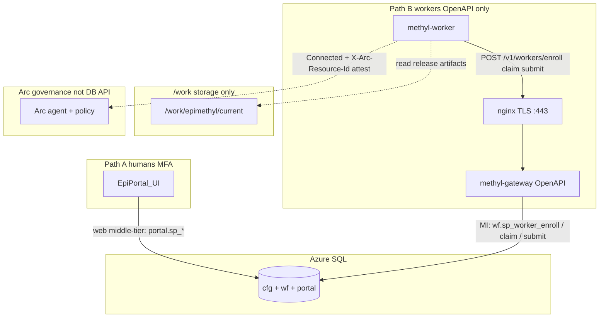

# Production platform deployment

Canonical greenfield guide for the **production** MethylPipeline control plane and GPU workers.

This page is the single ordered story. Deep dives stay in the linked runbooks; if another doc disagrees, **this page and the enroll/Arc runbooks win**.

| Related | Role |
|---------|------|
| [operator-journey.md](operator-journey.md) | Day-1 → day-N navigation index |
| [production_release.md](production_release.md) | MethylPipeline + MethylExtractor release assemble/promote |
| [production_runbook.md](production_runbook.md) | Study execution + gateway security detail |
| [arc_worker_runbook.md](arc_worker_runbook.md) | Azure Arc onboarding, policy, incident response |
| [worker_provision.md](worker_provision.md) | Per-VM GPU join playbook |
| [gpu_worker_runbook.md](gpu_worker_runbook.md) | Driver, Docker data-root, Parabricks |
| [distributed-workers-bootstrap.md](distributed-workers-bootstrap.md) | DB schema + catalog seed (privileged host) |

## Topology

**Day-2 production has exactly two ways to reach Azure SQL.** Everything else is greenfield/bootstrap on a privileged host (Phase 2), not a third runtime client.

| Path | Who | How |
|------|-----|-----|
| **A — Portal UI (web)** | Operators (MFA / company identity) | Browser → EpiPortal → Azure SQL (`portal.sp_*` / `cfg`). Studies, worker IP prereg, monitoring. |
| **B — Gateway REST** | GPU workers only | `methyl-worker` → HTTPS OpenAPI (`/v1/workers/*`) → `methyl-gateway` (MI) → `wf` procs. |

There is **no** worker SQL, **no** portal→gateway admin HTTP, and **no** day-2 “operator SQL / Admin CLI against production” path. CI/`methyl-study-start` and schema seed scripts are **bootstrap/parity** only (Phase 2 / Dev-only below).

**Preregistration ≠ enroll.**



### Access model (code)

| Actor | How they reach Azure SQL | Evidence |
|-------|--------------------------|----------|
| **EpiPortal UI** (MFA) | Web app → `portal.sp_*` — preregisters `(cluster_key, public_ip, external_worker_key)`; starts/monitors studies | Portal product + `portal.sp_upsert_worker_enrollment` |
| **methyl-worker** | **Only** gateway OpenAPI over HTTPS — no SQL drivers or DB secrets on the VM | `contracts/openapi.yaml`; `methyl-worker enroll` → `WorkflowRestClient` |
| **methyl-gateway** | Managed identity → worker-facing procs (`wf.sp_worker_enroll`, claim/submit/heartbeat/fail) | `POST /v1/workers/enroll` in `gateway.py` → `wf.sp_worker_enroll` (rejects unknown IP/key) |

- Operators use the **portal UI**; they do not open SQL tools or call the gateway for day-2 study control.
- Portal **never** calls the gateway for enroll or admin catalog routes.
- Workers **never** call SQL; enroll mints `worker_id` / `worker_token` once over TLS.
- Azure Arc is inventory/policy/attest (`GATEWAY_REQUIRE_ARC_ATTEST=1` + `X-Arc-Resource-Id`), not a substitute enroll or DB API.
- Shared `/work` is files only (release, samples, outputs).

**Hard rules for production**

| Rule | Detail |
|------|--------|
| Two day-2 paths only | Portal UI → SQL; workers → gateway REST → SQL |
| One gateway | Workers never open SQL; portal never calls gateway admin HTTP |
| Portal preregistration | Each worker’s **public IP** + cluster + key in the portal UI (backed by `portal.sp_upsert_worker_enrollment`) before enroll |
| Gateway enroll | `methyl-worker enroll` → OpenAPI → `wf.sp_worker_enroll`; writes `/etc/methyl/worker-token` — **no** `AZURE_SQL_*` / `POSTGRES_*` on workers |
| Arc required | Every worker is an Azure Arc **Connected** machine in the company subscription; gateway sets `GATEWAY_REQUIRE_ARC_ATTEST=1` |
| No git on workers | Runtime is `/work/epimethyl/current` only |

Dev/bootstrap may still use direct-DB `register_worker.sh` on a **trusted** host. That path is forbidden on production GPU VMs (Lambda, Nebius, Azure workers alike).

---

## Phase 0 — Shared storage and site

1. Mount fast shared storage at `/work` on the gateway VM and every GPU worker.
2. Ensure study trees and samples layouts exist (`/work/projects/<study>/`, `/work/samples/`).
3. Install site manifest: `/work/site/methyl_site.json` (`METHYL_SITE_CONFIG`), including **`reference_selection`** pins and concrete paths (see [`site_grch38.example.json`](../../tools/methyl-config-editor/configs/site_grch38.example.json)).
4. Provision **selected** genomes under `/work/genomes/` from company storage when local pins are incomplete:

```
epimethyl/genomes/          # myQNAPcloud (same bucket as samples/)
  linear/GRCh38/ensembl-114/
  annotation/gencode/v49/
  pangenome/GRCh38/d9/1.70/
        ↓  sync once onto shared /work
/work/genomes/              # same tree
```

```bash
# Prefer skip when selected paths already exist:
export AWS_ACCESS_KEY_ID=... AWS_SECRET_ACCESS_KEY=...
scripts/provision_selected_genomes.sh          # verify; sync only if missing
# or force / dry-run:
scripts/provision_selected_genomes.sh --dry-run
scripts/sync_genomes_to_s3.sh --download       # full inventory mirror
```

Site pins (not “latest in bucket”) decide which versions workers use. Portal wires `samples/` via `epimethyl-archive`; genomes use sibling endpoint `epimethyl-genomes` (`prefixBase: genomes/`) plus `cfg.reference_asset` recipes (`methyl-cfg provision-assets --selected-only`). **Upload map and Phase 0 checklist:** [reference-inventory-qnap.md](reference-inventory-qnap.md). Also: [production_runbook.md](production_runbook.md), [config-registry.md](../architecture/config-registry.md).

---

## Phase 1 — Release runtime (MethylPipeline + MethylExtractor)

Workers and the gateway consume a **promoted release**, not a git checkout.

```
/work/epimethyl/
  current -> releases/<ver>/
  releases/<ver>/          # manifest, wheels, runtime-bundle, extractor tarballs
  venv-aarch64/ | venv-amd64/
  methyl-extractor-aarch64/ | methyl-extractor-amd64/
  docker/                  # shared Docker data-root (Parabricks layers)
  env/                     # worker.env, parabricks.env, gateway.env
```

| Step | Command / pipeline |
|------|---------------------|
| Tag + build components | MethylExtractor + MethylPipeline ADO release pipelines (`v*` tags) |
| Assemble | `Epimethyl-Release-Assemble` or `bash scripts/assemble_release.sh …` |
| Promote | `Epimethyl-Release-Deploy` or `bash scripts/promote_release.sh --root /work/epimethyl --release … --arch <arch> --pull-parabricks` |

Promote (first arch) pulls **NVIDIA Clara Parabricks** into `/work/epimethyl/docker` (NGC login required on the promote host). Subsequent arches use `--skip-docker-pull`.

Details: [production_release.md](production_release.md), [platform_matrix.md](platform_matrix.md).

---

## Phase 2 — Database (privileged host / CI)

Run from a machine that may hold DB credentials or use CI secrets — **not** from workers.

```bash
source .venv/bin/activate   # or /work/epimethyl/venv-<arch>/bin/activate
export BACKEND_DB=mssql     # production + EpiPortal today
# AZURE_SQL_*  — or use a jump host with access

bash scripts/bootstrap_distributed_workers.sh
```

This deploys schema parity, seeds `wf.workflow_action` + schemas, materializes cfg (when enabled), and deploys DomainProgram graphs (`deploy_workflow_definitions.sh`).

Also deploy portal enrollment / cluster security if not already in the schema bundle:

- `workflow_engine/sql_mssql/wf_worker_enrollment.sql`
- `workflow_engine/sql_mssql/portal_worker_enrollment_api.sql`
- `workflow_engine/sql_mssql/wf_cluster_security_columns.sql`

(PostgreSQL: `sql_pg/` counterparts — used for parity/CI, not the portal production path.)

After breaking profile/schema changes, re-sync both DBs:

```bash
python scripts/sync_cfg_profiles_and_action_catalog.py --backend mssql
# and postgres if you keep a parity DB
```

---

## Phase 3 — Single gateway VM

### 3.1 Environment

```bash
# From templates
cp deploy/env/gateway.mssql.env.example /work/epimethyl/env/gateway.env
# Merge security flags from deploy/env/gateway.security.env.example
```

Production `gateway.env` essentials:

```bash
BACKEND_DB=mssql
WF_USE_MANAGED_IDENTITY=1
AZURE_SQL_SERVER=<server>.database.windows.net
AZURE_SQL_DB=MethylPipeline
# AZURE_CLIENT_ID=…   # only for user-assigned MI

WF_GATEWAY_HOST=127.0.0.1
GATEWAY_WORKER_IP_BIND=1
GATEWAY_TRUSTED_PROXY_CIDRS=127.0.0.1/32
GATEWAY_REQUIRE_ARC_ATTEST=1
```

Do **not** set `AZURE_SQL_USER` / `AZURE_SQL_PASSWORD` when managed identity is enabled. Grant the gateway VM MI execute rights on `wf` / `portal` as required.

### 3.2 systemd + TLS

```bash
sudo bash /work/epimethyl/current/runtime-bundle/scripts/install_gateway_systemd.sh \
  --root /work/epimethyl

# TLS certs → /etc/ssl/methyl-gateway/{fullchain.pem,privkey.pem}
bash /work/epimethyl/current/runtime-bundle/scripts/setup_gateway_nginx.sh \
  --hostname <gateway-fqdn>
```

NSG: allow **443** from VPN and known worker egress; **close** public 8080.

### 3.3 Verify

```bash
curl -s http://127.0.0.1:8080/v1/health
# Public: health 200; retired admin routes 404
curl -sS -o /dev/null -w '%{http_code}\n' https://<gateway-fqdn>/v1/health
```

Workers set `WORKER_API_BASE=https://<gateway-fqdn>/v1`.

Gateway HTTP is **worker-only** (`POST /v1/workers/*`). Day-2 humans use the **portal UI** only; catalog/workflow **seed** remains Phase 2 on a privileged host (not a runtime operator path).

---

## Phase 4 — Each GPU worker (Arc + enroll)

Every production worker must be:

1. An **Azure Arc Connected** machine in the **company** Azure tenant/subscription/resource group.
2. Preregistered in the portal by **public IP**.
3. Enrolled through the gateway (token file on the node).

### 4.1 Arc (company account)

```bash
export AZ_SUBSCRIPTION_ID=… AZ_RESOURCE_GROUP=… AZURE_TENANT_ID=…

sudo bash /work/epimethyl/current/runtime-bundle/scripts/install_arc_agent.sh \
  --subscription-id "$AZ_SUBSCRIPTION_ID" \
  --resource-group "$AZ_RESOURCE_GROUP" \
  --tenant-id "$AZURE_TENANT_ID" \
  --tags "cluster_key=gpu-west,environment=prod,phi=true,hipaa=true" \
  --with-ama

bash /work/epimethyl/current/runtime-bundle/scripts/verify_arc_prereqs.sh
# Status must be Connected; writes /etc/methyl/arc.env (ARC_RESOURCE_ID)
```

Uses `azcmagent` plus Azure CLI (`az`) for Connected Machine resource id / AMA extension. See [arc_worker_runbook.md](arc_worker_runbook.md) for Private Link Scope, Guest Configuration, Defender, and Sentinel.

### 4.2 Portal preregistration

In the **EpiPortal UI**, preregister this VM’s **public IP**, `cluster_key`, and worker `key` (usually `hostname -s`). The UI persists via `portal.sp_upsert_worker_enrollment`. Enroll fails if the client IP is not preregistered.

### 4.3 Orchestrated node join (recommended)

```bash
export WORKER_API_BASE=https://<gateway-fqdn>/v1
export AZ_SUBSCRIPTION_ID=… AZ_RESOURCE_GROUP=… AZURE_TENANT_ID=…

sudo bash /work/epimethyl/current/runtime-bundle/scripts/provision_worker_node.sh \
  --gpu \
  --arc-onboard \
  --require-arc \
  --register-worker \
  --enable-systemd \
  --cluster gpu-west
```

`--register-worker` is the enroll alias: calls the gateway when DB env is absent (production). It does **not** put SQL passwords on the worker.

Second and later VMs on the same cluster (shared venv already on `/work`):

```bash
sudo bash …/provision_worker_node.sh \
  --gpu --require-arc --skip-promote \
  --register-worker --enable-systemd --cluster gpu-west
```

### 4.4 What the provision path installs

| Prerequisite | Script / artifact | Needed for |
|--------------|-------------------|------------|
| NVIDIA driver | `nvidia-smi` / [gpu_worker_runbook.md](gpu_worker_runbook.md) | Parabricks, GPU centroids |
| Host tools (per VM, not `/work`) | `install_host_tools_gpu_vm.sh` / `setup_host.sh --system-deps --gpu` + `verify_host_tools.sh` | bedtools (mapper), samtools (WGBS BAM + flagstat), fastp (trim), NVRTC; optional `TMPDIR` on local disk for samtools spill |
| Docker + NVIDIA Container Toolkit | `setup_gpu_node.sh --docker-data-root /work/epimethyl/docker` | Clara Parabricks container |
| Parabricks image | Shared layers under `/work/epimethyl/docker`; `env/parabricks.env` | `sample.parabricks_fq2bam` / giraffe |
| MethylExtractor | `/work/epimethyl/methyl-extractor-<arch>/` | `sample.methyl_extract` |
| Python worker venv | `/work/epimethyl/venv-<arch>/` | all `methyl-*` / worker handlers |
| Enroll token | `/etc/methyl/worker-token` (mode 600) | claim/submit |
| systemd | `methyl-worker.service` (`After=azure-arc-agent`) | long-running poll |

Preflight:

```bash
set -a
source /work/epimethyl/env/worker.env
source /work/epimethyl/env/parabricks.env
set +a
bash /work/epimethyl/current/runtime-bundle/scripts/verify_e2e_node.sh
```

### 4.5 Enroll-only (node already provisioned)

```bash
export WORKER_API_BASE=https://<gateway-fqdn>/v1
bash scripts/verify_arc_prereqs.sh
methyl-worker enroll \
  --api-base "$WORKER_API_BASE" \
  --cluster gpu-west \
  --key "$(hostname -s)"
sudo systemctl enable --now methyl-worker.service
```

With `GATEWAY_REQUIRE_ARC_ATTEST=1`, the worker client sends `X-Arc-Resource-Id` from `/etc/methyl/arc.env` on every `/v1/workers/*` call.

---

## Phase 5 — Study execution (after platform is up)

| Stage | Production entry | Notes |
|-------|------------------|--------|
| SamplePrep | **EpiPortal UI** | Starts instances via portal middle-tier → `portal.sp_*` |
| Validation | **EpiPortal UI** | Same; workers claim tasks through the gateway |
| Local / lab only | `methyl-workflow-run` (no DB) or `methyl-study-start` (CI/parity DB) | Not the production day-2 path |

See [production_runbook.md](production_runbook.md) and [Usage ch.04](../usage/04-orchestration-workflow-run.qmd).

---

## Script catalog (production)

| Script | Phase |
|--------|--------|
| `scripts/assemble_release.sh` / `promote_release.sh` | 1 — runtime |
| `scripts/bootstrap_distributed_workers.sh` | 2 — DB |
| `scripts/deploy_workflow_definitions.sh` | 2 — graphs |
| `workflow_engine/sql_mssql/seed_action_catalog.py` | 2 — catalog |
| `scripts/sync_cfg_profiles_and_action_catalog.py` | 2 — cfg + catalog refresh |
| `scripts/install_gateway_systemd.sh` | 3 — gateway |
| `scripts/setup_gateway_nginx.sh` | 3 — TLS |
| `scripts/install_arc_agent.sh` / `verify_arc_prereqs.sh` | 4 — Arc (`az` / `azcmagent`) |
| `scripts/setup_host.sh` / `setup_gpu_node.sh` | 4 — host + Docker |
| `scripts/provision_worker_node.sh` | 4 — omnibus join |
| `scripts/install_worker_systemd.sh` | 4 — systemd |
| `scripts/verify_e2e_node.sh` / `verify_parabricks.sh` / `verify_methyl_extractor.sh` | 4 — preflight |

Azure CLI (`az`) is used for Arc Connected Machine metadata/AMA and for Azure Artifacts downloads during assemble — not for day-2 worker claim traffic.

---

## Dev-only / bootstrap paths (not day-2 production)

These may touch SQL with credentials on a **trusted** host or CI. They are **not** additional production access paths for operators or workers.

| Path | When |
|------|------|
| Phase 2 `bootstrap_distributed_workers.sh` / catalog seed / `deploy_workflow_definitions.sh` | Greenfield or schema upgrade on privileged host |
| `register_worker.sh` with `AZURE_SQL_*` / `POSTGRES_*` | Trusted bootstrap host only — never on GPU workers |
| `methyl-study-start` against a DB | CI / parity / developer mode |
| `GATEWAY_REQUIRE_ARC_ATTEST=0` / `--skip-arc-check` | Lab / CI |
| Git checkout as worker `WorkingDirectory` | Never in production |
| Gateway HTTP “admin catalog seed” | Removed — seed via Phase 2 scripts only |

---

## Verification checklist

- [ ] `/work/epimethyl/current/manifest.json` present on gateway and workers  
- [ ] `curl` gateway health 200; admin seed routes 404  
- [ ] `GATEWAY_REQUIRE_ARC_ATTEST=1` on gateway  
- [ ] Each worker: Arc **Connected**, portal IP row, `/etc/methyl/worker-token`, systemd active  
- [ ] `verify_e2e_node.sh` passes (Parabricks + MethylExtractor + venv)  
- [ ] Smoke: `scripts/smoke_sample_prep.sh` / `smoke_study_lifecycle.sh` (or portal study)  
