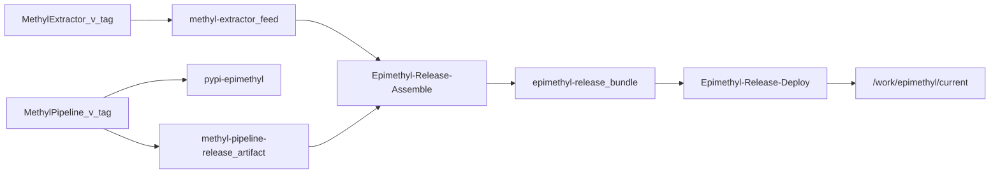

# Production release layout (GPU workers)

Production GPU workers consume **versioned releases** on fast shared storage (`/work/epimethyl`). No git checkouts on worker nodes at runtime.

See also: [worker_node.md](worker_node.md), [gpu_worker_runbook.md](gpu_worker_runbook.md), [worker_provision.md](worker_provision.md), [platform_matrix.md](platform_matrix.md), [ci/README.md](../../ci/README.md), [implementation plans](../plans/README.md).

## CI/CD overview (primary path)

MethylExtractor and MethylPipeline **version and publish independently** on git tags. A manual **assemble** pipeline composes the deploy bundle; a gated **deploy** pipeline promotes to `/work`.



| Step | Pipeline | Trigger |
|------|----------|---------|
| Build MethylExtractor per arch | MethylExtractor-Release-ARM64, MethylExtractor-Release-x64 | Tag `v*` |
| Build MP wheels + runtime-bundle | MethylPipeline-Release | Tag `v*` |
| Compose manifest + sha256 | Epimethyl-Release-Assemble | Manual |
| Promote to `/work` | Epimethyl-Release-Deploy | Manual + **production-work** approval |

**Typical release:**

1. Tag MethylExtractor `v2026.5.2` when native code changes.
2. Tag MethylPipeline `v2026.6.1` when Python/worker code changes.
3. Run **assemble** with `releaseVersion=2026.6.1`, `methylPipelineVersion=2026.6.1`, `methylExtractorVersion=2026.5.2`.
4. Approve **deploy** with `releaseVersion=2026.6.1`.

Register pipelines per [`ci/README.md`](../../ci/README.md).

## Directory layout

```
/work/epimethyl/
  current -> releases/2026.6.1
  releases/
    2026.6.1/
      manifest.json
      requirements-worker.lock
      wheels/*.whl
      runtime-bundle/          # schemas, domain programs/profiles, verify scripts, systemd units
      methyl-extractor-linux-aarch64.tar.gz
      methyl-extractor-linux-amd64.tar.gz
  docker/                      # shared Docker data-root (all GPU VMs)
  venv-aarch64/
  venv-amd64/
  methyl-extractor-aarch64/
  methyl-extractor-amd64/
  env/
    worker.env
    parabricks.env
    workflow_versions.json
  data/
  runs/
```

| Path | Shared? | Updated |
|------|---------|---------|
| `releases/<ver>/` | Yes | Per assemble/deploy |
| `docker/` | Yes | Once per release promote (`docker pull`) |
| `venv-<arch>/` | Yes | When lockfile changes |
| `methyl-extractor-<arch>/` | Yes | Per release × arch |
| `/etc/docker/daemon.json` | Per VM | Points `data-root` at shared `docker/` |

## Release version (SemVer)

All release identifiers use **SemVer 2.0 without leading zeros** (e.g. `2026.6.1`, not `2026.06.1`). This matches Azure Universal Packages and git tags (`v2026.6.1`).

| Use | Example |
|-----|---------|
| Git tag | `v2026.6.1` |
| Deploy bundle (`manifest.version`) | `2026.6.1` |
| Azure Universal Package `--version` | `2026.6.1` |
| `components.methyl_pipeline` / `methyl_extractor` | Independent pins |

Scripts validate versions via `require_release_version` in [`detect_platform.sh`](../../scripts/detect_platform.sh).

## manifest.json

Schema: [`schemas/deployment/epimethyl_release_manifest.schema.json`](../../schemas/deployment/epimethyl_release_manifest.schema.json).

Example (assembled release with independent component versions):

```json
{
  "version": "2026.6.1",
  "components": {
    "methyl_pipeline": "2026.6.1",
    "methyl_extractor": "2026.5.2"
  },
  "python": "3.12",
  "parabricks_image": "nvcr.io/nvidia/clara/clara-parabricks:4.7.0-1",
  "parabricks_image_digest": "sha256:…",
  "docker_data_root": "/work/epimethyl/docker",
  "min_driver_version": "550.xx",
  "requirements_lock": "requirements-worker.lock",
  "runtime_bundle": "runtime-bundle",
  "artifacts": {
    "aarch64": {
      "methyl_extractor": "methyl-extractor-linux-aarch64.tar.gz",
      "sha256": "…"
    },
    "amd64": {
      "methyl_extractor": "methyl-extractor-linux-amd64.tar.gz",
      "sha256": "…"
    }
  }
}
```

## Assemble a release (CI or admin)

[`scripts/assemble_release.sh`](../../scripts/assemble_release.sh) pulls MethylExtractor from Azure Artifacts and merges a MethylPipeline release artifact:

```bash
bash scripts/assemble_release.sh \
  --release-version 2026.6.1 \
  --methyl-pipeline-version 2026.6.1 \
  --methyl-extractor-version 2026.5.2 \
  --methyl-pipeline-dir /path/to/methyl-pipeline-release-2026.6.1 \
  --output /work/epimethyl/releases/2026.6.1
```

CI: [`ci/azure-pipelines-release-assemble.yml`](../../ci/azure-pipelines-release-assemble.yml).

## Promote a release

**Automated (recommended):** [`ci/azure-pipelines-release-deploy.yml`](../../ci/azure-pipelines-release-deploy.yml) with `production-work` environment approval.

**Manual** on shared storage (serializes `docker pull`):

```bash
bash scripts/promote_release.sh \
  --root /work/epimethyl \
  --release /work/epimethyl/releases/2026.6.1 \
  --arch aarch64 \
  --pull-parabricks

bash scripts/promote_release.sh \
  --root /work/epimethyl \
  --release /work/epimethyl/releases/2026.6.1 \
  --arch amd64 \
  --skip-docker-pull
```

Promote will:

1. Verify `manifest.json` and tarball checksums
2. Extract MethylExtractor to `/work/epimethyl/methyl-extractor-<arch>/`
3. Install or refresh `/work/epimethyl/venv-<arch>/` from release wheels
4. Optionally `docker pull` Parabricks into shared `docker/` (first arch only)
5. Update `/work/epimethyl/current` symlink
6. Write `env/worker.env` and `env/parabricks.env` (includes `METHYL_PROFILE_DIR` → `current/runtime-bundle/domain/profiles`)

### Domain programs and profiles (no git on workers)

The runtime-bundle ships `workflow_engine/domain/` (profiles, DomainPrograms, compiler inputs) at:

`/work/epimethyl/current/runtime-bundle/domain/`

Use these paths for operator CLI runs and for `METHYL_PROFILE=<name>` resolution. GPU workers executing gateway-dispatched tasks rely on **materialized `resolvedConfig`** in task input, not on reading profile files at runtime.

## Rollback

Re-run **deploy** pipeline with a previous `releaseVersion` and approval, or manually:

```bash
bash scripts/promote_release.sh \
  --root /work/epimethyl \
  --release /work/epimethyl/releases/<previous-ver> \
  --arch aarch64 \
  --skip-docker-pull
```

Restart workers after rollback: `sudo systemctl restart methyl-worker.service`.

## Manual / emergency build (fallback)

Use only when DevOps is unavailable:

```bash
source .venv/bin/activate
bash scripts/build_release.sh \
  --version 2026.6.1 \
  --output /work/epimethyl/releases/2026.6.1 \
  --with-gpu-reqs

bash scripts/download_methyl_extractor_artifacts.sh \
  --version 2026.5.2 \
  --release-dir /work/epimethyl/releases/2026.6.1
# Fill manifest sha256 or run assemble_release.sh
```

## Azure Artifacts feeds

| Feed | Type | Contents |
|------|------|----------|
| `methyl-extractor` | Universal Package | Per-arch tarballs |
| `pypi-epimethyl` | Python | `methyl-*` wheels |

Production venv install from feed ([`install_release.sh`](../../scripts/install_release.sh)):

```bash
bash scripts/install_release.sh \
  --release-dir /work/epimethyl/releases/2026.6.1 \
  --venv /work/epimethyl/venv-aarch64 \
  --index-url "https://pkgs.dev.azure.com/EpiMethyl/_packaging/pypi-epimethyl/pypi/simple/"
```
