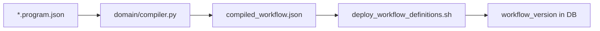

# DomainProgram Compiler

DomainPrograms (`.program.json`) are the canonical pipeline IR. The compiler lowers them to `WorkflowDefinitionSpec` / `compiled_workflow.json` for engine deploy.

## Language reference

- Operator summary: [`../reference/domain-program-language.md`](../reference/domain-program-language.md)
- Full language (assign / WHILE / SWITCH / REPEAT / typed `variables`): [`../reference/domain-program-language-v2.md`](../reference/domain-program-language-v2.md)

The compiler lowers `assign` to catalog `ACTION` + output bindings; emits `SWITCH` / `WHILE` / `REPEAT` to match the DB engine. Parallel shared assign targets are rejected.

Schemas: `schemas/domain/domain_program.schema.json`, `schemas/vars/`, `schemas/workflow/`

## Compiler code

| Module | Role |
|--------|------|
| `workflow_engine/domain/compiler.py` | Parse, validate, lower IR |
| `workflow_engine/domain/bindings.py` | Template resolution, `${var.*}` |
| `scripts/deploy_workflow_definitions.sh` | Compile + push to DB |

## Compile flow

## Profiles and manifests

- **Profiles** (`*.profile.json`) supply default `actionConfig` — repo paths under `workflow_engine/domain/profiles/`
- **Study manifest** (`project.json`) supplies cohorts and paths — `/work/<disease>/configs/`
- **Instance context** merges `projectPath`, `pipelineProfile`, runtime lists

Do **not** copy `*.program.json` under `/work/.../configs/`.

## Related

- [Layer model](../architecture/layer-model.md)
- [Orchestration paths](../architecture/orchestration-paths.md)
