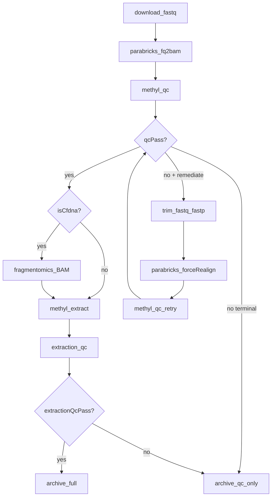

# Sample Preparation Flow

Developer and operator reference for the per-sample upstream workflow: laboratory FASTQs → aligned BAM → alignment QC → optional remediation → methylation extraction → extraction QC → `{chr}-CG.h5` archives.

**Workflow source of truth:** [`workflow_engine/domain/fixtures/sample_prep.program.json`](../../workflow_engine/domain/fixtures/sample_prep.program.json)

**Operator quick start:** [Usage ch.03 — Sample Prep and QC](../usage/03-sample-prep-and-qc.qmd)

## Overview

SamplePrepPipeline is the universal entry point for every sample (cfDNA, buffy coat, or other analytes). Each sample passes through **two automated guardrails** before entering stability, freeze, or discovery workflows:

1. **Alignment QC** (`sample.methyl_qc` / `methyl-qc`) — validates Parabricks alignment and sequencing metrics; may trigger focused FASTP trim and realign.
2. **Extraction QC** (`sample.extraction_qc` / `methyl-extraction-qc`) — validates MethylExtractor coverage and conversion-quality signal.

Without these gates, bad alignments waste GPU extraction time, and under-covered extractions pollute centroids, DMP discovery, and classifiers.



### Workflow scope variables

| Variable | Set by | Meaning |
|----------|--------|---------|
| `qcPass` | `sample.methyl_qc` | `guardrails.overall_pass` — alignment gate |
| `qcDisposition` | `sample.methyl_qc` | Cycle-screening disposition string |
| `remediateAlignment` | `sample.methyl_qc` | True when focused trim + realign is recommended |
| `trimFront1`, `trimTail1`, `trimFront2`, `trimTail2` | `sample.methyl_qc` | Recommended fastp trim bases per read end |
| `extractionQcPass` | `sample.extraction_qc` | `guardrails.overall_pass` — extraction gate |

**Ordering rationale:** alignment QC runs before cfDNA BAM fragmentomics so failed samples skip BAM scanning. FASTQs are retained until final QC disposition so fastp remediation can run.

## Stage-by-stage data path

| Stage | Worker action | Handler | Key implementation |
|-------|---------------|---------|-------------------|
| Download | `sample.download_fastq` | `_handle_download_fastq` | [`workers/methyl_worker/fastq_source.py`](../../workers/methyl_worker/fastq_source.py) |
| Align | `sample.parabricks_fq2bam` | `_handle_parabricks_fq2bam` | [`workers/methyl_worker/parabricks_runner.py`](../../workers/methyl_worker/parabricks_runner.py) |
| Alignment QC | `sample.methyl_qc` | `_handle_methyl_qc` | [`packages/methylalignmentqc/methyl_alignment_qc/core/writer.py`](../../packages/methylalignmentqc/methyl_alignment_qc/core/writer.py) |
| Trim (remediation) | `sample.trim_fastq` | `_handle_trim_fastq` | [`workers/methyl_worker/fastq_trim_runner.py`](../../workers/methyl_worker/fastq_trim_runner.py) |
| cfDNA fragmentomics | `sample.fragmentomics` | — | [`packages/methylfragmentomics/`](../../packages/methylfragmentomics/) |
| Extract | `sample.methyl_extract` | `_handle_methyl_extract` | [`workers/methyl_worker/extract_runner.py`](../../workers/methyl_worker/extract_runner.py) |
| Extraction QC | `sample.extraction_qc` | `_handle_extraction_qc` | [`packages/methylextractionqc/methyl_extraction_qc/guardrails.py`](../../packages/methylextractionqc/methyl_extraction_qc/guardrails.py) |

### Download FASTQs

Laboratory-owned `fastqSource` (file, S3, or Azure Blob) is materialized into `/work/samples/{sample_id}/` as paired `*_1.fastq.gz` / `*_2.fastq.gz`. Download is idempotent when local size and mtime match remote.

### Parabricks alignment (`fq2bam_meth`)

Clara Parabricks runs in Docker via `pbrun fq2bam_meth` with bisulfite-aware alignment. The runner prefers `{sample_id}_1/2.trimmed.fastq.gz` after fastp remediation, else the original FASTQs.

**Outputs under `/work/samples/{sample_id}/`:**

| Artifact | Role |
|----------|------|
| `{sample_id}.bam` | Aligned, deduplicated BAM |
| `{sample_id}.deduplicate_metrics.txt` | Picard-compatible duplication metrics |
| `{sample_id}.qc-metrics.tar` | Tabular metrics directory (primary Parabricks QC output) |
| `{sample_id}.json` | Optional consolidated metrics JSON |
| `{sample_id}.fq2bam_meth.log` | Alignment log |

GPU/Docker setup: [`workers/docs/parabricks.md`](../../workers/docs/parabricks.md).

**Important:** consolidated alignment QC JSON is **assembled by methyl-qc**, not always emitted directly by Parabricks. When `{sample_id}.json` is absent, `writer._build_parabricks_payload_from_qc_tar` reconstructs the payload from the qc-metrics tar.

## Metrics import and structured JSON

`methyl-qc` (`packages/methylalignmentqc`) merges two upstream metric families into one normalized export per sample.

### Import pipeline

1. **Picard dedup** — `*deduplicate_metrics.txt` or `*duplication_metrics.txt` parsed by [`parser.py`](../../packages/methylalignmentqc/methyl_alignment_qc/core/parser.py) → `summary_stats` (`PERCENT_DUPLICATION`, read-pair counts, unmapped reads).
2. **Parabricks payload** — from standalone `{sample_id}.json` or reconstructed from `{sample_id}.qc-metrics.tar`.
3. **Guardrails** — core WGBS checks (`wgbs_parabricks_qc.py`), optional bisulfite conversion, cfDNA fragmentomics, cycle screening, config-gated duplication/PF-read checks.
4. **Validate V1** Pydantic assembly → **convert to V2** → write `{output_base}/{project}/alignment_qc/{sample_id}.json`.

### Pydantic models and JSON Schema

| Artifact | Path |
|----------|------|
| V1 columnar models | [`packages/methylalignmentqc/methyl_alignment_qc/models/sample_qc.py`](../../packages/methylalignmentqc/methyl_alignment_qc/models/sample_qc.py) |
| V2 row-oriented export | [`packages/methylalignmentqc/methyl_alignment_qc/models/sample_qc_v2.py`](../../packages/methylalignmentqc/methyl_alignment_qc/models/sample_qc_v2.py) |
| Alignment QC config | [`packages/methylalignmentqc/methyl_alignment_qc/models/config.py`](../../packages/methylalignmentqc/methyl_alignment_qc/models/config.py) |
| V2 export JSON Schema | [`schemas/config/alignment_qc/exported_sample_qc_v2.schema.json`](../../schemas/config/alignment_qc/exported_sample_qc_v2.schema.json) |
| Project `step_config.alignment_qc` schema | [`schemas/config/alignment_qc.schema.json`](../../schemas/config/alignment_qc.schema.json) |
| Schema export utility | `methyl_alignment_qc/utils/schema_export.py` |

### Key export blocks

| Block | Contents |
|-------|----------|
| `summary_stats` | Duplication rate, read counts from Picard metrics |
| `quality_yield`, `mean_quality_by_cycle`, … | Parabricks sequencing sections |
| `guardrails.details` | Per-metric pass/fail, observed value, normal range, operator message |
| `guardrails.screening` | Cycle-quality disposition and recommended trim counts |
| `guardrails.overall_pass` | Single boolean bound to workflow `qcPass` |
| `qc_history` | Append-only list of evaluations (initial + post-remediation retries) |
| `fragmentomics_metrics` | cfDNA insert-size metrics when enabled |

## Guardrails reference

### Guardrail boundary

`guardrails.overall_pass` is the **logical AND** of all evaluated checks in `guardrails.details`. Optional guardrails (`duplication_rate_max`, `min_pf_reads`) are **off by default** until set in `step_config.alignment_qc.optional_guardrails`. When enabled, cfDNA fragmentomics and bisulfite conversion checks add to the AND via [`AlignmentQCConfig`](../../packages/methylalignmentqc/methyl_alignment_qc/models/config.py) or analyte profiles ([`docs/ANALYTE_PROFILES.md`](../ANALYTE_PROFILES.md)).

Core WGBS thresholds are defined in [`wgbs_parabricks_qc.py`](../../packages/methylalignmentqc/methyl_alignment_qc/core/wgbs_parabricks_qc.py).

### Core alignment guardrails

| Metric | Normal range (default) | Source | If fail | Possible fix |
|--------|------------------------|--------|---------|--------------|
| `pf_percent` | ≥ 90% | Parabricks `quality_yield` | Run-level PF loss | Re-sequence; check instrument/filtering |
| `q30_percent` | ≥ 85% | Parabricks `quality_yield` | Low base-call confidence | Focused trim if localized dip; else re-sequence |
| `mean_quality` | ≥ 35 | `mean_quality_by_cycle` | Global sequencing noise | Same as Q30 |
| `min_quality_post20` | ≥ 30 | cycles after index 20 | Late-cycle degradation | **Focused FASTP** if R2-start/end dip; else investigate |
| `at_dropout` | < 3.0 | `gc_bias_summary` | AT-rich coverage bias | Library prep / bisulfite over-degradation |
| `gc_dropout` | < 5.0 | `gc_bias_summary` | GC-rich coverage bias | Same as AT dropout |
| `median_insert_bp` | 150–300 bp (WGBS) | `insert_size_metrics` | Wrong fragmentation | WGBS: review shearing; cfDNA: see fragmentomics below |
| `deamination_qscore` | ≤ 30 (ideally ≤ 20) | `pre_adapter_summaries` | Conversion signal | Bisulfite protocol review |
| `oxog_qscore` | ≥ 20 | `pre_adapter_summaries` | Oxidative G→T damage | Library prep timing |

### Optional config guardrails

| Metric | Config key | Default | If fail | Possible fix |
|--------|------------|---------|---------|--------------|
| `duplication_rate` | `optional_guardrails.duplication_rate_max` | Off (e.g. 0.25 when set) | PCR over-amplification | More input DNA; **not fixable by trim** |
| `min_pf_reads` | `optional_guardrails.min_pf_reads` | Off (e.g. 1_000_000 when set) | Under-sequenced | Re-sequence |

### Bisulfite conversion (when enabled)

| Metric | Default threshold | Source |
|--------|-------------------|--------|
| `conversion_rate_pct` | ≥ 99.0% | `bisulfite_conversion.json` sidecar |
| `non_cpg_methylation_pct` | ≤ 2.0% | Sidecar |
| `deamination_qscore` (proxy) | ≤ 30 | When sidecar missing (`source: auto`) |

### Cycle screening dispositions

When `cycle_screening.enabled` is true, [`cycle_quality_screening.py`](../../packages/methylalignmentqc/methyl_alignment_qc/core/cycle_quality_screening.py) inspects Read 1 and Read 2 separately and assigns a disposition:

| Disposition | Automated action | Manual guidance |
|-------------|------------------|-----------------|
| `USE_CURRENT_ALIGNMENT` | Continue to extract | — |
| `REALIGN_TRIM` | fastp → `forceRealign` → methyl_qc retry | — |
| `REALIGN_READ2_TRIM` | Legacy alias for trim-eligible disposition | Same as `REALIGN_TRIM` |
| `INVESTIGATE_MULTI_REGION` | Terminal (no auto-trim) | FastQC, sliding-window trim (`SLIDINGWINDOW:4:20`) |
| `INVESTIGATE_GUARDRAIL_ONLY` | Terminal | Check duplication, insert size, dropout |
| `NOT_FIXABLE` | Archive qc_only, mark failed | No automated path |

Screening writes `guardrails.screening` with recommended trim bases. SamplePrep binds `remediateAlignment` when disposition is trim-eligible and at least one trim count is non-zero.

**Cycle screening defaults** (`CycleScreeningConfig`):

| Parameter | Default | Role |
|-----------|---------|------|
| `r2_quality_threshold` | 30 | Phred below which a cycle is "low quality" |
| `max_trim_bases` | 8 | Cap on any single trim_front/tail value |
| `recovery_cycles` | 10 | R2-start dip must recover within this many cycles |
| `read_edge_window` | 10 | Cycles from read start/end classified as edge dips |

## Focused FASTP trimming vs generic trimming

### The problem with generic failure

Historically, alignment QC computed `min(mq[20:])` over the **combined** R1+R2 cycle series. Fixable Read-2 start dips (common in prostate-cohort data) failed with a generic `"FAIL: Do NOT proceed"` message — no trim count, no realign path. See [`docs/plans/alignment-qc-screening.plan.md`](../plans/alignment-qc-screening.plan.md).

### Focused approach (current pipeline)

1. **Split cycles** — `read_length = max_cycle // 2`; for 151+151 paired-end, Read 2 starts at cycle **152**.
2. **Classify dip patterns** — `READ1_START_LOW_QUALITY`, `READ2_START_LOW_QUALITY`, `READ2_END_LOW_QUALITY`, `LOCALIZED_INTERNAL_LOW_QUALITY`, `BROAD_LOW_QUALITY`, `MULTIPLE_LOW_QUALITY_REGIONS`.
3. **Compute trim spec** — exact `trim_front1/tail1/front2/tail2` bases, capped at `max_trim_bases`.
4. **Run fastp** — only the recommended `--trim_front/tail` flags; **`--disable_quality_filtering`** so no reads are discarded by Phred score ([`fastq_trim_runner.py`](../../workers/methyl_worker/fastq_trim_runner.py)).
5. **Realign** — Parabricks with `forceRealign: true`, then `methyl_qc` retry (attempt 2 recorded in `qc_history`).

### Why focused trim is better than generic trim

| Concern | Focused (cycle screening + fastp) | Generic (`-q`, `-l`, sliding window) |
|---------|-----------------------------------|----------------------------------------|
| Read length preserved | Trims only known bad terminal cycles | May shorten reads unpredictably |
| Whole-read discard | Avoided — only bases at read ends removed | Low-quality reads may be dropped entirely |
| Mapping / methylation | Maximum usable insert for alignment | Over-trimming reduces effective coverage |
| Auditability | Trim counts bound to workflow scope and `qc_history` | Ad-hoc parameters, hard to reproduce |
| Automation | Wired into SamplePrep remediation branch | Manual operator intervention |

**When generic trim is appropriate:** manual path for `INVESTIGATE_MULTI_REGION` — review FastQC per-read quality profiles and apply tail crop or `SLIDINGWINDOW:4:20` outside the automated pipeline.

## Extraction-time read filtering and post-discard QC

Alignment QC validates the **BAM**. Extraction applies additional **read- and base-level filters** during methylation calling; extraction QC validates the **consequences** of those filters.

### Filters at extraction (MethylExtractor)

Configured in `step_config.methyl_extract` (production profiles default both to **20**):

| Parameter | CLI flag | Effect |
|-----------|----------|--------|
| `min_mapq` | `--min-mapq` | Excludes poorly aligned reads from methylation calling |
| `min_phred` | `--min-phred` | Excludes bases below Phred threshold during calling |

Wired in [`extract_runner.py`](../../workers/methyl_worker/extract_runner.py). Raising these values protects against low-quality reads but reduces effective coverage; lowering them without cause risks noisy methylation calls.

There is **no** standalone "discard rate" guardrail in alignment or extraction QC today.

### Post-discard QC (second gate)

`methyl-extraction-qc` reads `{sample_id}.extraction_manifest.json` and evaluates downstream consequences via [`guardrails.py`](../../packages/methylextractionqc/methyl_extraction_qc/guardrails.py):

| Guardrail | Default | What it detects after filtering |
|-----------|---------|--------------------------------|
| `cpg_weighted_mean_coverage` | ≥ 10× | Too many reads/bases discarded → insufficient depth |
| `chh_methylation_level` | ≤ 0.02 | Conversion sanity (when CHH extracted) |
| `chg_methylation_level` | ≤ 0.02 | Conversion sanity (when CHG extracted) |
| `chromosome_completeness` | all expected chromosomes | Missing chromosomes after aggressive filtering |
| `chromosome_uniformity` | autosomal min/median ≥ 0.5 | Localized dropout from MAPQ/Phred losses |

`guardrails.overall_pass` maps to workflow **`extractionQcPass`**. Failures are **terminal** today (no automatic retry loop).

### Recommended operational QC pattern

1. Compare alignment QC `summary_stats.total_reads` and `duplication_rate` with extraction manifest `summary.cpg_weighted_mean_coverage`.
2. If extraction coverage fails while alignment passed, suspect aggressive `min_mapq`/`min_phred` or localized BAM quality issues — do not blindly lower thresholds.
3. Use [`scripts/alignment_qc_cohort_screening.py`](../../scripts/alignment_qc_cohort_screening.py) for cohort-level alignment review; extraction failures are per-sample via `{sample_id}.extraction_qc.json`.

**Future enhancement:** if MethylExtractor adds `reads_used` / `reads_discarded` to the extraction manifest (see MethylExtractor `docs/extraction_qc_contract.md`), a dedicated `max_discard_fraction` guardrail could be added to `methylextractionqc`.

## cfDNA fragmentomics as additional QC

cfDNA projects use a **two-layer** fragmentomics model. See also [`packages/methylfragmentomics/docs/USAGE.md`](../../packages/methylfragmentomics/docs/USAGE.md).

### Phase 1 — insert-size guardrails (alignment QC)

Runs during `methyl_qc` when `fragmentomics.profile = cfdna` (auto-enabled when `primary_analyte` is `cfdna` via [`analyte_profiles.py`](../../packages/methylutils/methyl_utils/analyte_profiles.py)).

Implemented in [`fragmentomics.py`](../../packages/methylalignmentqc/methyl_alignment_qc/core/fragmentomics.py) from Parabricks `insert_size_histogram` and `insert_size_metrics`:

| Metric | Default threshold | Meaning |
|--------|-------------------|---------|
| Median insert | 120–220 bp | cfDNA-typical fragment length |
| Nucleosome peak | 140–200 bp (histogram mode) | Mono-nucleosome signature |
| Short-fragment fraction | ≤ 0.35 (fragments ≤ 150 bp) | Excess sub-nucleosomal debris |

Failing Phase 1 sets `guardrails.overall_pass = false` and blocks extraction.

| Failure pattern | Likely cause | Operator action |
|-----------------|--------------|-----------------|
| High median insert + low short fraction | Buffy-coat / genomic DNA contamination | Review extraction protocol and analyte labeling |
| Low nucleosome peak / flat histogram | Degraded DNA or wrong kit | Re-extract or re-sequence |
| High short-fragment fraction | Over-fragmentation or apoptosis-heavy sample | Compare to cohort; may be biological |

Note: WGBS core guardrail `median_insert_bp` (150–300 bp) still applies; cfDNA fragmentomics adds analyte-specific checks on top.

### Phase 2 — BAM fragmentomics (workflow branch)

Runs only when `qcPass && isCfdna` (`sample.fragmentomics`):

- **WPS** — binned fragment midpoint counts per chromosome
- **End motifs** — 5′ k-mer frequencies on read1

Outputs: `{output_base}/{project}/fragmentomics/{sample_id}/` (`sample_features.json`, `wps_bins.tsv`, `end_motifs.tsv`).

Phase 2 is used in validation readiness and Grok advisory payloads — **not** a hard SamplePrep gate today. A sample can pass Phase 1 but show abnormal WPS/end-motif patterns worth manual review before model training.

## Artifact map

Per sample under `/work/samples/{sample_id}/`:

| Artifact | Role |
|----------|------|
| `*_1.fastq.gz`, `*_2.fastq.gz` | Original paired FASTQs (retained until final QC) |
| `*_1.trimmed.fastq.gz`, `*_2.trimmed.fastq.gz` | Post-fastp FASTQs (remediation path) |
| `*deduplicate_metrics.txt` | Picard-style duplication metrics |
| `{sample_id}.qc-metrics.tar` | Parabricks tabular metrics |
| `{sample_id}.json` | Optional Parabricks consolidated metrics |
| `{sample_id}.bam` | Aligned BAM |
| `{sample_id}.extraction_manifest.json` | MethylExtractor summary |
| `{sample_id}.extraction_qc.json` | Extraction guardrail report |
| `{sample_id}.sample_prep_log.jsonl` | Append-only audit of every prep action |
| `{chr}-CG.h5` (and CHG/CHH) | Methylation matrices |

Project-scoped alignment QC export: `{output_base}/{project}/alignment_qc/{sample_id}.json`

## Configuration checklist

Before starting SamplePrep, confirm:

- [ ] `project.json` lists samples and paths resolve to `/work/samples/...`
- [ ] `step_config.alignment_qc` thresholds match analyte (cfDNA vs buffy coat)
- [ ] `step_config.extraction_qc` min coverage appropriate for WGBS depth expectations
- [ ] `step_config.methyl_extract.min_mapq` / `min_phred` reviewed for analyte
- [ ] `validation.regulatory.primary_analyte` set (drives fragmentomics profile)
- [ ] Instance `context_json` includes `fastqStorage`, `referenceFasta`, `samples[]`

Example `step_config.alignment_qc` snippet:

```json
{
  "alignment_qc": {
    "optional_guardrails": {
      "duplication_rate_max": 0.25,
      "min_pf_reads": 1000000
    },
    "bisulfite_conversion": {
      "enabled": true,
      "source": "auto",
      "min_conversion_rate_pct": 99.0
    },
    "fragmentomics": {
      "enabled": true,
      "profile": "cfdna"
    },
    "cycle_screening": {
      "enabled": true,
      "r2_quality_threshold": 30,
      "max_trim_bases": 8
    }
  }
}
```

## Debugging commands

```bash
source .venv/bin/activate

# Alignment QC for one sample directory
methyl-qc --samples /work/samples/SAMPLE_ID --output-dir /work/projects/prostate-cancer/alignment_qc

# Project-scoped (uses step_config.alignment_qc)
methyl-qc --project /work/projects/prostate-cancer/configs/project_Example.json

# Extraction QC after MethylExtractor
methyl-extraction-qc --sample-dir /work/samples/SAMPLE_ID --sample-id SAMPLE_ID

# Cohort alignment screening (offline)
python scripts/alignment_qc_cohort_screening.py \
  --qc-dir /work/projects/prostate-cancer/alignment_qc \
  --group healthy=/work/projects/prostate-cancer/data/healthy.csv \
  --group pca=/work/projects/prostate-cancer/data/pca.csv \
  --out /work/projects/prostate-cancer/alignment_qc/screening_report
```

More operator commands: [Usage ch.03](../usage/03-sample-prep-and-qc.qmd).

## Related documentation

| Document | Role |
|----------|------|
| [Usage ch.03 — Sample Prep and QC](../usage/03-sample-prep-and-qc.qmd) | Operator manual, flow diagram, config examples |
| [SamplePrepFlow.md](../../workflow_engine/sql/SamplePrepFlow.md) | Workflow tree, instance context, deploy |
| [sample_prep_capabilities.md](../../workflow_engine/contract/sample_prep_capabilities.md) | Worker I/O contracts, idempotency |
| [Workers and gateway](workers-and-gateway.md) | Poll/submit protocol |
| [parabricks.md](../../workers/docs/parabricks.md) | GPU/Docker Parabricks setup |
| [methylalignmentqc USAGE](../../packages/methylalignmentqc/docs/USAGE.md) | methyl-qc CLI, guardrails, screening |
| [methylalignmentqc IMPLEMENTATION](../../packages/methylalignmentqc/docs/IMPLEMENTATION.md) | Package code path index |
| [methylextractionqc README](../../packages/methylextractionqc/README.md) | Extraction QC guardrails |
| [methyl-fragmentomics USAGE](../../packages/methylfragmentomics/docs/USAGE.md) | Phase 2 BAM fragmentomics |
| [ANALYTE_PROFILES.md](../ANALYTE_PROFILES.md) | cfDNA vs buffy profile defaults |
| [alignment-qc-screening.plan.md](../plans/alignment-qc-screening.plan.md) | Historical design for cycle screening + fastp |
| [Theory ch.09 — MethylAlignmentQC](../theory/chapters/09-methylalignmentqc.qmd) | Publication framing |

## What this document does not cover

- GPU/Docker Parabricks node provisioning → [`workers/docs/parabricks.md`](../../workers/docs/parabricks.md)
- Full worker `input_json` / `output_json` examples → [`workflow_engine/contract/sample_prep_capabilities.md`](../../workflow_engine/contract/sample_prep_capabilities.md)
- Gateway scheduler internals → [`workflow_engine/docs/IMPLEMENTATION.md`](../../workflow_engine/docs/IMPLEMENTATION.md)
