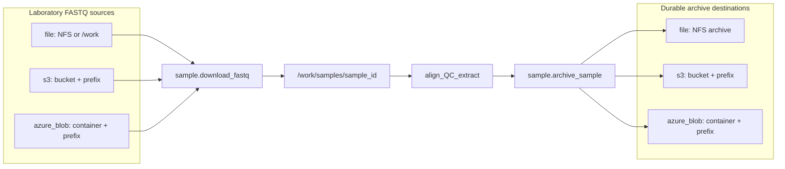
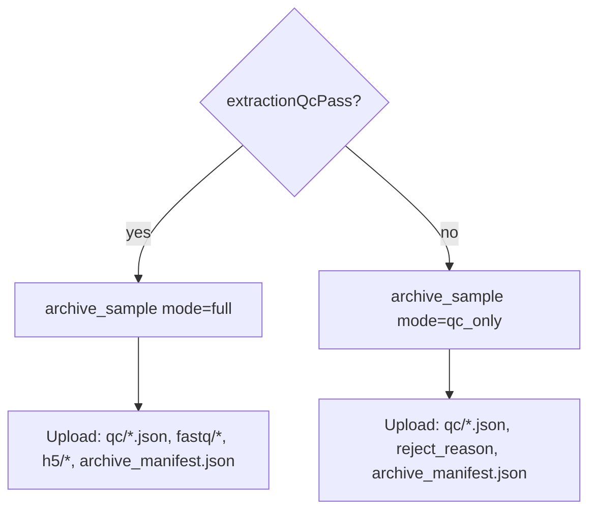
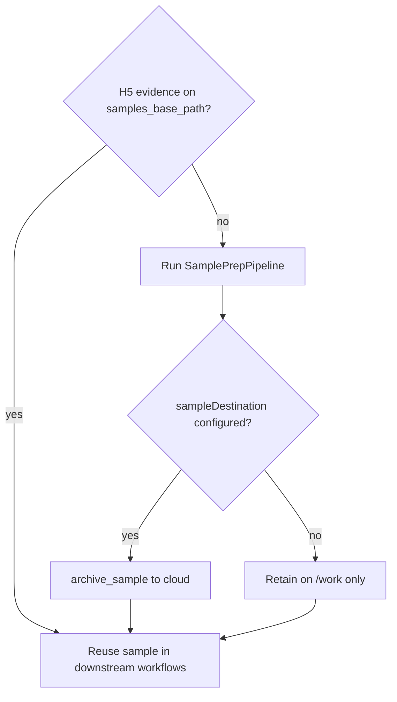

# Sample Preparation Flow

Developer and operator reference for the per-sample upstream workflow: laboratory FASTQs (from shared storage or cloud object stores) → aligned BAM → alignment QC → optional remediation → methylation extraction → extraction QC → `{chr}-CG.h5` archives, with optional upload to durable cloud storage for reuse and long-term retention.

**Workflow source of truth:** [`workflow_engine/domain/fixtures/sample_prep.program.json`](../../workflow_engine/domain/fixtures/sample_prep.program.json)

**Operator quick start:** [Usage ch.03 — Sample Prep and QC](../usage/03-sample-prep-and-qc.md)

## Overview

SamplePrepPipeline is the universal entry point for every sample (cfDNA, buffy coat, or other analytes). Each sample passes through **two automated guardrails** before entering stability, freeze, or discovery workflows:

1. **Alignment QC** (`sample.methyl_qc` / `methyl-qc`) — validates linear / stock Giraffe / methylGrapher QC BAM metrics; may trigger focused FASTP trim and realign on the **same** alignment mode.
2. **Extraction QC** (`sample.extraction_qc` / `methyl-extraction-qc`) — validates the extraction manifest (MethylExtractor or methylGrapher canonical shape) for coverage and conversion-quality signal.

Without these gates, bad alignments waste GPU cycles (native-Mojo Giraffe or Parabricks) and under-covered extractions pollute centroids, DMP discovery, and classifiers. Alignment QC is **mode-aware**: shared guardrails run for every mode, with tool-specific metrics for Parabricks vs methylGrapher (see [Metrics import](#metrics-import-and-structured-json)).

Canonical flowchart source: [`docs/diagrams/src/sample-prep-flow.mmd`](../diagrams/src/sample-prep-flow.mmd) (pre-rendered SVG/PNG under `docs/diagrams/out/`). Do **not** maintain a second inline copy of the graph here — the three-mode align/extract routing lives only in that `.mmd` and in [`sample_prep.program.json`](../../workflow_engine/domain/fixtures/sample_prep.program.json).

### Alignment modes (three-way)

| Mode | `alignmentMode` | Scope flags | Align action | Extract action |
|------|-----------------|-------------|--------------|----------------|
| Linear (default) | `linear` | `useWgbsPangenome=false`, `usePangenome=false` | `sample.parabricks_fq2bam` | `sample.methyl_extract` |
| Stock pangenome | `pangenome` | `useWgbsPangenome=false`, `usePangenome=true` | `sample.parabricks_giraffe` | `sample.methyl_extract` |
| WGBS pangenome | `pangenome_wgbs` | `useWgbsPangenome=true`, `usePangenome=true` | `sample.methylgrapher_wgbs_align` | `sample.methylgrapher_wgbs_extract` |

Program `IF` order checks `useWgbsPangenome` **before** `usePangenome`, so the WGBS path never falls through to stock Giraffe. Seeded by [`pipeline_profiles.seed_pipeline_scope_flags`](../../workflow_engine/domain/pipeline_profiles.py).

### Workflow scope variables

| Variable | Set by | Meaning |
|----------|--------|---------|
| `qcPass` | `sample.methyl_qc` | `guardrails.overall_pass` — alignment gate |
| `qcDisposition` | `sample.methyl_qc` | Cycle-screening disposition string |
| `remediateAlignment` | `sample.methyl_qc` | True when focused trim + realign is recommended |
| `trimFront1`, `trimTail1`, `trimFront2`, `trimTail2` | `sample.methyl_qc` | Recommended fastp trim bases per read end |
| `extractionQcPass` | `sample.extraction_qc` | `guardrails.overall_pass` — extraction gate |
| `useWgbsPangenome` / `usePangenome` | instance/profile seed | Alignment/extract branch selectors |
| `deleteFastqs` | instance/profile (default true) | Whether to delete local FASTQs after final disposition |

**Ordering rationale:** alignment QC runs before cfDNA BAM fragmentomics so failed samples skip BAM scanning. FASTQs are retained until final QC disposition so fastp remediation can run. Read-level `{chr}-CG.patterns.h5` sidecars are emitted at extract time; `pipeline.info_measures` runs later in the **study lifecycle**, not inside SamplePrep.

## Storage topology: sample sources and result archival

SamplePrepPipeline is the **low-cost gate** before stability, freeze, and discovery workflows. Inputs may already live on shared cluster storage or in a laboratory-owned cloud bucket; outputs are materialized on `/work` for GPU processing, then optionally archived back to cloud storage for reuse and long-term retention.

### End-to-end topology



**Supported cloud providers:** Amazon S3 and Azure Blob Storage only. There is no GCS, `azcopy`, or `rclone` integration in the worker path.

### Sample source options (input)

Every sample carries a typed `fastqSource` (discriminated union in [`packages/methyldomain/methyl_domain/fastq_storage.py`](../../packages/methyldomain/methyl_domain/fastq_storage.py)). The worker action `sample.download_fastq` (`sample.download-fastq`) stages all FASTQs for one sample into `/work/samples/{sample_id}/` via [`workers/methyl_worker/fastq_source.py`](../../workers/methyl_worker/fastq_source.py).

| Scheme | Keys | Staging mechanism |
|--------|------|-------------------|
| `file` | `basePath`, `prefix` | `shutil.copy2` from a shared/NFS path (samples already on `/work` or a mounted share) |
| `s3` | `bucket`, `prefix`, `region`, `endpointUrl`, `credentials` | `boto3` list + download |
| `azure_blob` | `account`, `container`, `prefix`, `credentials` | `azure-storage-blob` + `azure-identity` |

**Credential auth modes** (typed JSON on `fastqSource.credentials` — no worker env fallback):

| Scheme | `authMode` | Notes |
|--------|------------|-------|
| `s3` | `explicit_keys` | `accessKeyId`, `secretAccessKey`, optional `sessionToken`; expand may attach `contentHash` / `credentialName` |
| `s3` | `instance_profile` | IAM role / boto3 default credential chain |
| `s3` / `azure_blob` | `azure_key_vault` | Optional escape hatch: `{ vaultUrl, secretName }` |
| `s3` / `azure_blob` | `encrypted_file` | Node-local / air-gapped Fernet file (never under `/work`) |
| `azure_blob` | `account_key` | Storage account key |
| `azure_blob` | `connection_string` | Full connection string |
| `azure_blob` | `default_credential` | `DefaultAzureCredential` (managed identity, etc.) |

Secrets are marked `writeOnly` in JSON schema. **Production:** DB SoT (`cfg.credential`) via portal admins; schedule-time expand embeds secrets in claim `input_json` with `contentHash` for node-local cache refresh. They do **not** belong in the site manifest (`/work/site/methyl_site.json`) or `METHYL_*` environment variables. Archive defaults resolve `portal.resource_profile` → named `cfg.storage_endpoint`.

**Instance defaults:** top-level `fastqStorage` (with optional `prefixBase`) merges with each sample's `fastqPrefix` into the resolved `fastqSource`. See [`workflow_engine/sql_mssql/instance_context_examples/sample_prep_plasma.json`](../../workflow_engine/sql_mssql/instance_context_examples/sample_prep_plasma.json) for a full S3 ingress example.

**Idempotency:** `download_from_source` skips a file when local size matches remote and mtime is within ±1 s.

### Shared processing layer (`/work/samples/{sample_id}/`)

All source schemes converge on the same per-sample directory on shared cluster storage:

- Staged FASTQs: `*_1.fastq.gz`, `*_2.fastq.gz`
- Alignment artifacts: BAM, Picard dedup metrics, Parabricks qc-metrics tar
- Methylation outputs: `{chr}-{CG|CHG|CHH}.h5`, extraction manifest, QC JSON

Study manifests reference this tree via `samples_base_path` (default `/work/samples`). See [Artifact map](#artifact-map) below for the full file list.

### Result archival to cloud (output)

After QC disposition, `sample.archive_sample` (`sample.archive-sample`, [`workers/methyl_worker/sample_archive.py`](../../workers/methyl_worker/sample_archive.py)) uploads a curated bundle to a typed `sampleDestination` (same three schemes as ingress, defined in [`packages/methyldomain/methyl_domain/sample_storage.py`](../../packages/methyldomain/methyl_domain/sample_storage.py)).

> **Note:** `sample.upload_h5` is **retired**. Use `sample.archive_sample` with `sampleDestination`. See [`docs/reference/action-parameter-contract.md`](../reference/action-parameter-contract.md).



| Mode | When | Remote layout |
|------|------|---------------|
| `full` | Extraction QC passes | `qc/alignment.json`, `qc/extraction_qc.json`, `qc/extraction_manifest.json`, `qc/sample_prep_log.jsonl`, `fastq/*.fastq.gz`, `h5/{chr}-{ctx}.h5`, `archive_manifest.json` |
| `qc_only` | Alignment or extraction QC fails (terminal) | QC JSONs + `sample_prep_log.jsonl` + `reject_reason`; no FASTQs or H5 |

**Destination config:** `sampleDestination` (or deprecated alias `h5Destination` / instance-level `h5Storage` → `sampleStorage`) uses the same `file` / `s3` / `azure_blob` keys as ingress (`bucket`/`container`, `prefix`, `credentials`). If no destination is configured, archive is skipped with `skipReason: "sample_destination_not_configured"` — local `/work` files are still retained for downstream analysis.

**Idempotency:** S3 skips upload when remote size and ETag (32-char hex) match local md5; Azure skips on matching blob size.

**Audit trail:** each archive writes `archive_manifest.json` (`schema_name: "methylpipeline.sample_archive"`, `schema_version: "1.0.0"`) listing every uploaded file with `md5`, `size`, and `remote_prefix`.

### Reuse and caching (skip re-prep)

Already-prepared samples are detected by **H5 evidence** on `samples_base_path`, so the expensive analysis pipeline does not re-run sample prep when `{chr}-{ctx}.h5` files already exist:



| Mechanism | Location | Behavior |
|-----------|----------|----------|
| `sample_has_h5` | [`packages/methylutils/methyl_utils/test_data_registry.py`](../../packages/methylutils/methyl_utils/test_data_registry.py) | True when directory contains at least one `*-*.h5` |
| `_sample_h5_qc_record` | [`packages/methylutils/methyl_utils/pipeline_config.py`](../../packages/methylutils/methyl_utils/pipeline_config.py) | Per-project eligibility: expected `{chrom}×{context}` pairs vs found H5 files |
| Sample QC artifacts | `{project_root}/sample_qc/` | `sample_qc_report.csv`, `eligible_samples.txt`, `ineligible_samples.txt` |

Samples without H5 evidence are excluded from cohort comparisons (`reason: excluded_no_h5`). Cloud-archived H5 bundles can be re-staged to `/work/samples/{id}/` (via `file` copy or re-download) before starting a new study.

### Config surfaces recap

| Layer | Artifact | What it holds |
|-------|----------|---------------|
| **Instance context** | `context_json` on sample-prep start | `fastqStorage`, `sampleStorage`, `samples[]` with `fastqSource`, `sampleDestination`, `sampleDir` |
| **Site manifest** | `/work/site/methyl_site.json` (`METHYL_SITE_CONFIG`) | Reference genome, GTF, caches, Parabricks — **not** cloud credentials |
| **Portal** | `SampleStorageDefaults` | Operator archive profile defaults (e.g. `epimethyl-samples`) |
| **Study manifest** | `project.json` | `samples_base_path`, cohort CSVs — **not** FASTQ/archive credentials |

Example instance context (S3 ingress + S3 archive, abbreviated):

```json
{
  "fastqStorage": { "type": "s3", "bucket": "methyl-cohort", "region": "us-east-1",
    "credentials": { "authMode": "instance_profile" } },
  "sampleStorage": { "type": "s3", "bucket": "methyl-archive", "region": "us-east-1",
    "credentials": { "authMode": "instance_profile" } },
  "samples": [{
    "sampleId": "DPLST-051425-111148",
    "sampleDir": "/work/samples/DPLST-051425-111148",
    "fastqPrefix": "plasma/DPLST-051425-111148/",
    "fastqSource": { "type": "s3", "bucket": "methyl-cohort", "prefix": "plasma/DPLST-051425-111148/", ... },
    "sampleDestination": { "type": "s3", "bucket": "methyl-archive", "prefix": "plasma/DPLST-051425-111148/", ... }
  }]
}
```

Full example: [`workflow_engine/sql_mssql/instance_context_examples/sample_prep_plasma.json`](../../workflow_engine/sql_mssql/instance_context_examples/sample_prep_plasma.json).

## Stage-by-stage data path

| Stage | Worker action | Handler | Key implementation |
|-------|---------------|---------|-------------------|
| Download | `sample.download_fastq` | `_handle_download_fastq` | [`workers/methyl_worker/fastq_source.py`](../../workers/methyl_worker/fastq_source.py) |
| Align (linear) | `sample.parabricks_fq2bam` | `_handle_parabricks_fq2bam` | [`workers/methyl_worker/parabricks_runner.py`](../../workers/methyl_worker/parabricks_runner.py) |
| Align (stock pangenome) | `sample.parabricks_giraffe` | `_handle_parabricks_giraffe` | [`workers/methyl_worker/giraffe_runner.py`](../../workers/methyl_worker/giraffe_runner.py) |
| Align (WGBS pangenome) | `sample.methylgrapher_wgbs_align` | `_handle_methylgrapher_wgbs_align` | [`workers/methyl_worker/methylgrapher_wgbs_runner.py`](../../workers/methyl_worker/methylgrapher_wgbs_runner.py) |
| Alignment QC | `sample.methyl_qc` | `_handle_methyl_qc` | [`packages/methylalignmentqc/methyl_alignment_qc/core/writer.py`](../../packages/methylalignmentqc/methyl_alignment_qc/core/writer.py) |
| Trim (remediation) | `sample.trim_fastq` | `_handle_trim_fastq` | [`workers/methyl_worker/fastq_trim_runner.py`](../../workers/methyl_worker/fastq_trim_runner.py) |
| cfDNA fragmentomics | `sample.fragmentomics` | — | [`packages/methylfragmentomics/`](../../packages/methylfragmentomics/) |
| Extract (linear / stock) | `sample.methyl_extract` | `_handle_methyl_extract` | [`workers/methyl_worker/extract_runner.py`](../../workers/methyl_worker/extract_runner.py) |
| Extract (WGBS pangenome) | `sample.methylgrapher_wgbs_extract` | `_handle_methylgrapher_wgbs_extract` | [`workers/methyl_worker/methylgrapher_wgbs_runner.py`](../../workers/methyl_worker/methylgrapher_wgbs_runner.py) |
| Extraction QC | `sample.extraction_qc` | `_handle_extraction_qc` | [`packages/methylextractionqc/methyl_extraction_qc/guardrails.py`](../../packages/methylextractionqc/methyl_extraction_qc/guardrails.py) |
| Archive / cleanup | `sample.archive_sample`, `delete_fastqs`, `delete_bam` | — | [`workers/methyl_worker/sample_archive.py`](../../workers/methyl_worker/sample_archive.py) |

### Download FASTQs

See [Storage topology](#storage-topology-sample-sources-and-result-archival) above for source schemes, credentials, and archival. Laboratory-owned `fastqSource` (file, S3, or Azure Blob) is materialized into `/work/samples/{sample_id}/` as paired `*_1.fastq.gz` / `*_2.fastq.gz`. Download is idempotent when local size and mtime match remote.

### Parabricks alignment (`fq2bam_meth`)

Clara Parabricks runs in Docker via `pbrun fq2bam_meth` with bisulfite-aware alignment. The runner prefers `{sample_id}_1/2.trimmed.fastq.gz` after fastp remediation, else the original FASTQs.

**Outputs under `/work/samples/{sample_id}/`:**

| Artifact | Role |
|----------|------|
| `{sample_id}.bam` | Aligned, deduplicated BAM |
| `{sample_id}.deduplicate_metrics.txt` | Picard-compatible duplication metrics |
| `{sample_id}.qc-metrics.tar` | Tabular metrics directory (primary Parabricks QC output) |
| `{sample_id}.json` | Optional consolidated metrics JSON |
| `{sample_id}.fq2bam_meth.log` | Alignment log |

GPU/Docker setup: [`workers/docs/parabricks.md`](../../workers/docs/parabricks.md).


### Parabricks pangenome alignment (`giraffe` + `collectmultiplemetrics`)

When instance/profile sets `alignmentMode: "pangenome"` (scope flag `usePangenome: true`), SamplePrep runs **`sample.parabricks_giraffe`** instead of `sample.parabricks_fq2bam`:

1. **`pbrun giraffe`** — GPU vg Giraffe against an HPRC graph bundle from site manifest `pangenome_genome` (`gbz`, `dist`, `min`, `zipcodes`, `ref_paths`). Output is surjected to **GRCh38** coordinates via `--ref-paths` (same BAM artifact names as the linear path).
2. **`pbrun collectmultiplemetrics --gen-all-metrics`** — regenerates the same Picard/GATK metric tables (`quality_yield`, `gcbias`, `insert_size`, `sequencingArtifact`, …) from the surjected BAM against `pangenome_genome.linear_ref_fasta`, packaged as `{sample_id}.qc-metrics.tar`.

**Scientific requirement:** stock HPRC graphs are **not** bisulfite-aware. Do **not** use stock Giraffe as a silent substitute for WGBS. For bisulfite-aware pangenome alignment, use `alignmentMode: "pangenome_wgbs"` (methylGrapher) below. Default remains `alignmentMode: "linear"` (`fq2bam_meth`).

**Site manifest example** (`/work/site/methyl_site.json`):

```json
"pangenome_genome": {
  "gbz": "/work/genomes/pangenome/GRCh38/d9/1.70/hprc-v1.1-mc-grch38.d9.gbz",
  "dist": "/work/genomes/pangenome/GRCh38/d9/1.70/hprc-v1.1-mc-grch38.d9.autoindex.1.70.dist",
  "min": "/work/genomes/pangenome/GRCh38/d9/1.70/hprc-v1.1-mc-grch38.d9.autoindex.1.70.shortread.withzip.min",
  "zipcodes": "/work/genomes/pangenome/GRCh38/d9/1.70/hprc-v1.1-mc-grch38.d9.autoindex.1.70.shortread.zipcodes",
  "ref_paths": "/work/genomes/pangenome/GRCh38/d9/1.70/hprc-v1.1-mc-grch38.d9.paths.sub",
  "linear_ref_fasta": "/work/genomes/linear/GRCh38/ensembl-116/Homo_sapiens.GRCh38.dna.primary_assembly.fa"
}
```

Profile override: `actionConfig.parabricks.alignment_mode: "pangenome"`.

**Staging the graph bundle:** run [`scripts/download_pangenome_hprc_grch38.sh`](../../scripts/download_pangenome_hprc_grch38.sh) on the worker/GPU node to download `hprc-v1.1-mc-grch38.d9.gbz` from the [HPRC public S3 bucket](https://github.com/human-pangenomics/hpp_pangenome_resources) and build `vg autoindex` + `ref_paths` files under `/work/genomes/pangenome/GRCh38/d9/1.70/`.

Implementation: [`workers/methyl_worker/giraffe_runner.py`](../../workers/methyl_worker/giraffe_runner.py).

**Important:** consolidated alignment QC JSON is **assembled by methyl-qc**, not always emitted directly by Parabricks. When `{sample_id}.json` is absent, `writer._build_parabricks_payload_from_qc_tar` reconstructs the payload from the qc-metrics tar.

### WGBS pangenome alignment (native-Mojo methylGrapher dual C2T/G2A)

When instance/profile/procedure sets `alignmentMode: "pangenome_wgbs"` (scope `useWgbsPangenome: true`), SamplePrep runs **`sample.methylgrapher_wgbs_align`** then later **`sample.methylgrapher_wgbs_extract`**. Procedure pack [`buffy_wgbs_pangenome_gene_fc`](../../workflow_engine/domain/profiles/procedures/buffy_wgbs_pangenome_gene_fc.procedure.json) selects this mode. Leadership brief: [`docs/architecture/mojo-multi-gpu-dual-align.md`](../architecture/mojo-multi-gpu-dual-align.md).

**Canonical runtime:** **native-Mojo** — one portable Giraffe hot path (`giraffe_stream_map`) using `std.gpu.host.DeviceContext` on **NVIDIA** (`api="cuda"`, e.g. `sm_90` / GH200) **or AMD** (`api="hip"`, e.g. `gfx942` / MI300X). Choosing `pangenome_wgbs` implies a known NVIDIA or AMD GPU; site image tags (`epimethyl/methylgrapher:1.70-mojo-cuda` / `:1.70-mojo-rocm`) and host runtime select the API. Native-Mojo does **not** prefer NVIDIA over AMD.

**Not automatic failure paths:**

- NVIDIA Clara Parabricks is a **separate explicit** mode (`alignmentMode: linear|pangenome`) — never a silent consequence of Mojo failing on an NVIDIA host.
- On known NVIDIA/AMD fleets, Mojo GPU failure is **fail-closed** (`METHYLGRAPHER_GPU_REQUIRE`). CPU (`cpu_vg` / `engine=python`) is only for **unknown GPU vendors** (e.g. Google Cloud GPUs that are neither NVIDIA nor AMD) or explicit dev/parity rollback.

**Bisulfite-aware correction chain** (worker-side; assets from task `resolvedConfig` only — no stock Giraffe fallback):

1. Resolve dual **C→T** and **G→A** GBZ quartet + `cpg_tsv` / `ref_paths` / `original_gbz` from site `pangenome_wgbs_genome` / `actionConfig.methylgrapher_wgbs` (QNAP asset `pangenome-grch38-d9-bs-1.70`).
2. **`methylGrapher Align`** with `engine=mojo` and `align_engine=gpu_giraffe|mojo_giraffe` (directional Y/N) against both converted indexes → merged **GAF** `{sample_id}.alignment.gaf`. Re-running the action reuses an existing non-empty GAF instead of re-mapping.
3. **QC BAM** — separate C2T BAM pass (Mojo QC BAM or `vg giraffe -o BAM --ref-paths` when configured), using freshly converted reads (R1 C→T, R2 G→A). Surjection happens **inside** giraffe for the vg path.
   - **Do not surject the methylGrapher GAF.** Science GAF uses named coordinates for `MethylCall`; QC needs one best alignment per read on the C2T pass.
4. **Restore original read sequences/qualities** on the BAM (converted bases are not suitable for downstream QC as-is).
5. `samtools fixmate -m` → `sort` → `markdup` → `index`; emit Picard-like `{sample_id}.deduplicate_metrics.txt` and optional `{sample_id}.qc-metrics.tar` when Picard collectmultiplemetrics succeeds. Giraffe BAMs lack the MC tag that `markdup` requires, so fixmate is mandatory.
6. Write `{sample_id}.alignment_metrics.json` with tool/image pins and **asset fingerprints** (partial SHA256) for CAAS provenance. This file is the **primary** input for methylGrapher-family alignment QC (not a Parabricks JSON substitute).

**Extract (graph-aware, native-Mojo):** `methylGrapher MethylCall` + `MergeCpG` (+ optional `ConversionRate`) run as **native-Mojo** hot paths with Mojo `parallelize()` (CPU-parallel — **not** a CUDA/HIP GPU workload and **not** stock Python). Linear-coordinate CpG TSV → `{chr}-CG.h5` + optional `{chr}-CG.patterns.h5`. The extraction manifest uses the **canonical** `metadata` / `summary` / `per_chromosome` shape expected by `methyl_extraction_qc` (plus methylGrapher provenance). Read-filtering stats are omitted when unavailable so the discard-fraction guardrail reports a skipped check.

**Operator requirements:**

- Provision BS bundle under `/work/genomes/pangenome/.../d9-bs/1.70` (see [`docs/deployment/reference-inventory-qnap.md`](../deployment/reference-inventory-qnap.md)).
- Pin `actionConfig.methylgrapher_wgbs` (`engine=mojo`, `align_engine=gpu_giraffe` or `mojo_giraffe`, `giraffe_device=auto|nvidia|amd`, image `:1.70-mojo-cuda` or `:1.70-mojo-rocm`). See [`workers/docker/methylgrapher/README.md`](../../workers/docker/methylgrapher/README.md) and [`docs/reference/action-parameter-contract.md`](../reference/action-parameter-contract.md).
- On 64 KB-page ARM64 the image must contain `jemalloc=off` vg for any vg-assisted QC BAM path.
- Compare quality vs cost with [`scripts/compare_sample_prep_linear_vs_wgbs.sh`](../../scripts/compare_sample_prep_linear_vs_wgbs.sh); gate promotion with [`workers/tests/test_methylgrapher_wgbs_canary.md`](../../workers/tests/test_methylgrapher_wgbs_canary.md).

**Code default flag:** launcher/env defaults in the sibling `methylGrapher-mojo` repo may still say `engine=python` / `align_engine=cpu_vg` for dual-ship rollback. Production site/profile config should pin Mojo GPU as above — do not treat those code defaults as the SamplePrep contract.

Implementation: [`workers/methyl_worker/methylgrapher_wgbs_runner.py`](../../workers/methyl_worker/methylgrapher_wgbs_runner.py).

## Metrics import and structured JSON

`methyl-qc` (`packages/methylalignmentqc`) is **mode-aware**. It detects a metrics family ([`metrics_family.py`](../../packages/methylalignmentqc/methyl_alignment_qc/core/metrics_family.py)) and merges **shared** plus **tool-specific** guardrails into one normalized V2 export per sample. Operator table: [Usage ch.03](../usage/03-sample-prep-and-qc.md); theory: [ch.09 methylalignmentqc](../theory/chapters/09-methylalignmentqc.md).

### Artifacts by alignment mode

| Mode | Primary metrics | Always | Optional |
|------|-----------------|--------|----------|
| `linear` / `pangenome` (Parabricks) | `{id}.json` or rebuild from `{id}.qc-metrics.tar` | `{id}.deduplicate_metrics.txt` | — |
| `pangenome_wgbs` (methylGrapher) | `{id}.alignment_metrics.json` (tool, fingerprints, gaf, bam) | dedup metrics + GAF + QC BAM | Picard tar **only if** provenance `collectmultiplemetrics: true` (else a stale linear tar is ignored) |

### Import pipeline

1. **Detect metrics family** — explicit `alignmentMode` when present; otherwise infer from artifacts (see note below).
2. **Picard dedup** — `*deduplicate_metrics.txt` or `*duplication_metrics.txt` → `summary_stats` ([`parser.py`](../../packages/methylalignmentqc/methyl_alignment_qc/core/parser.py)).
3. **Family payload** — Parabricks: `{sample_id}.json` or tar rebuild. methylGrapher: `alignment_metrics.json` + optional Picard enrichment when `collectmultiplemetrics: true`.
4. **Guardrails** — shared layers for all modes; Parabricks-family core/cycles/fragmentomics and/or methylGrapher-family provenance/GAF/BAM checks (see [Guardrails reference](#guardrails-reference)).
5. **Validate V1** → **convert to V2** → write `{output_base}/{project}/alignment_qc/{sample_id}.json`.

**Inference hazard (docs note only):** `alignmentMode` is seeded on instance context for align/realign branching but is **not** declared on `MethylQcTaskInput` / `sample_methyl_qc.input.schema.json`. When mode is omitted and both a Picard tar and methylGrapher provenance exist, inference can prefer the Parabricks family. Prefer passing `alignmentMode` on the methyl_qc task input when the workflow template allows it.

### Pydantic models and JSON Schema

| Artifact | Path |
|----------|------|
| V1 columnar models | [`packages/methylalignmentqc/methyl_alignment_qc/models/sample_qc.py`](../../packages/methylalignmentqc/methyl_alignment_qc/models/sample_qc.py) |
| V2 row-oriented export | [`packages/methylalignmentqc/methyl_alignment_qc/models/sample_qc_v2.py`](../../packages/methylalignmentqc/methyl_alignment_qc/models/sample_qc_v2.py) |
| Alignment QC config | [`packages/methylalignmentqc/methyl_alignment_qc/models/config.py`](../../packages/methylalignmentqc/methyl_alignment_qc/models/config.py) |
| V2 export JSON Schema | [`schemas/config/alignment_qc/exported_sample_qc_v2.schema.json`](../../schemas/config/alignment_qc/exported_sample_qc_v2.schema.json) |
| Profile `actionConfig.alignment_qc` schema | [`schemas/config/alignment_qc.schema.json`](../../schemas/config/alignment_qc.schema.json) |
| Schema export utility | `methyl_alignment_qc/utils/schema_export.py` |

### Key export blocks

| Block | Contents |
|-------|----------|
| `summary_stats` | Duplication rate, read counts from Picard metrics |
| `quality_yield`, `mean_quality_by_cycle`, … | Parabricks sequencing sections |
| `guardrails.details` | Per-metric pass/fail, observed value, normal range, operator message |
| `guardrails.screening` | Cycle-quality disposition and recommended trim counts |
| `guardrails.overall_pass` | Single boolean bound to workflow `qcPass` |
| `qc_history` | Append-only list of evaluations (initial + post-remediation retries) |
| `fragmentomics_metrics` | cfDNA insert-size metrics when enabled |
| `alignment_stats` | Derived mapping rate, secondary/supplementary rate, GC uniformity |
| `alignment_flagstat` | samtools flagstat counters and pairing rates (when enabled) |

## QC layers

`methyl-qc` evaluates complementary layers before extraction. Which sequencing/library checks run depends on the metrics family:

| Layer | What it gates | When it runs |
|-------|---------------|--------------|
| **Shared alignment** | Dedup summary, optional duplication/PF, mapping / secondary-supplementary / GC uniformity, flagstat pairing | All modes (`actionConfig.alignment_qc`) |
| **Parabricks sequencing / library** | Q30, cycles, GC dropout, insert size, artifacts, fragmentomics | `linear` / `pangenome`, or WGBS after Picard enrichment |
| **methylGrapher provenance** | tool/fingerprints, GAF present, BAM present, BAM mapped rate | `pangenome_wgbs` baseline ([`wgbs_pangenome_qc.py`](../../packages/methylalignmentqc/methyl_alignment_qc/core/wgbs_pangenome_qc.py)) |
| **Methylation (extract)** | CpG depth, conversion, chromosome uniformity | `methyl-extraction-qc` after extract |

The workflow variable `qcPass` covers alignment QC (shared + family-specific). Extraction QC (`extractionQcPass`) covers the methylation layer.

## Guardrails reference

### Guardrail boundary

`guardrails.overall_pass` is the **logical AND** of all **evaluated** checks in `guardrails.details` (skipped checks do not fail the sample). Optional guardrails (`duplication_rate_max`, `min_pf_reads`) are **off by default** until set in profile `actionConfig.alignment_qc.optional_guardrails`. **Alignment guardrails** are enabled by default for `cfdna` and `buffy_coat` via analyte profiles (`alignment_guardrails.enabled: true`). cfDNA fragmentomics and bisulfite conversion checks add to the AND when enabled via [`AlignmentQCConfig`](../../packages/methylalignmentqc/methyl_alignment_qc/models/config.py) or [`docs/ANALYTE_PROFILES.md`](../ANALYTE_PROFILES.md).

### Shared vs tool-specific (summary)

| Family | Module | Checks |
|--------|--------|--------|
| **Shared** | `parser`, `alignment_derived_qc`, `bam_flagstat`, `bisulfite_conversion`, optional guardrails | Dedup `summary_stats`; mapping/secondary/GC uniformity; flagstat; bisulfite sidecar; optional duplication/PF |
| **Parabricks-only** | [`wgbs_parabricks_qc.py`](../../packages/methylalignmentqc/methyl_alignment_qc/core/wgbs_parabricks_qc.py), cycle screening, fragmentomics | PF%, Q30, cycle quality, GC/AT dropout, insert size, deamination/OxoG; trim dispositions; cfDNA fragmentomics |
| **methylGrapher-only** | [`wgbs_pangenome_qc.py`](../../packages/methylalignmentqc/methyl_alignment_qc/core/wgbs_pangenome_qc.py) | `wgbs_provenance`, `wgbs_gaf_present`, `wgbs_bam_present`, `wgbs_bam_mapped_rate`. No cycle metrics by default → `NO_CYCLE_METRICS` / `USE_CURRENT_ALIGNMENT`; optional `remediate_without_cycles` |

Stock Giraffe (`pangenome`) uses the **same** Parabricks guardrail set as linear (science differs; QC family does not).

### Core sequencing / library guardrails (Parabricks family)

Override any threshold per deployment in site `actionConfig.alignment_qc.core_guardrails` or per procedure in a pipeline profile. The reported `normal_range` on each metric always reflects the resolved threshold, so QC JSON stays self-describing.

| Metric | Config key | Normal range (unset) | Source | If fail | Possible fix |
|--------|------------|----------------------|--------|---------|--------------|
| `pf_percent` | `min_pf_percent` | ≥ 90% | Parabricks `quality_yield` | Run-level PF loss | Re-sequence; check instrument/filtering |
| `q30_percent` | `min_q30_percent` | ≥ 85% | Parabricks `quality_yield` | Low base-call confidence | Focused trim if localized dip; else re-sequence |
| `mean_quality` | `min_mean_quality` | ≥ 35 | `mean_quality_by_cycle` | Global sequencing noise | Same as Q30 |
| `min_quality_post20` | `min_quality_post20` | ≥ 30 | cycles after index 20 | Late-cycle degradation | **Focused FASTP** if R2-start/end dip; else investigate |
| `at_dropout` | `max_at_dropout` | < 3.0 | `gc_bias_summary` | AT-rich coverage bias | Library prep / bisulfite over-degradation |
| `gc_dropout` | `max_gc_dropout` | < 5.0 | `gc_bias_summary` | GC-rich coverage bias | Same as AT dropout; raise per deployment for known GC-skewed libraries |
| `median_insert_bp` | `median_insert_min_bp` / `median_insert_max_bp` | 150–300 bp (WGBS) | `insert_size_metrics` | Wrong fragmentation | WGBS: review shearing; cfDNA: see fragmentomics below |
| `deamination_qscore` | `max_deamination_qscore` | ≤ 30 | `pre_adapter_summaries` | Conversion signal | Bisulfite protocol review |
| `oxog_qscore` | `min_oxog_qscore` | ≥ 20 | `pre_adapter_summaries` | Oxidative G→T damage | Library prep timing |

### Optional config guardrails

| Metric | Config key | Default | If fail | Possible fix |
|--------|------------|---------|---------|--------------|
| `duplication_rate` | `optional_guardrails.duplication_rate_max` | Off (e.g. 0.25 when set) | PCR over-amplification | More input DNA; **not fixable by trim** |
| `min_pf_reads` | `optional_guardrails.min_pf_reads` | Off (e.g. 1_000_000 when set) | Under-sequenced | Re-sequence |

### Alignment-layer guardrails (analyte profile default)

Enabled when profile `actionConfig.alignment_qc.alignment_guardrails.enabled` is true (default for `cfdna` and `buffy_coat` via analyte profile).

| Metric | Config key | Profile default | If fail | Possible fix |
|--------|------------|-----------------|---------|--------------|
| `mapping_rate` | `min_mapping_rate` | ≥ 0.98 | Low mapped fraction | Check reference, contamination, library quality |
| `secondary_supplementary_rate` | `max_secondary_supplementary_rate` | ≤ 0.05 | Chimeric/split mappings | Investigate library prep; re-sequence |
| `gc_coverage_uniformity` | `min_gc_coverage_uniformity` | Off by default (set e.g. 0.5 after cohort calibration) | Localized dropout | Compare to extraction QC |
| `properly_paired_rate` | `min_properly_paired_rate` | ≥ 0.90 | Pairing failure | Re-align; check insert size and sequencer |
| `supplementary_rate_flagstat` | `max_supplementary_rate_flagstat` | ≤ 0.02 | Supplementary alignments | Same as secondary/supplementary |

Phase 1 metrics are derived from Picard dedup + GC bias details. Phase 2 runs `samtools flagstat` on `{sample_id}.bam` during `methyl_qc` (requires **samtools** on GPU workers). Calibrate thresholds on a cohort with:

```bash
python scripts/calibrate_alignment_guardrails.py --qc-dir /work/projects/prostate-cancer/alignment_qc
```

Disable alignment gates per project: `"alignment_guardrails": {"enabled": false}`.

### Bisulfite conversion (when enabled)

| Metric | Default threshold | Source |
|--------|-------------------|--------|
| `conversion_rate_pct` | ≥ 99.0% | `bisulfite_conversion.json` sidecar |
| `non_cpg_methylation_pct` | ≤ 2.0% | Sidecar |
| `deamination_qscore` (proxy) | ≤ 30 | When sidecar missing (`source: auto`) |

### Cycle screening dispositions

When `cycle_screening.enabled` is true, [`cycle_quality_screening.py`](../../packages/methylalignmentqc/methyl_alignment_qc/core/cycle_quality_screening.py) inspects Read 1 and Read 2 separately and assigns a disposition:

| Disposition | Automated action | Manual guidance |
|-------------|------------------|-----------------|
| `USE_CURRENT_ALIGNMENT` | Continue to extract | — |
| `REALIGN_TRIM` | fastp → `forceRealign` → methyl_qc retry | — |
| `REALIGN_READ2_TRIM` | Legacy alias for trim-eligible disposition | Same as `REALIGN_TRIM` |
| `INVESTIGATE_MULTI_REGION` | Terminal (no auto-trim) | FastQC, sliding-window trim (`SLIDINGWINDOW:4:20`) |
| `INVESTIGATE_GUARDRAIL_ONLY` | Terminal | Check duplication, insert size, dropout |
| `NOT_FIXABLE` | Archive qc_only, mark failed | No automated path |

Screening writes `guardrails.screening` with recommended trim bases. SamplePrep binds `remediateAlignment` when disposition is trim-eligible and at least one trim count is non-zero.

**Cycle screening defaults** (`CycleScreeningConfig`):

| Parameter | Default | Role |
|-----------|---------|------|
| `r2_quality_threshold` | 30 | Phred below which a cycle is "low quality" |
| `max_trim_bases` | 8 | Cap on any single trim_front/tail value |
| `recovery_cycles` | 10 | R2-start dip must recover within this many cycles |
| `read_edge_window` | 10 | Cycles from read start/end classified as edge dips |

## Focused FASTP trimming vs generic trimming

### The problem with generic failure

Historically, alignment QC computed `min(mq[20:])` over the **combined** R1+R2 cycle series. Fixable Read-2 start dips (common in prostate-cohort data) failed with a generic `"FAIL: Do NOT proceed"` message — no trim count, no realign path. See [`docs/plans/alignment-qc-screening.plan.md`](../plans/alignment-qc-screening.plan.md).

### Focused approach (current pipeline)

1. **Split cycles** — `read_length = max_cycle // 2`; for 151+151 paired-end, Read 2 starts at cycle **152**.
2. **Classify dip patterns** — `READ1_START_LOW_QUALITY`, `READ2_START_LOW_QUALITY`, `READ2_END_LOW_QUALITY`, `LOCALIZED_INTERNAL_LOW_QUALITY`, `BROAD_LOW_QUALITY`, `MULTIPLE_LOW_QUALITY_REGIONS`.
3. **Compute trim spec** — exact `trim_front1/tail1/front2/tail2` bases, capped at `max_trim_bases`.
4. **Run fastp** — only the recommended `--trim_front/tail` flags; **`--disable_quality_filtering`** so no reads are discarded by Phred score ([`fastq_trim_runner.py`](../../workers/methyl_worker/fastq_trim_runner.py)).
5. **Realign** — on the **same** alignment mode as the original sample (`sample.parabricks_fq2bam`, `sample.parabricks_giraffe`, or `sample.methylgrapher_wgbs_align`) with `forceRealign: true`, then `methyl_qc` retry (attempt 2 recorded in `qc_history`). For `pangenome_wgbs` without cycle metrics, remediation may use `remediate_without_cycles` + fallback trim bases instead of cycle-derived trims.

### Why focused trim is better than generic trim

| Concern | Focused (cycle screening + fastp) | Generic (`-q`, `-l`, sliding window) |
|---------|-----------------------------------|----------------------------------------|
| Read length preserved | Trims only known bad terminal cycles | May shorten reads unpredictably |
| Whole-read discard | Avoided — only bases at read ends removed | Low-quality reads may be dropped entirely |
| Mapping / methylation | Maximum usable insert for alignment | Over-trimming reduces effective coverage |
| Auditability | Trim counts bound to workflow scope and `qc_history` | Ad-hoc parameters, hard to reproduce |
| Automation | Wired into SamplePrep remediation branch | Manual operator intervention |

**When generic trim is appropriate:** manual path for `INVESTIGATE_MULTI_REGION` — review FastQC per-read quality profiles and apply tail crop or `SLIDINGWINDOW:4:20` outside the automated pipeline.

## Extraction-time read filtering and post-discard QC

Alignment QC validates the **QC BAM**. Extraction applies additional **read- and base-level filters** during methylation calling (MethylExtractor) or produces graph-aware calls (methylGrapher); extraction QC validates the **consequences** via the canonical extraction manifest.

### Filters at extraction (MethylExtractor — linear / stock pangenome)

Configured in profile/site `actionConfig.methyl_extract` (production profiles default both to **20**):

| Parameter | CLI flag | Effect |
|-----------|----------|--------|
| `min_mapq` | `--min-mapq` | Excludes poorly aligned reads from methylation calling |
| `min_phred` | `--min-phred` | Excludes bases below Phred threshold during calling |

Wired in [`extract_runner.py`](../../workers/methyl_worker/extract_runner.py) via `resolvedConfig.methyl_extract` only (no wire tunables). Raising these values protects against low-quality reads but reduces effective coverage; lowering them without cause risks noisy methylation calls.

Alignment QC has no standalone read-discard guardrail; extraction QC includes `read_discard_fraction` when the MethylExtractor `read_filtering` manifest block is present. On the methylGrapher path that block is typically omitted (skipped as a pass).

### Post-discard QC (second gate)

`methyl-extraction-qc` reads `{sample_id}.extraction_manifest.json` and evaluates downstream consequences via [`guardrails.py`](../../packages/methylextractionqc/methyl_extraction_qc/guardrails.py):

| Guardrail | Default | What it detects after filtering |
|-----------|---------|--------------------------------|
| `cpg_weighted_mean_coverage` | ≥ 10× | Too many reads/bases discarded → insufficient depth |
| `chh_methylation_level` | ≤ 0.02 | Conversion sanity (when CHH extracted) |
| `chg_methylation_level` | ≤ 0.02 | Conversion sanity (when CHG extracted) |
| `chromosome_completeness` | all expected chromosomes | Missing chromosomes after aggressive filtering |
| `chromosome_uniformity` | autosomal min/median ≥ 0.5 | Localized dropout from MAPQ/Phred losses |
| `read_discard_fraction` | ≤ 0.9 (`max_discard_fraction`) | Catastrophic read loss: `1 − read_retention_rate` from `read_filtering` (unmapped, secondary/supplementary, duplicate, low-MAPQ, multimap, no-strand) |

`read_discard_fraction` reads the manifest `read_filtering` block (`reads_seen`, `reads_used`, `read_retention_rate`); it is skipped as a pass when the block is absent (older manifests or methylGrapher graph extract). It complements the coverage checks — a sample can retain acceptable coverage yet still have discarded the bulk of its reads, which flags a systematic problem (wrong reference, contamination, or mis-set `min_mapq`/`min_phred`). Tune `max_discard_fraction` via profile/site `actionConfig.extraction_qc.guardrails`.

`guardrails.overall_pass` maps to workflow **`extractionQcPass`**. Failures are **terminal** today (no automatic retry loop).

### Canonical extraction-manifest contract

Both extractors must emit:

| Block | Required fields |
|-------|-----------------|
| `metadata` | `schema_name`, `schema_version`, `contexts_extracted`, `sample_id` |
| `summary` | `cpg_weighted_mean_coverage` (optional CHH/CHG levels when those contexts are extracted) |
| `per_chromosome` | Expected chromosomes with a `CG` block including `mean_coverage` |

methylGrapher builds this shape from emitted linear CpG calls (`build_canonical_extraction_manifest` in [`methylgrapher_wgbs_runner.py`](../../workers/methyl_worker/methylgrapher_wgbs_runner.py)) while retaining graph provenance.

### Recommended operational QC pattern

1. Compare alignment QC `summary_stats.total_reads` and `duplication_rate` with extraction manifest `summary.cpg_weighted_mean_coverage`.
2. If extraction coverage fails while alignment passed, suspect aggressive `min_mapq`/`min_phred` or localized BAM quality issues — do not blindly lower thresholds. On the WGBS pangenome path, also verify linear-coordinate projection / `linear_cpg_tsv` and asset fingerprints in `alignment_metrics.json`.
3. Use [`scripts/alignment_qc_cohort_screening.py`](../../scripts/alignment_qc_cohort_screening.py) for cohort-level alignment review; extraction failures are per-sample via `{sample_id}.extraction_qc.json`.

**Implemented:** MethylExtractor emits `reads_seen` / `reads_used` / `read_retention_rate` in the extraction manifest `read_filtering` block (see MethylExtractor `docs/extraction_qc_contract.md`), and `methylextractionqc` evaluates the `read_discard_fraction` guardrail (`max_discard_fraction`, default ≤ 0.9) against it.

## cfDNA fragmentomics as additional QC

cfDNA projects use a **two-layer** fragmentomics model. See also [`packages/methylfragmentomics/docs/USAGE.md`](../../packages/methylfragmentomics/docs/USAGE.md).

### Phase 1 — insert-size guardrails (alignment QC)

Runs during `methyl_qc` when `fragmentomics.profile = cfdna` (auto-enabled when `primary_analyte` is `cfdna` via [`analyte_profiles.py`](../../packages/methylutils/methyl_utils/analyte_profiles.py)).

Implemented in [`fragmentomics.py`](../../packages/methylalignmentqc/methyl_alignment_qc/core/fragmentomics.py) from Parabricks `insert_size_histogram` and `insert_size_metrics`:

| Metric | Default threshold | Meaning |
|--------|-------------------|---------|
| Median insert | 120–220 bp | cfDNA-typical fragment length |
| Nucleosome peak | 140–200 bp (histogram mode) | Mono-nucleosome signature |
| Short-fragment fraction | ≤ 0.35 (fragments ≤ 150 bp) | Excess sub-nucleosomal debris |

Failing Phase 1 sets `guardrails.overall_pass = false` and blocks extraction.

| Failure pattern | Likely cause | Operator action |
|-----------------|--------------|-----------------|
| High median insert + low short fraction | Buffy-coat / genomic DNA contamination | Review extraction protocol and analyte labeling |
| Low nucleosome peak / flat histogram | Degraded DNA or wrong kit | Re-extract or re-sequence |
| High short-fragment fraction | Over-fragmentation or apoptosis-heavy sample | Compare to cohort; may be biological |

Note: WGBS core guardrail `median_insert_bp` (150–300 bp) still applies; cfDNA fragmentomics adds analyte-specific checks on top.

### Phase 2 — BAM fragmentomics (workflow branch)

Runs only when `qcPass && isCfdna` (`sample.fragmentomics`):

- **WPS** — binned fragment midpoint counts per chromosome
- **End motifs** — 5′ k-mer frequencies on read1

Outputs: `{output_base}/{project}/fragmentomics/{sample_id}/` (`sample_features.json`, `wps_bins.tsv`, `end_motifs.tsv`).

Phase 2 is used in validation readiness and Grok advisory payloads — **not** a hard SamplePrep gate today. A sample can pass Phase 1 but show abnormal WPS/end-motif patterns worth manual review before model training.

## Artifact map

Per sample under `/work/samples/{sample_id}/`:

| Artifact | Role |
|----------|------|
| `*_1.fastq.gz`, `*_2.fastq.gz` | Original paired FASTQs (retained until final QC) |
| `*_1.trimmed.fastq.gz`, `*_2.trimmed.fastq.gz` | Post-fastp FASTQs (remediation path) |
| `*deduplicate_metrics.txt` | Picard-style duplication metrics (linear / Giraffe / methylGrapher QC BAM) |
| `{sample_id}.qc-metrics.tar` | Parabricks / methylGrapher tabular metrics |
| `{sample_id}.json` | Optional Parabricks consolidated metrics |
| `{sample_id}.bam` | Aligned / QC-compatible BAM |
| `{sample_id}.alignment.gaf` | methylGrapher merged GAF (WGBS pangenome) |
| `{sample_id}.alignment_metrics.json` | methylGrapher align provenance + asset fingerprints |
| `{sample_id}.extraction_manifest.json` | Canonical extractor / methylGrapher summary |
| `{sample_id}.extraction_qc.json` | Extraction guardrail report |
| `{sample_id}.sample_prep_log.jsonl` | Append-only audit of every prep action |
| `{chr}-CG.h5` (and CHG/CHH) | Methylation matrices |
| `{chr}-CG.patterns.h5` | Read-level pattern sidecars for downstream `pipeline.info_measures` |

Project-scoped alignment QC export: `{output_base}/{project}/alignment_qc/{sample_id}.json`

## Configuration checklist

Before starting SamplePrep, confirm:

- [ ] `project.json` lists samples and paths resolve to `/work/samples/...`
- [ ] Profile `actionConfig.alignment_qc` thresholds match analyte (cfDNA vs buffy coat)
- [ ] Profile `actionConfig.extraction_qc` min coverage appropriate for WGBS depth expectations
- [ ] Profile `actionConfig.methyl_extract.min_mapq` / `min_phred` reviewed for analyte (linear / stock path)
- [ ] `validation.regulatory.primary_analyte` set (drives fragmentomics profile)
- [ ] Instance `context_json` includes `fastqStorage`, `samples[]`; reference genome on site manifest
- [ ] Stock pangenome: run [`scripts/download_pangenome_hprc_grch38.sh`](../../scripts/download_pangenome_hprc_grch38.sh), set `pangenome_genome`, `alignmentMode: "pangenome"`
- [ ] WGBS pangenome: provision `pangenome_wgbs_genome` / `d9-bs/1.70`, set `alignmentMode: "pangenome_wgbs"`, `METHYL_METHYLGRAPHER_IMAGE`, and pass the canary checklist

Example profile `actionConfig.alignment_qc` snippet:

```json
{
  "alignment_qc": {
    "core_guardrails": {
      "max_gc_dropout": 6.0
    },
    "optional_guardrails": {
      "duplication_rate_max": 0.25,
      "min_pf_reads": 1000000
    },
    "bisulfite_conversion": {
      "enabled": true,
      "source": "auto",
      "min_conversion_rate_pct": 99.0
    },
    "fragmentomics": {
      "enabled": true,
      "profile": "cfdna"
    },
    "cycle_screening": {
      "enabled": true,
      "r2_quality_threshold": 30,
      "max_trim_bases": 8
    },
    "alignment_guardrails": {
      "enabled": true,
      "min_mapping_rate": 0.98,
      "max_secondary_supplementary_rate": 0.05,
      "min_gc_coverage_uniformity": 0.5,
      "flagstat_enabled": true,
      "min_properly_paired_rate": 0.90,
      "max_supplementary_rate_flagstat": 0.02
    }
  }
}
```

## Debugging commands

```bash
source .venv/bin/activate

# Alignment QC for one sample directory
methyl-qc --samples /work/samples/SAMPLE_ID --output-dir /work/projects/prostate-cancer/alignment_qc

# Project-scoped (resolves profile/site actionConfig.alignment_qc)
methyl-qc --project /work/projects/prostate-cancer/configs/project_Example.json

# Extraction QC after MethylExtractor
methyl-extraction-qc --sample-dir /work/samples/SAMPLE_ID --sample-id SAMPLE_ID

# Cohort alignment screening (offline)
python scripts/alignment_qc_cohort_screening.py \
  --qc-dir /work/projects/prostate-cancer/alignment_qc \
  --group healthy=/work/projects/prostate-cancer/data/healthy.csv \
  --group pca=/work/projects/prostate-cancer/data/pca.csv \
  --out /work/projects/prostate-cancer/alignment_qc/screening_report
```

More operator commands: [Usage ch.03](../usage/03-sample-prep-and-qc.md).

## Related documentation

| Document | Role |
|----------|------|
| [Usage ch.03 — Sample Prep and QC](../usage/03-sample-prep-and-qc.md) | Operator manual, flow diagram, config examples |
| [SamplePrepFlow.md](../../workflow_engine/sql_mssql/SamplePrepFlow.md) | Workflow tree, instance context, deploy |
| [sample_prep_capabilities.md](../../workflow_engine/contract/sample_prep_capabilities.md) | Worker I/O contracts, idempotency |
| [fastq_storage.py](../../packages/methyldomain/methyl_domain/fastq_storage.py) | Typed FASTQ source models (file / S3 / Azure) |
| [sample_storage.py](../../packages/methyldomain/methyl_domain/sample_storage.py) | Typed archive destination models |
| [sample_archive_sample.input.schema.json](../../schemas/tasks/sample_archive_sample.input.schema.json) | Archive action input schema |
| [Workers and gateway](workers-and-gateway.md) | Poll/submit protocol |
| [parabricks.md](../../workers/docs/parabricks.md) | GPU/Docker Parabricks setup |
| [methylalignmentqc USAGE](../../packages/methylalignmentqc/docs/USAGE.md) | methyl-qc CLI, guardrails, screening |
| [methylalignmentqc IMPLEMENTATION](../../packages/methylalignmentqc/docs/IMPLEMENTATION.md) | Package code path index |
| [methylextractionqc README](../../packages/methylextractionqc/README.md) | Extraction QC guardrails |
| [methyl-fragmentomics USAGE](../../packages/methylfragmentomics/docs/USAGE.md) | Phase 2 BAM fragmentomics |
| [ANALYTE_PROFILES.md](../ANALYTE_PROFILES.md) | cfDNA vs buffy profile defaults |
| [alignment-qc-screening.plan.md](../plans/alignment-qc-screening.plan.md) | Historical design for cycle screening + fastp |
| [Theory ch.09 — MethylAlignmentQC](../theory/chapters/09-methylalignmentqc.md) | Publication framing |

## What this document does not cover

- GPU/Docker Parabricks node provisioning → [`workers/docs/parabricks.md`](../../workers/docs/parabricks.md)
- Full worker `input_json` / `output_json` examples → [`workflow_engine/contract/sample_prep_capabilities.md`](../../workflow_engine/contract/sample_prep_capabilities.md)
- Gateway scheduler internals → [`workflow_engine/docs/IMPLEMENTATION.md`](../../workflow_engine/docs/IMPLEMENTATION.md)
