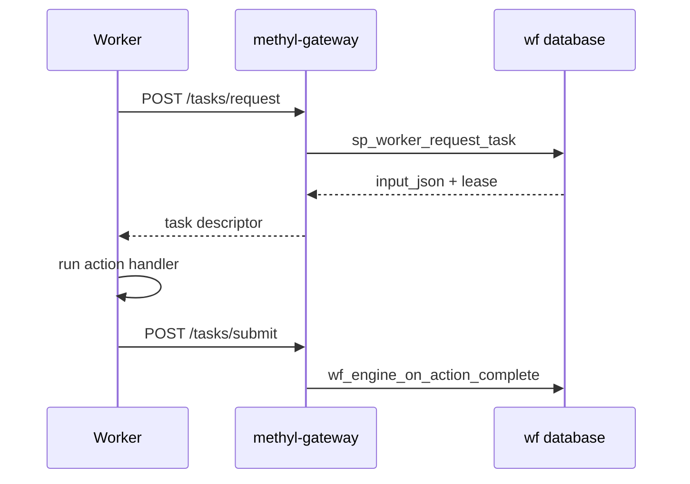

# Workers and Gateway

Workers poll the middle-tier for ACTION nodes matching their **capabilities**, execute package CLIs or in-process handlers, and submit results back to the workflow engine.

## Protocol summary

1. Worker `POST /v1/tasks/request` with bearer token + capability list
2. Gateway calls `sp_worker_request_task` → `input_json` + lease or empty
3. Worker runs handler (e.g. `methyl-centroid`, `methyl-detector`)
4. Worker `POST /v1/tasks/{id}/submit` with result payload
5. Engine applies output bindings to `scope_variable`; activates downstream nodes

## Canonical references

- [`workers/WORKER_PROTOCOL.md`](../../workers/WORKER_PROTOCOL.md)
- [`contracts/openapi.yaml`](../../contracts/openapi.yaml)
- [`workflow_engine/contract/sample_prep_capabilities.md`](../../workflow_engine/contract/sample_prep_capabilities.md)
- Sample prep worker docs: [`workers/docs/`](../../workers/docs/)

## Deployment

See [Usage ch.14](../usage/14-deployment-and-distributed-workflow.qmd) and [`docs/deployment/production_runbook.md`](../deployment/production_runbook.md).

## Implementation detail

Gateway modules, DB client, scheduler: [`workflow_engine/docs/IMPLEMENTATION.md`](../../workflow_engine/docs/IMPLEMENTATION.md).
