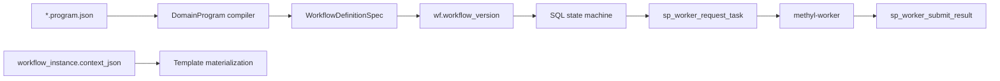

# Workflow Engine

The workflow engine schedules DomainProgram graphs **in-process** (`LocalWorkflowEngine`) or via a **database-resident** engine with remote workers.

## Architecture



| Path | Role |
|------|------|
| `workflow_engine/local/` | In-process executor; `methyl-workflow-run` |
| `workflow_engine/rest/` | `methyl-gateway` — worker HTTP → stored procedures |
| `workflow_engine/rest/db_client.py` | Backend-agnostic DB wrappers (Admin CLI, deploy scripts) |
| `workflow_engine/sql_mssql/` | Azure SQL deploy + SamplePrep/DataDriven docs |
| `workflow_engine/sql_pg/` | PostgreSQL parity |
| `workflow_engine/domain/` | Compiler, profiles, fixtures, checks |
| `workflow_engine/ops/` | Compile/plan/deploy helpers (no HTTP) |
| `workflow_engine/admin/study_start.py` | `methyl-study-start` CLI |

## Dual-backend contract

`BACKEND_DB` selects MSSQL or PostgreSQL ([`rest/connection.py`](../../workflow_engine/rest/connection.py)):

| Backend | Env |
|---------|-----|
| `postgres` | `POSTGRES_HOST`, `POSTGRES_PORT`, `POSTGRES_DB`, `POSTGRES_USER`, `POSTGRES_PASSWORD` |
| `mssql` | `AZURE_SQL_SERVER`, `AZURE_SQL_DB`, `AZURE_SQL_USER`, `AZURE_SQL_PASSWORD` |

Repository API procedures are mirrored in `sql_pg/` with parity harness: `python workflow_engine/tests/parity/run_parity.py`.

Deploy entrypoints:

- PostgreSQL greenfield: `bash workflow_engine/sql_pg/deploy_azure.sh`
- Azure SQL: base `sql_mssql/MethylPipeline.sql`, then `bash workflow_engine/sql_mssql/deploy_azure.sh`

Object catalog: [`workflow_engine/contract/db_objects.md`](../../workflow_engine/contract/db_objects.md).

## Graph repository

| Object | Purpose |
|--------|---------|
| `workflow_def` | Named workflow identity |
| `workflow_version` | Immutable compiled `spec_json` |
| `workflow_node` / `workflow_edge` | Graph topology, control-flow kind |
| `workflow_action` | Catalog binding (`action_name`, `capability`) |

Deploy compiled specs via `scripts/deploy_workflow_definitions.sh` or `methyl-study-start` + `ops.workflow_deploy`.

## Instance and node lifecycle

| State | Level | Notes |
|-------|-------|-------|
| `CREATED` → `RUNNING` → terminal | Instance | `sp_start_workflow_instance` expands graph |
| `PENDING` → `READY` → `RUNNING` → terminal | Node | Action rows claimed by workers |
| Leases | Node | `lease_owner`, `lease_expires_at` on claim |

**Scopes:** `scope_variable` holds `${var.*}` and `${ctx.*}` resolution per instance/subgraph. FOREACH and PARALLEL copy/open scope per [`wf_sql_foreach_support.sql`](../../workflow_engine/sql_mssql/wf_sql_foreach_support.sql) parity.

**Templates:** Node `input_json` templates materialize at schedule time from `context_json`, scope, and upstream outputs.

## Worker integration

Gateway exposes **only** `/v1/workers/*` ([`contracts/openapi.yaml`](../../contracts/openapi.yaml)). Workers never read `project.json` for tunables when `resolvedConfig` is present on the task payload.

| Step | Procedure / route |
|------|-------------------|
| Claim | `POST /v1/workers/claim` → `sp_worker_request_task` |
| Submit | `POST /v1/workers/submit` → `sp_worker_submit_result` |
| Heartbeat | `POST /v1/workers/heartbeat` (optional) |

Operational contracts: [idempotency/lease](../architecture/workflow-idempotency-retry-lease.md), [logging](../reference/logging-observability.md).

## Local execution

```bash
methyl-workflow-run \
  --program workflow_engine/domain/checks/pca1_5_cg/configs/study_validation_lifecycle.program.json \
  --context '{"projectPath": "/work/projects/prostate-cancer/configs/project_Healthy_vs_PCa1-5-CG.json"}'
```

`LocalWorkflowEngine` materializes the same compiled graph as production without DB leases.

## Admin vs worker paths

| Operation | Path |
|-----------|------|
| Compile program | `methyl-study-start compile` |
| Start instance | `methyl-study-start validation-start` / portal `portal.sp_*` |
| Execute action | Worker claim/submit only |

See [Admin CLI reference](../reference/admin-cli-methyl-study-start.md).

## Related

- [Distributed runtime](../architecture/distributed-runtime.md)
- [DomainProgram language](../reference/domain-program-language.md)
- [Pipeline architecture (full)](../../workflow_engine/docs/pipeline_architecture.md)
- [IMPLEMENTATION.md](../../workflow_engine/docs/IMPLEMENTATION.md)
- [workflow_engine/README.md](../../workflow_engine/README.md)
